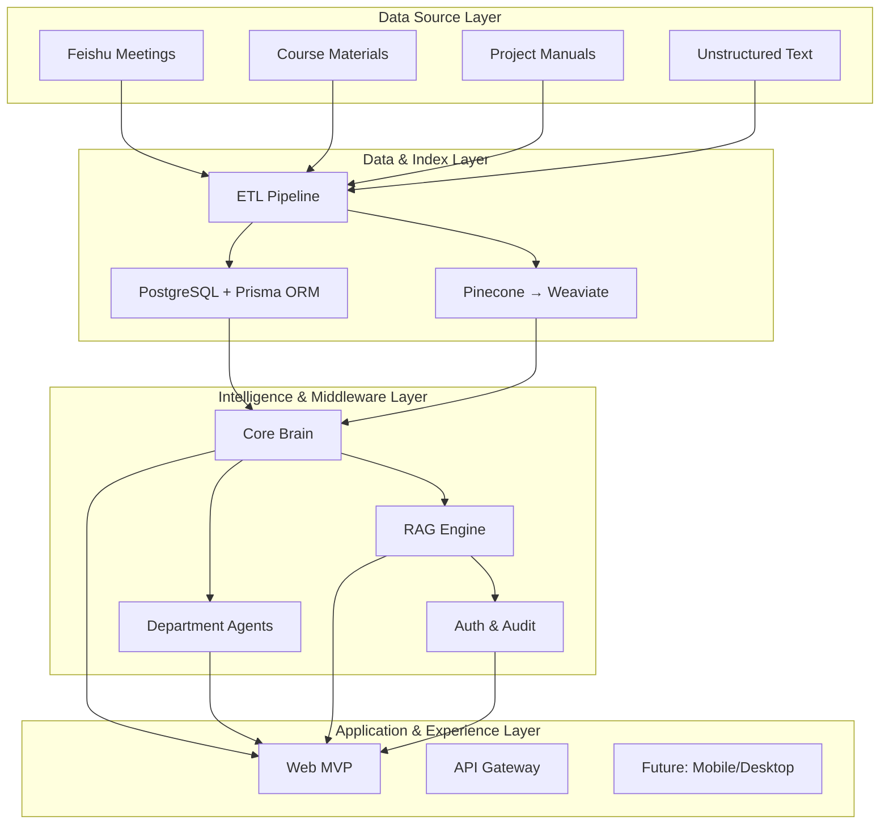
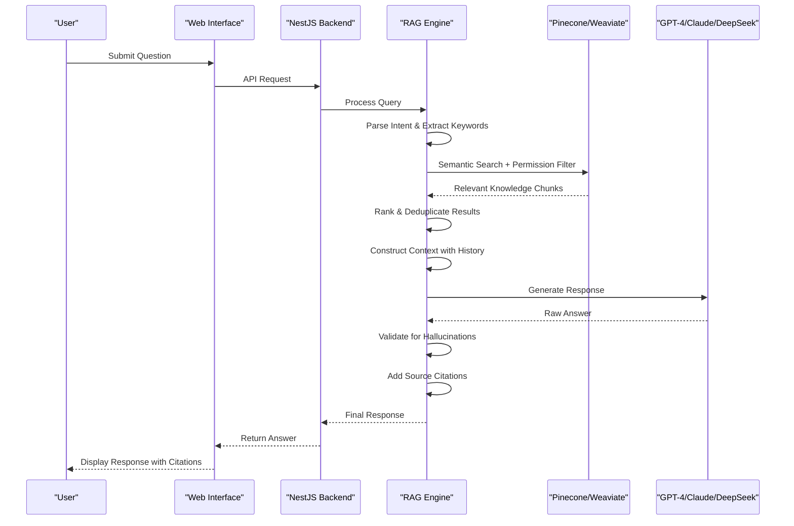

# AI Q&A System

<cite>
**Referenced Files in This Document**   
- [技术框架方案探讨.md](file://技术框架方案探讨.md)
- [NOVE项目书.md](file://NOVE项目书.md)
- [完整方案构思.md](file://完整方案构思.md)
- [实施路线图.md](file://实施路线图.md)
- [项目介绍.md](file://项目介绍.md)
- [项目名称.md](file://项目名称.md)
</cite>

## Table of Contents
1. [Introduction](#introduction)
2. [System Architecture Overview](#system-architecture-overview)
3. [RAG System Workflow](#rag-system-workflow)
4. [Semantic Search and Knowledge Retrieval](#semantic-search-and-knowledge-retrieval)
5. [Data Flow from Query to Response](#data-flow-from-query-to-response)
6. [Embeddings and Chunking Strategies](#embeddings-and-chunking-strategies)
7. [Relevance Ranking and Retrieval Optimization](#relevance-ranking-and-retrieval-optimization)
8. [AI Model Integration and Response Generation](#ai-model-integration-and-response-generation)
9. [Permission-Aware Knowledge Base](#permission-aware-knowledge-base)
10. [Hallucination Mitigation and Citation Accuracy](#hallucination-mitigation-and-citation-accuracy)
11. [Practical Use Cases](#practical-use-cases)
12. [Configuration and Performance Optimization](#configuration-and-performance-optimization)
13. [Conclusion](#conclusion)

## Introduction

The AI Q&A System with Retrieval-Augmented Generation (RAG) is designed to deliver accurate, contextually relevant responses by combining semantic search with large language model (LLM) capabilities. This system serves as the core intelligence engine for the "EduMind AI Platform," supporting personalized education services modeled after the "tài zǐ xǐ mǎ" (tutor to the crown prince) concept. The platform aims to provide each learner with elite-level, AI-enhanced educational guidance through a permission-aware knowledge base that integrates institutional data from multiple sources.

The system leverages advanced AI technologies to enable intelligent question answering, meeting summarization, action item tracking, and department-specific agent creation. By combining vectorized knowledge retrieval with LLM reasoning, the system ensures responses are both factually grounded and contextually appropriate. The architecture supports multi-model inference (GPT-4, Claude, DeepSeek), hybrid search (vector + keyword), and fine-grained access control based on user roles and attributes.

**Section sources**
- [项目介绍.md](file://项目介绍.md#L1-L40)
- [项目名称.md](file://项目名称.md#L1-L46)
- [NOVE项目书.md](file://NOVE项目书.md#L1-L50)

## System Architecture Overview

The AI Q&A System follows a four-layer architecture that separates concerns across data ingestion, indexing, intelligence processing, and application delivery. This layered approach enables modularity, scalability, and maintainability while supporting the complex requirements of an enterprise-grade educational intelligence platform.

The architecture consists of:
- **Data Source Layer**: Integrates with various systems including Feishu meetings, course documents, project manuals, and unstructured text repositories
- **Data & Index Layer**: Processes raw data through ETL pipelines and stores structured data in PostgreSQL while maintaining vector embeddings in Pinecone/Weaviate
- **Intelligence & Middleware Layer**: Hosts the core brain (RAG engine), departmental agents, orchestration logic, and security controls
- **Application & Experience Layer**: Delivers web-based interfaces for Q&A, meeting management, and task tracking

This separation allows independent evolution of components while maintaining clear interfaces between layers. The system is designed for gradual enhancement, starting with MVP features and expanding to support mobile clients, voice interaction, and SaaS multi-tenancy in future versions.

**Diagram sources**
- [NOVE项目书.md](file://NOVE项目书.md#L100-L150)
- [技术框架方案探讨.md](file://技术框架方案探讨.md#L1-L100)

**Section sources**
- [NOVE项目书.md](file://NOVE项目书.md#L100-L200)
- [技术框架方案探讨.md](file://技术框架方案探讨.md#L1-L200)

## RAG System Workflow

The Retrieval-Augmented Generation (RAG) system operates through a multi-stage workflow that transforms user queries into accurate, cited responses. This process ensures that answers are grounded in verified knowledge while leveraging the generative capabilities of large language models.

The workflow begins with query understanding, where the system analyzes the user's input to identify intent and extract key concepts. This is followed by semantic retrieval from the vector database, with results filtered according to the user's permissions. The retrieved context is then combined with conversation history and user profile information to construct a comprehensive prompt for the LLM. After response generation, the system performs quality checks including hallucination detection before delivering the final output with proper source citations.

Each stage incorporates validation and optimization mechanisms to ensure reliability and performance. The system supports both synchronous queries for immediate responses and asynchronous processing for complex tasks like meeting summarization or report generation.

**Diagram sources**
- [NOVE项目书.md](file://NOVE项目书.md#L200-L250)
- [技术框架方案探讨.md](file://技术框架方案探讨.md#L200-L300)

**Section sources**
- [NOVE项目书.md](file://NOVE项目书.md#L200-L300)
- [技术框架方案探讨.md](file://技术框架方案探讨.md#L200-L400)

## Semantic Search and Knowledge Retrieval

Semantic search in the AI Q&A System enables understanding of user queries beyond keyword matching, allowing for more accurate retrieval of relevant knowledge from the permission-aware knowledge base. The system uses embedding models (text-embedding-ada-002) to convert both queries and knowledge chunks into high-dimensional vectors that capture their semantic meaning.

When a user submits a question, the system generates an embedding vector for the query and performs a similarity search against the vector database (Pinecone or Weaviate). This allows the system to find conceptually related content even when exact keywords don't match. For example, a query about "student engagement strategies" can retrieve documents discussing "classroom participation techniques" or "learner motivation methods."

The retrieval process incorporates multiple strategies to improve accuracy:
- **Hybrid Search**: Combines vector similarity with keyword matching and metadata filtering
- **Permission Filtering**: Applies role-based (RBAC) and attribute-based (ABAC) access controls to filter results
- **Temporal Relevance**: Prioritizes recent documents when appropriate
- **Source Reliability**: Weights results based on document provenance and quality

This multi-faceted approach ensures that retrieved knowledge is not only semantically relevant but also accessible to the user based on their role and organizational context.

**Section sources**
- [技术框架方案探讨.md](file://技术框架方案探讨.md#L300-L400)
- [NOVE项目书.md](file://NOVE项目书.md#L250-L300)

## Data Flow from Query to Response

The data flow from user query to final response involves multiple coordinated components working in sequence to deliver accurate, cited answers. This end-to-end process begins with user input and concludes with a formatted response that includes source references.

When a user submits a query through the web interface, the request travels through an API gateway to the backend service (NestJS). The system first authenticates the user and determines their permissions. The query then enters the RAG pipeline where it undergoes natural language processing to identify intent and extract key entities.

The processed query is sent to the vector database for semantic search, returning a set of relevant knowledge chunks. These results are filtered based on the user's permissions and ranked by relevance. The top results are combined with conversation history and user context to form a comprehensive prompt for the LLM.

The prompt is routed to an appropriate AI model (GPT-4 for complex reasoning, Claude for long documents, or DeepSeek for cost-sensitive operations). After receiving the generated response, the system validates it for hallucinations, adds proper citations to the source documents, and formats the output for display.

Throughout this flow, monitoring systems track performance metrics including response time, success rate, and user satisfaction to ensure service quality.

**Section sources**
- [技术框架方案探讨.md](file://技术框架方案探讨.md#L400-L600)
- [NOVE项目书.md](file://NOVE项目书.md#L300-L400)

## Embeddings and Chunking Strategies

The effectiveness of the RAG system depends heavily on the quality of embeddings and the strategy used for document chunking. The system uses text-embedding-ada-002 to generate 1536-dimensional vectors that capture semantic meaning, enabling accurate similarity comparisons between queries and knowledge fragments.

Document chunking follows a hybrid approach that balances context preservation with retrieval precision:
- **Fixed-size chunks**: 512-token segments with 10% overlap to maintain context continuity
- **Semantic boundaries**: Respects paragraph and section breaks to avoid splitting related content
- **Hierarchical chunking**: Creates multiple levels of granularity (summary, section, paragraph)
- **Metadata enrichment**: Each chunk includes source, date, author, and access level

For different document types, specialized chunking strategies are applied:
- **Meeting transcripts**: Chunks organized by discussion topic with speaker attribution
- **Course materials**: Chunks aligned with learning objectives and assessment criteria
- **Project documentation**: Chunks grouped by phase (planning, execution, review)

The system also implements dynamic chunk selection, where the size and type of chunks retrieved depend on the query complexity. Simple factual questions retrieve small, precise chunks, while analytical queries pull larger contextual segments.

This sophisticated chunking strategy ensures that the LLM receives appropriately scoped context for generating accurate responses while minimizing token usage and processing costs.

**Section sources**
- [技术框架方案探讨.md](file://技术框架方案探讨.md#L600-L700)
- [完整方案构思.md](file://完整方案构思.md#L100-L200)

## Relevance Ranking and Retrieval Optimization

Relevance ranking in the AI Q&A System combines multiple signals to order retrieved knowledge chunks by their likely usefulness to the user's query. The system employs a multi-factor ranking algorithm that goes beyond simple vector similarity to deliver more accurate results.

The ranking process evaluates each candidate chunk based on:
- **Semantic similarity**: Cosine similarity between query and chunk embeddings
- **Recency**: Newer documents receive slight preference when content is comparable
- **Source authority**: Documents from verified experts or official sources are weighted higher
- **Usage frequency**: Frequently accessed and cited chunks gain prominence
- **User context**: Personalization based on user role, department, and past interactions

The system implements query expansion techniques to improve recall, automatically adding synonyms and related concepts to the search. For example, a query about "teaching methods" might be expanded to include "instructional strategies," "pedagogical approaches," and "classroom techniques."

To optimize retrieval performance, the system uses:
- **Hybrid search**: Combines vector similarity with keyword matching for better precision
- **Caching**: Frequently accessed results are cached in Redis for sub-second response
- **Index partitioning**: Knowledge base divided by department and access level
- **Pre-filtering**: Applies permission filters before vector search to reduce computation

These optimization strategies ensure that users receive relevant results quickly while maintaining the security and privacy requirements of the educational environment.

**Section sources**
- [技术框架方案探讨.md](file://技术框架方案探讨.md#L700-L800)
- [NOVE项目书.md](file://NOVE项目书.md#L400-L450)

## AI Model Integration and Response Generation

The AI Q&A System integrates multiple large language models (GPT-4, Claude, and DeepSeek) through a coordinated orchestration layer that selects the appropriate model based on task requirements and cost considerations. This multi-model strategy provides flexibility in balancing performance, cost, and specialized capabilities.

Model selection follows a routing logic:
- **GPT-4**: Used for complex reasoning, report generation, and high-stakes queries requiring maximum accuracy
- **Claude**: Preferred for processing long documents and meeting transcripts due to superior context handling
- **DeepSeek**: Deployed for routine queries and cost-sensitive operations to reduce API expenses

The response generation process incorporates several quality enhancement mechanisms:
- **Context augmentation**: Retrieved knowledge chunks are formatted with metadata and source citations
- **Prompt engineering**: Templates guide the LLM to produce structured, concise responses
- **Temperature control**: Adjusts randomness based on query type (lower for factual, higher for creative)
- **Output validation**: Rule-based checks detect hallucinations and inconsistent claims

The system supports streaming responses for improved user experience, delivering answers incrementally as they are generated. This is particularly valuable for longer responses, allowing users to begin reading while the full answer is still being constructed.

Model performance is continuously monitored through metrics including response accuracy, hallucination rate, and user satisfaction, with automated alerts for degradation in quality.

**Section sources**
- [技术框架方案探讨.md](file://技术框架方案探讨.md#L800-L900)
- [NOVE项目书.md](file://NOVE项目书.md#L450-L500)

## Permission-Aware Knowledge Base

The permission-aware knowledge base is a critical component that ensures users only access information appropriate to their role and clearance level. This security model combines Role-Based Access Control (RBAC) and Attribute-Based Access Control (ABAC) to provide fine-grained data protection.

The system implements a multi-layered permission structure:
- **Role levels**: System administrator, department administrator, regular user
- **Attribute rules**: Department affiliation, project membership, time-based access windows
- **Data classification**: Public, internal, confidential, and secret levels with corresponding protections

When retrieving knowledge, the system applies permission filters at multiple stages:
1. **Pre-filtering**: Before querying the vector database, inaccessible collections are excluded
2. **Post-retrieval filtering**: Results are checked against user permissions before presentation
3. **Content redaction**: Sensitive information within accessible documents is automatically redacted

Data protection measures include:
- **Encryption**: AES-256 encryption for data at rest and TLS 1.3 for data in transit
- **Audit logging**: Comprehensive logs track all access attempts and data retrievals
- **Data masking**: Personally identifiable information (PII) is automatically detected and obscured
- **Watermarking**: Sensitive documents include invisible user-specific watermarks for traceability

This comprehensive approach ensures compliance with data protection regulations while enabling appropriate knowledge sharing within the educational organization.

**Section sources**
- [技术框架方案探讨.md](file://技术框架方案探讨.md#L900-L1000)
- [NOVE项目书.md](file://NOVE项目书.md#L500-L550)

## Hallucination Mitigation and Citation Accuracy

Hallucination mitigation and citation accuracy are essential for maintaining trust in the AI Q&A System's responses. The system implements multiple safeguards to ensure answers are factually grounded and properly attributed.

The hallucination detection framework includes:
- **Source grounding check**: Verifies that claims in the response are supported by retrieved knowledge chunks
- **Confidence scoring**: Rates the certainty of responses based on evidence strength
- **Contradiction detection**: Identifies inconsistencies between the response and source material
- **Uncertainty signaling**: Adds qualifiers like "according to available information" when evidence is limited

For citation accuracy, the system:
- **Automatically links** claims to their source documents with timestamps and page numbers
- **Generates reference lists** in standard academic formats
- **Provides direct access** to source materials through clickable citations
- **Highlights quoted passages** in the original context

When the system detects potential hallucinations or insufficient evidence:
- It reduces confidence scores and adds appropriate disclaimers
- It may request clarification from the user
- In high-risk scenarios, it escalates to human review

These mechanisms ensure that users can verify the accuracy of responses and understand the basis for AI-generated content, promoting transparency and academic integrity.

**Section sources**
- [技术框架方案探讨.md](file://技术框架方案探讨.md#L1000-L1100)
- [NOVE项目书.md](file://NOVE项目书.md#L550-L600)

## Practical Use Cases

The AI Q&A System supports several practical use cases that demonstrate its value in educational settings. These scenarios illustrate how semantic search and RAG capabilities enhance teaching, learning, and administrative functions.

### Student Query Resolution
When a student asks about course requirements, the system retrieves the most current syllabus, grading policy, and assignment guidelines. For example, a query like "What are the deadlines for project submissions in Advanced AI course?" returns a timeline with citations to the official course document, recent announcements, and relevant meeting discussions.

### Teacher Material Retrieval
Faculty members can quickly find teaching resources by asking natural language questions. A query such as "Show me active learning techniques used in previous machine learning lectures" retrieves video clips, slide decks, and student feedback from past sessions, organized by effectiveness ratings and adaptation suggestions.

### Meeting Knowledge Extraction
After Feishu meetings, the system automatically processes transcripts to extract key decisions, action items, and discussion points. When asked "What were the conclusions from last week's curriculum committee meeting?", the system provides a structured summary with direct quotes and assigned responsibilities.

### Personalized Learning Support
The system tracks individual student progress and can answer personalized queries like "Based on my performance in linear algebra, what study resources would help me prepare for the quantum computing module?" by analyzing assessment results and recommending targeted materials.

These use cases demonstrate how the RAG system transforms institutional knowledge into actionable insights while maintaining proper attribution and access controls.

**Section sources**
- [NOVE项目书.md](file://NOVE项目书.md#L600-L650)
- [完整方案构思.md](file://完整方案构思.md#L200-L250)

## Configuration and Performance Optimization

Optimal configuration and performance tuning are critical for maintaining the AI Q&A System's effectiveness and efficiency. The system provides several configuration options and optimization strategies to balance accuracy, speed, and cost.

Key configuration parameters include:
- **Chunk size**: Adjustable based on content type and query patterns
- **Top-k retrieval**: Number of knowledge chunks passed to the LLM (typically 3-7)
- **Similarity threshold**: Minimum relevance score for including results
- **Model temperature**: Controls response creativity vs. consistency
- **Cache TTL**: Time-to-live for frequently accessed queries

Performance optimization strategies:
- **Multi-level caching**: Browser, CDN, Redis, and database caching layers
- **Index optimization**: Regular maintenance of vector database indexes
- **Query batching**: Combines similar queries for efficient processing
- **Asynchronous processing**: Offloads resource-intensive tasks like document ingestion
- **Load balancing**: Distributes requests across multiple model endpoints

The system monitors key performance indicators:
- **Response time**: Target average < 2 seconds, 99th percentile < 5 seconds
- **Accuracy rate**: Measured through user feedback and expert evaluation
- **Cache hit ratio**: Target > 70% for common queries
- **Cost per query**: Tracked to ensure economic sustainability

Regular optimization cycles analyze usage patterns and adjust configurations to maintain optimal performance as the knowledge base grows and user needs evolve.

**Section sources**
- [技术框架方案探讨.md](file://技术框架方案探讨.md#L1100-L1200)
- [实施路线图.md](file://实施路线图.md#L1-L34)

## Conclusion

The AI Q&A System with Retrieval-Augmented Generation represents a sophisticated integration of semantic search, permission-aware knowledge management, and large language model capabilities. By combining vector database technology with multi-model AI inference, the system delivers accurate, cited responses that are both contextually relevant and securely accessed.

The architecture supports the core mission of providing "tài zǐ xǐ mǎ"-style personalized education through a scalable, maintainable platform that can evolve from an MVP to a comprehensive enterprise solution. Key strengths include its hybrid search approach, fine-grained permission controls, multi-model orchestration, and comprehensive hallucination mitigation.

As the system matures through its implementation roadmap, it will continue to enhance educational outcomes by making institutional knowledge more accessible, actionable, and trustworthy. Future developments may include voice interaction, mobile access, and advanced personalization through learning trajectory analysis.

The success of this system depends not only on technical excellence but also on continuous alignment with educational goals, user needs, and ethical considerations in AI-assisted learning environments.