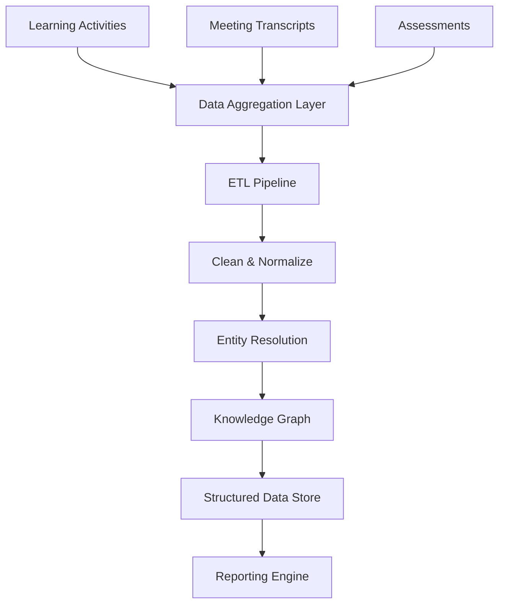
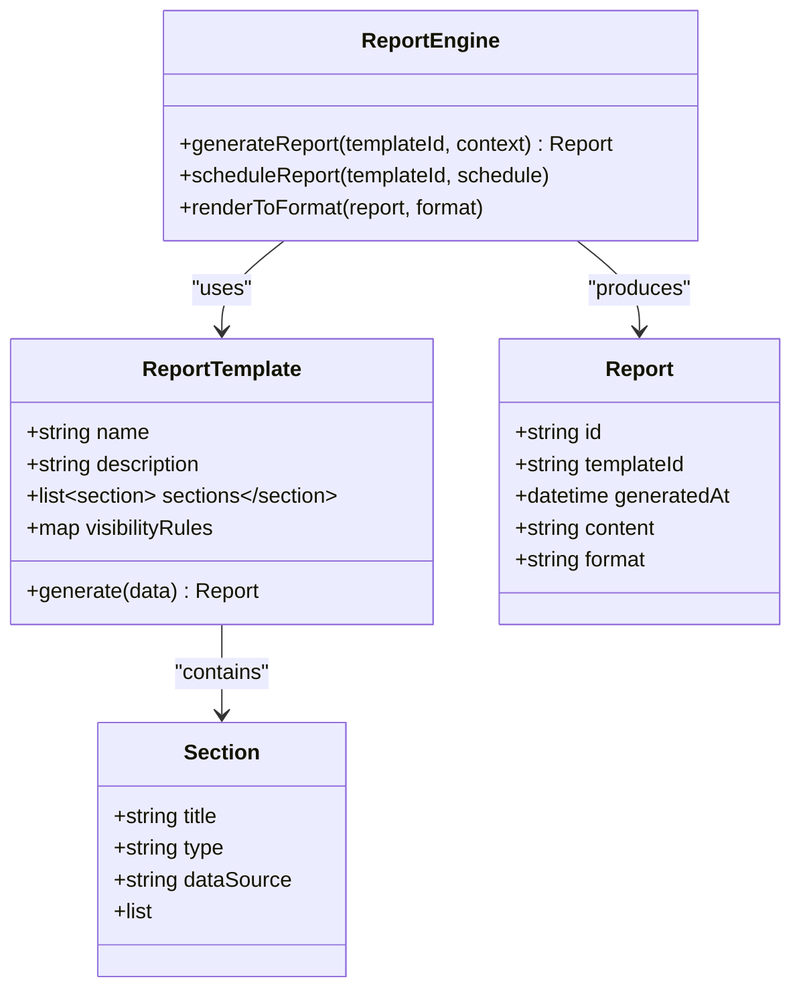
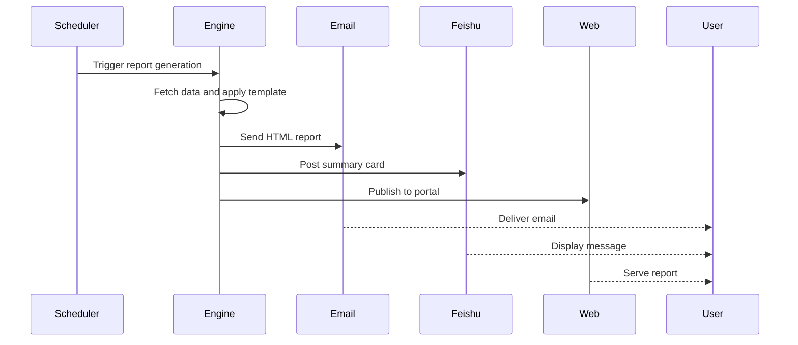
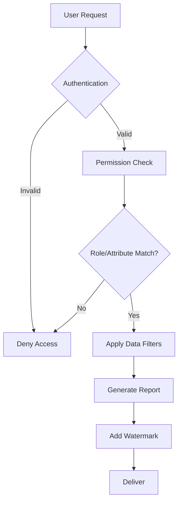

# Automated Reporting

<cite>
**Referenced Files in This Document**  
- [NOVE项目书.md](file://NOVE项目书.md)
- [完整方案构思.md](file://完整方案构思.md)
- [实施路线图.md](file://实施路线图.md)
- [技术框架方案探讨.md](file://技术框架方案探讨.md)
</cite>

## Table of Contents
1. [Introduction](#introduction)
2. [Data Aggregation and Processing](#data-aggregation-and-processing)
3. [Report Templating and Generation](#report-templating-and-generation)
4. [Scheduling and Delivery Channels](#scheduling-and-delivery-channels)
5. [Audience-Specific Report Formats](#audience-specific-report-formats)
6. [Permission and Data Visibility Control](#permission-and-data-visibility-control)
7. [Customization, Branding, and Localization](#customization-branding-and-localization)
8. [Best Practices for Report Accuracy and Timeliness](#best-practices-for-report-accuracy-and-timeliness)

## Introduction
The Automated Reporting feature in the nove platform enables systematic generation of progress reports, parent communications, and performance analytics by leveraging data from learning activities, meeting outcomes, and assessments. This system supports structured reporting through intelligent data aggregation, templating, scheduling, and multi-channel delivery. It integrates tightly with the permission system to ensure data visibility compliance and supports customization for branding and localization. This document details the architecture, workflows, and best practices for maintaining accurate and timely reporting.

**Section sources**
- [NOVE项目书.md](file://NOVE项目书.md#L1-L420)
- [完整方案构思.md](file://完整方案构思.md#L1-L213)

## Data Aggregation and Processing
The reporting system aggregates data from multiple sources including learning activities, meeting transcripts, action items, and assessment outcomes. Data is ingested through real-time webhooks and batch synchronization from integrated platforms such as Feishu. Learning activity data is captured via user interactions tracked in the application layer and stored in PostgreSQL. Meeting data is processed through an automated pipeline: audio transcription (ASR), summary generation, keyword extraction, and action item identification using LLMs. Assessment results are normalized and stored with metadata for trend analysis.

Processed data is structured into a unified schema and indexed in both relational and vector databases. The system applies data cleaning, deduplication, and entity resolution to ensure consistency. Knowledge graph techniques are used to establish relationships between entities (e.g., student, session, outcome), enabling complex queries for report generation. Version control and data lineage tracking ensure auditability and reproducibility of reports.

**Diagram sources**
- [NOVE项目书.md](file://NOVE项目书.md#L150-L200)
- [技术框架方案探讨.md](file://技术框架方案探讨.md#L300-L350)

**Section sources**
- [NOVE项目书.md](file://NOVE项目书.md#L150-L200)
- [技术框架方案探讨.md](file://技术框架方案探讨.md#L300-L350)

## Report Templating and Generation
The system uses a modular templating engine to generate reports based on predefined layouts and dynamic content blocks. Templates are defined in a low-code interface where administrators can configure sections such as student progress, meeting summaries, skill development, and recommendations. Each template supports conditional logic to include or exclude content based on data availability and audience type.

Report generation is triggered either on-demand or via scheduled jobs. The engine retrieves relevant data from the structured store, applies business rules for calculations (e.g., progress percentage, performance trends), and populates the template. LLMs enhance narrative content by generating natural language summaries from structured data (e.g., converting assessment scores into descriptive feedback). Generated reports are versioned and stored for audit and reissuance.

**Diagram sources**
- [完整方案构思.md](file://完整方案构思.md#L100-L150)
- [技术框架方案探讨.md](file://技术框架方案探讨.md#L400-L450)

**Section sources**
- [完整方案构思.md](file://完整方案构思.md#L100-L150)
- [技术框架方案探讨.md](file://技术框架方案探讨.md#L400-L450)

## Scheduling and Delivery Channels
Reports can be scheduled for recurring delivery (daily, weekly, monthly) or triggered by events (e.g., post-meeting, after assessment). The scheduling system uses a task queue (Redis + BullMQ) to manage execution timing and retry logic for failed deliveries. Users can configure delivery preferences through a management interface.

Delivery channels include:
- **Email**: HTML-formatted reports with embedded charts and links
- **Feishu Messages**: Summary cards with quick access to full reports
- **Web Portal**: Reports accessible via secure login with search and filtering
- **API Endpoints**: For integration with third-party systems

Each channel adapts content formatting to platform constraints while preserving core information. Delivery logs are maintained for tracking and compliance.

**Diagram sources**
- [实施路线图.md](file://实施路线图.md#L20-L30)
- [技术框架方案探讨.md](file://技术框架方案探讨.md#L500-L550)

**Section sources**
- [实施路线图.md](file://实施路线图.md#L20-L30)
- [技术框架方案探讨.md](file://技术框架方案探讨.md#L500-L550)

## Audience-Specific Report Formats
The system generates tailored reports for different stakeholders:

### Parent Communication Reports
- Focus on student progress, behavior, and upcoming activities
- Use simple language with visual indicators (e.g., progress bars, smiley ratings)
- Include personalized recommendations for home support
- Highlight achievements and areas for improvement

### Administrator Performance Analytics
- Aggregate data across students, instructors, and programs
- Visualize KPIs: completion rates, assessment trends, engagement metrics
- Support drill-down from organizational to individual level
- Include benchmarking against historical data

### Instructor Progress Reports
- Detailed learning trajectory analysis per student
- Correlation between activities and outcomes
- Early warning indicators for at-risk students
- Resource utilization and teaching effectiveness metrics

Templates are configurable to align with institutional branding and educational frameworks.

**Section sources**
- [完整方案构思.md](file://完整方案构思.md#L150-L200)
- [NOVE项目书.md](file://NOVE项目书.md#L300-L350)

## Permission and Data Visibility Control
The reporting system enforces strict data visibility through a hybrid RBAC + ABAC model. Access to report data is determined by user role, department affiliation, and data sensitivity level. For example, parents can only view their child's data, while department heads can access aggregated data from their team.

The system applies row-level and column-level filtering during data retrieval. Sensitive fields (e.g., personal identifiers) are automatically redacted or aggregated based on the viewer's permissions. All data access is logged for audit purposes, and reports include watermarks for traceability.

Integration with the central authentication system ensures that only authorized users can generate or view reports. API access is protected with OAuth 2.0 and rate limiting.

**Diagram sources**
- [NOVE项目书.md](file://NOVE项目书.md#L250-L300)
- [技术框架方案探讨.md](file://技术框架方案探讨.md#L600-L650)

**Section sources**
- [NOVE项目书.md](file://NOVE项目书.md#L250-L300)
- [技术框架方案探讨.md](file://技术框架方案探讨.md#L600-L650)

## Customization, Branding, and Localization
The reporting system supports extensive customization options:
- **Branding**: Custom logos, color schemes, and fonts can be applied to templates
- **Localization**: Multi-language support with locale-specific date/number formatting
- **Content Rules**: Conditional sections based on student profile or program type
- **Output Formats**: PDF, HTML, and printable versions with consistent styling

Administrators can modify templates without code changes using a visual editor. Branding assets are stored in a media library with version control. Language packs support right-to-left scripts and complex character sets.

Localization extends to terminology (e.g., "term" vs "semester") and cultural adaptations in feedback phrasing. The system detects user preferences and defaults to appropriate settings.

**Section sources**
- [完整方案构思.md](file://完整方案构思.md#L200-L213)
- [项目名称.md](file://项目名称.md#L1-L45)

## Best Practices for Report Accuracy and Timeliness
To ensure high-quality reporting:
- **Data Validation**: Implement automated checks for completeness and consistency
- **Freshness Monitoring**: Track data ingestion delays and alert on anomalies
- **Version Control**: Maintain report template versions with change logs
- **User Feedback Loop**: Allow recipients to flag inaccuracies for review
- **Automated Testing**: Validate report outputs against known datasets
- **Caching Strategy**: Balance performance with data freshness using TTL-based invalidation
- **Audit Trail**: Record all report generation events with parameters and outcomes

Regular calibration of LLM-generated content ensures alignment with educational standards. Performance metrics (generation time, delivery success rate) are monitored to maintain system reliability.

**Section sources**
- [技术框架方案探讨.md](file://技术框架方案探讨.md#L700-L750)
- [实施路线图.md](file://实施路线图.md#L30-L34)