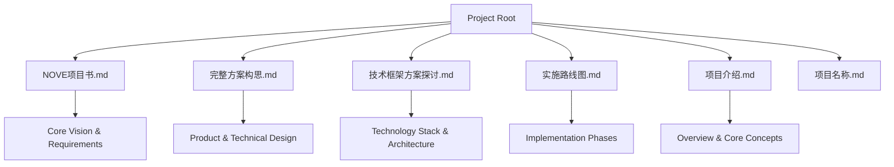
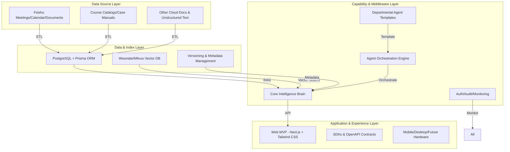
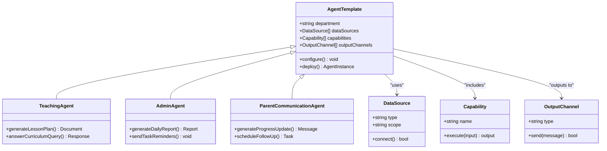
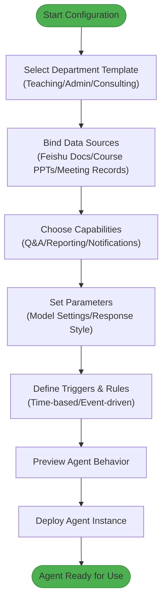
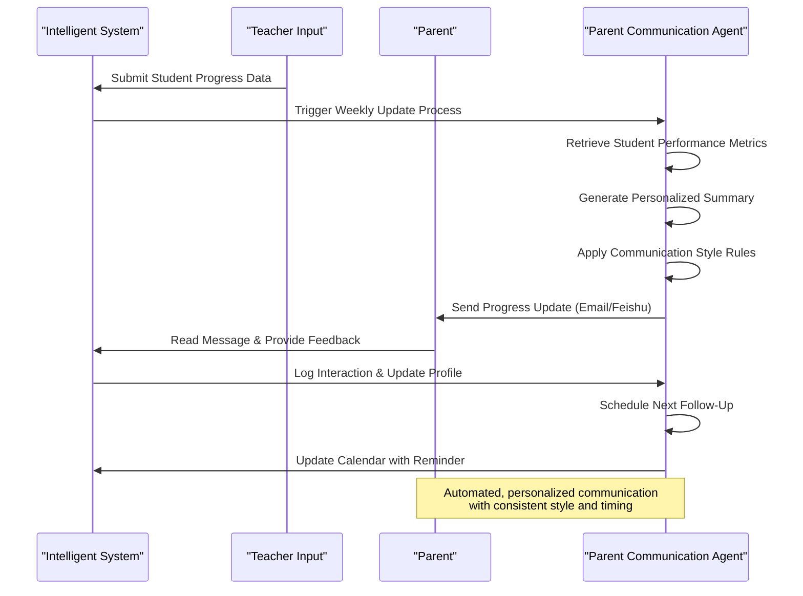
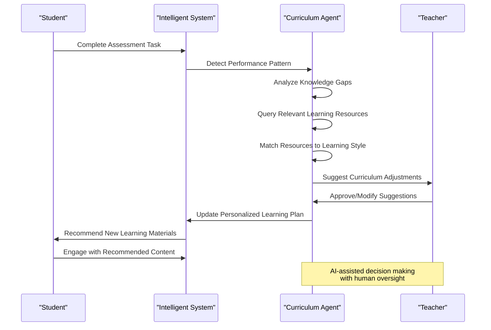
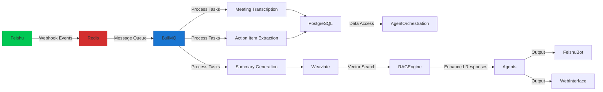

# Intelligent Agent Orchestration

<cite>
**Referenced Files in This Document**   
- [NOVE项目书.md](file://NOVE项目书.md)
- [完整方案构思.md](file://完整方案构思.md)
- [技术框架方案探讨.md](file://技术框架方案探讨.md)
- [实施路线图.md](file://实施路线图.md)
- [项目介绍.md](file://项目介绍.md)
</cite>

## Table of Contents
1. [Introduction](#introduction)
2. [Project Structure](#project-structure)
3. [Core Components](#core-components)
4. [Architecture Overview](#architecture-overview)
5. [Detailed Component Analysis](#detailed-component-analysis)
6. [Dependency Analysis](#dependency-analysis)
7. [Performance Considerations](#performance-considerations)
8. [Troubleshooting Guide](#troubleshooting-guide)
9. [Conclusion](#conclusion)

## Introduction
The Intelligent Agent Orchestration system is designed to deliver a "Crown Prince Tutor"-style personalized education platform, providing each learner with exclusive, top-tier educational services through the integration of AI and expert mentorship. This document details the architecture and functionality of department-specific AI agents, low-code configuration interfaces, event-driven workflows, and integration with Feishu. The system enables non-developers to define agent behavior using rules and triggers, supports scalable deployment across departments, and ensures robust debugging and version control for agent configurations.

## Project Structure
The project is organized around core documentation files that define the system's vision, technical framework, implementation roadmap, and functional scope. These files collectively outline the structure of an intelligent education platform centered on AI agent orchestration, data integration, and departmental customization.

**Diagram sources**
- [NOVE项目书.md](file://NOVE项目书.md)
- [完整方案构思.md](file://完整方案构思.md)
- [实施路线图.md](file://实施路线图.md)

**Section sources**
- [NOVE项目书.md](file://NOVE项目书.md)
- [完整方案构思.md](file://完整方案构思.md)
- [实施路线图.md](file://实施路线图.md)

## Core Components
The Intelligent Agent Orchestration system comprises several core components: the Central Intelligence Brain, Departmental Agents, RAG-based Knowledge System, Event-Driven Architecture, and Low-Code Configuration Interface. These components work together to enable intelligent, context-aware interactions across educational and administrative domains.

**Section sources**
- [NOVE项目书.md](file://NOVE项目书.md#L1-L420)
- [完整方案构思.md](file://完整方案构思.md#L1-L213)
- [技术框架方案探讨.md](file://技术框架方案探讨.md#L1-L700)

## Architecture Overview
The system follows a four-layer architecture: Data Source Layer, Data & Index Layer, Capability & Middleware Layer, and Application & Experience Layer. This layered design enables modular development, secure data handling, and flexible deployment of intelligent agents across departments.

**Diagram sources**
- [NOVE项目书.md](file://NOVE项目书.md#L1-L420)
- [技术框架方案探讨.md](file://技术框架方案探讨.md#L1-L700)

## Detailed Component Analysis

### Department-Specific AI Agents
Department-specific AI agents are composed of reusable capabilities such as reporting, Q&A, notification, and task management. Each agent is configured to operate within specific data boundaries and permission levels, ensuring secure and relevant interactions.

#### Agent Composition and Capabilities
AI agents are modular constructs that combine data sources, functional capabilities, and output channels. They can be customized for different departments (e.g., teaching, administration, consulting) by selecting appropriate data scopes and functional modules.

**Diagram sources**
- [完整方案构思.md](file://完整方案构思.md#L1-L213)
- [NOVE项目书.md](file://NOVE项目书.md#L1-L420)

**Section sources**
- [完整方案构思.md](file://完整方案构思.md#L1-L213)
- [NOVE项目书.md](file://NOVE项目书.md#L1-L420)

### Low-Code Configuration Interface
The low-code configuration interface allows non-developers to define agent behavior using visual rules and triggers. Users can select data sources, combine capabilities, and set up automated workflows without writing code.

#### Configuration Workflow
The configuration process involves selecting a department template, binding data sources, choosing functional capabilities, and defining output formats. This enables rapid deployment of new agents with minimal technical expertise.

**Diagram sources**
- [完整方案构思.md](file://完整方案构思.md#L1-L213)
- [技术框架方案探讨.md](file://技术框架方案探讨.md#L1-L700)

**Section sources**
- [完整方案构思.md](file://完整方案构思.md#L1-L213)
- [技术框架方案探讨.md](file://技术框架方案探讨.md#L1-L700)

### Agent Workflows and Use Cases
Agent workflows demonstrate how intelligent automation enhances educational and administrative processes. Examples include automated parent communication and curriculum suggestions based on student performance.

#### Automated Parent Communication Workflow
This workflow illustrates how the system generates personalized progress updates and schedules follow-up actions for parents.

**Diagram sources**
- [项目介绍.md](file://项目介绍.md#L1-L39)
- [完整方案构思.md](file://完整方案构思.md#L1-L213)

**Section sources**
- [项目介绍.md](file://项目介绍.md#L1-L39)
- [完整方案构思.md](file://完整方案构思.md#L1-L213)

#### Curriculum Suggestion Workflow
This workflow shows how the system analyzes student performance and recommends appropriate learning materials.

**Diagram sources**
- [项目介绍.md](file://项目介绍.md#L1-L39)
- [NOVE项目书.md](file://NOVE项目书.md#L1-L420)

**Section sources**
- [项目介绍.md](file://项目介绍.md#L1-L39)
- [NOVE项目书.md](file://NOVE项目书.md#L1-L420)

## Dependency Analysis
The system relies on a robust event-driven architecture with message queues (Redis/BullMQ) for asynchronous task processing and seamless integration with Feishu for real-time data synchronization.

**Diagram sources**
- [NOVE项目书.md](file://NOVE项目书.md#L1-L420)
- [技术框架方案探讨.md](file://技术框架方案探讨.md#L1-L700)

**Section sources**
- [NOVE项目书.md](file://NOVE项目书.md#L1-L420)
- [技术框架方案探讨.md](file://技术框架方案探讨.md#L1-L700)

## Performance Considerations
The system is designed for scalability, supporting over 1000 concurrent users with an average response time under 2 seconds. The architecture employs multi-layer caching (browser, CDN, Redis, database), horizontal scaling of stateless services, and efficient load balancing to ensure high availability and performance.

## Troubleshooting Guide
Debugging agent logic involves monitoring execution traces, reviewing input/output logs, and validating rule configurations. Version control for agent configurations is implemented through a dedicated management interface that tracks changes, supports rollbacks, and maintains audit trails for compliance.

**Section sources**
- [NOVE项目书.md](file://NOVE项目书.md#L1-L420)
- [技术框架方案探讨.md](file://技术框架方案探讨.md#L1-L700)

## Conclusion
The Intelligent Agent Orchestration system provides a comprehensive framework for deploying department-specific AI agents through low-code configuration. By leveraging reusable capabilities, event-driven architecture, and seamless Feishu integration, the platform enables educational institutions to deliver personalized, efficient, and scalable intelligent services. The combination of modular agent design, visual configuration tools, and robust operational infrastructure ensures both flexibility for non-technical users and reliability for production deployment.