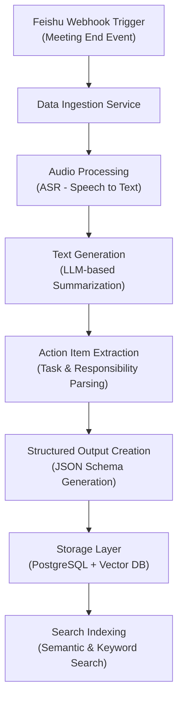
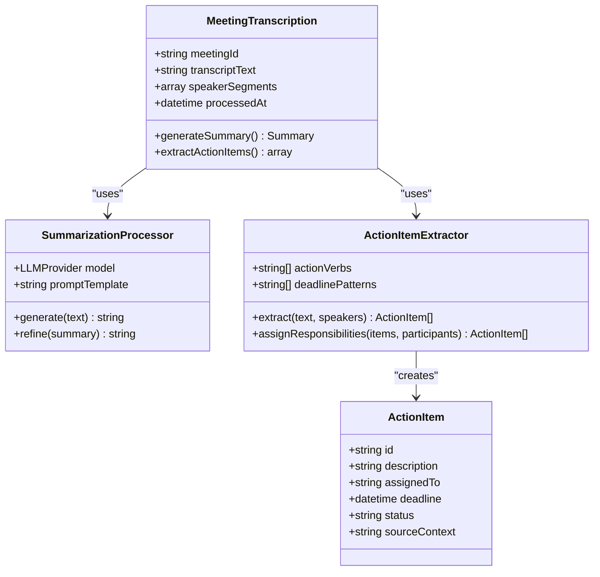
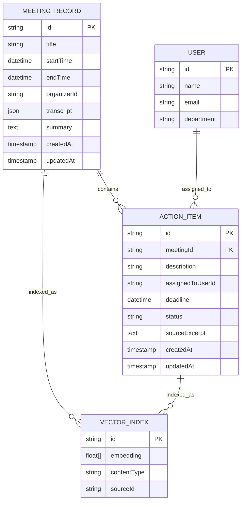
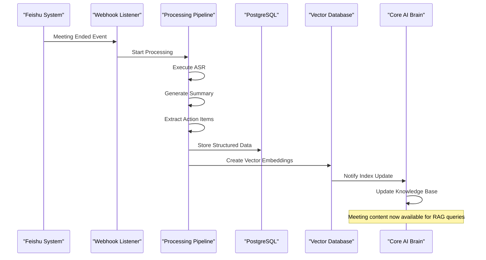

# Meeting Intelligence

<cite>
**Referenced Files in This Document**  
- [NOVE项目书.md](file://NOVE项目书.md)
- [完整方案构思.md](file://完整方案构思.md)
- [技术框架方案探讨.md](file://技术框架方案探讨.md)
</cite>

## Table of Contents
1. [Introduction](#introduction)
2. [Data Pipeline Overview](#data-pipeline-overview)
3. [Core Processing Components](#core-processing-components)
4. [Storage and Indexing Architecture](#storage-and-indexing-architecture)
5. [Integration with Core AI Brain](#integration-with-core-ai-brain)
6. [Downstream Applications](#downstream-applications)
7. [Accuracy and Speaker Identification](#accuracy-and-speaker-identification)
8. [Calendar and Task Synchronization](#calendar-and-task-synchronization)
9. [Troubleshooting Guide](#troubleshooting-guide)
10. [Conclusion](#conclusion)

## Introduction
The Meeting Intelligence feature is designed to transform Feishu meeting data into actionable insights through automated transcription, summarization, and action item extraction. This system serves as a critical component of the NOVE project's Laboratory AI Brain, enabling seamless knowledge capture and operational continuity from virtual meetings. By leveraging AI models and structured data processing, the feature ensures that valuable discussion content is preserved, indexed, and made accessible for future retrieval and task management.

**Section sources**
- [NOVE项目书.md](file://NOVE项目书.md#L1-L50)
- [完整方案构思.md](file://完整方案构思.md#L1-L20)

## Data Pipeline Overview
The Meeting Intelligence data pipeline begins with webhook triggers from Feishu upon meeting completion. These events initiate a sequence of processing steps that transform raw meeting data into structured, searchable information. The pipeline follows a layered architecture: data ingestion → audio processing (if applicable) → text generation via AI models → structured output creation → storage and indexing.

**Diagram sources**
- [NOVE项目书.md](file://NOVE项目书.md#L150-L180)
- [技术框架方案探讨.md](file://技术框架方案探讨.md#L200-L230)

**Section sources**
- [NOVE项目书.md](file://NOVE项目书.md#L140-L190)
- [技术框架方案探讨.md](file://技术框架方案探讨.md#L190-L240)

## Core Processing Components

### Transcription Module
The transcription module utilizes Automatic Speech Recognition (ASR) technology to convert spoken content from Feishu meetings into text. This process occurs asynchronously after the meeting concludes, triggered by webhook notifications. The system supports multiple speakers and maintains temporal alignment of utterances.

### Summarization Engine
The summarization engine employs large language models (LLMs) such as GPT-4 and Claude to generate concise meeting summaries. These models analyze the transcribed text to identify key discussion points, decisions made, and overall meeting context. The summarization process includes topic segmentation and importance weighting of content.

### Action Item Extraction
Action item extraction identifies tasks, responsibilities, and deadlines mentioned during meetings. Using natural language processing techniques, the system parses sentences containing action verbs and assigns extracted tasks to specific participants based on contextual clues and speaker identification.

**Diagram sources**
- [NOVE项目书.md](file://NOVE项目书.md#L200-L230)
- [技术框架方案探讨.md](file://技术框架方案探讨.md#L250-L280)

**Section sources**
- [NOVE项目书.md](file://NOVE项目书.md#L200-L240)
- [技术框架方案探讨.md](file://技术框架方案探讨.md#L240-L290)

## Storage and Indexing Architecture
Meeting records are stored in a dual-storage architecture combining relational and vector databases. The PostgreSQL database serves as the primary storage for structured meeting metadata, action items, and user assignments, while the vector database enables semantic search capabilities across meeting content.

**Diagram sources**
- [NOVE项目书.md](file://NOVE项目书.md#L250-L270)
- [技术框架方案探讨.md](file://技术框架方案探讨.md#L300-L330)

**Section sources**
- [NOVE项目书.md](file://NOVE项目书.md#L240-L280)
- [技术框架方案探讨.md](file://技术框架方案探讨.md#L290-L340)

## Integration with Core AI Brain
The Meeting Intelligence system integrates tightly with the Core AI Brain through a retrieval-augmented generation (RAG) architecture. Processed meeting data becomes part of the knowledge base that powers intelligent responses to user queries. When users ask questions about past meetings or seek information discussed in sessions, the AI Brain retrieves relevant meeting excerpts from the vector database and incorporates them into its responses.

The integration follows a publish-subscribe pattern where completed meeting processing triggers updates to the AI Brain's knowledge index. This ensures that newly acquired meeting insights are immediately available for retrieval in subsequent interactions.

**Diagram sources**
- [NOVE项目书.md](file://NOVE项目书.md#L300-L330)
- [技术框架方案探讨.md](file://技术框架方案探讨.md#L350-L380)

**Section sources**
- [NOVE项目书.md](file://NOVE项目书.md#L290-L340)
- [技术框架方案探讨.md](file://技术框架方案探讨.md#L340-L390)

## Downstream Applications
Meeting Intelligence data feeds into various downstream applications that enhance productivity and accountability. The action item tracking system synchronizes extracted tasks with users' personal task lists, while the knowledge management system makes meeting content searchable across the organization.

Managers can access dashboards showing team action item completion rates and meeting participation metrics. The system also supports compliance requirements by maintaining an auditable record of decisions and assignments made during meetings.

Example generated summary:
"Team discussed Q3 product roadmap. Key decisions: proceed with mobile app redesign, allocate additional resources to API development. Marketing campaign launch delayed by two weeks to align with feature completion."

Example extracted action items:
- "Redesign mobile app interface" assigned to Alice Chen, deadline: 2025-09-30
- "Optimize API response time" assigned to Bob Johnson, deadline: 2025-10-15
- "Update marketing materials" assigned to Carol Davis, deadline: 2025-10-01

**Section sources**
- [NOVE项目书.md](file://NOVE项目书.md#L340-L370)
- [完整方案构思.md](file://完整方案构思.md#L50-L80)

## Accuracy and Speaker Identification
The system prioritizes accuracy in both transcription and action item extraction through multiple quality assurance mechanisms. For speaker identification, the system combines Feishu's participant list with voice pattern analysis when available. In cases where speaker diarization is uncertain, the system flags ambiguous segments for potential manual review.

Accuracy considerations include:
- Contextual validation of extracted action items against meeting agenda
- Cross-referencing assignment statements with participant lists
- Confidence scoring for uncertain identifications
- Manual correction interface for post-processing refinement

The system employs a confidence threshold mechanism where low-confidence extractions trigger alerts for human verification, ensuring high reliability in task assignment and deadline capture.

**Section sources**
- [NOVE项目书.md](file://NOVE项目书.md#L370-L400)
- [技术框架方案探讨.md](file://技术框架方案探讨.md#L400-L430)

## Calendar and Task Synchronization
Extracted action items automatically synchronize with users' calendars and task management systems. The integration creates calendar events for deadlines and adds tasks to individual to-do lists with proper prioritization. Users receive reminders as deadlines approach, and completion status is tracked back in the meeting intelligence system.

The synchronization respects user preferences and organizational policies regarding notification frequency and task visibility. Managers can view aggregated views of team commitments while respecting privacy boundaries for personal tasks.

This bidirectional sync ensures that updates to task status in external systems are reflected in the meeting intelligence database, maintaining consistency across platforms.

**Section sources**
- [NOVE项目书.md](file://NOVE项目书.md#L400-L430)
- [完整方案构思.md](file://完整方案构思.md#L90-L120)

## Troubleshooting Guide
Common issues and their resolutions:

### Latency Issues
**Symptoms**: Delays in meeting processing after completion
**Causes**: High system load, API rate limiting, large meeting files
**Solutions**: 
- Monitor queue lengths in the asynchronous processing system
- Implement exponential backoff for API calls
- Optimize file transfer protocols for large audio files

### Transcription Errors
**Symptoms**: Inaccurate speech-to-text conversion
**Causes**: Poor audio quality, overlapping speech, technical jargon
**Solutions**:
- Pre-process audio for noise reduction
- Implement speaker diarization improvements
- Allow manual transcript correction with version tracking

### Missed Action Items
**Symptoms**: Important tasks not captured in extraction
**Causes**: Ambiguous language, implicit assignments, low-confidence detection
**Solutions**:
- Review and refine action verb dictionaries
- Adjust confidence thresholds for extraction
- Implement user feedback loop to improve model training
- Provide manual action item addition interface

**Section sources**
- [NOVE项目书.md](file://NOVE项目书.md#L430-L460)
- [技术框架方案探讨.md](file://技术框架方案探讨.md#L600-L630)

## Conclusion
The Meeting Intelligence feature represents a comprehensive solution for transforming Feishu meeting content into structured, actionable knowledge. By integrating advanced AI processing with robust data storage and retrieval systems, the feature enables organizations to maintain continuity between meetings and follow-up actions. The architecture balances automation with human oversight, ensuring reliability while supporting continuous improvement through feedback loops. As a core component of the Laboratory AI Brain, this system enhances organizational memory and accountability, ultimately improving productivity and decision implementation.