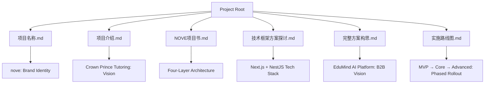
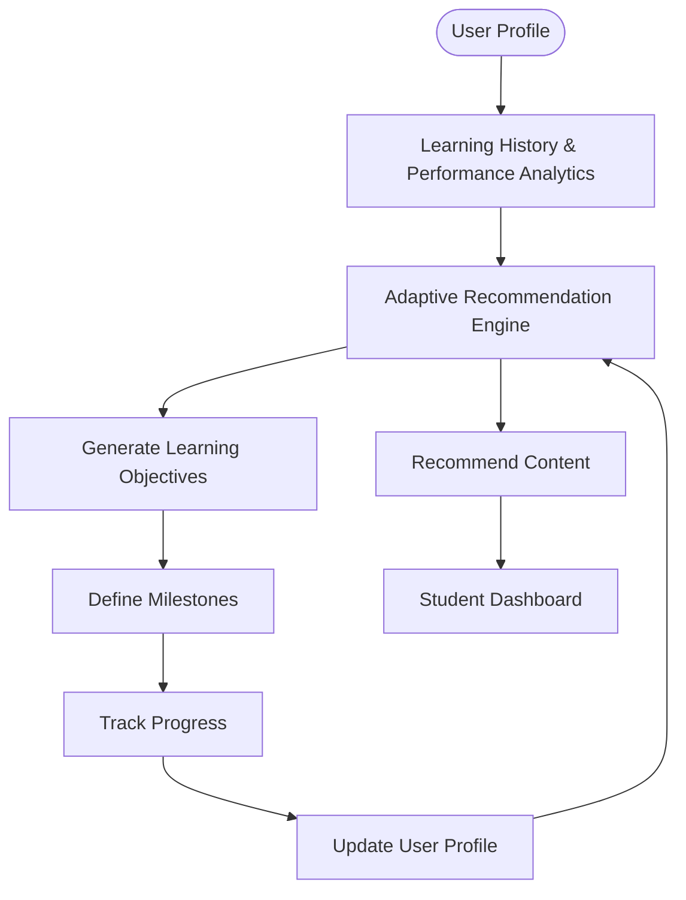
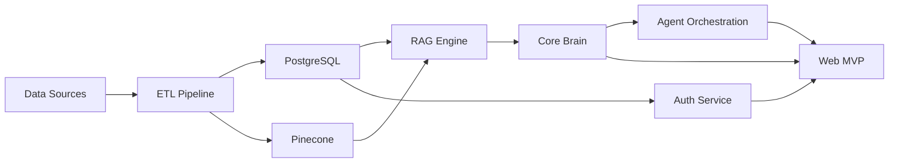

# Personalized Learning Paths

<cite>
**Referenced Files in This Document**   
- [NOVE项目书.md](file://NOVE项目书.md)
- [完整方案构思.md](file://完整方案构思.md)
- [实施路线图.md](file://实施路线图.md)
- [技术框架方案探讨.md](file://技术框架方案探讨.md)
- [项目介绍.md](file://项目介绍.md)
- [项目名称.md](file://项目名称.md)
</cite>

## Table of Contents
1. [Introduction](#introduction)
2. [Project Structure](#project-structure)
3. [Core Components](#core-components)
4. [Architecture Overview](#architecture-overview)
5. [Detailed Component Analysis](#detailed-component-analysis)
6. [Dependency Analysis](#dependency-analysis)
7. [Performance Considerations](#performance-considerations)
8. [Troubleshooting Guide](#troubleshooting-guide)
9. [Conclusion](#conclusion)

## Introduction
The Personalized Learning Paths system, branded as **nove**, is an AI-powered intelligent education platform designed to deliver a "Crown Prince Tutoring" experience—offering each student a bespoke, elite-level educational journey. Inspired by the historical role of the "Taizi Xima" (tutor to the crown prince), the system combines AI intelligence with human mentorship to create a truly personalized learning environment. The core philosophy, "One Student, One Plan," ensures that every learner receives a tailored educational path based on their unique profile, learning history, and performance analytics. This document details the system's architecture, domain model, AI-human collaboration, and technical implementation, with a focus on data privacy, fairness, and educator customization.

## Project Structure
The project is structured around a comprehensive set of documentation that defines the vision, architecture, and roadmap for the nove platform. The root directory contains six key Markdown files that collectively form the project blueprint. The `项目名称.md` file establishes the brand identity and naming philosophy, while `项目介绍.md` provides a high-level overview of the service model and core理念. The `NOVE项目书.md` serves as the primary project charter, detailing the system's four-layer architecture, key features, and 12-week implementation plan. The `技术框架方案探讨.md` offers a deep dive into the technical stack, including frontend, backend, and AI integration. The `完整方案构思.md` expands the vision into a B2B enterprise platform, and `实施路线图.md` outlines the phased development approach.



**Diagram sources**
- [项目名称.md](file://项目名称.md)
- [项目介绍.md](file://项目介绍.md)
- [NOVE项目书.md](file://NOVE项目书.md)
- [技术框架方案探讨.md](file://技术框架方案探讨.md)
- [完整方案构思.md](file://完整方案构思.md)
- [实施路线图.md](file://实施路线图.md)

**Section sources**
- [项目名称.md](file://项目名称.md)
- [项目介绍.md](file://项目介绍.md)
- [NOVE项目书.md](file://NOVE项目书.md)
- [技术框架方案探讨.md](file://技术框架方案探讨.md)
- [完整方案构思.md](file://完整方案构思.md)
- [实施路线图.md](file://实施路线图.md)

## Core Components
The core components of the Personalized Learning Paths system are defined by its four-layer architecture: Data & Index Layer, Capability & Middleware Layer, Application & Experience Layer, and the overarching "One Student, One Plan" philosophy. The system ingests data from multiple sources, including meeting transcripts, course materials, and user interactions, to build a comprehensive user profile. This profile, combined with learning history and performance analytics, feeds into an adaptive recommendation engine powered by Retrieval-Augmented Generation (RAG). The Capability & Middleware Layer orchestrates AI models and business logic, while the Application & Experience Layer renders personalized dashboards and learning content for students and educators.

**Section sources**
- [NOVE项目书.md](file://NOVE项目书.md#L1-L420)
- [技术框架方案探讨.md](file://技术框架方案探讨.md#L1-L700)
- [完整方案构思.md](file://完整方案构思.md#L1-L213)

## Architecture Overview
The system is built on a four-layer architecture that ensures scalability, security, and adaptability. The Data & Index Layer handles the ingestion, cleaning, and storage of raw data in both relational (PostgreSQL) and vector (Pinecone/Weaviate) databases. The Capability & Middleware Layer, or the "Core Brain," is the heart of the system, responsible for RAG, intelligent agent orchestration, and session management. It uses a multi-model AI strategy, leveraging GPT-4 for complex reasoning and Claude for long-form document analysis. The Application & Experience Layer provides a Next.js-based web interface for users, while the system supports future expansion to mobile and desktop platforms.

```mermaid
graph TD
subgraph "Data & Index Layer"
A[Data Sources] --> B[ETL Pipeline]
B --> C[(PostgreSQL)]
B --> D[(Pinecone/Weaviate)]
B --> E[(MinIO)]
end
subgraph "Capability & Middleware Layer"
F[Core Brain]
G[Agent Orchestration Engine]
H[Auth & Audit Service]
I[RAG Engine]
F --> G
F --> H
F --> I
end
subgraph "Application & Experience Layer"
J[Web MVP]
K[API Gateway]
L[Mobile App (Future)]
J --> K
L --> K
end
C --> F
D --> F
E --> F
G --> J
I --> J
H --> J
```

**Diagram sources**
- [NOVE项目书.md](file://NOVE项目书.md#L1-L420)
- [技术框架方案探讨.md](file://技术框架方案探讨.md#L1-L700)

## Detailed Component Analysis

### Personalized Learning Path Engine
The Personalized Learning Path Engine is the system's central intelligence, responsible for creating and dynamically adjusting each student's learning plan. It operates on a continuous feedback loop, where user profiles, learning histories, and performance analytics are fed into an adaptive recommendation engine. The engine uses a hybrid approach, combining collaborative filtering with content-based filtering, to recommend learning objectives and milestones. For example, if a student struggles with a particular concept, the engine will recommend foundational materials before advancing to more complex topics. The system also incorporates a "knowledge graph" to map relationships between concepts, ensuring a coherent and logical learning progression.



**Diagram sources**
- [NOVE项目书.md](file://NOVE项目书.md#L1-L420)
- [完整方案构思.md](file://完整方案构思.md#L1-L213)

**Section sources**
- [NOVE项目书.md](file://NOVE项目书.md#L1-L420)
- [完整方案构思.md](file://完整方案构思.md#L1-L213)

### AI-Human Collaboration Framework
The system's effectiveness is amplified by a seamless collaboration between AI and human mentors. The AI handles data-intensive tasks such as real-time progress tracking, automated feedback, and initial content recommendations. Human mentors, on the other hand, provide high-level guidance, emotional support, and nuanced interventions. The system facilitates this collaboration by providing mentors with a comprehensive dashboard that highlights students who need attention, based on AI-generated risk scores. For instance, if the AI detects a student's engagement dropping, it will flag the case for the mentor, who can then schedule a personal check-in. This human-in-the-loop approach ensures that the system remains empathetic and responsive to individual needs.

**Section sources**
- [项目介绍.md](file://项目介绍.md#L1-L39)
- [NOVE项目书.md](file://NOVE项目书.md#L1-L420)

### Student Dashboard and Progress Tracking
The student dashboard is the primary interface for the "One Student, One Plan" experience. It visually represents the student's personalized learning path, showing completed milestones, upcoming objectives, and recommended content. Progress is tracked using a combination of quantitative metrics (e.g., quiz scores, completion rates) and qualitative feedback (e.g., mentor comments, self-assessments). The dashboard uses a gamified approach, with badges and progress bars to motivate students. For example, a student might see a recommendation to "Complete the 'Advanced Python' module to unlock the 'Machine Learning' path," creating a clear and engaging roadmap for their learning journey.

**Section sources**
- [NOVE项目书.md](file://NOVE项目书.md#L1-L420)
- [项目介绍.md](file://项目介绍.md#L1-L39)

## Dependency Analysis
The system's components are tightly integrated, with dependencies flowing from the data layer up to the application layer. The most critical dependency is between the Data & Index Layer and the Capability & Middleware Layer, as the RAG engine and recommendation algorithms are entirely dependent on the quality and freshness of the data. The Application & Experience Layer is dependent on the API Gateway, which in turn relies on the services provided by the middleware layer. A key design principle is modularity, which allows for the replacement of individual components without disrupting the entire system. For example, the vector database can be switched from Pinecone to Weaviate with minimal changes to the core logic.



**Diagram sources**
- [NOVE项目书.md](file://NOVE项目书.md#L1-L420)
- [技术框架方案探讨.md](file://技术框架方案探讨.md#L1-L700)

**Section sources**
- [NOVE项目书.md](file://NOVE项目书.md#L1-L420)
- [技术框架方案探讨.md](file://技术框架方案探讨.md#L1-L700)

## Performance Considerations
The system is designed with high performance and scalability in mind. The target is an average response time of less than 2 seconds for AI queries, with a 99.5% system availability. To achieve this, a multi-layered caching strategy is employed, using Redis to cache user sessions, permissions, and frequently accessed knowledge fragments. The system is built on a stateless architecture, allowing for horizontal scaling of application servers. The use of a message queue (Redis + BullMQ) ensures that long-running tasks, such as meeting transcription and index rebuilding, do not block the main application flow. Performance is continuously monitored using APM tools, with alerts set for any degradation in response time or error rates.

**Section sources**
- [技术框架方案探讨.md](file://技术框架方案探讨.md#L1-L700)
- [NOVE项目书.md](file://NOVE项目书.md#L1-L420)

## Troubleshooting Guide
Common issues in the system typically revolve around data quality, AI performance, and integration points. If the recommendation engine is not providing relevant content, the first step is to verify the data ingestion pipeline and ensure that the knowledge base has been properly updated. For slow response times, check the Redis cache and database performance. If the AI is generating hallucinated or incorrect answers, review the RAG pipeline's retrieval quality and consider adding more stringent rule-based filters. The system's comprehensive audit logs and monitoring dashboards are essential tools for diagnosing and resolving these issues.

**Section sources**
- [技术框架方案探讨.md](file://技术框架方案探讨.md#L1-L700)
- [NOVE项目书.md](file://NOVE项目书.md#L1-L420)

## Conclusion
The Personalized Learning Paths system, nove, represents a transformative approach to education, merging AI efficiency with human wisdom to deliver a truly personalized experience. By adhering to the "One Student, One Plan" philosophy, the system ensures that every learner receives a unique and optimized educational journey. The robust four-layer architecture, combined with a focus on data privacy, model fairness, and educator customization, positions nove as a leading solution in the future of intelligent education. As the system evolves from its initial MVP to a full-featured platform, it will continue to refine its algorithms and expand its capabilities, ultimately fulfilling its vision of providing "Crown Prince Tutoring" to every student.