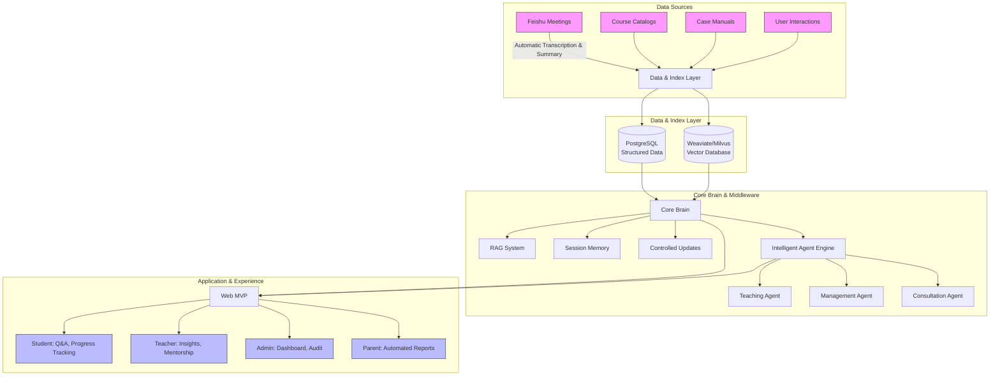

# Project Overview

<cite>
**Referenced Files in This Document**   
- [NOVE项目书.md](file://NOVE项目书.md)
- [项目名称.md](file://项目名称.md)
- [项目介绍.md](file://项目介绍.md)
- [完整方案构思.md](file://完整方案构思.md)
- [实施路线图.md](file://实施路线图.md)
- [技术框架方案探讨.md](file://技术框架方案探讨.md)
</cite>

## Table of Contents
1. [Vision and Mission](#vision-and-mission)  
2. [Core Concept: The "Prince Teacher" Metaphor](#core-concept-the-prince-teacher-metaphor)  
3. [Target Audience](#target-audience)  
4. [Market Positioning and Value Proposition](#market-positioning-and-value-proposition)  
5. [Branding and the Meaning of "NOVE"](#branding-and-the-meaning-of-nove)  
6. [Educational Framework: AI-Human Collaboration](#educational-framework-ai-human-collaboration)  
7. [Conceptual Model of the NOVE AI Education Platform](#conceptual-model-of-the-nove-ai-education-platform)

## Vision and Mission

The NOVE AI education platform is founded on a transformative vision: to revolutionize education by seamlessly integrating artificial intelligence with human mentorship, creating a new paradigm of personalized, elite-level learning for every individual. The mission of NOVE is to build an intelligent education platform that acts as a "core brain" for educational institutions, unifying knowledge, enhancing human capabilities, and delivering a "Prince Teacher" experience to all learners.

Inspired by the ancient Chinese concept of the "Crown Prince's Tutor," NOVE aims to provide each student with a level of dedicated, high-caliber educational support that was once reserved for royalty. This is not merely about luxury, but about a fundamental shift in educational philosophy—moving from a one-size-fits-all model to a system where every learner is treated as a unique individual with a bespoke educational journey. The platform is designed to be a central hub for knowledge, capable of ingesting, processing, and intelligently serving information from diverse sources such as meetings, documents, and course materials, thereby empowering both students and educators.

**Section sources**
- [NOVE项目书.md](file://NOVE项目书.md#L1-L20)
- [项目介绍.md](file://项目介绍.md#L1-L10)

## Core Concept: The "Prince Teacher" Metaphor

The "Prince Teacher" metaphor is the cornerstone of NOVE's educational philosophy. It symbolizes a fusion of AI intelligence and human mentorship, where technology serves as a powerful, tireless assistant to human educators, enabling them to deliver an unprecedented level of personalized attention.

In this model, the AI system acts as the "intelligent aide," responsible for the heavy lifting of data processing, continuous monitoring, and preliminary analysis. It automatically transcribes and summarizes meetings, retrieves relevant knowledge from a vast repository, and provides real-time, data-driven insights. This allows the human teacher—the "master tutor"—to focus on the highest-value activities: providing emotional support, offering nuanced guidance, fostering critical thinking, and building deep, personal relationships with students.

The metaphor emphasizes that AI does not replace the teacher but elevates their role. Just as a prince had a team of advisors and tutors to ensure his holistic development, every student on the NOVE platform is supported by a "team" consisting of a dedicated human mentor and an AI-powered "brain" that manages their entire learning ecosystem. This ensures a "one-student, one-plan" approach, where education is truly "tailored to the individual."

**Section sources**
- [项目介绍.md](file://项目介绍.md#L19-L35)
- [项目名称.md](file://项目名称.md#L16-L25)

## Target Audience

NOVE is designed as a B2B2C platform, serving a diverse ecosystem of stakeholders within an educational organization.

*   **Students (The "Princes")**: The primary beneficiaries. NOVE provides them with a personalized learning path, 24/7 AI-powered tutoring for Q&A and practice, real-time progress tracking, and a holistic development plan. The platform caters to their unique learning styles and paces, ensuring they receive an elite, individualized education.
*   **Teachers and Mentors (The "Master Tutors")**: The human experts who are empowered by the platform. NOVE relieves them of administrative burdens (e.g., grading, note-taking) and provides them with deep, AI-generated insights into each student's performance and needs. This allows them to focus on high-impact teaching, mentorship, and strategic guidance.
*   **Administrators and Managers**: They use NOVE's operational dashboards to monitor overall system health, track key performance indicators (KPIs) like knowledge coverage and task completion rates, manage user permissions, and ensure data security and compliance. The platform provides them with a comprehensive view of institutional efficiency and learning outcomes.
*   **Parents**: The platform includes a parent communication system that automatically generates and delivers personalized learning reports, keeping them informed and engaged in their child's educational journey without requiring constant manual updates from teachers.

**Section sources**
- [NOVE项目书.md](file://NOVE项目书.md#L35-L50)
- [项目介绍.md](file://项目介绍.md#L2-L5)

## Market Positioning and Value Proposition

NOVE is positioned as a pioneering enterprise-grade intelligent education platform that bridges the gap between traditional pedagogy and cutting-edge AI. Its primary market is forward-thinking educational institutions, starting with the Lu Xiangqian Lab as its first client, with a clear expansion path to universities, vocational training centers, and corporate training departments.

The core value proposition of NOVE is **"Elite Education for Everyone."** It offers a unique combination of:

*   **Unparalleled Personalization**: Moving beyond generic curricula to deliver a truly "one-student, one-plan" experience, dynamically adjusted by AI.
*   **Enhanced Human Expertise**: By automating routine tasks and providing deep analytics, NOVE multiplies the effectiveness of human teachers, allowing them to achieve more with their time.
*   **Data-Driven Decision Making**: The platform transforms fragmented data (meetings, documents, student interactions) into a unified, actionable knowledge base, enabling evidence-based teaching and management.
*   **Operational Efficiency**: Automating processes like meeting summarization, action item tracking, and report generation significantly reduces administrative overhead and accelerates knowledge circulation.
*   **Scalable Quality**: The "Prince Teacher" model, powered by AI, makes it possible to deliver a consistently high level of personalized attention at scale, which was previously impossible with human resources alone.

**Section sources**
- [完整方案构思.md](file://完整方案构思.md#L1-L20)
- [项目名称.md](file://项目名称.md#L36-L40)

## Branding and the Meaning of "NOVE"

The name "NOVE" is a deliberate and meaningful choice, derived from the Latin word "novus," meaning "new" or "innovative." This name encapsulates the platform's core mission of bringing a revolutionary approach to education.

The branding is built around the acronym, which stands for a set of core principles:
*   **N - New**: Representing a completely new educational model that breaks free from traditional boundaries.
*   **O - Optimized**: Signifying an optimized learning experience, where every aspect of a student's journey is tailored for maximum effectiveness.
*   **V - Versatile**: Highlighting the platform's ability to adapt to diverse learning styles, subjects, and institutional needs.
*   **E - Elite**: Emphasizing the delivery of an elite, top-tier educational service, akin to the privileged education of a prince.

The brand identity is centered on the concept of the "Prince Washi-style personalized education platform," where "Washi" (洗马) refers to the historical tutor of a crown prince. This powerful metaphor communicates the promise of providing every learner with a royal-level, dedicated, and comprehensive educational experience, supported by a team of experts and intelligent systems.

**Section sources**
- [项目名称.md](file://项目名称.md#L1-L45)

## Educational Framework: AI-Human Collaboration

The NOVE platform is designed around a synergistic AI-human collaboration model. This framework ensures that technology enhances, rather than replaces, the irreplaceable human elements of education.

The system operates on a four-layer architecture: a **Data Source Layer** (ingesting information from tools like Feishu), a **Data and Index Layer** (storing and organizing information in relational and vector databases), a **Core Brain and Middleware Layer** (where AI processes data, performs RAG, and manages intelligent agents), and an **Application and Experience Layer** (the user-facing interface). At the heart of this is the "Core Brain," which uses Retrieval-Augmented Generation (RAG) to provide accurate, traceable answers by combining real-time data retrieval with powerful language models.

The collaboration is seamless: when a student asks a question, the AI "aide" instantly retrieves relevant information and formulates a response. For complex or sensitive matters, the system can flag the query for human review or escalate it directly to the teacher. Similarly, the AI continuously analyzes a student's progress and suggests interventions, which the human mentor can then approve, modify, or act upon personally. This creates a continuous feedback loop where AI handles scale and speed, while humans provide judgment, empathy, and wisdom.

**Section sources**
- [NOVE项目书.md](file://NOVE项目书.md#L80-L150)
- [技术框架方案探讨.md](file://技术框架方案探讨.md#L1-L40)

## Conceptual Model of the NOVE AI Education Platform

**Diagram sources**
- [NOVE项目书.md](file://NOVE项目书.md#L80-L150)
- [完整方案构思.md](file://完整方案构思.md#L20-L50)