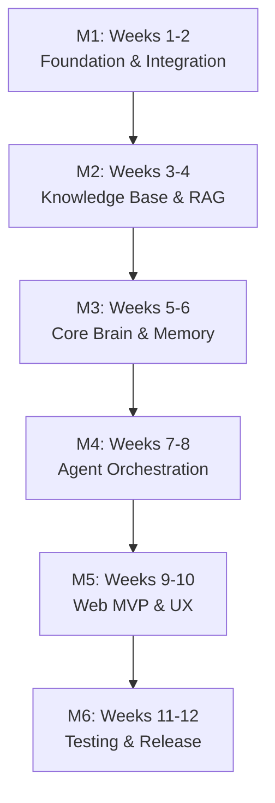
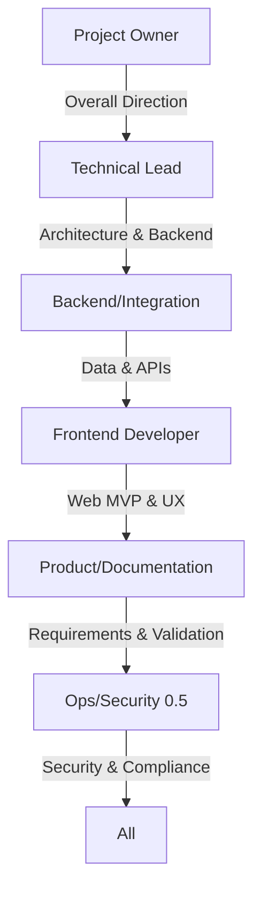
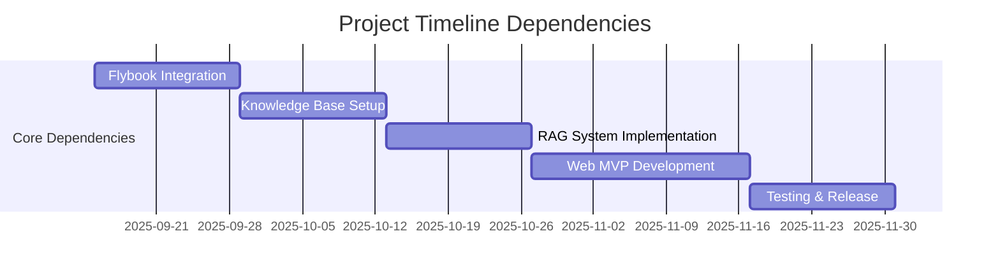

# Project Planning

<cite>
**Referenced Files in This Document**   
- [NOVE项目书.md](file://NOVE项目书.md)
- [实施路线图.md](file://实施路线图.md)
- [技术框架方案探讨.md](file://技术框架方案探讨.md)
- [完整方案构思.md](file://完整方案构思.md)
- [项目介绍.md](file://项目介绍.md)
- [项目名称.md](file://项目名称.md)
</cite>

## Table of Contents
1. [Organizational Structure](#organizational-structure)
2. [Milestone Tracking](#milestone-tracking)
3. [Resource Allocation](#resource-allocation)
4. [Risk Mitigation Strategies](#risk-mitigation-strategies)
5. [Team Roles and Responsibilities](#team-roles-and-responsibilities)
6. [Sprint Planning Approach](#sprint-planning-approach)
7. [Coordination Mechanisms](#coordination-mechanisms)
8. [Success Metrics (KPIs)](#success-metrics-kpis)
9. [Budgetary Considerations](#budgetary-considerations)
10. [Timeline Dependencies](#timeline-dependencies)
11. [External Integration Challenges](#external-integration-challenges)

## Organizational Structure

The project adopts a lean, cross-functional team structure designed for rapid iteration and high accountability. The organizational model emphasizes flat communication, clear ownership, and technical-product alignment to support agile delivery of the AI-powered education platform.

**Section sources**
- [NOVE项目书.md](file://NOVE项目书.md#L7)
- [完整方案构思.md](file://完整方案构思.md#L1)

## Milestone Tracking

The project follows a 12-week milestone-driven delivery plan, structured into six bi-weekly phases. Each milestone delivers a tangible increment of functionality, enabling continuous validation and stakeholder feedback.

**Diagram sources**
- [NOVE项目书.md](file://NOVE项目书.md#L209-L267)

## Resource Allocation

Resource planning is based on a core team of 3–5 full-time members over a 3-month period. The allocation balances technical development, product design, and operational readiness to ensure sustainable delivery pace and quality.

**Section sources**
- [NOVE项目书.md](file://NOVE项目书.md#L385)

## Risk Mitigation Strategies

Key risks are proactively identified and addressed through technical, process, and governance controls. The strategy emphasizes early detection, redundancy, and continuous monitoring to maintain system reliability and data integrity.

**Section sources**
- [NOVE项目书.md](file://NOVE项目书.md#L366-L384)
- [技术框架方案探讨.md](file://技术框架方案探讨.md#L600-L650)

## Team Roles and Responsibilities

The team is structured around specialized roles with clear deliverables and accountability. This ensures end-to-end ownership of critical components while enabling collaborative problem-solving.

**Diagram sources**
- [NOVE项目书.md](file://NOVE项目书.md#L349-L355)

**Section sources**
- [NOVE项目书.md](file://NOVE项目书.md#L349-L355)

## Sprint Planning Approach

The project follows a bi-weekly sprint cycle aligned with the 12-week milestone plan. Each sprint begins with a planning session to define scope, acceptance criteria, and success metrics. Sprints conclude with a review and retrospective to incorporate feedback and improve processes.

Sprint planning emphasizes:
- Delivering working software every two weeks
- Prioritizing high-value, user-facing features
- Maintaining technical debt below 10% of capacity
- Ensuring test coverage ≥ 80% for critical modules

**Section sources**
- [NOVE项目书.md](file://NOVE项目书.md#L209-L267)
- [技术框架方案探讨.md](file://技术框架方案探讨.md#L500-L550)

## Coordination Mechanisms

Coordination is achieved through lightweight, high-frequency communication practices:
- Daily 15-minute standups for progress tracking
- Bi-weekly sprint reviews with stakeholders
- Weekly architecture and design syncs
- Real-time collaboration via shared documentation and task boards

The team uses a "contract-first" approach for integrations, ensuring API specifications are agreed upon before implementation begins.

**Section sources**
- [NOVE项目书.md](file://NOVE项目书.md#L14)
- [技术框架方案探讨.md](file://技术框架方案探讨.md#L580-L590)

## Success Metrics (KPIs)

Success is measured through a balanced set of technical, business, and user experience KPIs.

### Technical Performance KPIs
| Metric | Target | Measurement Method |
|--------|--------|-------------------|
| **Question Accuracy Rate** | ≥ 80% | Top-K hit rate + manual audit |
| **System Response Time** | Avg < 2s, P99 < 5s | APM monitoring + UX telemetry |
| **System Availability** | ≥ 99.5% | Health checks + auto-recovery |
| **Concurrent Users** | > 1,000 | Load testing + elastic scaling |

### Business Effectiveness KPIs
| Metric | Target | Measurement Method |
|--------|--------|-------------------|
| **Self-Service Resolution Rate** | ≥ 60% | User interaction analysis |
| **Action Item Closure Rate** | ≥ 70% | Task tracking system |
| **Knowledge Coverage** | ≥ 85% | Document indexing audit |
| **Data Accuracy** | 0 violations | Permission & security audit |

### User Experience KPIs
| Metric | Target | Measurement Method |
|--------|--------|-------------------|
| **User Satisfaction** | ≥ 4.2/5 | In-app surveys |
| **User Retention Rate** | ≥ 70% monthly | Analytics tracking |
| **Feature Adoption Rate** | ≥ 80% | Usage analytics |
| **Learning Efficiency Gain** | ≥ 25% | User-reported metrics |

**Section sources**
- [NOVE项目书.md](file://NOVE项目书.md#L310-L348)

## Budgetary Considerations

The budget encompasses personnel, infrastructure, and third-party services. Cost management focuses on optimizing cloud resource utilization and controlling AI model invocation expenses.

Key cost components:
- **Personnel**: 3–5 FTEs over 3 months
- **Infrastructure**: PostgreSQL, vector database, object storage
- **Third-party**: LLM APIs (GPT-4, Claude), speech-to-text services
- **Monitoring**: Logging, tracing, and observability tools

Cost control measures include:
- Resource utilization ≥ 75%
- AI cost per user per month within budget
- Regular cost reviews at each milestone

**Section sources**
- [NOVE项目书.md](file://NOVE项目书.md#L385)

## Timeline Dependencies

The project timeline has critical dependencies on external systems and internal deliverables. These are managed through early integration testing and incremental delivery.

**Diagram sources**
- [NOVE项目书.md](file://NOVE项目书.md#L209-L267)

## External Integration Challenges

The primary external integration is with Flybook (Feishu), which presents several technical and operational challenges:

### Key Integration Risks
- **API Rate Limiting**: Flybook API quotas may restrict data synchronization
  - *Mitigation*: Implement request queuing with exponential backoff
- **Authentication Complexity**: OAuth 2.0 flow and webhook verification
  - *Mitigation*: Use standardized auth libraries and sandbox testing
- **Data Format Variability**: Inconsistent document and meeting structures
  - *Mitigation*: Build adaptive parsers with fallback strategies
- **Real-time Sync Reliability**: Ensuring no data loss during events
  - *Mitigation*: Implement idempotent processing and retry mechanisms

Integration is approached incrementally, starting with read-only access and expanding to write operations after validation.

**Section sources**
- [NOVE项目书.md](file://NOVE项目书.md#L93-L104)
- [技术框架方案探讨.md](file://技术框架方案探讨.md#L300-L350)