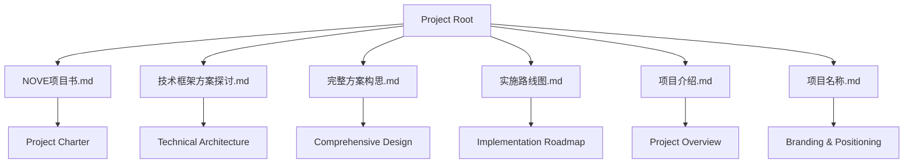
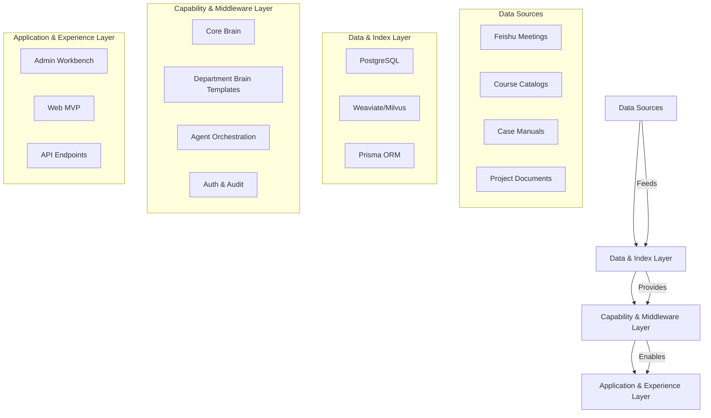
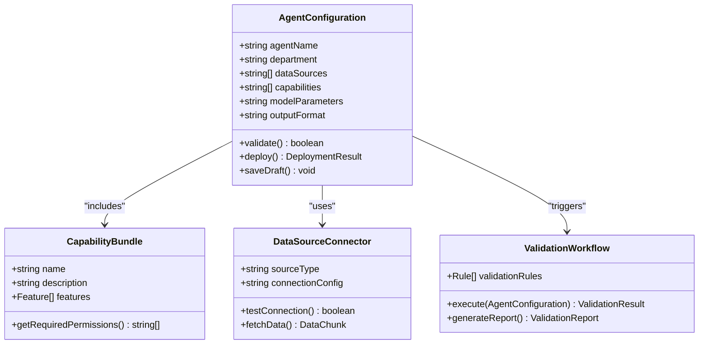
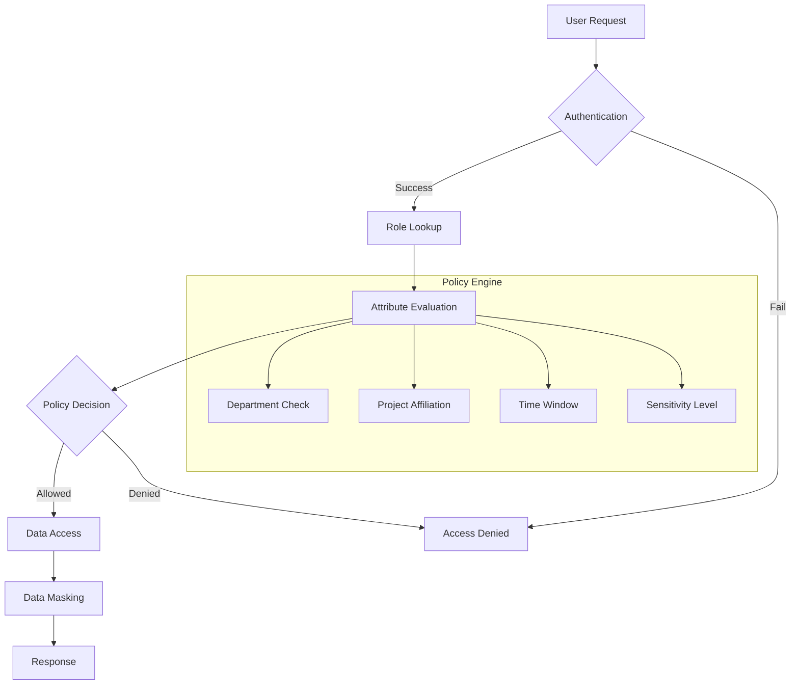
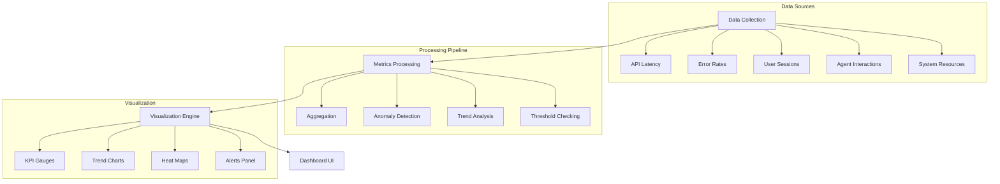
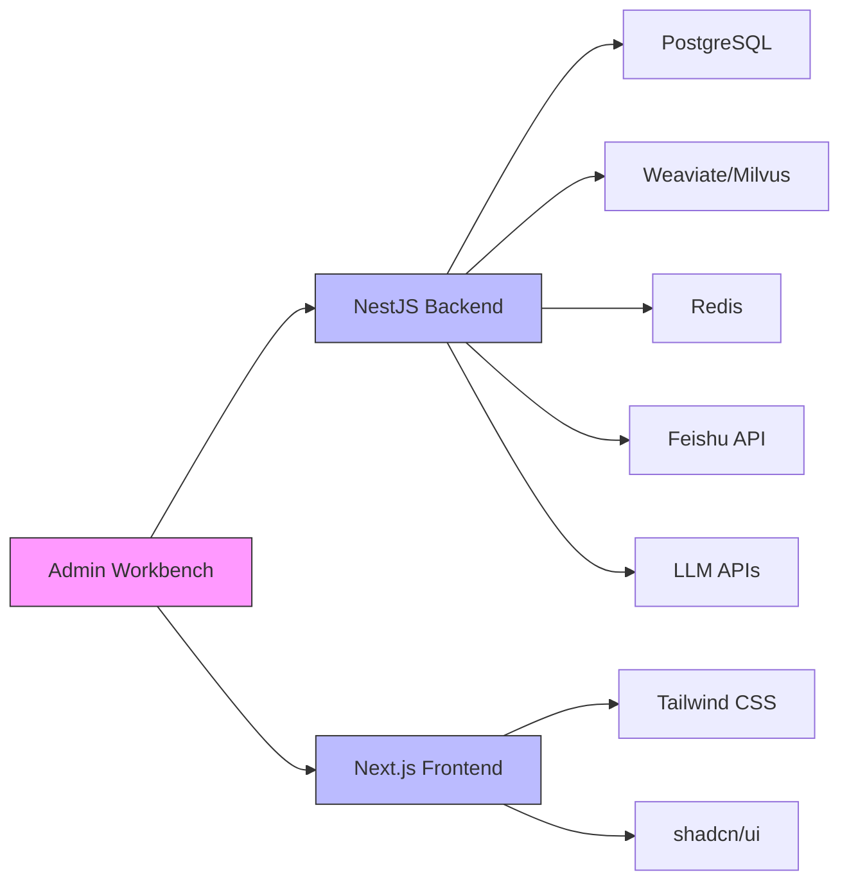

# Admin Interface

<cite>
**Referenced Files in This Document**   
- [NOVE项目书.md](file://NOVE项目书.md)
- [技术框架方案探讨.md](file://技术框架方案探讨.md)
- [完整方案构思.md](file://完整方案构思.md)
- [实施路线图.md](file://实施路线图.md)
- [项目介绍.md](file://项目介绍.md)
- [项目名称.md](file://项目名称.md)
</cite>

## Table of Contents
1. [Introduction](#introduction)
2. [Project Structure](#project-structure)
3. [Core Components](#core-components)
4. [Architecture Overview](#architecture-overview)
5. [Detailed Component Analysis](#detailed-component-analysis)
6. [Dependency Analysis](#dependency-analysis)
7. [Performance Considerations](#performance-considerations)
8. [Troubleshooting Guide](#troubleshooting-guide)
9. [Conclusion](#conclusion)

## Introduction
The Administrator Workbench within the Application & Experience Layer of the NOVE platform serves as the central control hub for managing AI-driven educational services. This interface enables administrators to configure departmental AI agents, manage user permissions, monitor system performance, and audit knowledge retrieval processes. Designed with a low-code philosophy, the admin interface supports form-based configuration, capability bundling, and validation workflows to streamline agent deployment. It integrates with backend APIs for real-time status updates and system control, providing visualizations of KPIs, user activity logs, and agent behavior analytics. The system emphasizes secure access, role-based UI rendering, and robust error handling during configuration. This documentation details the design, functionality, and operational best practices for the Administrator Workbench, ensuring effective management of large-scale deployments.

## Project Structure
The NOVE project is structured around a layered architecture that separates concerns across data, intelligence, and application layers. The root directory contains key documentation files that define the project's vision, technical framework, implementation roadmap, and core concepts. These include `NOVE项目书.md` (project charter), `技术框架方案探讨.md` (technical architecture), `完整方案构思.md` (comprehensive design), `实施路线图.md` (implementation roadmap), `项目介绍.md` (project overview), and `项目名称.md` (branding and positioning). This flat structure prioritizes clarity and accessibility, with all strategic and technical decisions captured in markdown documents rather than distributed across code files. The absence of traditional source code directories suggests that implementation is either in early stages or managed externally, with documentation serving as the primary artifact for system design and planning.

**Diagram sources**
- [NOVE项目书.md](file://NOVE项目书.md)
- [技术框架方案探讨.md](file://技术框架方案探讨.md)
- [完整方案构思.md](file://完整方案构思.md)

**Section sources**
- [NOVE项目书.md](file://NOVE项目书.md)
- [技术框架方案探讨.md](file://技术框架方案探讨.md)
- [完整方案构思.md](file://完整方案构思.md)
- [实施路线图.md](file://实施路线图.md)
- [项目介绍.md](file://项目介绍.md)
- [项目名称.md](file://项目名称.md)

## Core Components
The Administrator Workbench comprises several core components that enable comprehensive management of the AI education platform. These include the agent configuration engine, permission management system, monitoring dashboard, and audit logging framework. The agent configuration engine supports low-code setup of departmental AI agents through form-based inputs and capability selection. The permission system implements RBAC and ABAC models to enforce data access controls. The monitoring component provides real-time KPIs and system health metrics, while the audit framework tracks knowledge retrieval and user activities. These components are designed to work together seamlessly, providing administrators with a unified interface for system oversight and control.

**Section sources**
- [NOVE项目书.md](file://NOVE项目书.md#L1-L420)
- [技术框架方案探讨.md](file://技术框架方案探讨.md#L1-L700)
- [完整方案构思.md](file://完整方案构思.md#L1-L213)

## Architecture Overview
The Administrator Workbench operates within a four-layer architecture that spans from data sources to user experience. At the foundation, data is ingested from various sources including meeting systems, documents, and business applications. This data flows through processing and indexing layers where it is cleaned, structured, and stored in both relational and vector databases. The middle layer hosts the core intelligence, including the central "brain" for unified retrieval and reasoning, departmental agent templates, and orchestration engines. At the top, the Application & Experience Layer provides the admin interface with web-based access to configuration, monitoring, and management functions. This layered approach ensures separation of concerns while enabling tight integration between components.

**Diagram sources**
- [NOVE项目书.md](file://NOVE项目书.md#L1-L420)
- [技术框架方案探讨.md](file://技术框架方案探讨.md#L1-L700)

## Detailed Component Analysis

### Agent Configuration Interface
The low-code agent configuration interface allows administrators to create and manage departmental AI agents without requiring programming expertise. Through a form-based UI, admins can select data sources, define capabilities, and set operational parameters for each agent. The interface supports capability bundling, where multiple functions such as Q&A, report generation, and task reminders can be combined into a single agent profile. Validation workflows ensure that configurations meet system requirements before deployment. This approach enables rapid creation of specialized agents for different departments, such as teaching assistants, management bots, or consultation services, each tailored to specific organizational needs.

#### For Object-Oriented Components:

**Diagram sources**
- [完整方案构思.md](file://完整方案构思.md#L1-L213)
- [技术框架方案探讨.md](file://技术框架方案探讨.md#L1-L700)

**Section sources**
- [完整方案构思.md](file://完整方案构思.md#L1-L213)
- [技术框架方案探讨.md](file://技术框架方案探讨.md#L1-L700)

### Permission Management System
The permission management system implements a hybrid model combining Role-Based Access Control (RBAC) and Attribute-Based Access Control (ABAC) to ensure secure data access. Administrators can define roles such as system administrator, department administrator, and regular user, each with specific privileges. The system enforces data isolation at the department level, ensuring users only access information relevant to their responsibilities. Sensitive data is automatically detected and masked, while comprehensive audit logs track all access attempts and modifications. This multi-layered approach to security enables fine-grained control over who can view, modify, or delete information within the platform.

**Diagram sources**
- [NOVE项目书.md](file://NOVE项目书.md#L1-L420)
- [技术框架方案探讨.md](file://技术框架方案探讨.md#L1-L700)

**Section sources**
- [NOVE项目书.md](file://NOVE项目书.md#L1-L420)
- [技术框架方案探讨.md](file://技术框架方案探讨.md#L1-L700)

### Monitoring and Analytics Dashboard
The monitoring and analytics dashboard provides real-time visibility into system performance and usage patterns. Key performance indicators such as response times, success rates, and user satisfaction are displayed alongside system health metrics. The dashboard tracks AI effectiveness through measures like answer accuracy and hallucination detection rates. User activity logs show interaction patterns, while agent behavior analytics reveal how different AI assistants are being utilized across departments. This comprehensive monitoring capability enables administrators to identify bottlenecks, optimize performance, and ensure service quality meets organizational standards.

**Diagram sources**
- [NOVE项目书.md](file://NOVE项目书.md#L1-L420)
- [技术框架方案探讨.md](file://技术框架方案探讨.md#L1-L700)

**Section sources**
- [NOVE项目书.md](file://NOVE项目书.md#L1-L420)
- [技术框架方案探讨.md](file://技术框架方案探讨.md#L1-L700)

## Dependency Analysis
The Administrator Workbench depends on several key components and services to function effectively. At the data layer, it relies on PostgreSQL for storing configuration data and user permissions, while vector databases like Weaviate or Milvus support semantic search capabilities. The backend is built on NestJS, providing a robust framework for API development and integration. Frontend components are implemented using Next.js with Tailwind CSS for responsive design. The system integrates with external services such as Feishu for meeting data and authentication providers for user management. These dependencies are carefully selected to balance development efficiency, performance, and long-term maintainability.

**Diagram sources**
- [技术框架方案探讨.md](file://技术框架方案探讨.md#L1-L700)
- [NOVE项目书.md](file://NOVE项目书.md#L1-L420)

**Section sources**
- [技术框架方案探讨.md](file://技术框架方案探讨.md#L1-L700)
- [NOVE项目书.md](file://NOVE项目书.md#L1-L420)

## Performance Considerations
When managing large-scale deployments through the Administrator Workbench, several performance considerations must be addressed. The system is designed to handle 1000+ concurrent users with a target availability of 99.5% and average response times under 2 seconds. Caching strategies employ Redis to store frequently accessed data such as user permissions and session contexts. The architecture supports horizontal scaling of application services, while database sharding can be implemented as data volumes grow. For AI-intensive operations, the system uses asynchronous processing with message queues to handle long-running tasks like meeting transcription and index rebuilding. These design choices ensure that administrative functions remain responsive even under heavy load.

## Troubleshooting Guide
Common issues in the Administrator Workbench typically relate to configuration errors, permission conflicts, or integration failures. When configuring new AI agents, administrators should verify that selected data sources are accessible and that capability bundles are compatible. Permission issues often arise from role inheritance conflicts or attribute-based policies that inadvertently restrict access. Integration problems with external systems like Feishu may occur due to API rate limiting or authentication token expiration. The system provides diagnostic tools including real-time logs, configuration validation reports, and connectivity tests to assist in resolving these issues. Regular monitoring of system health metrics can help prevent problems before they impact users.

**Section sources**
- [NOVE项目书.md](file://NOVE项目书.md#L1-L420)
- [技术框架方案探讨.md](file://技术框架方案探讨.md#L1-L700)

## Conclusion
The Administrator Workbench for the NOVE platform provides a comprehensive interface for managing an AI-powered educational ecosystem. By combining low-code configuration, robust permission controls, and real-time monitoring, it enables administrators to efficiently deploy and oversee departmental AI agents. The system's architecture supports scalability and security, making it suitable for large organizations with complex requirements. As the platform evolves, the admin interface will continue to play a critical role in ensuring that AI capabilities are aligned with organizational goals and deliver maximum value to users. The documented best practices and troubleshooting guidance provide a solid foundation for successful implementation and ongoing management of the system.