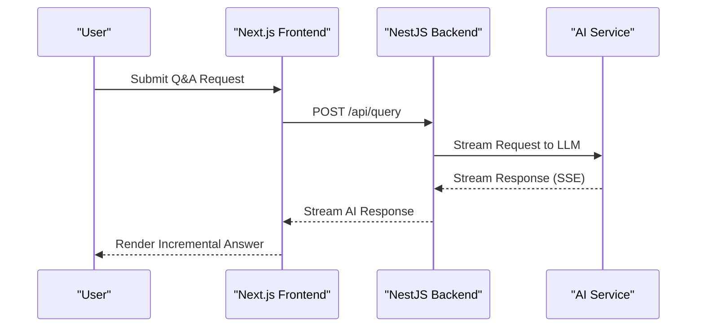
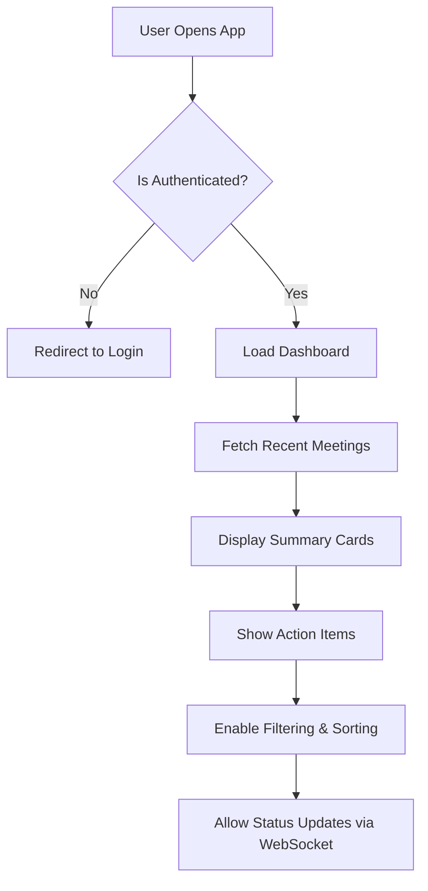

# Application & Experience Layer

<cite>
**Referenced Files in This Document**  
- [技术框架方案探讨.md](file://技术框架方案探讨.md)
</cite>

## Table of Contents
1. [Introduction](#introduction)
2. [Frontend Architecture](#frontend-architecture)
3. [State Management and Real-Time Interaction](#state-management-and-real-time-interaction)
4. [Core User Experience Design](#core-user-experience-design)
5. [Administrator Workbenches](#administrator-workbenches)
6. [Responsive Design and Accessibility](#responsive-design-and-accessibility)
7. [Future Extension Points](#future-extension-points)
8. [Conclusion](#conclusion)

## Introduction
The Application & Experience Layer of the NOVE platform is designed to deliver a seamless, intelligent, and user-centric digital experience for teachers, students, and parents. Built on a modern tech stack centered around Next.js and Tailwind CSS, this layer powers the Web MVP with core functionalities including AI-driven Q&A, meeting summary dashboards, and action item tracking. This document outlines the architectural principles, frontend design patterns, real-time interaction mechanisms, and future scalability of the user-facing components.

**Section sources**
- [技术框架方案探讨.md](file://技术框架方案探讨.md#L1-L50)

## Frontend Architecture
The frontend architecture is based on **Next.js**, leveraging its support for Server-Side Rendering (SSR) to enhance SEO for knowledge retrieval pages and streamline API routing for efficient communication between client and server. The integration of **TypeScript** ensures type safety across the full stack, reducing runtime errors and improving developer productivity.

UI components are styled using **Tailwind CSS**, enabling rapid development of responsive and customizable interfaces. The component library is enhanced with **shadcn/ui**, providing accessible and modular UI elements. Key custom components include:
- Intelligent Q&A interface with multi-turn conversation and citation tracing
- Meeting summary dashboard with structured insights
- Kanban-style action item tracking board
- Low-code agent configuration interface for administrators

This architecture supports both static and dynamic content delivery, with optimized performance through built-in Next.js features such as image optimization, code splitting, and incremental static regeneration.

**Section sources**
- [技术框架方案探讨.md](file://技术框架方案探讨.md#L51-L100)

## State Management and Real-Time Interaction
To manage application state efficiently, the platform uses **Zustand** as the primary state management solution. Its lightweight nature and simplicity make it ideal for medium-sized applications like the NOVE Web MVP, allowing shared state across components without the complexity of larger frameworks.

Real-time interactions are enabled through two complementary technologies:
- **WebSocket**: Used for bidirectional communication in live scenarios such as classroom interaction, meeting status synchronization, and collaborative editing.
- **Server-Sent Events (SSE)**: Employed for streaming AI-generated responses from the backend, enabling progressive rendering of long-form content like meeting summaries or detailed answers.

Additionally, **React Query** is used for server state management, providing intelligent caching, background data synchronization, and automatic revalidation. This ensures that users always interact with up-to-date information while minimizing unnecessary network requests.

**Diagram sources**
- [技术框架方案探讨.md](file://技术框架方案探讨.md#L101-L130)

**Section sources**
- [技术框架方案探讨.md](file://技术框架方案探讨.md#L101-L130)

## Core User Experience Design
The user experience is tailored to three primary personas: **teachers**, **students**, and **parents**, each with distinct workflows and information needs.

### Intelligent Q&A System
Users can ask natural language questions about meetings, documents, or projects. The system leverages Retrieval-Augmented Generation (RAG) to provide accurate, context-aware responses with traceable sources. The interface supports multi-turn conversations and displays confidence levels and citation references.

### Meeting Summary Dashboard
After each meeting, an AI-generated summary is displayed, highlighting:
- Key discussion points
- Decisions made
- Identified action items with owners and deadlines
- Timeline of events

This dashboard integrates with calendar systems (e.g., Feishu) and updates in real time as new data becomes available.

### Action Item Tracking
Action items are extracted automatically from meeting transcripts and displayed in a Kanban-style board. Users can filter by status, assignee, or deadline. Real-time updates ensure all stakeholders see the latest progress.

**Diagram sources**
- [技术框架方案探讨.md](file://技术框架方案探讨.md#L131-L160)

**Section sources**
- [技术框架方案探讨.md](file://技术框架方案探讨.md#L131-L160)

## Administrator Workbenches
Administrators have access to dedicated workbenches for configuring AI agents and monitoring system health.

### Agent Configuration Interface
A low-code interface allows administrators to:
- Select pre-defined agent templates (e.g., Teaching Assistant, Project Manager)
- Bind data sources with permission-aware filtering
- Enable/disable capabilities (Q&A, report generation, reminders)
- Define routing rules based on query type

These configurations are persisted and dynamically loaded by the backend to customize agent behavior per department or role.

### System Monitoring Dashboard
Real-time metrics are displayed, including:
- Active users and concurrent sessions
- API latency and error rates
- AI response quality (accuracy, hallucination rate)
- Task queue status (e.g., document processing)

Alerts are triggered when thresholds are exceeded, and logs are available for audit and troubleshooting.

**Section sources**
- [技术框架方案探讨.md](file://技术框架方案探讨.md#L161-L190)

## Responsive Design and Accessibility
The UI is built with **responsive design** principles using Tailwind CSS, ensuring optimal display across devices—from desktops to tablets. Flexible layouts adapt to screen size, maintaining usability and readability.

Accessibility is prioritized through:
- Semantic HTML structure
- Keyboard navigation support
- ARIA labels and roles
- High-contrast mode and font scaling options
- Screen reader compatibility

User workflows are designed to minimize cognitive load, with guided onboarding and contextual help available throughout the application.

**Section sources**
- [技术框架方案探讨.md](file://技术框架方案探讨.md#L191-L210)

## Future Extension Points
The architecture is designed for extensibility beyond the current Web MVP.

### Mobile and Desktop Applications
Future versions will include native mobile apps (iOS/Android) and a desktop client, sharing core logic via reusable TypeScript modules. These clients will support offline mode with local data caching and sync upon reconnection.

### Hardware Integration
Planned integrations include:
- Smart classroom devices (e.g., AI-powered whiteboards)
- Wearables for attendance and engagement tracking
- Voice-enabled kiosks for hands-free interaction

### Cross-Platform Synchronization
A unified state synchronization mechanism will ensure consistent user experience across all interfaces, powered by real-time updates via WebSocket and conflict-free replicated data types (CRDTs) for offline edits.

**Section sources**
- [技术框架方案探讨.md](file://技术框架方案探讨.md#L211-L230)

## Conclusion
The Application & Experience Layer of the NOVE platform delivers a robust, scalable, and user-focused frontend architecture. By combining Next.js, Tailwind CSS, Zustand, and real-time communication protocols, it enables rich, interactive experiences tailored to educational workflows. The design emphasizes accessibility, responsiveness, and extensibility, laying the foundation for future mobile, desktop, and hardware interfaces. With administrator workbenches for agent configuration and system monitoring, the platform balances flexibility with control, ensuring long-term maintainability and alignment with user needs.

**Section sources**
- [技术框架方案探讨.md](file://技术框架方案探讨.md#L231-L250)