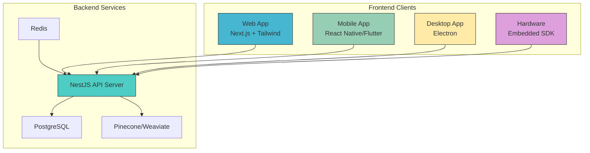

# Multi-Platform Extensions

<cite>
**Referenced Files in This Document**   
- [NOVE项目书.md](file://NOVE项目书.md)
- [技术框架方案探讨.md](file://技术框架方案探讨.md)
- [实施路线图.md](file://实施路线图.md)
- [完整方案构思.md](file://完整方案构思.md)
- [项目介绍.md](file://项目介绍.md)
</cite>

## Table of Contents
1. [Introduction](#introduction)
2. [Architectural Considerations for Multi-Platform Support](#architectural-considerations-for-multi-platform-support)
3. [Mobile Application Strategy](#mobile-application-strategy)
4. [Desktop Client Implementation](#desktop-client-implementation)
5. [Cross-Device Synchronization and Offline Access](#cross-device-synchronization-and-offline-access)
6. [Push Notification System](#push-notification-system)
7. [User Experience and Accessibility Standards](#user-experience-and-accessibility-standards)
8. [Real-Time Communication Across Platforms](#real-time-communication-across-platforms)
9. [Technical Feasibility and Resource Allocation](#technical-feasibility-and-resource-allocation)
10. [Prioritization Roadmap](#prioritization-roadmap)

## Introduction
This document outlines the future extension roadmap for multi-platform support beyond the Web MVP of the NOVE project. The platform, initially built as a Next.js-based web application for the Lu Xiangqian Laboratory, aims to evolve into a comprehensive cross-platform intelligent education system. This roadmap details the architectural strategies for expanding to mobile applications (iOS/Android), desktop clients, and potential hardware integrations. It addresses the technical, user experience, and operational considerations necessary to maintain a cohesive, high-performance, and secure educational platform across all devices.

**Section sources**
- [NOVE项目书.md](file://NOVE项目书.md#L1-L50)
- [项目介绍.md](file://项目介绍.md#L1-L20)

## Architectural Considerations for Multi-Platform Support
The current architecture is a four-layer system: Data Source, Data & Index, Capability & Middleware, and Application & Experience. The Web MVP is built on Next.js, which provides a strong foundation for server-side rendering and a unified TypeScript experience. For multi-platform expansion, the key architectural principle is **separation of concerns**. The core business logic, data models, and API contracts (defined via OpenAPI) must remain centralized in the backend (NestJS) and shared across all clients. This ensures consistency and reduces maintenance overhead. The frontend strategy will shift from a monolithic web app to a multi-client ecosystem, all consuming the same robust API layer.

**Diagram sources**
- [NOVE项目书.md](file://NOVE项目书.md#L100-L150)
- [技术框架方案探讨.md](file://技术框架方案探讨.md#L50-L100)

**Section sources**
- [NOVE项目书.md](file://NOVE项目书.md#L100-L150)
- [技术框架方案探讨.md](file://技术框架方案探讨.md#L50-L100)

## Mobile Application Strategy
The mobile application will be the primary extension beyond the web, enabling on-the-go access to learning materials and real-time communication. Two primary technical paths are under consideration: React Native and Flutter.

**React Native** offers the highest degree of code reuse with the existing Next.js (React) codebase. The shared use of TypeScript allows for a unified development experience, and a significant portion of the UI components and business logic can be shared between the web and mobile apps. This aligns perfectly with the project's "value-first" and "gradual iteration" principles, minimizing the initial development cost and time-to-market.

**Flutter** presents an alternative with a highly performant, natively compiled engine and a rich, customizable widget library. While it would require a complete rewrite of the UI layer in Dart, it offers superior performance and a more consistent look-and-feel across iOS and Android, adhering strictly to each platform's design guidelines (Material Design and Cupertino).

Given the existing investment in the React/TypeScript stack, **React Native is the recommended path** for the initial mobile release. This decision leverages the current team's expertise and accelerates development. The mobile app will focus on core functionalities: accessing the RAG-based Q&A system, viewing meeting summaries and action items, receiving push notifications, and offline access to downloaded learning materials.

**Section sources**
- [技术框架方案探讨.md](file://技术框架方案探讨.md#L500-L520)
- [完整方案构思.md](file://完整方案构思.md#L100-L120)

## Desktop Client Implementation
For a richer, more powerful user experience, particularly for content creation and management, a desktop client will be developed using **Electron**. Electron allows for the creation of cross-platform desktop applications (Windows, macOS, Linux) using web technologies (HTML, CSS, JavaScript/TypeScript). This is a natural extension of the current stack, as the core application logic and UI components from the Next.js web app can be largely reused.

The desktop client will serve as a productivity hub, offering features that benefit from a larger screen and direct file system access. This includes advanced document editing, comprehensive data analysis and reporting, and the management of complex intelligent agent configurations. The Electron app will communicate with the NestJS backend via the same RESTful API and tRPC endpoints used by the web and mobile clients, ensuring data consistency. Security will be paramount, with the same RBAC/ABAC permission model and data encryption standards applied.

**Section sources**
- [技术框架方案探讨.md](file://技术框架方案探讨.md#L520-L530)
- [完整方案构思.md](file://完整方案构思.md#L120-L140)

## Cross-Device Synchronization and Offline Access
Seamless synchronization across devices is critical for user retention and satisfaction. The central **PostgreSQL database** will serve as the single source of truth for all user data, including profiles, preferences, learning progress, and action items. All clients will sync their state with this backend via the API.

For offline access, a local data persistence strategy will be implemented on mobile and desktop clients. On mobile, **React Native's AsyncStorage** or a lightweight SQLite database will cache essential learning materials (e.g., course documents, case studies) and recent conversation history. The app will detect network status and automatically switch to offline mode, allowing users to review cached content. Upon reconnection, any user-generated content (e.g., notes, completed tasks) will be synchronized with the backend, with conflict resolution handled by the server.

The **"cold data" storage strategy** mentioned in the technical framework (archiving data older than 12 months) will be leveraged to manage the size of the offline cache, ensuring optimal performance on devices with limited storage.

**Section sources**
- [技术框架方案探讨.md](file://技术框架方案探讨.md#L300-L320)
- [NOVE项目书.md](file://NOVE项目书.md#L200-L220)

## Push Notification System
To keep users engaged and informed, a robust push notification system will be integrated. This system will deliver timely alerts for critical events such as new action items assigned to the user, deadlines approaching, new meeting summaries being available, and personalized learning recommendations.

The backend will use a **message queue (Redis + BullMQ)** to manage notification tasks asynchronously. When an event occurs (e.g., an action item is created), a notification job is queued. A dedicated **notification service** will then process this job, determine the target users, and send the notification through the appropriate platform-specific service (Apple Push Notification Service for iOS, Firebase Cloud Messaging for Android, and a custom solution for the desktop client).

The notification content will be personalized and actionable, allowing users to tap a notification to directly open the relevant content within the app, thereby driving engagement and ensuring important information is not missed.

**Section sources**
- [技术框架方案探讨.md](file://技术框架方案探讨.md#L250-L270)
- [NOVE项目书.md](file://NOVE项目书.md#L180-L190)

## User Experience and Accessibility Standards
Maintaining a consistent user experience (UX) across platforms is a key challenge. The goal is **familiarity, not uniformity**. Core navigation patterns, color schemes, and branding will be consistent, but each client will adhere to its platform's native UI guidelines. The mobile app will follow Material Design or Human Interface Guidelines, the desktop app will have native window controls and menu bars, and the web app will retain its responsive design.

Accessibility is a non-negotiable requirement. All clients will comply with **WCAG 2.1 AA standards**. This includes proper semantic markup, keyboard navigation support, screen reader compatibility, sufficient color contrast, and resizable text. The use of **Tailwind CSS** in the web app provides a strong foundation for accessible design, and these principles will be extended to the mobile and desktop interfaces. Features like text-to-speech for learning materials and voice input for queries will be explored in future iterations to further enhance accessibility.

**Section sources**
- [技术框架方案探讨.md](file://技术框架方案探讨.md#L150-L170)
- [完整方案构思.md](file://完整方案构思.md#L80-L100)

## Real-Time Communication Across Platforms
The current architecture already supports real-time communication via **WebSocket** for interactive features like live Q&A and **tRPC** for efficient, type-safe remote procedure calls. This existing infrastructure is platform-agnostic and will be the backbone for real-time features across all clients.

All clients—web, mobile, and desktop—will establish WebSocket connections to the NestJS backend to receive real-time updates, such as when a new message arrives in a collaborative session or when an action item's status changes. The tRPC framework, with its strong TypeScript support, will ensure that the API contracts are consistent and type-safe, regardless of the client platform. This unified communication layer guarantees that the "core brain" of the system remains the central, real-time hub of intelligence, with all devices receiving updates simultaneously.

**Section sources**
- [技术框架方案探讨.md](file://技术框架方案探讨.md#L200-L220)
- [NOVE项目书.md](file://NOVE项目书.md#L170-L180)

## Technical Feasibility and Resource Allocation
The technical feasibility of this roadmap is high, primarily due to the modular and well-documented architecture. The clear separation between the frontend and backend, the use of OpenAPI contracts, and the choice of React Native for mobile ensure a smooth transition.

Resource allocation will follow a phased approach. The initial phase will require a **mobile developer** with React Native and TypeScript expertise to work alongside the existing frontend team. The desktop client development can be handled by the same frontend team with minimal additional training on Electron. The backend team will need to focus on hardening the API for mobile use (e.g., optimizing payloads, ensuring robust authentication) and scaling the infrastructure to handle increased load.

The estimated timeline for the mobile MVP is **4-6 months** after the completion of the web MVP, aligning with the "gradual iteration" principle. The desktop client can follow 2-3 months later. The total additional resource requirement is estimated at 1.5-2 full-time equivalents (FTEs) for the first year of multi-platform development.

**Section sources**
- [NOVE项目书.md](file://NOVE项目书.md#L600-L650)
- [实施路线图.md](file://实施路线图.md#L1-L34)

## Prioritization Roadmap
The prioritization for multi-platform expansion is based on user value, technical leverage, and market reach.

1.  **Phase 1: Mobile App (React Native) - High Priority**
    *   **Rationale**: Mobile is the most ubiquitous platform. It enables anytime, anywhere access, which is crucial for a learning platform. Code reuse with the web app maximizes efficiency.
    *   **Timeline**: 4-6 months post-web MVP.
    *   **Key Features**: Q&A, Meeting Summaries, Action Items, Push Notifications, Offline Content.

2.  **Phase 2: Desktop Client (Electron) - Medium Priority**
    *   **Rationale**: Provides a superior experience for content creation, management, and data analysis. Leverages existing web codebase.
    *   **Timeline**: 6-9 months post-web MVP.
    *   **Key Features**: Advanced Agent Configuration, Comprehensive Reporting, File System Integration, Enhanced Editor.

3.  **Phase 3: Hardware Integrations - Low Priority (Future)**
    *   **Rationale**: Potential for specialized hardware (e.g., AI-powered learning kiosks, smart classroom devices) exists but requires significant R&D and market validation.
    *   **Timeline**: 12+ months, dependent on market demand and partnerships.
    *   **Key Features**: Embedded SDK for device integration, Voice-First Interaction, IoT Data Ingestion.

This prioritization ensures that the most impactful features are delivered first, using the most efficient technical paths, while laying the groundwork for future innovation.

**Section sources**
- [实施路线图.md](file://实施路线图.md#L1-L34)
- [NOVE项目书.md](file://NOVE项目书.md#L600-L650)
- [完整方案构思.md](file://完整方案构思.md#L200-L210)