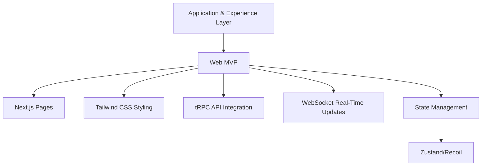
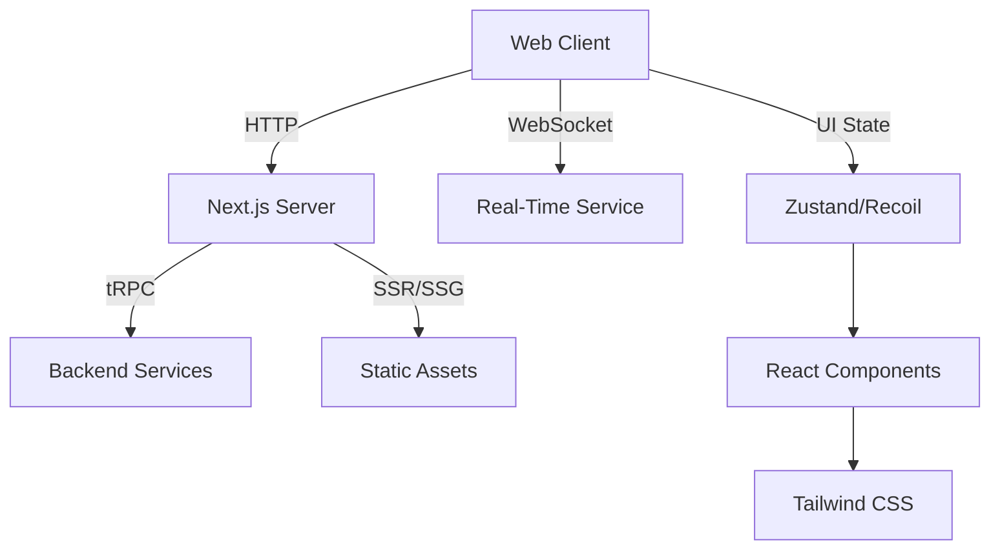
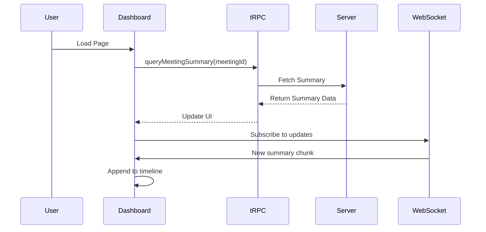
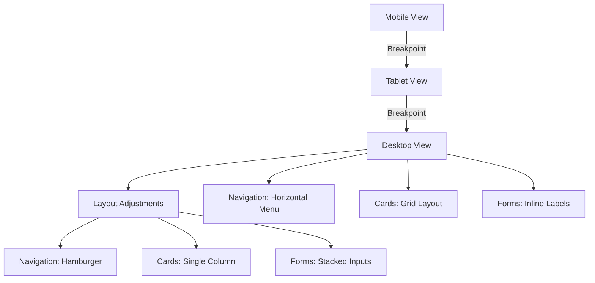
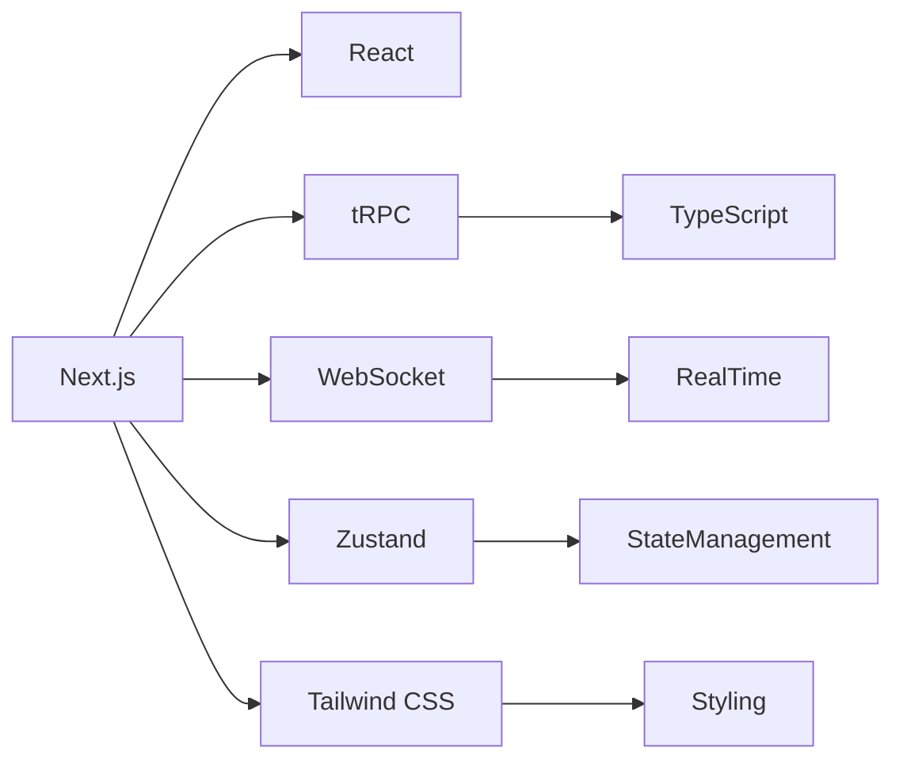

# Web MVP

<cite>
**Referenced Files in This Document**  
- [NOVE项目书.md](file://NOVE项目书.md)
- [完整方案构思.md](file://完整方案构思.md)
- [实施路线图.md](file://实施路线图.md)
- [技术框架方案探讨.md](file://技术框架方案探讨.md)
- [项目介绍.md](file://项目介绍.md)
- [项目名称.md](file://项目名称.md)
</cite>

## Table of Contents
1. [Introduction](#introduction)
2. [Project Structure](#project-structure)
3. [Core Components](#core-components)
4. [Architecture Overview](#architecture-overview)
5. [Detailed Component Analysis](#detailed-component-analysis)
6. [Dependency Analysis](#dependency-analysis)
7. [Performance Considerations](#performance-considerations)
8. [Troubleshooting Guide](#troubleshooting-guide)
9. [Conclusion](#conclusion)

## Introduction
This document provides comprehensive technical documentation for the Web MVP component of the Application & Experience Layer in the NOVE project. The frontend is implemented using Next.js and Tailwind CSS, enabling a responsive, performant, and accessible user interface. The system integrates with backend services via tRPC and WebSocket to deliver real-time features such as intelligent Q&A, meeting summaries, and action item tracking. This documentation details the implementation architecture, user workflows for students, teachers, and parents, state management strategies, data fetching mechanisms, and solutions to common frontend challenges including hydration errors and authentication synchronization.

## Project Structure
The project follows a modular structure with Markdown files outlining key project documentation, including vision, technical design, and implementation planning. While source code directories for Next.js, Tailwind CSS, tRPC, and WebSocket integration are not visible in the current file listing, the documented architecture indicates a modern full-stack setup with clear separation between presentation, logic, and data layers.

**Diagram sources**
- [技术框架方案探讨.md](file://技术框架方案探讨.md)

**Section sources**
- [项目介绍.md](file://项目介绍.md)
- [实施路线图.md](file://实施路线图.md)

## Core Components
The Web MVP is built on a foundation of declarative routing with Next.js App Router, utility-first styling via Tailwind CSS, and end-to-end type safety using tRPC. Key user-facing components include intelligent Q&A interfaces, meeting summary dashboards, and action item trackers. These components are designed to support distinct personas—students, teachers, and parents—with tailored workflows and access patterns.

State management is handled using either Zustand or Recoil, enabling scalable and performant global state handling across complex UI interactions. Real-time updates are delivered through WebSocket connections, ensuring synchronized views across clients during collaborative sessions.

**Section sources**
- [完整方案构思.md](file://完整方案构思.md)
- [技术框架方案探讨.md](file://技术框架方案探讨.md)

## Architecture Overview
The Web MVP operates as the primary interface within the Application & Experience Layer, orchestrating interactions between users and backend services. It leverages Next.js for server-side rendering and static generation, ensuring fast initial loads and SEO compatibility. Tailwind CSS enables responsive design across devices, while tRPC provides a type-safe API layer for seamless data exchange.

Real-time functionality such as live Q&A and collaborative meeting notes are powered by WebSocket connections, allowing bidirectional communication between client and server. Authentication state is synchronized across tabs and sessions to prevent inconsistencies during user navigation.

**Diagram sources**
- [技术框架方案探讨.md](file://技术框架方案探讨.md)

**Section sources**
- [技术框架方案探讨.md](file://技术框架方案探讨.md)
- [NOVE项目书.md](file://NOVE项目书.md)

## Detailed Component Analysis

### Intelligent Q&A Interface
This component enables users to ask questions during meetings or lectures, with responses generated and displayed in real time. The interface uses tRPC to send queries to the backend and receive structured answers, while WebSocket ensures that all participants see updates instantly.

User input is validated and submitted via tRPC mutation, with loading and error states managed through React hooks. The response is rendered with syntax highlighting and citation links where applicable.

**Section sources**
- [完整方案构思.md](file://完整方案构思.md)
- [NOVE项目书.md](file://NOVE项目书.md)

### Meeting Summary Dashboard
The dashboard aggregates key discussion points, decisions, and outcomes from meetings. It fetches summary data via tRPC queries during page load and subscribes to WebSocket events for live updates as new summaries are generated.

Summaries are displayed in a collapsible timeline format, with filtering options by topic or participant. Export functionality allows users to download summaries in PDF or Markdown format.

**Diagram sources**
- [完整方案构思.md](file://完整方案构思.md)

**Section sources**
- [完整方案构思.md](file://完整方案构思.md)
- [实施路线图.md](file://实施路线图.md)

### Action Item Tracker
This component displays tasks assigned during meetings, with status tracking (pending, in progress, completed) and ownership assignment. Users can update task status directly from the UI, triggering tRPC mutations that propagate changes to the backend and broadcast updates via WebSocket.

The tracker supports filtering by assignee and due date, with visual indicators for overdue items. Integration with calendar services allows one-click scheduling.

**Section sources**
- [NOVE项目书.md](file://NOVE项目书.md)
- [完整方案构思.md](file://完整方案构思.md)

### Responsive UI Design with Tailwind CSS
The interface is built using Tailwind CSS to ensure responsiveness across mobile, tablet, and desktop devices. Breakpoints are defined using Tailwind’s standard sm, md, lg, and xl classes, with layout adjustments for navigation, card sizing, and form inputs.

Accessibility is prioritized through semantic HTML, ARIA labels, focus management, and sufficient color contrast. All interactive elements are keyboard-navigable and screen-reader friendly.

**Diagram sources**
- [技术框架方案探讨.md](file://技术框架方案探讨.md)

**Section sources**
- [技术框架方案探讨.md](file://技术框架方案探讨.md)

## Dependency Analysis
The Web MVP relies on a combination of internal and external dependencies to deliver its functionality. Core libraries include Next.js for routing and rendering, Tailwind CSS for styling, tRPC for typed API communication, and either Zustand or Recoil for state management.

External services are accessed through secure tRPC endpoints and authenticated WebSocket connections. The system is designed to minimize third-party dependencies to reduce bundle size and security surface.

**Diagram sources**
- [技术框架方案探讨.md](file://技术框架方案探讨.md)

**Section sources**
- [技术框架方案探讨.md](file://技术框架方案探讨.md)
- [项目介绍.md](file://项目介绍.md)

## Performance Considerations
The application employs several optimization techniques to ensure fast load times and smooth interactions:
- **Static Site Generation (SSG)** and **Server-Side Rendering (SSR)** via Next.js for critical pages
- **Code splitting** and **dynamic imports** to reduce initial bundle size
- **Lazy loading** of non-critical components and images
- **Caching strategies** using HTTP headers and in-memory state
- **Debounced input handling** in search and Q&A fields
- **Efficient re-renders** through proper state scoping and memoization

Hydration errors are mitigated by ensuring consistent server-client component output and using `use client` directives appropriately in React Server Components.

**Section sources**
- [技术框架方案探讨.md](file://技术框架方案探讨.md)
- [实施路线图.md](file://实施路线图.md)

## Troubleshooting Guide
Common frontend issues and their solutions:

### Hydration Errors
Occur when server-rendered HTML does not match client-side initial render. Ensure all conditional UI based on `window`, `localStorage`, or `navigator` is wrapped in `useEffect` or conditionally rendered after mount.

### Authentication State Synchronization
Use a global auth context synchronized via localStorage events or a shared state manager. On login/logout, broadcast events to all tabs to update UI consistently.

### Latency in Real-Time Feeds
Implement optimistic updates and local state buffering. Show "sending" indicators and handle failed deliveries with retry queues.

### tRPC Query Staleness
Use tRPC’s `invalidateQueries` to refresh data after mutations. Configure appropriate cache time and stale time based on data criticality.

**Section sources**
- [技术框架方案探讨.md](file://技术框架方案探讨.md)
- [完整方案构思.md](file://完整方案构思.md)

## Conclusion
The Web MVP delivers a robust, user-centric interface for the NOVE platform, leveraging modern frontend technologies to enable intelligent Q&A, meeting summaries, and action item tracking. Through careful architecture using Next.js, Tailwind CSS, tRPC, and WebSocket, the system provides a responsive, type-safe, and real-time experience for students, teachers, and parents. State management, performance optimization, and accessibility are prioritized to ensure a high-quality user experience across devices and network conditions.