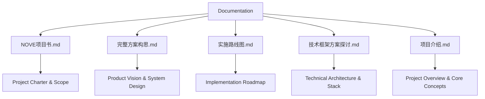
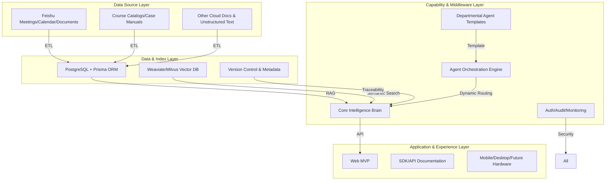
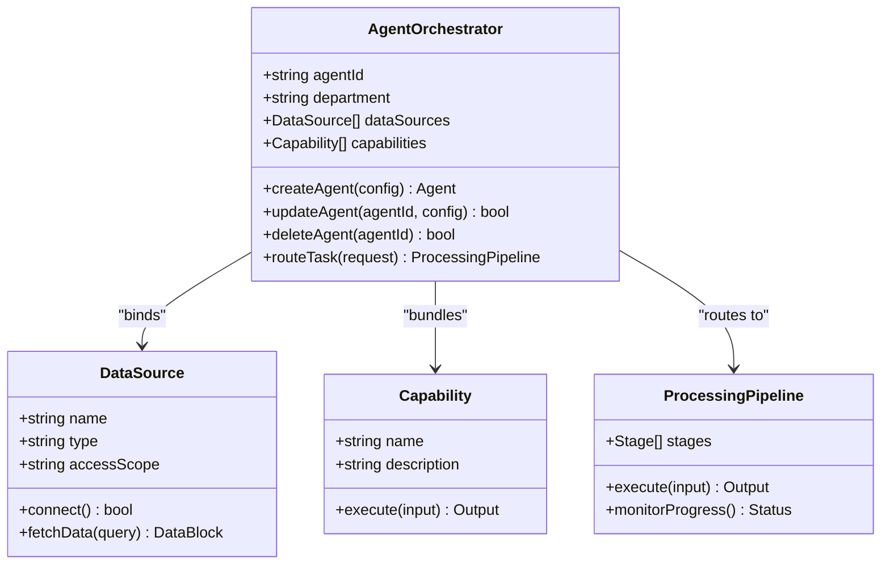
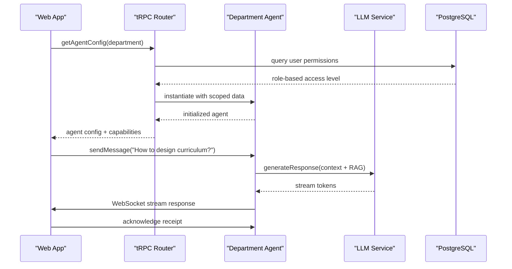
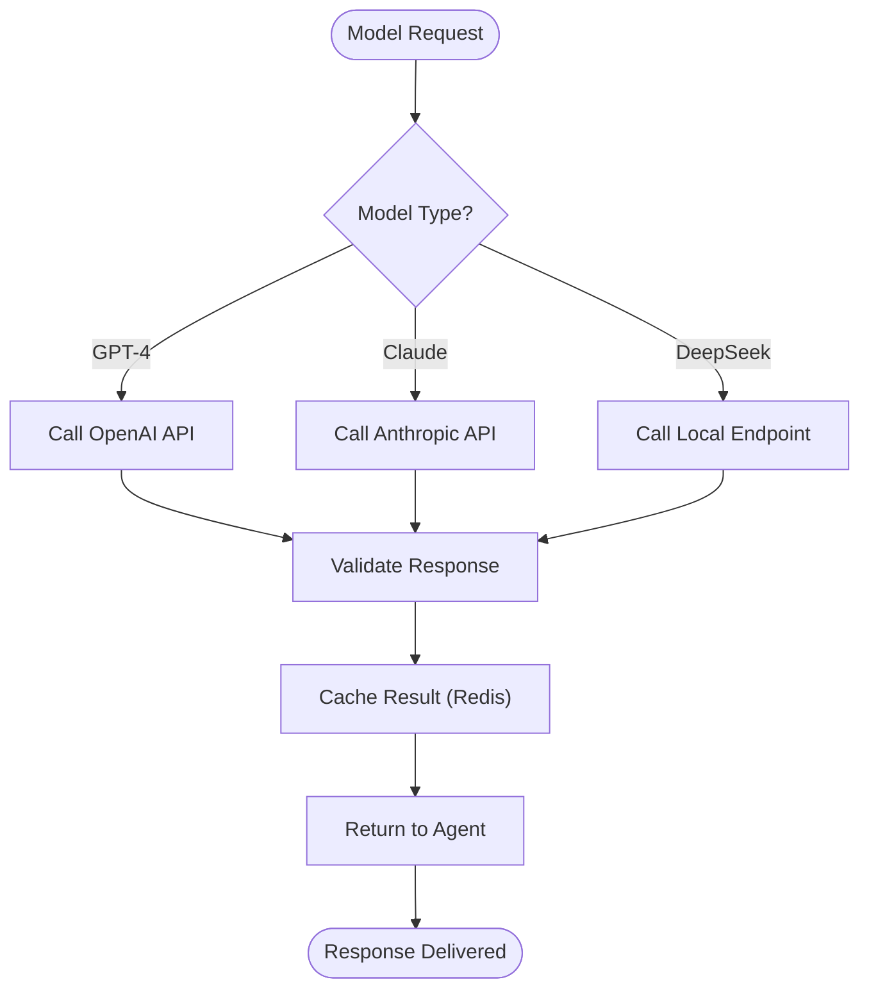
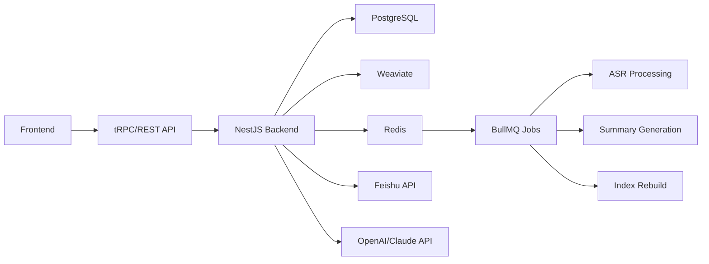

# Agent Orchestration

<cite>
**Referenced Files in This Document**   
- [NOVE项目书.md](file://NOVE项目书.md)
- [完整方案构思.md](file://完整方案构思.md)
- [实施路线图.md](file://实施路线图.md)
- [技术框架方案探讨.md](file://技术框架方案探讨.md)
- [项目介绍.md](file://项目介绍.md)
</cite>

## Table of Contents
1. [Introduction](#introduction)
2. [Project Structure](#project-structure)
3. [Core Components](#core-components)
4. [Architecture Overview](#architecture-overview)
5. [Detailed Component Analysis](#detailed-component-analysis)
6. [Dependency Analysis](#dependency-analysis)
7. [Performance Considerations](#performance-considerations)
8. [Troubleshooting Guide](#troubleshooting-guide)
9. [Conclusion](#conclusion)

## Introduction
The Agent Orchestration system is designed to enable low-code configuration of department-specific AI agents (e.g., teaching, management, consultation) within an intelligent education platform. Inspired by the concept of "tài zǐ xǐ mǎ" (tutor to the crown prince), the system aims to deliver personalized, top-tier educational services through a fusion of AI and expert human guidance. This document details how non-technical users can assemble agents using capability bundling and rule-based triggers, explains the underlying architecture for dynamic agent creation and lifecycle management, and covers real-time coordination via tRPC/WebSocket. It also addresses extensibility for integrating new AI models (GPT-4, Claude, DeepSeek) and third-party services, along with workflows, debugging, monitoring, and security.

## Project Structure
The project is organized around a layered architecture that supports data integration, intelligent processing, and user-facing applications. Key directories include documentation files that define the project's vision, technical framework, implementation roadmap, and core objectives. The structure emphasizes modularity, scalability, and ease of iteration, aligning with the goal of building an AI-powered educational platform for the Lu Xiangqian Lab as the initial deployment target.

**Diagram sources**
- [NOVE项目书.md](file://NOVE项目书.md)
- [完整方案构思.md](file://完整方案构思.md)
- [实施路线图.md](file://实施路线图.md)
- [技术框架方案探讨.md](file://技术框架方案探讨.md)
- [项目介绍.md](file://项目介绍.md)

**Section sources**
- [NOVE项目书.md](file://NOVE项目书.md)
- [完整方案构思.md](file://完整方案构思.md)
- [实施路线图.md](file://实施路线图.md)
- [技术框架方案探讨.md](file://技术框架方案探讨.md)
- [项目介绍.md](file://项目介绍.md)

## Core Components
The core components of the Agent Orchestration system include the **Core Intelligence Brain**, **Departmental Agents**, **RAG-based Knowledge System**, **Intelligent Agent Orchestration Engine**, and **Permission & Compliance System**. These components work together to enable dynamic agent creation, secure data access, and intelligent interaction. The system supports multi-model AI integration (GPT-4, Claude, DeepSeek) and real-time communication via WebSocket and tRPC for seamless frontend coordination.

**Section sources**
- [NOVE项目书.md](file://NOVE项目书.md#L1-L420)
- [技术框架方案探讨.md](file://技术框架方案探讨.md#L1-L700)

## Architecture Overview
The system follows a four-layer architecture: **Data Source Layer**, **Data & Index Layer**, **Capability & Middleware Layer**, and **Application & Experience Layer**. This design enables modular development, secure data handling, and flexible agent deployment.

**Diagram sources**
- [NOVE项目书.md](file://NOVE项目书.md#L1-L420)
- [技术框架方案探讨.md](file://技术框架方案探讨.md#L1-L700)

## Detailed Component Analysis

### Intelligent Agent Orchestration Engine
The orchestration engine enables non-technical users to create department-specific agents through a low-code interface. Users can define agent capabilities by selecting data sources (e.g., "only teaching meetings + course PPTs"), bundling functions (Q&A, report generation, task reminders), and configuring parameters (model choice, response style). Agents are dynamically loaded at runtime, supporting task routing based on request type and maintaining conversation state for contextual continuity.

#### For Object-Oriented Components:

**Diagram sources**
- [NOVE项目书.md](file://NOVE项目书.md#L1-L420)
- [完整方案构思.md](file://完整方案构思.md#L1-L213)

### Real-Time Communication System
The system uses tRPC for lightweight remote procedure calls and WebSocket for real-time bidirectional communication between agents and frontend applications. This enables streaming AI responses, live collaboration features, and instant updates to dashboards and action item tracking.

#### For API/Service Components:

**Diagram sources**
- [技术框架方案探讨.md](file://技术框架方案探讨.md#L1-L700)
- [NOVE项目书.md](file://NOVE项目书.md#L1-L420)

### Extensibility and Model Integration
The system supports pluggable AI models including GPT-4 for complex reasoning, Claude for long-context processing, and DeepSeek for cost-effective local inference. Third-party services (Feishu, CRM, LMS) are integrated via API connectors, enabling data synchronization and workflow automation.

#### For Complex Logic Components:

**Diagram sources**
- [技术框架方案探讨.md](file://技术框架方案探讨.md#L1-L700)
- [完整方案构思.md](file://完整方案构思.md#L1-L213)

**Section sources**
- [NOVE项目书.md](file://NOVE项目书.md#L1-L420)
- [技术框架方案探讨.md](file://技术框架方案探讨.md#L1-L700)
- [完整方案构思.md](file://完整方案构思.md#L1-L213)

## Dependency Analysis
The system relies on a combination of internal modules and external services. Key dependencies include Feishu for meeting data, PostgreSQL for relational data, Weaviate/Milvus for vector storage, and third-party LLM providers. The architecture ensures loose coupling through API gateways and message queues (Redis/BullMQ), enabling independent scaling and replacement of components.

**Diagram sources**
- [技术框架方案探讨.md](file://技术框架方案探讨.md#L1-L700)
- [NOVE项目书.md](file://NOVE项目书.md#L1-L420)

**Section sources**
- [技术框架方案探讨.md](file://技术框架方案探讨.md#L1-L700)
- [实施路线图.md](file://实施路线图.md#L1-L33)

## Performance Considerations
The system is designed for high availability (≥99.5%) and low latency (<2s average response). Caching strategies include Redis for session state and frequent queries, CDN for static assets, and in-memory caching for model outputs. The backend is stateless to support horizontal scaling, with load balancing via Nginx. Performance targets include support for 1000+ concurrent users and peak QPS > 500.

## Troubleshooting Guide
The system includes comprehensive monitoring and debugging tools. Key features include real-time dashboards for API usage, response times, and error rates; audit logs for all user actions; and AI effect tracking (accuracy, hallucination rate). Debugging tools allow administrators to inspect agent configurations, view data access scopes, and trace request flows across services.

**Section sources**
- [NOVE项目书.md](file://NOVE项目书.md#L1-L420)
- [技术框架方案探讨.md](file://技术框架方案探讨.md#L1-L700)

## Conclusion
The Agent Orchestration system provides a robust foundation for building department-specific AI agents in an educational context. By combining low-code configuration, secure data access, real-time communication, and multi-model AI support, it enables non-technical users to create powerful, personalized agents. The architecture supports scalability, extensibility, and compliance, making it suitable for deployment in sensitive environments like academic institutions. Future enhancements include mobile apps, voice interaction, and SaaS multi-tenancy.