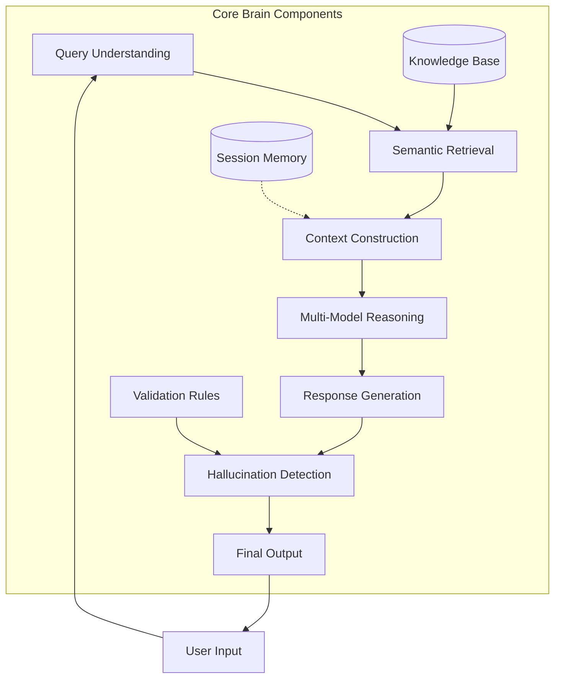
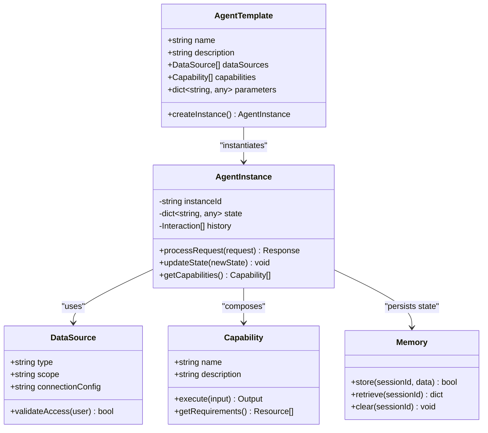
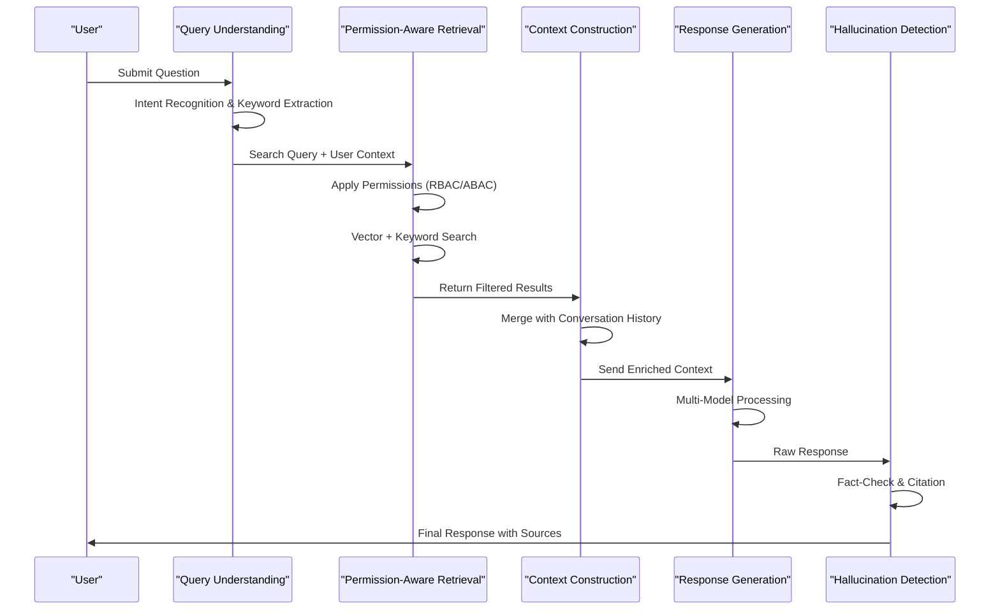
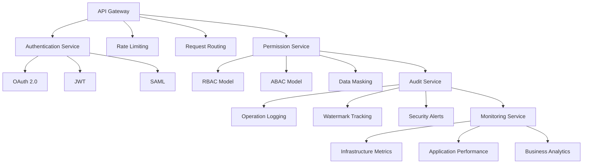
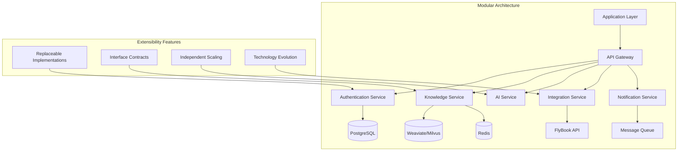
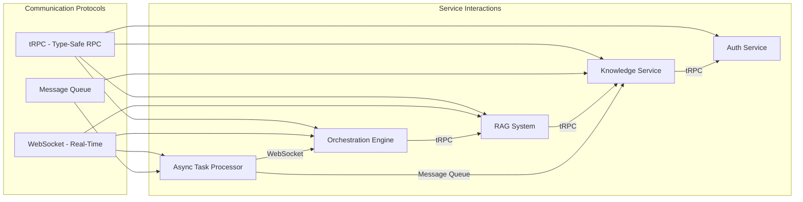

# Capability & Middleware Layer

<cite>
**Referenced Files in This Document**   
- [技术框架方案探讨.md](file://技术框架方案探讨.md)
- [NOVE项目书.md](file://NOVE项目书.md)
- [完整方案构思.md](file://完整方案构思.md)
</cite>

## Table of Contents
1. [Introduction](#introduction)
2. [Core Intelligence Hub: The NOVE Brain](#core-intelligence-hub-the-nove-brain)
3. [AI Agent Orchestration Engine](#ai-agent-orchestration-engine)
4. [RAG Workflow Architecture](#rag-workflow-architecture)
5. [Middleware Services Layer](#middleware-services-layer)
6. [System Modularity and Extensibility](#system-modularity-and-extensibility)
7. [Internal Communication Protocols](#internal-communication-protocols)
8. [Conclusion](#conclusion)

## Introduction
The Capability & Middleware Layer serves as the central nervous system of the NOVE platform, integrating advanced AI capabilities with robust enterprise middleware to deliver a unified, secure, and scalable intelligent education platform. This layer functions as the "Core Brain" that orchestrates knowledge retrieval, reasoning, session memory management, and controlled knowledge updates across the system. It enables department-specific AI agents through a low-code configuration interface, allowing seamless adaptation to teaching, management, and consultation scenarios. Built on a modular architecture with clear separation of concerns, this layer integrates authentication (OAuth 2.0, JWT), audit logging, monitoring, and API gateway functions to ensure enterprise-grade security and observability. The design emphasizes extensibility and leverages tRPC and WebSocket protocols for efficient internal communication between microservices.

**Section sources**
- [技术框架方案探讨.md](file://技术框架方案探讨.md#L1-L50)
- [NOVE项目书.md](file://NOVE项目书.md#L1-L30)

## Core Intelligence Hub: The NOVE Brain

The Core Brain represents the central intelligence unit of the NOVE platform, responsible for unified retrieval, contextual reasoning, persistent session memory, and controlled knowledge evolution. This component integrates multiple large language models (GPT-4, Claude, DeepSeek) through a coordinated routing strategy that selects the optimal model based on task complexity and cost considerations. The brain maintains conversational context across interactions using Redis-based session storage with a 24-hour TTL, enabling coherent multi-turn dialogues. Knowledge updates follow a version-controlled, incremental approach with data lineage tracking to ensure controlled evolution of the knowledge base. The system implements hallucination detection through rule-based validation engines that cross-reference generated responses against source materials, providing uncertainty indicators when confidence is low. This architecture ensures reliable, traceable, and contextually aware AI interactions while maintaining data integrity and security.

**Diagram sources**
- [NOVE项目书.md](file://NOVE项目书.md#L150-L200)
- [技术框架方案探讨.md](file://技术框架方案探讨.md#L200-L250)

**Section sources**
- [NOVE项目书.md](file://NOVE项目书.md#L100-L250)
- [技术框架方案探讨.md](file://技术框架方案探讨.md#L150-L300)

## AI Agent Orchestration Engine

The AI Agent Orchestration Engine enables low-code configuration of department-specific intelligent agents for teaching, management, and consultation scenarios. This engine provides a visual interface where non-technical users can define agent behavior through template-based configuration, data source binding, and capability composition. Administrators can select specific data scopes (e.g., "only curriculum documents and teaching PPTs") and combine functional modules such as Q&A, report generation, and task reminders. The engine supports dynamic routing based on user request type, directing queries to specialized processing pipelines. Each agent maintains its own state and interaction history, supporting contextually continuous conversations. The system allows for runtime addition of new data sources or functionality without service interruption. This approach democratizes AI deployment across departments while maintaining centralized control over data access and security policies.

**Diagram sources**
- [完整方案构思.md](file://完整方案构思.md#L100-L150)
- [NOVE项目书.md](file://NOVE项目书.md#L250-L300)

**Section sources**
- [完整方案构思.md](file://完整方案构思.md#L50-L200)
- [NOVE项目书.md](file://NOVE项目书.md#L200-L350)

## RAG Workflow Architecture

The Retrieval-Augmented Generation (RAG) workflow implements a comprehensive pipeline for accurate and trustworthy AI responses. The process begins with query understanding, where LLMs perform intent recognition and keyword extraction to clarify user requests. This is followed by permission-aware retrieval that combines vector similarity matching with keyword search and temporal filtering, applying RBAC/ABAC policies to ensure users only access authorized information. The context construction phase integrates retrieved results with conversation history, performing deduplication and relevance ranking to create a comprehensive context. Response generation leverages multiple LLMs in a coordinated fashion, with GPT-4 handling complex reasoning, Claude processing long documents, and DeepSeek providing cost-effective alternatives. The final stage includes hallucination detection through rule-based validation that checks factual consistency against source materials and provides citation tracing to enable verification of all generated content.

**Diagram sources**
- [技术框架方案探讨.md](file://技术框架方案探讨.md#L300-L400)
- [NOVE项目书.md](file://NOVE项目书.md#L300-L350)

**Section sources**
- [技术框架方案探讨.md](file://技术框架方案探讨.md#L250-L450)
- [NOVE项目书.md](file://NOVE项目书.md#L250-L400)

## Middleware Services Layer

The Middleware Services Layer provides essential enterprise capabilities including authentication, audit logging, monitoring, and API gateway functions. Authentication is implemented through OAuth 2.0 integration with FlyBook, supplemented by JWT for session management and optional SAML support. The RBAC/ABAC permission model enforces data isolation at multiple levels, including row-level (department data separation) and column-level (PII field masking) controls. Comprehensive audit logging captures all user operations with watermark tracking for full traceability. The monitoring system implements a multi-tiered approach with infrastructure monitoring (CPU/memory), application performance monitoring (response time/error rate), and business metrics (user engagement/AI accuracy). The API gateway handles request routing, rate limiting to prevent DDoS attacks, and IP whitelisting for additional security. These services work in concert to ensure the platform meets enterprise security, compliance, and reliability requirements.

**Diagram sources**
- [技术框架方案探讨.md](file://技术框架方案探讨.md#L450-L550)
- [NOVE项目书.md](file://NOVE项目书.md#L400-L450)

**Section sources**
- [技术框架方案探讨.md](file://技术框架方案探讨.md#L400-L600)
- [NOVE项目书.md](file://NOVE项目书.md#L350-L500)

## System Modularity and Extensibility

The architecture emphasizes modularity and extensibility through clearly defined component boundaries and replaceable implementations. The system follows a layered design with strict separation between data, capability, and application layers, enabling independent evolution of each component. Core services are designed with interface contracts that allow alternative implementations, supporting technology stack evolution without disrupting dependent systems. The microservices architecture enables future scaling to a distributed model with separate services for user management, knowledge processing, AI inference, and third-party integrations. Data storage follows a polyglot persistence model with PostgreSQL for relational data, Weaviate/Milvus for vector search, and Redis for caching, allowing each data type to be optimized independently. The system supports cold-warm-hot data tiering with automated migration between storage classes based on access patterns, ensuring cost-effective scalability as data volumes grow.

**Diagram sources**
- [技术框架方案探讨.md](file://技术框架方案探讨.md#L600-L700)
- [NOVE项目书.md](file://NOVE项目书.md#L500-L550)

**Section sources**
- [技术框架方案探讨.md](file://技术框架方案探讨.md#L550-L700)
- [NOVE项目书.md](file://NOVE项目书.md#L450-L600)

## Internal Communication Protocols

Internal communication within the Capability & Middleware Layer leverages tRPC for lightweight remote procedure calls and WebSocket for real-time bidirectional messaging. tRPC provides type-safe communication between services with minimal overhead, enabling efficient data exchange between the orchestration engine, RAG system, and middleware components. The protocol's TypeScript integration ensures compile-time type checking across service boundaries, reducing integration errors. WebSocket connections support real-time features including streaming AI responses, live collaboration notifications, and instant status updates for asynchronous tasks like meeting transcription processing. The message queue system (Redis + BullMQ) handles long-running operations such as knowledge base indexing and batch data synchronization, ensuring reliable delivery with retry mechanisms and dead-letter queue handling for error recovery. This combination of protocols optimizes both request-response efficiency and real-time interactivity across the distributed system.

**Diagram sources**
- [技术框架方案探讨.md](file://技术框架方案探讨.md#L250-L300)
- [NOVE项目书.md](file://NOVE项目书.md#L350-L400)

**Section sources**
- [技术框架方案探讨.md](file://技术框架方案探讨.md#L200-L350)
- [NOVE项目书.md](file://NOVE项目书.md#L300-L450)

## Conclusion
The Capability & Middleware Layer forms the intelligent core of the NOVE platform, successfully integrating advanced AI capabilities with enterprise-grade middleware services. The Core Brain architecture enables unified retrieval, contextual reasoning, and controlled knowledge evolution, while the AI agent orchestration engine allows for low-code configuration of department-specific assistants. The RAG workflow implements a robust process for permission-aware retrieval, context construction, and hallucination-resistant response generation. Middleware services provide comprehensive authentication, audit logging, monitoring, and API gateway functions that ensure security, compliance, and reliability. The modular design with clear component boundaries and the use of tRPC/WebSocket for internal communication create a flexible, extensible foundation that can evolve from an MVP to an enterprise-scale solution. This architecture successfully balances innovation with practicality, delivering a powerful intelligent education platform that can adapt to diverse organizational needs while maintaining strict data governance and security standards.