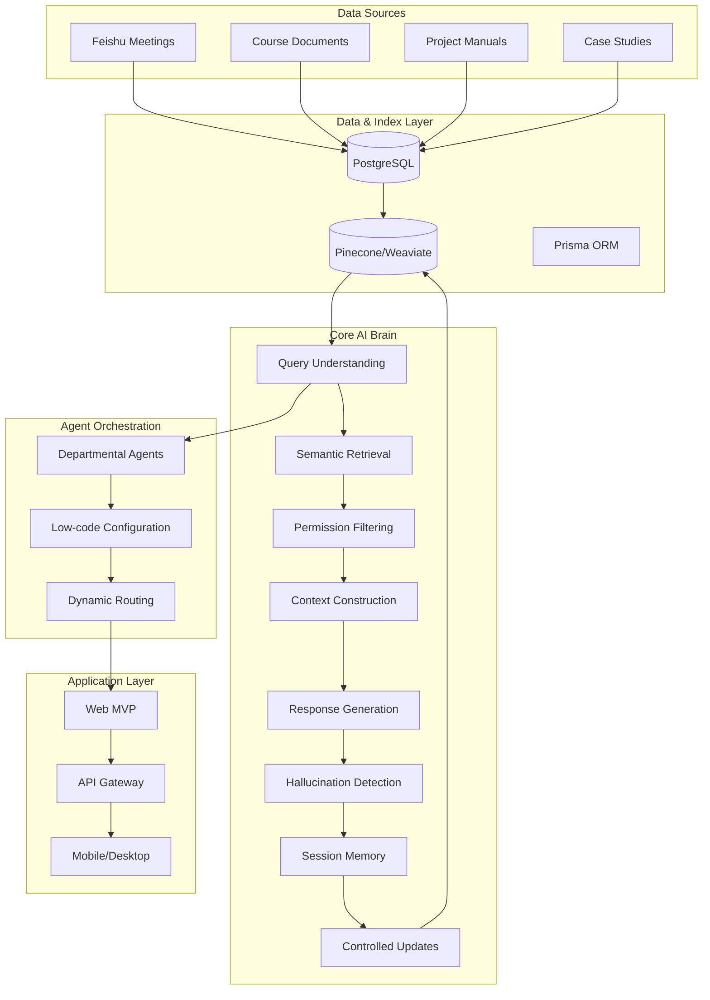
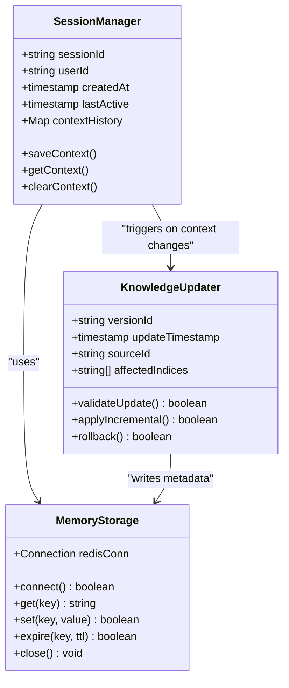
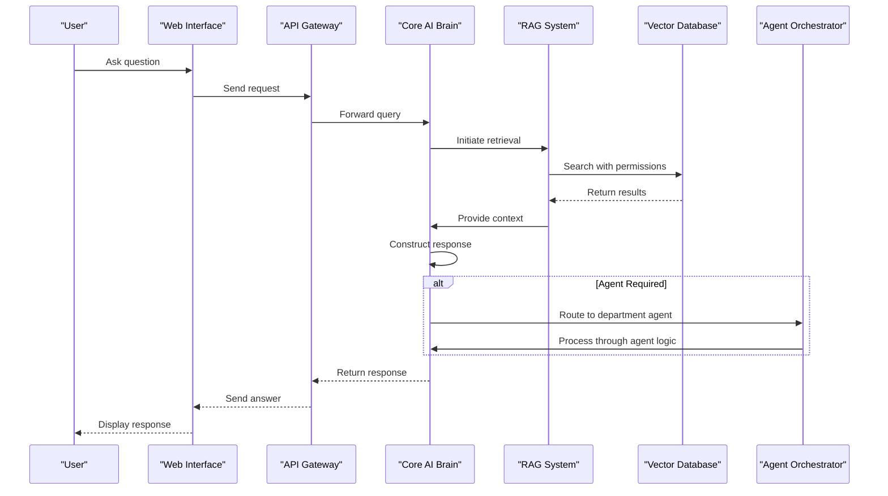
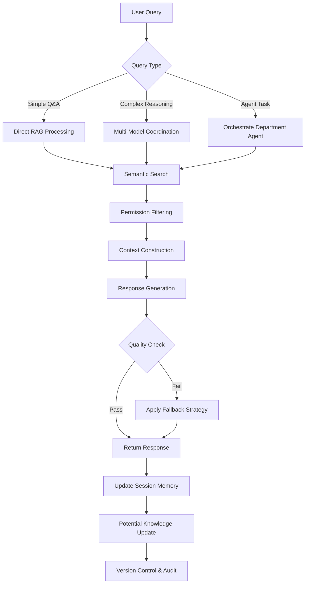

# Core AI Brain

<cite>
**Referenced Files in This Document**   
- [技术框架方案探讨.md](file://技术框架方案探讨.md)
- [NOVE项目书.md](file://NOVE项目书.md)
- [完整方案构思.md](file://完整方案构思.md)
</cite>

## Table of Contents
1. [Introduction](#introduction)
2. [Architecture Overview](#architecture-overview)
3. [Core Components](#core-components)
4. [State and Memory Management](#state-and-memory-management)
5. [Integration with RAG and Agent Orchestration](#integration-with-rag-and-agent-orchestration)
6. [Data Flow and Decision-Making Pipeline](#data-flow-and-decision-making-pipeline)
7. [Integration Patterns](#integration-patterns)
8. [Design Principles](#design-principles)
9. [Evolution and Feedback Mechanisms](#evolution-and-feedback-mechanisms)
10. [Conclusion](#conclusion)

## Introduction

The Core AI Brain serves as the central intelligence engine of the NOVE platform, unifying retrieval, reasoning, session memory management, and controlled knowledge updates. It acts as the cognitive nucleus that enables context-aware, intelligent responses across the system. This document details its architectural design, internal mechanisms, integration patterns, and evolution strategies, providing a comprehensive understanding of how the brain powers the AI-driven educational experience.

**Section sources**
- [NOVE项目书.md](file://NOVE项目书.md#L1-L50)
- [技术框架方案探讨.md](file://技术框架方案探讨.md#L1-L100)

## Architecture Overview

The Core AI Brain operates within a layered architecture that separates concerns and enables modularity. It sits at the heart of the capability and middleware layer, orchestrating interactions between data sources, AI models, and application interfaces.

**Diagram sources**
- [NOVE项目书.md](file://NOVE项目书.md#L150-L200)
- [技术框架方案探讨.md](file://技术框架方案探讨.md#L200-L250)

**Section sources**
- [NOVE项目书.md](file://NOVE项目书.md#L100-L200)
- [技术框架方案探讨.md](file://技术框架方案探讨.md#L100-L300)

## Core Components

The Core AI Brain comprises several interconnected components that work in concert to deliver intelligent responses. These include query understanding, semantic retrieval, permission-aware filtering, context construction, response generation, quality assurance, session memory management, and controlled knowledge update mechanisms. Each component is designed to be modular and replaceable, adhering to the project's principle of technical evolvability.

**Section sources**
- [NOVE项目书.md](file://NOVE项目书.md#L200-L300)
- [技术框架方案探讨.md](file://技术框架方案探讨.md#L300-L400)

## State and Memory Management

The Core AI Brain maintains both short-term and long-term memory to enable context-aware interactions. Session memory is persisted using Redis with a TTL of 24 hours, allowing for multi-turn conversations while managing resource usage. Long-term memory is stored in the vector database (Pinecone evolving to Weaviate), where knowledge is indexed with metadata including versioning, data lineage, and access permissions. The system implements a hybrid approach combining vector similarity with keyword and temporal filtering to ensure relevant context retrieval.

**Diagram sources**
- [技术框架方案探讨.md](file://技术框架方案探讨.md#L500-L550)
- [NOVE项目书.md](file://NOVE项目书.md#L300-L350)

**Section sources**
- [技术框架方案探讨.md](file://技术框架方案探讨.md#L400-L600)
- [NOVE项目书.md](file://NOVE项目书.md#L250-L400)

## Integration with RAG and Agent Orchestration

The Core AI Brain is tightly integrated with the Retrieval-Augmented Generation (RAG) system and the agent orchestration layer. It receives user queries through the API gateway, processes them through the RAG pipeline involving semantic search and permission filtering, then generates responses using multiple LLMs (GPT-4, Claude, DeepSeek) with model routing based on task requirements. The brain also serves as the foundation for departmental agents, where its capabilities are encapsulated into configurable intelligent agents for specific use cases like teaching, management, and consulting.

**Diagram sources**
- [NOVE项目书.md](file://NOVE项目书.md#L350-L400)
- [技术框架方案探讨.md](file://技术框架方案探讨.md#L600-L650)

**Section sources**
- [NOVE项目书.md](file://NOVE项目书.md#L300-L450)
- [技术框架方案探讨.md](file://技术框架方案探讨.md#L550-L700)

## Data Flow and Decision-Making Pipeline

The Core AI Brain follows a structured decision-making pipeline that begins with query understanding and ends with response delivery. The pipeline includes intent recognition, keyword extraction, semantic search, permission filtering, context fusion with conversation history, response generation with multiple model coordination, quality validation including hallucination detection, and finally response delivery with citation tracing. This pipeline is designed for real-time performance with an average response time target of under 2 seconds and 99% of responses under 5 seconds.

**Diagram sources**
- [NOVE项目书.md](file://NOVE项目书.md#L400-L450)
- [技术框架方案探讨.md](file://技术框架方案探讨.md#L700-L750)

**Section sources**
- [NOVE项目书.md](file://NOVE项目书.md#L350-L500)
- [技术框架方案探讨.md](file://技术框架方案探讨.md#L650-L800)

## Integration Patterns

The Core AI Brain integrates with upstream data sources and downstream application interfaces through well-defined patterns. Upstream, it connects to Feishu via OAuth 2.0 authentication and webhook subscriptions for real-time meeting data ingestion. It also supports batch synchronization from document systems and manual uploads. Downstream, it exposes capabilities through a RESTful API with OpenAPI 3.0 documentation, supports real-time communication via WebSocket for streaming responses, and provides SDKs for third-party integration. The system uses tRPC for lightweight internal remote procedure calls and implements rate limiting and IP whitelisting for security.

**Section sources**
- [NOVE项目书.md](file://NOVE项目书.md#L500-L550)
- [技术框架方案探讨.md](file://技术框架方案探讨.md#L800-L850)

## Design Principles

The Core AI Brain is built on several key design principles: modularity, scalability, and fault tolerance. The system follows a modular architecture where components have clear boundaries and interfaces, allowing for technology stack evolution and implementation replacement. It is designed for horizontal scaling with stateless services that can be load-balanced, and incorporates fault tolerance through retry mechanisms, circuit breakers, and fallback strategies. The architecture supports a future evolution to microservices, with potential service decomposition into user, knowledge, AI, integration, and notification services as user scale grows beyond 10,000.

**Section sources**
- [技术框架方案探讨.md](file://技术框架方案探讨.md#L850-L900)
- [NOVE项目书.md](file://NOVE项目书.md#L550-L600)

## Evolution and Feedback Mechanisms

The Core AI Brain evolves through continuous feedback loops and human-in-the-loop validation. The system incorporates user feedback mechanisms where users can rate response quality and correct inaccuracies, which are then used to improve future responses. It maintains an offline evaluation set for continuous testing of retrieval quality and response accuracy. The knowledge base supports incremental updates with version control and data lineage tracking, allowing for controlled evolution of the knowledge corpus. Human validation is required for critical updates, and the system includes audit trails for all knowledge modifications to ensure accountability and compliance.

**Section sources**
- [NOVE项目书.md](file://NOVE项目书.md#L600-L650)
- [技术框架方案探讨.md](file://技术框架方案探讨.md#L900-L950)

## Conclusion

The Core AI Brain represents a sophisticated integration of retrieval, reasoning, memory management, and controlled knowledge evolution. By unifying these capabilities within a modular, scalable architecture, it enables the NOVE platform to deliver context-aware, reliable, and secure AI-powered educational experiences. Its design anticipates future growth and technological evolution, ensuring long-term viability and adaptability in the rapidly changing AI landscape.