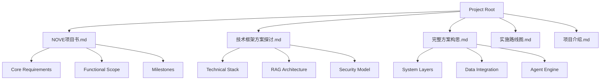
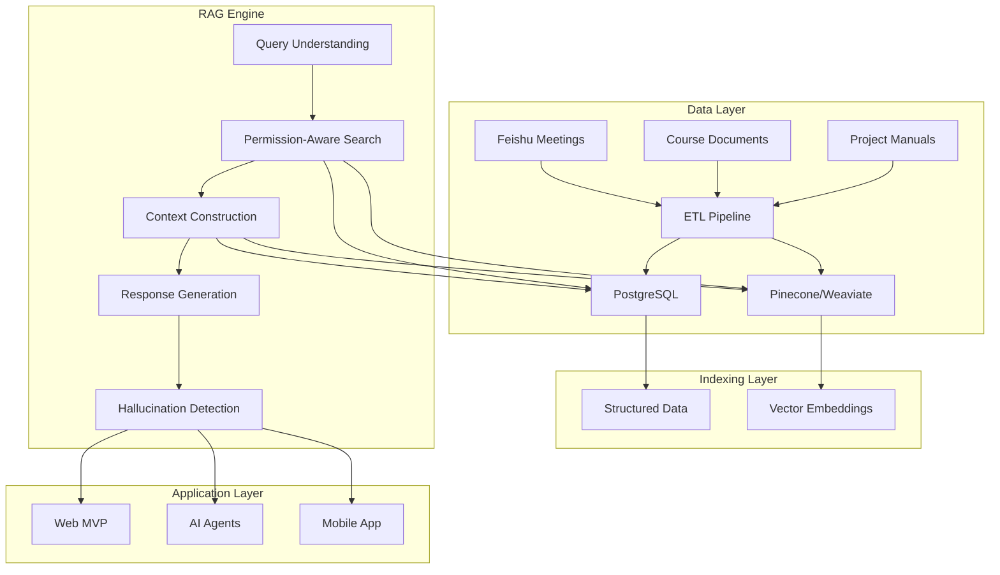
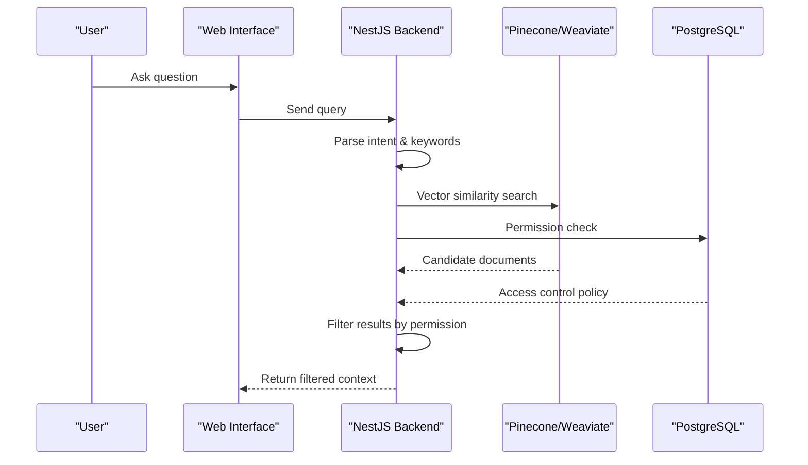
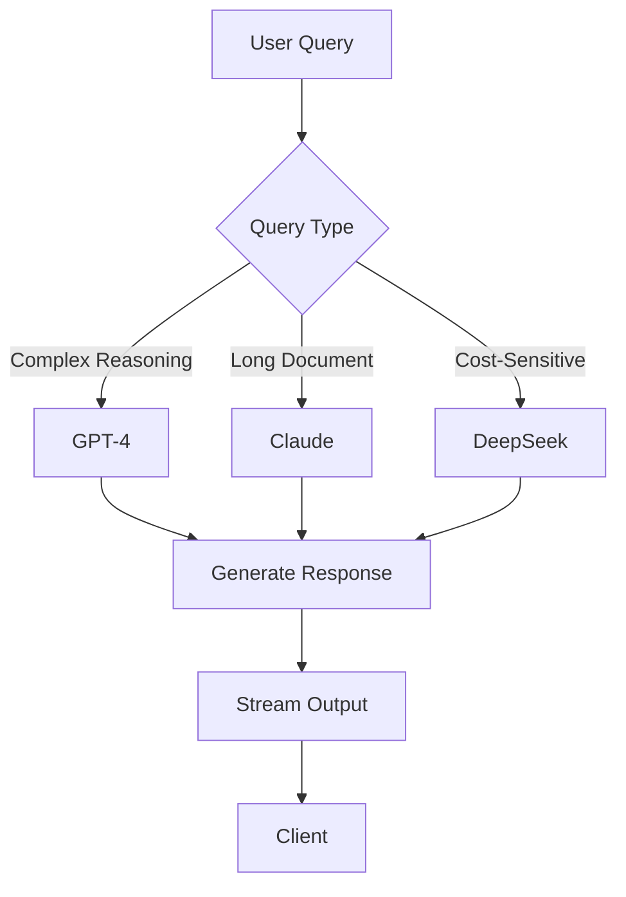
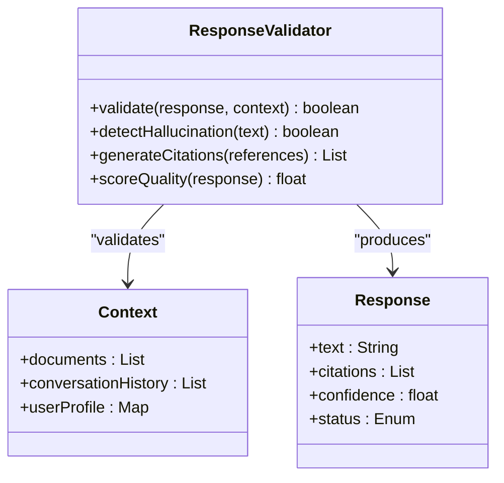
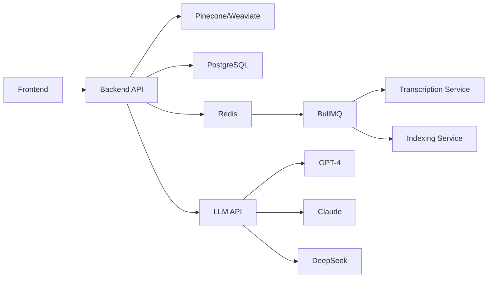

# RAG System

<cite>
**Referenced Files in This Document**   
- [技术框架方案探讨.md](file://技术框架方案探讨.md)
- [NOVE项目书.md](file://NOVE项目书.md)
- [完整方案构思.md](file://完整方案构思.md)
</cite>

## Table of Contents
1. [Introduction](#introduction)
2. [Project Structure](#project-structure)
3. [Core Components](#core-components)
4. [Architecture Overview](#architecture-overview)
5. [Detailed Component Analysis](#detailed-component-analysis)
6. [Dependency Analysis](#dependency-analysis)
7. [Performance Considerations](#performance-considerations)
8. [Troubleshooting Guide](#troubleshooting-guide)
9. [Conclusion](#conclusion)

## Introduction
The Retrieval-Augmented Generation (RAG) system is the core intelligence engine powering NOVE, an AI-driven educational platform designed to deliver personalized, secure, and trustworthy knowledge services. This document provides a comprehensive analysis of the RAG system, detailing its end-to-end workflow from query understanding to response generation and hallucination detection. The system integrates vector databases (Pinecone/Weaviate) for semantic search and PostgreSQL for structured data retrieval, ensuring both high relevance and strict access control. It supports intelligent Q&A, meeting summarization, action item tracking, and department-specific AI agents. The design emphasizes data security, performance, and scalability, with a clear roadmap for evolution from MVP to enterprise-grade deployment.

## Project Structure
The NOVE project is organized around a layered architecture that separates concerns across data, intelligence, and application layers. The core technical documentation and planning artifacts define the system's scope, requirements, and implementation strategy. Key files include the project charter, technical framework proposal, and full solution design, which collectively outline the RAG system's role within the broader AI education platform.

**Diagram sources**
- [NOVE项目书.md](file://NOVE项目书.md#L1-L50)
- [技术框架方案探讨.md](file://技术框架方案探讨.md#L1-L50)
- [完整方案构思.md](file://完整方案构思.md#L1-L50)

**Section sources**
- [NOVE项目书.md](file://NOVE项目书.md#L1-L100)
- [技术框架方案探讨.md](file://技术框架方案探讨.md#L1-L100)
- [完整方案构思.md](file://完整方案构思.md#L1-L100)

## Core Components
The RAG system in NOVE is composed of several interconnected components that work in concert to deliver intelligent responses. These include query understanding, permission-aware semantic search, context construction, response generation, and hallucination detection. The system leverages both vector databases for unstructured text retrieval and relational databases for structured data and access control. The integration with external systems like Feishu enables automatic ingestion of meeting data, which is processed into actionable knowledge. The architecture supports multi-model inference, allowing the system to route queries to the most appropriate large language model (GPT-4, Claude, or DeepSeek) based on task complexity and cost considerations.

**Section sources**
- [技术框架方案探讨.md](file://技术框架方案探讨.md#L150-L300)
- [NOVE项目书.md](file://NOVE项目书.md#L200-L400)

## Architecture Overview
The RAG system follows a four-layer architecture that ensures modularity, security, and scalability. The system begins with data ingestion from various sources, processes it into structured and vectorized formats, and exposes it through a secure API layer to the end-user applications.

**Diagram sources**
- [技术框架方案探讨.md](file://技术框架方案探讨.md#L300-L500)
- [NOVE项目书.md](file://NOVE项目书.md#L150-L250)

## Detailed Component Analysis

### Query Understanding and Semantic Search
The query understanding module is responsible for interpreting user intent and extracting key information from natural language queries. It uses LLMs to perform intent classification and keyword extraction, which are then used to construct search queries for the vector database. The semantic search component performs a hybrid retrieval, combining vector similarity with keyword matching and temporal filtering to ensure high relevance.

**Diagram sources**
- [技术框架方案探讨.md](file://技术框架方案探讨.md#L500-L700)
- [NOVE项目书.md](file://NOVE项目书.md#L300-L400)

**Section sources**
- [技术框架方案探讨.md](file://技术框架方案探讨.md#L500-L700)
- [NOVE项目书.md](file://NOVE项目书.md#L300-L400)

### Context Construction and Response Generation
After retrieving relevant documents and applying permission filters, the system constructs a context that includes the user's query, the retrieved knowledge, and any relevant conversation history. This context is then fed to a large language model for response generation. The system supports multiple models, with routing logic that selects GPT-4 for complex reasoning, Claude for long-context tasks, and DeepSeek for cost-sensitive operations.

**Diagram sources**
- [技术框架方案探讨.md](file://技术框架方案探讨.md#L700-L900)
- [完整方案构思.md](file://完整方案构思.md#L100-L200)

**Section sources**
- [技术框架方案探讨.md](file://技术框架方案探讨.md#L700-L900)
- [完整方案构思.md](file://完整方案构思.md#L100-L200)

### Hallucination Detection and Quality Assurance
To ensure the reliability of generated responses, the RAG system includes a hallucination detection mechanism. This component uses a rule-based engine and LLM-based validation to cross-check facts against the retrieved context. It also provides citation generation, allowing users to trace the source of information. The system includes quality scoring and uncertainty prompts to indicate confidence levels in the responses.

**Diagram sources**
- [NOVE项目书.md](file://NOVE项目书.md#L400-L500)
- [技术框架方案探讨.md](file://技术框架方案探讨.md#L900-L1000)

**Section sources**
- [NOVE项目书.md](file://NOVE项目书.md#L400-L500)
- [技术框架方案探讨.md](file://技术框架方案探讨.md#L900-L1000)

## Dependency Analysis
The RAG system has a well-defined dependency graph that ensures loose coupling and high cohesion. The frontend depends on the backend API, which in turn depends on the vector and relational databases. The AI models are accessed through external APIs, making the system resilient to model provider changes. The use of message queues (Redis + BullMQ) for asynchronous tasks decouples long-running processes like meeting transcription from the main request-response cycle.

**Diagram sources**
- [技术框架方案探讨.md](file://技术框架方案探讨.md#L1000-L1200)
- [NOVE项目书.md](file://NOVE项目书.md#L500-L600)

**Section sources**
- [技术框架方案探讨.md](file://技术框架方案探讨.md#L1000-L1200)
- [NOVE项目书.md](file://NOVE项目书.md#L500-L600)

## Performance Considerations
The RAG system is designed with performance and scalability in mind. The target metrics include an average response time of less than 2 seconds, with 99% of requests completed under 5 seconds. The system supports over 1000 concurrent users and achieves 99.5% availability. A multi-layer caching strategy is employed, including browser caching, CDN, Redis for hot data, and database query caching. The system uses write-through caching to ensure consistency and intelligent cache invalidation based on versioning.

**Section sources**
- [技术框架方案探讨.md](file://技术框架方案探讨.md#L1200-L1400)

## Troubleshooting Guide
Common issues in the RAG system include latency, low retrieval accuracy, and ambiguous queries. For latency, the primary causes are LLM API response times and vector database queries. Solutions include implementing caching, optimizing embedding models, and using model routing to balance cost and performance. For low retrieval accuracy, the system employs hybrid search (vector + keyword) and continuous feedback loops with human-in-the-loop validation. Ambiguous queries are handled by the query understanding module, which can ask clarifying questions or provide multiple interpretation paths.

**Section sources**
- [技术框架方案探讨.md](file://技术框架方案探讨.md#L1400-L1600)
- [NOVE项目书.md](file://NOVE项目书.md#L600-L700)

## Conclusion
The RAG system in NOVE represents a sophisticated integration of AI, data engineering, and security principles to deliver a trustworthy and efficient knowledge platform. By combining vector and relational databases with multi-model inference and strict access control, the system provides accurate, relevant, and secure responses. The architecture is designed for scalability, with a clear path from MVP to microservices. The emphasis on transparency, with citation generation and hallucination detection, ensures user trust. The system's success will be measured by key metrics including response accuracy, user satisfaction, and operational efficiency, all of which are supported by a robust monitoring and optimization framework.