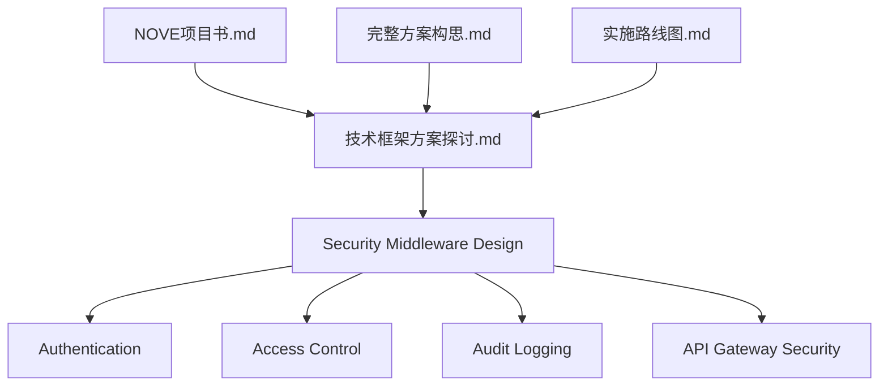
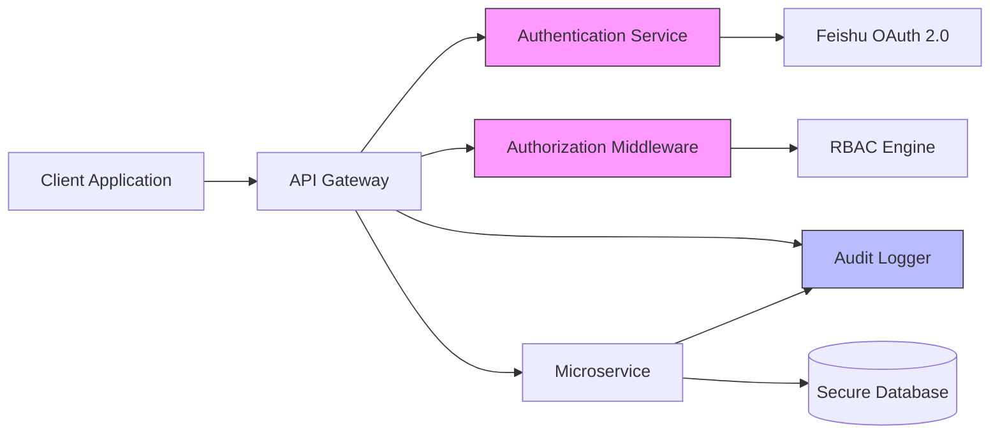
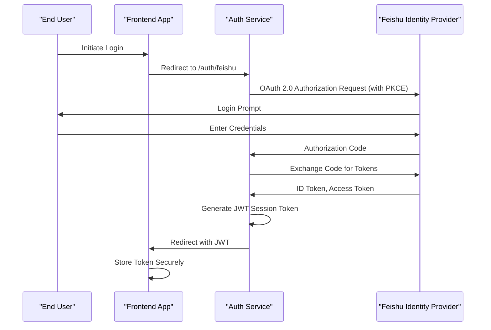
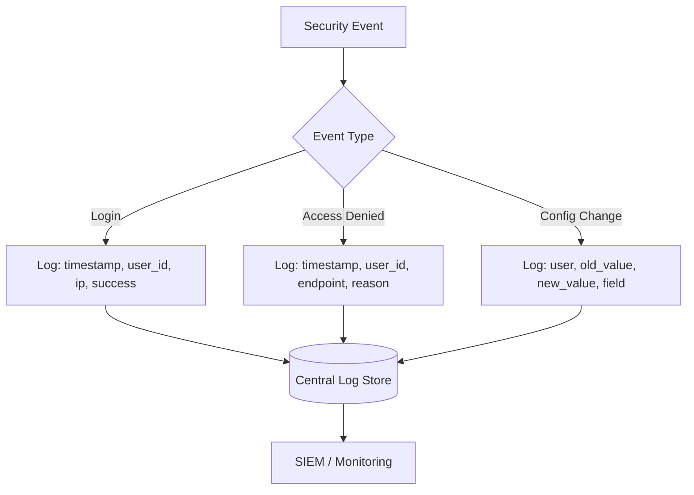
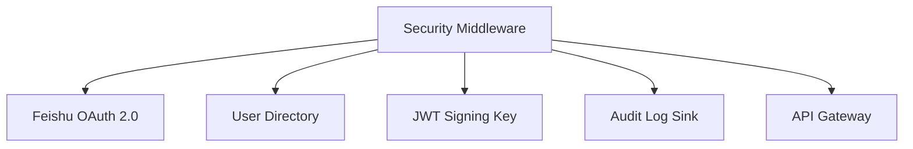

# Security Middleware

<cite>
**Referenced Files in This Document**   
- [NOVE项目书.md](file://NOVE项目书.md)
- [完整方案构思.md](file://完整方案构思.md)
- [实施路线图.md](file://实施路线图.md)
- [技术框架方案探讨.md](file://技术框架方案探讨.md)
- [项目介绍.md](file://项目介绍.md)
- [项目名称.md](file://项目名称.md)
</cite>

## Table of Contents
1. [Introduction](#introduction)
2. [Project Structure](#project-structure)
3. [Core Components](#core-components)
4. [Architecture Overview](#architecture-overview)
5. [Detailed Component Analysis](#detailed-component-analysis)
6. [Dependency Analysis](#dependency-analysis)
7. [Performance Considerations](#performance-considerations)
8. [Troubleshooting Guide](#troubleshooting-guide)
9. [Conclusion](#conclusion)

## Introduction
This document provides comprehensive documentation for the Security Middleware services within the NOVE platform. It details the implementation and integration of authentication mechanisms, audit logging, API gateway controls, and permission-aware access enforcement. The goal is to ensure data integrity, regulatory compliance, and robust protection against common security threats such as token leakage, replay attacks, and unauthorized access. The system leverages OAuth 2.0 with Feishu integration, JWT-based session management, role-based access control (RBAC), and secure inter-service communication patterns.

## Project Structure
The project is organized around high-level conceptual documents that define the vision, technical direction, and implementation roadmap of the NOVE platform. These markdown files serve as the primary source of design and architectural intent, particularly regarding security middleware components.



**Diagram sources**
- [技术框架方案探讨.md](file://技术框架方案探讨.md#L1-L50)
- [完整方案构思.md](file://完整方案构思.md#L1-L40)

**Section sources**
- [技术框架方案探讨.md](file://技术框架方案探讨.md#L1-L60)
- [实施路线图.md](file://实施路线图.md#L1-L30)

## Core Components
The core security components are defined across multiple design documents, outlining the intended functionality of authentication flows, access enforcement policies, and audit mechanisms. These components are not implemented in code within the current workspace but are described in detail in the accompanying documentation.

- **OAuth 2.0 with Feishu Integration**: Describes the third-party identity provider integration for user authentication.
- **JWT-Based Session Management**: Outlines token issuance, validation, and expiration strategies.
- **Role-Based Access Control (RBAC)**: Defines roles, permissions, and enforcement logic across services.
- **Audit Logging Framework**: Specifies event types, log formats, and retention policies.
- **API Gateway Controls**: Details rate limiting, request validation, and threat detection at the edge.

**Section sources**
- [完整方案构思.md](file://完整方案构思.md#L25-L80)
- [技术框架方案探讨.md](file://技术框架方案探讨.md#L15-L70)

## Architecture Overview
The security middleware architecture is designed as a layered defense model, integrating with both frontend and backend services through well-defined interfaces. It operates primarily at the API gateway and service boundary layers, enforcing authentication and authorization before requests reach business logic.



**Diagram sources**
- [技术框架方案探讨.md](file://技术框架方案探讨.md#L40-L90)
- [完整方案构思.md](file://完整方案构思.md#L50-L100)

## Detailed Component Analysis

### Authentication Service Analysis
The authentication service is responsible for integrating with Feishu using OAuth 2.0, issuing JWT tokens upon successful login, and managing session state. It supports secure redirect flows, PKCE for public clients, and short-lived access tokens with refresh token rotation.

#### For API/Service Components:


**Diagram sources**
- [完整方案构思.md](file://完整方案构思.md#L60-L120)
- [技术框架方案探讨.md](file://技术框架方案探讨.md#L50-L80)

**Section sources**
- [完整方案构思.md](file://完整方案构思.md#L55-L130)
- [NOVE项目书.md](file://NOVE项目书.md#L20-L60)

### Role-Based Access Control (RBAC) Analysis
The RBAC system defines hierarchical roles, scoped permissions, and context-aware policies. It integrates with the JWT claims to enforce access at both route and data levels. Policies are configurable and support dynamic evaluation based on resource ownership and organizational boundaries.

```mermaid
classDiagram
class User {
+string userID
+string email
+Role[] roles
}
class Role {
+string roleName
+Permission[] permissions
+Role parent
}
class Permission {
+string resource
+Set~Action~ actions
+string scope
}
class PolicyEngine {
+evaluate(user, resource, action) bool
+checkOwnership(user, resource) bool
}
User --> Role
Role --> Permission
PolicyEngine --> Role
PolicyEngine --> User
note right of PolicyEngine
Evaluates JWT claims and
context to enforce access
end
```

**Diagram sources**
- [技术框架方案探讨.md](file://技术框架方案探讨.md#L90-L140)
- [完整方案构思.md](file://完整方案构思.md#L130-L180)

**Section sources**
- [技术框架方案探讨.md](file://技术框架方案探讨.md#L85-L150)
- [实施路线图.md](file://实施路线图.md#L40-L70)

### Audit Logging Framework Analysis
The audit logging component captures security-relevant events including login attempts, access denials, configuration changes, and data exports. Logs are structured in JSON format with standardized fields for traceability and SIEM integration.



**Diagram sources**
- [完整方案构思.md](file://完整方案构思.md#L180-L220)
- [技术框架方案探讨.md](file://技术框架方案探讨.md#L150-L180)

**Section sources**
- [完整方案构思.md](file://完整方案构思.md#L175-L230)

## Dependency Analysis
The security middleware depends on external identity providers (Feishu), internal user databases, and centralized logging infrastructure. While no direct code dependencies are present in the current workspace, the design documents specify integration points and data exchange formats.



**Diagram sources**
- [技术框架方案探讨.md](file://技术框架方案探讨.md#L180-L210)
- [完整方案构思.md](file://完整方案构思.md#L220-L250)

**Section sources**
- [技术框架方案探讨.md](file://技术框架方案探讨.md#L175-L220)

## Performance Considerations
The security middleware is designed to minimize latency through caching of public keys, RBAC policy evaluation, and JWT validation results. Token parsing and signature verification are optimized using efficient cryptographic libraries. The system supports horizontal scaling of authentication services and asynchronous log shipping to avoid blocking critical paths.

## Troubleshooting Guide
Common issues include token validation failures, misconfigured redirect URIs in Feishu apps, RBAC policy mismatches, and audit log delivery delays. Administrators should verify JWT issuer and audience claims, ensure clock synchronization across services, and validate role assignments in the user directory.

**Section sources**
- [NOVE项目书.md](file://NOVE项目书.md#L60-L90)
- [实施路线图.md](file://实施路线图.md#L70-L100)

## Conclusion
The Security Middleware design for the NOVE platform provides a comprehensive foundation for protecting data integrity and ensuring compliance. By leveraging OAuth 2.0 with Feishu, JWT-based sessions, RBAC, and structured audit logging, the system addresses key security requirements. Future implementation should focus on secure coding practices, regular penetration testing, and integration with monitoring tools to detect and respond to threats in real time.