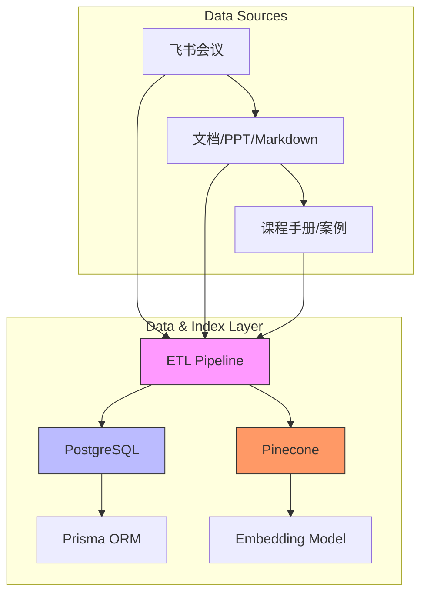
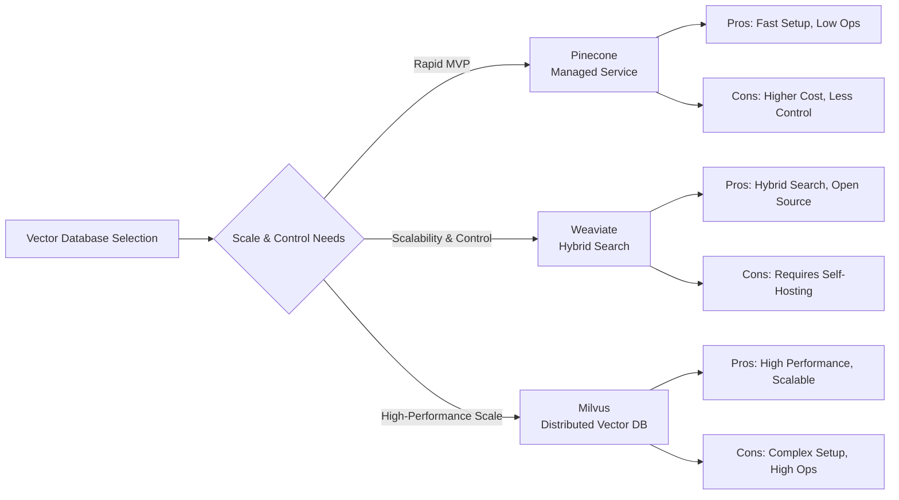

# Data & Index Layer

<cite>
**Referenced Files in This Document**   
- [技术框架方案探讨.md](file://技术框架方案探讨.md)
- [NOVE项目书.md](file://NOVE项目书.md)
- [完整方案构思.md](file://完整方案构思.md)
</cite>

## Table of Contents
1. [Introduction](#introduction)
2. [Dual-Storage Architecture](#dual-storage-architecture)
3. [ETL Pipeline Responsibilities](#etl-pipeline-responsibilities)
4. [Version Control and Data Lineage](#version-control-and-data-lineage)
5. [Vector Database Trade-offs](#vector-database-trade-offs)
6. [Data Retention and Synchronization](#data-retention-and-synchronization)
7. [Conclusion](#conclusion)

## Introduction
The Data & Index Layer of the NOVE platform serves as the foundational backbone for storing, indexing, and retrieving both structured and unstructured data. This layer enables the platform’s core AI capabilities—particularly Retrieval-Augmented Generation (RAG)—by ensuring that user queries are answered with accurate, contextually relevant, and permission-aware results. It implements a dual-storage architecture combining relational and vector databases to support diverse data types and access patterns. This document details the design, components, workflows, and operational considerations of this critical layer.

**Section sources**
- [技术框架方案探讨.md](file://技术框架方案探讨.md#L1-L700)
- [NOVE项目书.md](file://NOVE项目书.md#L1-L420)

## Dual-Storage Architecture
The NOVE platform employs a dual-storage architecture to efficiently manage structured and unstructured data. This design separates concerns between transactional integrity and semantic retrieval, enabling optimized performance and scalability for distinct data access patterns.

### Relational Storage with PostgreSQL and Prisma ORM
PostgreSQL serves as the primary relational database for structured data, including user profiles, permissions, action items, meeting metadata, and audit logs. Its ACID compliance ensures data consistency and reliability for transactional operations. The Prisma ORM is used as the primary interface between the application and the database, providing type-safe queries, schema migrations, and a declarative data modeling syntax. This combination supports complex relational queries, such as retrieving all action items assigned to a user within a specific department, while maintaining developer productivity and code maintainability.

### Vector Storage for Semantic Retrieval
For unstructured data such as meeting transcripts, course materials, and project documentation, the platform uses vector databases to enable semantic search. Textual content is processed through an embedding model (e.g., text-embedding-ada-002) to generate high-dimensional vectors, which are then stored in a vector database. The platform adopts an evolutionary strategy, starting with **Pinecone** for rapid prototyping and managed service benefits, and planning a transition to **Weaviate** or **Milvus** for greater control, hybrid search capabilities (combining keyword and vector search), and cost efficiency at scale. These vector stores allow the system to find content based on meaning rather than exact keyword matches, which is essential for effective RAG.

**Diagram sources**
- [技术框架方案探讨.md](file://技术框架方案探讨.md#L1-L700)
- [NOVE项目书.md](file://NOVE项目书.md#L1-L420)

**Section sources**
- [技术框架方案探讨.md](file://技术框架方案探讨.md#L1-L700)
- [NOVE项目书.md](file://NOVE项目书.md#L1-L420)

## ETL Pipeline Responsibilities
The Extract, Transform, Load (ETL) pipeline is responsible for ingesting raw data from various sources, processing it into a usable format, and populating both the relational and vector databases. This pipeline ensures data quality, consistency, and readiness for downstream AI operations.

### Document Chunking
Raw documents and meeting transcripts are split into smaller, semantically coherent chunks. This process prevents information overload during retrieval and ensures that the most relevant segment is returned in response to a query. Chunking strategies may include fixed-size windows, sentence boundary detection, or LLM-assisted semantic segmentation to preserve context.

### Embedding Generation
Each text chunk is passed through an embedding model to generate a fixed-length vector representation. This transformation captures the semantic meaning of the text in a mathematical form that can be efficiently compared using similarity metrics like cosine distance. The choice of embedding model is critical for retrieval accuracy and is selected based on a balance of performance, cost, and domain relevance.

### Metadata Tagging
During the transformation phase, rich metadata is attached to each data unit. This includes source information (e.g., meeting ID, document title), temporal context (e.g., creation date), ownership (e.g., department, author), and access permissions. This metadata enables fine-grained filtering during retrieval, ensuring that users only see content they are authorized to access.

### Indexing Strategies
The pipeline implements intelligent indexing strategies to maintain high retrieval performance. This includes creating hybrid indexes in Weaviate that combine vector search with keyword-based filtering, and maintaining secondary indexes in PostgreSQL for fast lookups of structured attributes. Index rebuilding is performed periodically or triggered by significant data updates to ensure index freshness and query accuracy.

**Section sources**
- [技术框架方案探讨.md](file://技术框架方案探讨.md#L1-L700)
- [NOVE项目书.md](file://NOVE项目书.md#L1-L420)
- [完整方案构思.md](file://完整方案构思.md#L1-L213)

## Version Control and Data Lineage
To ensure data quality and support auditability, the platform implements robust version control and data lineage tracking.

### Version Control
All documents and knowledge base entries are versioned. When a new version of a document is uploaded or generated, the system preserves the previous version and updates the vector index accordingly. This allows for controlled updates to the knowledge base and enables rollback in case of errors. The system supports both full and incremental index rebuilds, with incremental updates preferred for efficiency.

### Data Lineage
The ETL pipeline maintains a complete record of data provenance, tracking the origin of each data point, the transformations it underwent, and its current state. This lineage information is crucial for debugging, compliance, and understanding the context of AI-generated responses. It also supports the "traceable citation" feature, allowing users to verify the source of any information provided by the AI.

### Periodic Index Rebuilding
To maintain retrieval quality, the vector index is periodically rebuilt. This process is triggered by a combination of factors, including the volume of new data, changes in the embedding model, or scheduled maintenance windows. Rebuilding ensures that the index reflects the current state of the knowledge base and incorporates any improvements in the chunking or embedding algorithms.

**Section sources**
- [NOVE项目书.md](file://NOVE项目书.md#L1-L420)
- [完整方案构思.md](file://完整方案构思.md#L1-L213)

## Vector Database Trade-offs
The choice between managed and self-hosted vector databases involves significant trade-offs in terms of scalability, maintenance, and operational control.

### Managed Service: Pinecone
Pinecone is used in the initial phase for its ease of setup and managed infrastructure. It eliminates the need for database administration, allowing the team to focus on application development. Its auto-scaling capabilities ensure high availability and performance with minimal operational overhead. However, this convenience comes at a higher cost and less flexibility in customization and integration with other open-source tools.

### Self-Hosted Solutions: Weaviate and Milvus
As the platform scales, the architecture evolves toward Weaviate or Milvus. **Weaviate** is favored for its native support for hybrid search, GraphQL API, and modular architecture, which allows for custom modules and integrations. **Milvus** is chosen for scenarios requiring extreme scalability and high-performance vector search at massive scale. Both solutions require more operational effort, including cluster management, monitoring, and tuning, but offer greater cost efficiency and control over data and infrastructure.

**Diagram sources**
- [技术框架方案探讨.md](file://技术框架方案探讨.md#L1-L700)
- [NOVE项目书.md](file://NOVE项目书.md#L1-L420)

**Section sources**
- [技术框架方案探讨.md](file://技术框架方案探讨.md#L1-L700)
- [NOVE项目书.md](file://NOVE项目书.md#L1-L420)

## Data Retention and Synchronization
The platform implements policies and mechanisms to manage data lifecycle and ensure consistency between the relational and vector stores.

### Data Retention Policies
Data retention is managed according to a tiered strategy. Hot data (e.g., recent meetings and active projects) is stored on high-performance SSDs for fast access. Warm data (older than three months) is moved to standard storage, and cold data (over a year old) is archived to low-cost storage or deleted based on compliance requirements. This policy optimizes storage costs while maintaining access to relevant information.

### Synchronization Mechanisms
Synchronization between the relational and vector databases is achieved through event-driven architecture. When a new document is processed or an existing one is updated, the ETL pipeline emits an event that triggers both the update of the structured record in PostgreSQL and the regeneration of the vector embedding in the vector database. This ensures that both stores remain consistent. For deletions, a soft-delete pattern is used in PostgreSQL, and the corresponding vector is marked as inactive in the vector store, with periodic cleanup jobs to remove obsolete entries.

**Section sources**
- [技术框架方案探讨.md](file://技术框架方案探讨.md#L1-L700)
- [NOVE项目书.md](file://NOVE项目书.md#L1-L420)

## Conclusion
The Data & Index Layer of the NOVE platform is a sophisticated, dual-storage system designed to support the demanding requirements of an AI-powered educational platform. By combining the reliability and structure of PostgreSQL with the semantic power of vector databases like Pinecone, Weaviate, and Milvus, the platform can deliver accurate, context-aware, and secure responses to user queries. The ETL pipeline ensures data quality through chunking, embedding, and metadata tagging, while version control, data lineage, and periodic index rebuilding maintain the integrity and freshness of the knowledge base. The strategic trade-off between managed and self-hosted vector databases allows for rapid initial deployment and a smooth evolution toward a scalable, cost-effective, and controllable infrastructure. Together, these components form a robust foundation for the platform’s AI capabilities, enabling the vision of a "tutor for every student" to become a reality.