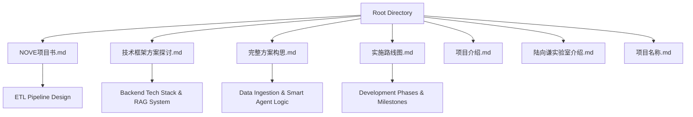
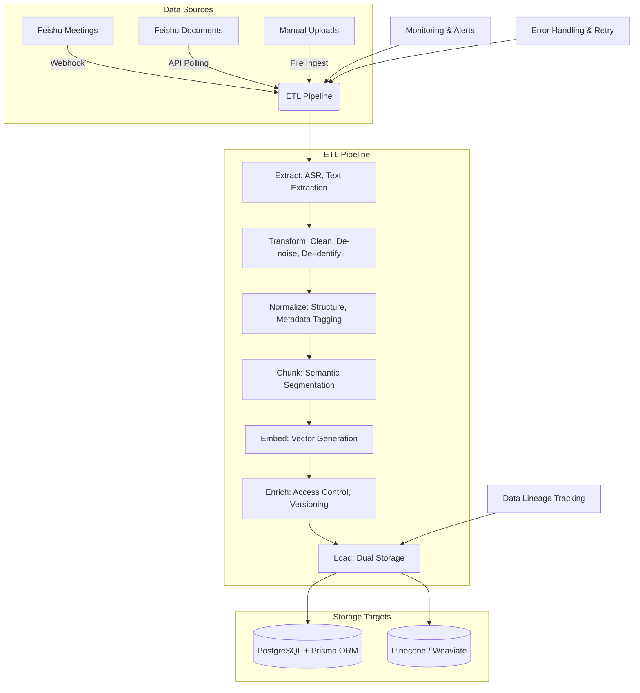
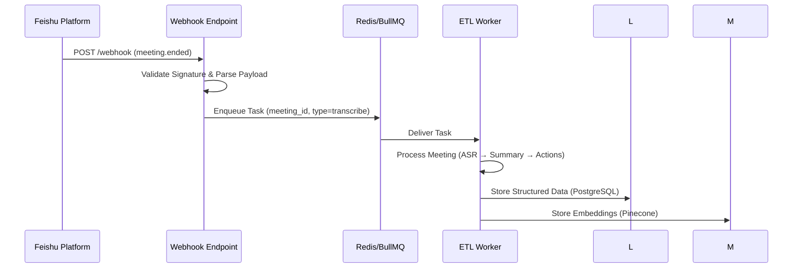
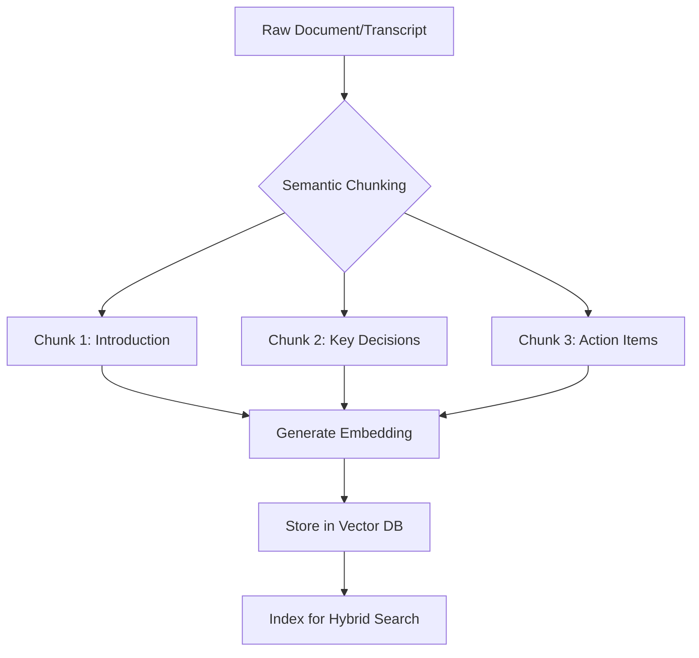
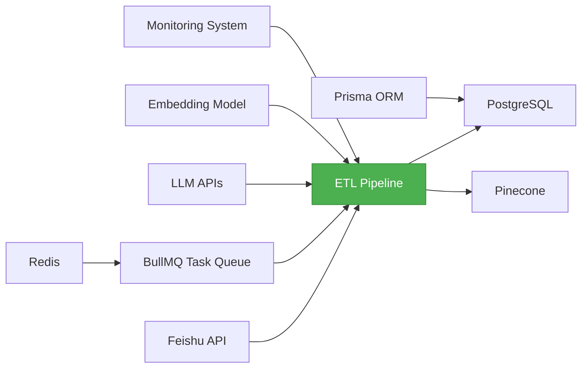

# ETL Pipeline

<cite>
**Referenced Files in This Document**   
- [NOVE项目书.md](file://NOVE项目书.md)
- [技术框架方案探讨.md](file://技术框架方案探讨.md)
- [完整方案构思.md](file://完整方案构思.md)
- [实施路线图.md](file://实施路线图.md)
</cite>

## Table of Contents
1. [Introduction](#introduction)
2. [Project Structure](#project-structure)
3. [Core Components](#core-components)
4. [Architecture Overview](#architecture-overview)
5. [Detailed Component Analysis](#detailed-component-analysis)
6. [Dependency Analysis](#dependency-analysis)
7. [Performance Considerations](#performance-considerations)
8. [Troubleshooting Guide](#troubleshooting-guide)
9. [Conclusion](#conclusion)

## Introduction
This document provides comprehensive architectural documentation for the ETL (Extract, Transform, Load) pipeline responsible for data ingestion and transformation within the Data & Index Layer of the NOVE project. The system is designed to support an AI-powered educational intelligence platform that integrates real-time and batch data from multiple sources, primarily Feishu meetings and uploaded documents. The pipeline enables retrieval-augmented generation (RAG), intelligent agent orchestration, and personalized knowledge delivery by transforming unstructured data into structured, searchable, and semantically rich formats.

The ETL pipeline plays a central role in the four-layer architecture of the system: Data Source Layer → Data & Index Layer → Capability & Middleware Layer → Application & Experience Layer. It ensures that raw inputs such as meeting transcripts, documents, and user-generated content are processed, normalized, chunked, embedded, and loaded into both relational (PostgreSQL) and vector databases (Pinecone/Weaviate) for downstream AI and application use.

Key objectives of this documentation include:
- Describing the end-to-end workflow from source ingestion to indexed storage
- Explaining event-driven triggers via webhooks and OAuth 2.0 integration with Feishu
- Detailing transformation logic including metadata tagging, access control inheritance, and versioning
- Covering batch vs. real-time processing modes and resource scaling using Redis/BullMQ
- Outlining error handling, retry mechanisms, and data lineage tracking
- Providing insights into monitoring, auditability, and reproducibility

This document synthesizes information from core project files including NOVE项目书.md, 技术框架方案探讨.md, 完整方案构思.md, and 实施路线图.md to deliver a technically accurate and accessible overview of the ETL architecture.

## Project Structure
The project is organized around a modular, layered architecture with clearly defined responsibilities across components. The root directory contains high-level strategic and technical planning documents that define the scope, goals, and implementation roadmap of the ETL pipeline.

**Diagram sources**
- [NOVE项目书.md](file://NOVE项目书.md#L57-L62)
- [技术框架方案探讨.md](file://技术框架方案探讨.md#L1-L10)
- [完整方案构思.md](file://完整方案构思.md#L1-L10)
- [实施路线图.md](file://实施路线图.md#L1-L10)

**Section sources**
- [NOVE项目书.md](file://NOVE项目书.md#L1-L100)
- [技术框架方案探讨.md](file://技术框架方案探讨.md#L1-L50)
- [完整方案构思.md](file://完整方案构思.md#L1-L30)
- [实施路线图.md](file://实施路线图.md#L1-L20)

## Core Components
The ETL pipeline consists of several interconnected components responsible for ingesting, processing, and storing data from heterogeneous sources. These components operate within a well-defined architecture that separates concerns across data acquisition, transformation, indexing, and persistence layers.

Key components include:
- **Feishu Integration Service**: Handles OAuth 2.0 authentication and webhook subscriptions for real-time event capture from meetings, calendars, and documents.
- **Data Ingestion Layer**: Supports both real-time (webhook-triggered) and batch (scheduled sync) data collection from Feishu and manual uploads.
- **Transformation Engine**: Performs cleaning, de-noising, de-identification, and structural normalization of raw input data.
- **Chunking & Embedding Module**: Splits documents and transcripts into semantically meaningful segments and generates vector embeddings using models like text-embedding-ada-002.
- **Metadata Enrichment System**: Applies automatic tagging, entity recognition, relationship extraction, and access control inheritance based on organizational hierarchy.
- **Versioning & Lineage Tracker**: Maintains historical versions of processed content and tracks data provenance for auditability and reproducibility.
- **Dual-Storage Loader**: Persists structured metadata in PostgreSQL via Prisma ORM and vector embeddings in Pinecone (initial) or Weaviate/Milvus (future).
- **Async Task Queue (BullMQ + Redis)**: Manages long-running tasks such as ASR, summarization, and index rebuilding with retry and dead-letter queue support.

These components are orchestrated through a message-driven architecture that enables scalability, fault tolerance, and separation of concerns.

**Section sources**
- [NOVE项目书.md](file://NOVE项目书.md#L57-L62)
- [技术框架方案探讨.md](file://技术框架方案探讨.md#L45-L150)
- [完整方案构思.md](file://完整方案构思.md#L50-L100)

## Architecture Overview
The ETL pipeline follows a layered, event-driven architecture designed to handle both real-time and batch data processing workflows. It integrates tightly with Feishu as the primary data source while supporting additional document uploads and future integrations.

**Diagram sources**
- [NOVE项目书.md](file://NOVE项目书.md#L57-L62)
- [技术框架方案探讨.md](file://技术框架方案探讨.md#L129-L140)
- [完整方案构思.md](file://完整方案构思.md#L60-L80)

## Detailed Component Analysis

### Data Ingestion and Event Triggers
The ETL pipeline supports multiple ingestion modes: real-time via webhooks and batch via scheduled polling. Real-time ingestion is triggered by Feishu webhook events such as "meeting ended" or "document updated", which initiate asynchronous processing jobs. Batch ingestion occurs periodically to synchronize historical or missed data.

Authentication is handled via OAuth 2.0, ensuring secure access to organizational data. Upon receiving a webhook, the system validates the payload signature, extracts relevant metadata (e.g., meeting ID, participants, timestamp), and enqueues a processing task using Redis and BullMQ for reliable delivery.

**Diagram sources**
- [NOVE项目书.md](file://NOVE项目书.md#L150-L160)
- [技术框架方案探讨.md](file://技术框架方案探讨.md#L130-L145)
- [完整方案构思.md](file://完整方案构思.md#L65-L75)

### Transformation and Normalization Logic
The transformation phase applies a series of operations to convert raw, unstructured input into clean, standardized, and enriched data suitable for downstream AI applications.

Processing steps include:
- **Cleaning**: Removal of filler words, speaker labels, and non-content elements
- **De-noising**: Filtering out irrelevant segments (e.g., off-topic discussions)
- **De-identification**: Automatic detection and masking of PII (phone numbers, IDs)
- **Normalization**: Standardizing date formats, naming conventions, and terminology
- **Metadata Tagging**: Using LLMs to extract topics, keywords, sentiment, and document classification
- **Access Control Inheritance**: Propagating permissions based on organizational hierarchy (e.g., department-level visibility)
- **Versioning**: Assigning version numbers and tracking changes for auditability

This logic ensures data consistency, security, and compliance while enabling fine-grained retrieval and filtering in the RAG system.

**Section sources**
- [NOVE项目书.md](file://NOVE项目书.md#L57-L62)
- [技术框架方案探讨.md](file://技术框架方案探讨.md#L135-L150)
- [完整方案构思.md](file://完整方案构思.md#L70-L90)

### Chunking and Embedding Strategy
Document and transcript chunking is performed using semantic segmentation rather than fixed-size splitting. The system leverages LLMs to identify natural boundaries such as topic shifts, section breaks, or discussion transitions, ensuring each chunk represents a coherent unit of meaning.

Each chunk is then passed through an embedding model (e.g., text-embedding-ada-002) to generate a high-dimensional vector representation. These vectors are stored in a vector database (initially Pinecone, later Weaviate or Milvus) to enable fast, approximate nearest neighbor (ANN) search during RAG queries.

Chunk metadata includes:
- Source document/meeting ID
- Timestamp range (for transcripts)
- Author/speaker
- Security classification
- Version ID
- Confidence score

This strategy optimizes retrieval accuracy and relevance while supporting hybrid search (vector + keyword + metadata filtering).

**Diagram sources**
- [技术框架方案探讨.md](file://技术框架方案探讨.md#L45-L50)
- [完整方案构思.md](file://完整方案构思.md#L75-L85)

### Loading and Dual-Storage Mechanism
The final stage of the ETL pipeline involves loading transformed data into dual storage systems:

1. **Relational Storage (PostgreSQL + Prisma ORM)**:
   - Stores structured metadata: users, permissions, audit logs, action items, document versions
   - Enables complex joins, transactional integrity, and RBAC/ABAC enforcement
   - Serves as the source of truth for operational data

2. **Vector Storage (Pinecone → Weaviate/Milvus)**:
   - Stores text embeddings for semantic search
   - Supports high-performance ANN queries
   - Enables hybrid search with metadata filtering (e.g., "find decisions about X from Q3")

Data is loaded asynchronously, with failure isolation and retry mechanisms. Updates trigger version increments and lineage updates to ensure traceability.

**Section sources**
- [NOVE项目书.md](file://NOVE项目书.md#L60-L61)
- [技术框架方案探讨.md](file://技术框架方案探讨.md#L51-L55)
- [完整方案构思.md](file://完整方案构思.md#L73-L75)

## Dependency Analysis
The ETL pipeline depends on several internal and external components to function correctly.

**Diagram sources**
- [NOVE项目书.md](file://NOVE项目书.md#L164-L165)
- [技术框架方案探讨.md](file://技术框架方案探讨.md#L51-L55)
- [完整方案构思.md](file://完整方案构思.md#L73-L75)

## Performance Considerations
The ETL pipeline is designed for scalability, resilience, and efficient resource utilization:

- **Horizontal Scaling**: Workers are stateless and can be scaled independently based on queue depth.
- **Message Queuing**: Redis with BullMQ enables load leveling, fault tolerance, and prioritized task execution.
- **Caching**: Frequently accessed metadata (e.g., user roles, document schemas) is cached in Redis with TTL-based invalidation.
- **Batch Processing**: Large-scale index rebuilds are performed in batches to avoid system overload.
- **Monitoring**: Real-time metrics track job latency, success rate, queue length, and error rates.
- **Resource Isolation**: Critical paths (e.g., real-time ingestion) are isolated from heavy batch jobs.

Target performance metrics include:
- Average task processing time < 30s (95th percentile)
- System availability ≥ 99.5%
- Support for 1000+ concurrent ingestion events
- Index update latency < 5 minutes for new content

## Troubleshooting Guide
Common issues and mitigation strategies for the ETL pipeline:

- **Webhook Delivery Failures**:
  - Cause: Network issues, invalid signatures, rate limiting
  - Resolution: Implement exponential backoff, validate payloads, monitor API quotas

- **Task Processing Errors**:
  - Cause: Model timeouts, database connection loss, malformed input
  - Resolution: Retry with jitter, dead-letter queue for inspection, structured logging

- **Data Inconsistency**:
  - Cause: Partial failures during dual-write operations
  - Resolution: Use idempotent writes, transactional outbox pattern, reconciliation jobs

- **Slow Embedding Generation**:
  - Cause: High LLM API latency or throttling
  - Resolution: Implement circuit breakers, fallback models, local caching of embeddings

- **Permission Mismatches**:
  - Cause: Delayed sync between identity provider and local DB
  - Resolution: Cache invalidation on user role change, fallback to deny-by-default

Logs, traces, and metrics are collected via ELK stack or Grafana for root cause analysis.

**Section sources**
- [技术框架方案探讨.md](file://技术框架方案探讨.md#L250-L300)
- [NOVE项目书.md](file://NOVE项目书.md#L10-L15)

## Conclusion
The ETL pipeline is a foundational component of the NOVE AI education platform, enabling the transformation of raw, unstructured data from Feishu meetings and documents into structured, semantically rich, and securely indexed knowledge assets. By leveraging event-driven architecture, asynchronous processing with Redis/BullMQ, and dual-storage persistence in PostgreSQL and vector databases, the system supports both real-time and batch workflows with high reliability and scalability.

Key strengths include:
- Seamless integration with Feishu via webhooks and OAuth 2.0
- Intelligent transformation with metadata tagging, access control inheritance, and versioning
- Robust error handling and retry mechanisms
- Comprehensive data lineage tracking for auditability
- Support for hybrid search and RAG applications

Future enhancements may include microservices decomposition, multi-tenant support, and advanced data quality monitoring. The current architecture provides a solid foundation for delivering personalized, context-aware AI experiences to educators and learners.