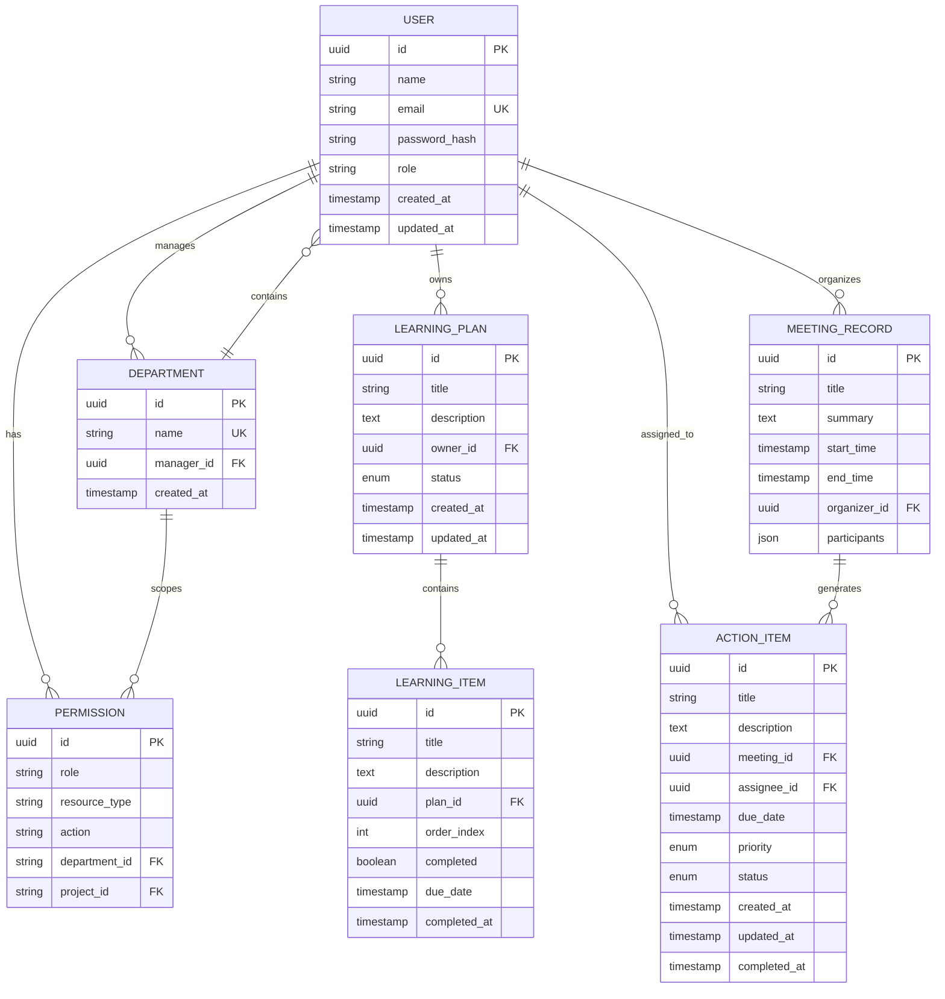

# Relational Storage

<cite>
**Referenced Files in This Document**  
- [NOVE项目书.md](file://NOVE项目书.md)
- [技术框架方案探讨.md](file://技术框架方案探讨.md)
- [完整方案构思.md](file://完整方案构思.md)
</cite>

## Table of Contents
1. [Introduction](#introduction)
2. [Core Data Model](#core-data-model)
3. [Entity-Relationship Diagram](#entity-relationship-diagram)
4. [Prisma ORM Integration](#prisma-orm-integration)
5. [Data Validation and Constraints](#data-validation-and-constraints)
6. [Transaction and ACID Compliance](#transaction-and-acid-compliance)
7. [Common Query Patterns](#common-query-patterns)
8. [Data Lifecycle and Backup](#data-lifecycle-and-backup)
9. [Hybrid Query Workflows](#hybrid-query-workflows)
10. [Conclusion](#conclusion)

## Introduction
The Relational Storage subsystem of the NOVE platform serves as the authoritative source of structured data, ensuring data integrity, consistency, and security. It is built on PostgreSQL and managed through Prisma ORM, forming the foundation for user management, permissions, learning plans, action items, and meeting records. This documentation details the schema design, data relationships, access patterns, and integration strategies that enable a robust and scalable data architecture.

**Section sources**
- [NOVE项目书.md](file://NOVE项目书.md#L1-L50)
- [技术框架方案探讨.md](file://技术框架方案探讨.md#L1-L30)

## Core Data Model
The core data model is designed to support the key entities of the NOVE platform: users, permissions, learning plans, action items, and meeting records. Each entity is represented as a table in the PostgreSQL database, with well-defined primary keys, foreign key relationships, and constraints.

### User Profiles
The `User` entity stores essential information about platform users, including personal details, authentication credentials, and role assignments. It serves as the central identity for access control and personalization.

### Permissions
The permission system implements a hybrid model combining Role-Based Access Control (RBAC) and Attribute-Based Access Control (ABAC). Roles define broad access levels (e.g., admin, teacher, student), while attributes enable fine-grained control based on department, project, or data sensitivity.

### Learning Plans
Learning plans are structured as hierarchical entities, with a `LearningPlan` table containing metadata and a `LearningItem` table for individual tasks or milestones. This design supports flexible curriculum design and progress tracking.

### Action Items
Action items are extracted from meeting records and linked to users and deadlines. The `ActionItem` table includes status tracking, priority levels, and completion timestamps, enabling effective task management.

### Meeting Records
Meeting records capture structured data from Flybook meetings, including participants, timestamps, summaries, and associated action items. The schema supports both real-time access and historical analysis.

**Section sources**
- [NOVE项目书.md](file://NOVE项目书.md#L100-L200)
- [技术框架方案探讨.md](file://技术框架方案探讨.md#L100-L150)

## Entity-Relationship Diagram

**Diagram sources**
- [NOVE项目书.md](file://NOVE项目书.md#L150-L180)
- [技术框架方案探讨.md](file://技术框架方案探讨.md#L120-L140)

## Prisma ORM Integration
Prisma ORM is used to provide type-safe database access and streamline migration management. The Prisma schema defines the data model in a declarative manner, enabling automatic generation of type definitions and database migrations.

### Type-Safe Access
Prisma Client generates TypeScript types based on the database schema, ensuring compile-time validation of queries and reducing runtime errors. This integration enhances developer productivity and code reliability.

### Migration Management
Prisma Migrate is used to manage schema evolution. Each change to the Prisma schema triggers a migration script that can be version-controlled and applied in a consistent manner across development, testing, and production environments.

### Relationship Handling
Prisma simplifies the management of complex relationships through its intuitive query API. For example, retrieving a user's learning plans with their associated items can be done in a single query with proper nesting.

**Section sources**
- [技术框架方案探讨.md](file://技术框架方案探讨.md#L200-L250)
- [NOVE项目书.md](file://NOVE项目书.md#L300-L320)

## Data Validation and Constraints
The database schema enforces data integrity through a combination of constraints and application-level validation.

### Primary and Foreign Keys
Primary keys ensure entity uniqueness, while foreign keys maintain referential integrity. For example, the `assignee_id` in the `ACTION_ITEM` table references the `id` in the `USER` table, preventing orphaned records.

### Unique Constraints
Unique constraints are applied to fields that must be distinct, such as the `email` field in the `USER` table, preventing duplicate accounts.

### Check Constraints
Check constraints enforce domain-specific rules, such as validating that the `priority` field in the `ACTION_ITEM` table only accepts values from a predefined set (e.g., 'low', 'medium', 'high').

### Not Null Constraints
Critical fields are marked as NOT NULL to ensure data completeness. For instance, the `title` field in the `LEARNING_PLAN` table cannot be empty.

**Section sources**
- [技术框架方案探讨.md](file://技术框架方案探讨.md#L250-L280)
- [完整方案构思.md](file://完整方案构思.md#L50-L70)

## Transaction and ACID Compliance
The PostgreSQL database ensures ACID (Atomicity, Consistency, Isolation, Durability) compliance for all transactions, providing a reliable foundation for data operations.

### Atomicity
Operations within a transaction are treated as a single unit. For example, when creating a new meeting record and its associated action items, either all records are committed, or none are, preventing partial updates.

### Consistency
The database maintains consistency by enforcing constraints and rules. Any operation that would violate a constraint is rolled back, ensuring the database remains in a valid state.

### Isolation
Transaction isolation levels prevent interference between concurrent operations. The default isolation level ensures that reads do not block writes and vice versa, while preventing dirty reads and non-repeatable reads.

### Durability
Once a transaction is committed, its changes are permanently stored, even in the event of a system failure. This is achieved through write-ahead logging (WAL) and regular checkpoints.

**Section sources**
- [技术框架方案探讨.md](file://技术框架方案探讨.md#L300-L330)

## Common Query Patterns
The data model supports several common access patterns that are optimized for performance.

### Permission Checking
To check if a user has permission to access a resource, a query joins the `USER`, `PERMISSION`, and resource tables, filtering by the user's role and attributes.

### Progress Tracking
Progress in a learning plan is calculated by aggregating the completion status of its learning items. A single query can retrieve the plan and compute the percentage of completed items.

### Action Item Status
A dashboard query retrieves all action items assigned to a user, grouped by status and sorted by due date, enabling efficient task management.

### Meeting History
Historical meeting data can be queried with filters for date range, organizer, or keywords in the summary, supporting retrospective analysis.

**Section sources**
- [NOVE项目书.md](file://NOVE项目书.md#L400-L420)
- [技术框架方案探讨.md](file://技术框架方案探讨.md#L350-L370)

## Data Lifecycle and Backup
The relational storage subsystem implements a comprehensive data lifecycle management strategy.

### Data Retention
Data is categorized into hot, warm, and cold tiers based on access frequency. Hot data (e.g., recent meetings) is stored on high-performance SSDs, while cold data (e.g., archived records) is moved to cost-effective object storage.

### Backup Strategy
Regular backups are performed using PostgreSQL's built-in tools, with full backups weekly and incremental backups daily. Backups are encrypted and stored in a geographically separate location.

### Disaster Recovery
A disaster recovery plan includes automated failover to a standby database and procedures for restoring data from backups. Recovery time objectives (RTO) and recovery point objectives (RPO) are defined and tested regularly.

**Section sources**
- [技术框架方案探讨.md](file://技术框架方案探讨.md#L400-L430)

## Hybrid Query Workflows
The relational storage subsystem integrates with the vector database to enable hybrid query workflows that combine structured and semantic search.

### Query Flow
When a user submits a query, the system first performs a permission check against the relational database. Then, it routes the query to the vector database for semantic search, using the results to construct a context-aware response.

### Data Synchronization
Changes to structured data (e.g., a new meeting record) trigger an asynchronous process that updates the vector database, ensuring consistency between the two systems.

### Performance Optimization
Caching strategies are employed to reduce latency, with frequently accessed data stored in Redis. This hybrid approach balances the precision of relational queries with the flexibility of semantic search.

**Section sources**
- [NOVE项目书.md](file://NOVE项目书.md#L250-L280)
- [技术框架方案探讨.md](file://技术框架方案探讨.md#L500-L530)

## Conclusion
The Relational Storage subsystem of the NOVE platform provides a robust, secure, and scalable foundation for managing structured data. By leveraging PostgreSQL and Prisma ORM, the system ensures data integrity, supports complex access patterns, and integrates seamlessly with the vector database for hybrid query capabilities. This architecture enables the platform to deliver personalized, context-aware services while maintaining strict data governance and compliance.