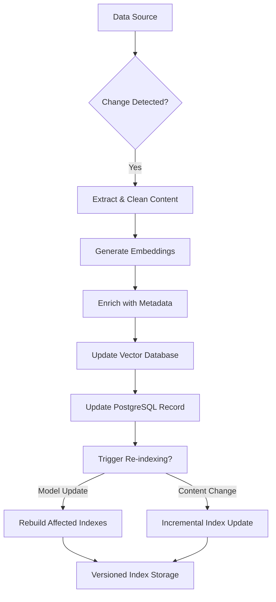
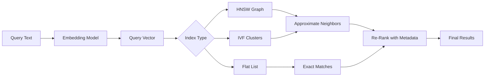

# Vector Indexing

<cite>
**Referenced Files in This Document**   
- [技术框架方案探讨.md](file://技术框架方案探讨.md)
- [NOVE项目书.md](file://NOVE项目书.md)
- [完整方案构思.md](file://完整方案构思.md)
</cite>

## Table of Contents
1. [Introduction](#introduction)
2. [Vector Database Selection and Comparison](#vector-database-selection-and-comparison)
3. [Embedding Generation Process](#embedding-generation-process)
4. [Document Chunking and Metadata Enrichment](#document-chunking-and-metadata-enrichment)
5. [Indexing Workflows and Synchronization](#indexing-workflows-and-synchronization)
6. [Index Types and Similarity Metrics](#index-types-and-similarity-metrics)
7. [Performance Tuning and Operational Considerations](#performance-tuning-and-operational-considerations)

## Introduction

The Vector Indexing subsystem forms a critical component within the Data & Index Layer of the EduMind AI Platform, enabling semantic search and Retrieval-Augmented Generation (RAG) capabilities. This system bridges structured metadata in PostgreSQL with unstructured textual knowledge from diverse sources such as meeting transcripts, course materials, and project documentation. By converting text into high-dimensional vectors using embedding models, the platform supports context-aware retrieval that powers intelligent agents, personalized learning experiences, and automated knowledge management. The architecture is designed for modularity, allowing evolution from managed services like Pinecone to self-hosted solutions such as Weaviate or Milvus based on scalability, cost, and control requirements.

**Section sources**
- [NOVE项目书.md](file://NOVE项目书.md#L1-L50)
- [技术框架方案探讨.md](file://技术框架方案探讨.md#L1-L100)

## Vector Database Selection and Comparison

The system employs a strategic evolution path for vector databases: starting with **Pinecone** for rapid prototyping and initial deployment, then transitioning to **Weaviate** or **Milvus** for long-term scalability and enhanced functionality.

| Feature | Pinecone | Weaviate | Milvus |
|--------|--------|--------|--------|
| **Hosting Model** | Fully managed | Hybrid (managed/self-hosted) | Self-hosted / Cloud |
| **Search Type** | Pure vector | Hybrid (vector + keyword) | Vector-optimized |
| **Scalability** | Automatic scaling | Horizontal scaling | Distributed architecture |
| **Operational Overhead** | Low | Medium | High |
| **Cost Model** | Pay-per-query | Tiered subscription | Infrastructure-based |
| **Customization** | Limited | High (open source) | Very high |
| **Use Case Fit** | MVP, fast iteration | Enterprise-grade hybrid search | Large-scale, high-performance needs |

Pinecone enables quick validation of RAG workflows with minimal setup, making it ideal for early development phases. Weaviate offers a balanced approach with support for hybrid search (combining keyword and vector matching), multi-tenancy, and GraphQL APIs, suitable for departmental intelligent agents requiring fine-grained access control. Milvus provides maximum performance and customization for large-scale deployments, supporting advanced indexing algorithms and integration with machine learning pipelines.

This tiered adoption strategy aligns with the project’s principle of "value first" and "progressive iteration," ensuring technical decisions are driven by real usage patterns rather than speculative requirements.

**Section sources**
- [技术框架方案探讨.md](file://技术框架方案探讨.md#L150-L250)
- [NOVE项目书.md](file://NOVE项目书.md#L300-L350)

## Embedding Generation Process

The embedding generation pipeline utilizes the **text-embedding-ada-002** model as the primary encoder for transforming textual content into dense vector representations. This process occurs during the ETL (Extract, Transform, Load) phase when ingesting data from various sources including meeting transcripts, course documents, and project manuals.

The workflow follows these steps:
1. **Text Extraction**: Raw content is extracted from files (PDF, PPT, Markdown) or API responses (e.g., Flybook meeting records).
2. **Preprocessing**: Text is cleaned, normalized, and segmented into logical units.
3. **Embedding**: Each text chunk is passed through the `text-embedding-ada-002` model to generate a 1536-dimensional vector.
4. **Storage**: Vectors are stored in the vector database with metadata references to their source documents in PostgreSQL.

This embedding model was selected for its strong performance on semantic similarity tasks, cost-effectiveness, and seamless integration with OpenAI’s ecosystem. The system is designed to support model versioning, allowing future upgrades to newer embedding models without disrupting existing workflows.

**Section sources**
- [技术框架方案探讨.md](file://技术框架方案探讨.md#L250-L300)
- [NOVE项目书.md](file://NOVE项目书.md#L350-L400)

## Document Chunking and Metadata Enrichment

Effective vector indexing requires intelligent document segmentation and rich metadata annotation to ensure high retrieval precision.

### Document Chunking Strategies

The system implements dynamic chunking based on content type:
- **Meeting Transcripts**: Segmented by speaker turns and topic shifts, with summaries generated for each segment.
- **Course Materials**: Split by section headers, with PPT slides treated as atomic units.
- **Long Documents**: Processed using sliding windows with overlap to preserve context across boundaries.

Chunk sizes are optimized between 256–512 tokens to balance context retention and retrieval accuracy. Overlapping windows (10–15%) prevent critical information from being split across chunks.

### Metadata Enrichment

Each vector is enriched with structured metadata to enable filtered and contextualized search:
- **Source Attributes**: Document type, creation date, author, department
- **Semantic Tags**: Automatically generated using LLMs (e.g., "curriculum design", "user feedback")
- **Access Control**: Role-based visibility flags (RBAC/ABAC) synchronized from PostgreSQL
- **Temporal Context**: Time windows for relevance filtering (e.g., "only show meetings from last 6 months")

This metadata enables hybrid queries that combine semantic similarity with structured filters, significantly improving result relevance in enterprise scenarios where data access must respect organizational boundaries.

**Section sources**
- [完整方案构思.md](file://完整方案构思.md#L100-L200)
- [NOVE项目书.md](file://NOVE项目书.md#L400-L450)

## Indexing Workflows and Synchronization

The indexing system maintains consistency between PostgreSQL metadata and vector stores through a synchronized update mechanism.

**Diagram sources**
- [技术框架方案探讨.md](file://技术框架方案探讨.md#L500-L600)
- [NOVE项目书.md](file://NOVE项目书.md#L500-L550)

### Synchronization Mechanisms

- **Event-Driven Updates**: Webhooks from Flybook and document systems trigger immediate reprocessing of changed content.
- **Batch Processing**: Daily jobs scan for updates and apply bulk indexing operations.
- **Conflict Resolution**: Timestamp-based versioning ensures consistency across distributed components.

### Re-indexing Triggers

Index regeneration is triggered by:
- **Content Updates**: When source documents are modified or new meetings are recorded
- **Model Version Changes**: When embedding models are upgraded, necessitating re-encoding
- **Schema Evolution**: When metadata fields or access policies change
- **Quality Thresholds**: Automated detection of retrieval accuracy degradation

The system supports both full and incremental re-indexing, with versioned indexes allowing rollback in case of quality regressions.

**Section sources**
- [技术框架方案探讨.md](file://技术框架方案探讨.md#L600-L700)
- [NOVE项目书.md](file://NOVE项目书.md#L550-L600)

## Index Types and Similarity Metrics

The vector indexing subsystem supports multiple index types and similarity measures to optimize for different query patterns and performance requirements.

### Supported Index Types

| Index Type | Description | Use Case |
|-----------|-----------|---------|
| **HNSW (Hierarchical Navigable Small World)** | Graph-based approximate nearest neighbor search | High recall, low latency queries |
| **IVF (Inverted File Index)** | Clustering-based search with quantization | Memory-efficient large-scale search |
| **Flat Index** | Exact brute-force search | Small datasets requiring 100% recall |

HNSW is the default index type due to its superior speed-accuracy tradeoff, while IVF is used for very large collections where memory optimization is critical. Flat indexing is reserved for small, high-precision use cases such as template matching.

### Similarity Metrics

The system supports multiple distance functions:
- **Cosine Similarity**: Measures angular difference between vectors; invariant to magnitude
- **Dot Product**: Efficient computation; suitable when vectors are normalized
- **Euclidean Distance**: Measures straight-line distance; sensitive to magnitude

Cosine similarity is the primary metric due to its effectiveness in capturing semantic similarity regardless of text length. The choice of metric can be configured per collection based on use case requirements.

**Diagram sources**
- [技术框架方案探讨.md](file://技术框架方案探讨.md#L300-L400)
- [完整方案构思.md](file://完整方案构思.md#L50-L100)

**Section sources**
- [技术框架方案探讨.md](file://技术框架方案探讨.md#L300-L400)
- [完整方案构思.md](file://完整方案构思.md#L50-L100)

## Performance Tuning and Operational Considerations

The system incorporates several performance optimization strategies to meet stringent response time targets (<2s average, <5s p99).

### Performance Tuning Parameters

| Parameter | Recommended Value | Impact |
|---------|------------------|-------|
| **ef_construction** | 200–300 | Controls graph quality during build |
| **ef_search** | 50–100 | Balances search speed and recall |
| **M (max connections)** | 16–48 | Affects graph density and memory |
| **nlist (IVF)** | √N (N=total vectors) | Optimizes clustering for search |
| **nprobe (IVF)** | 10–50 | Tradeoff between speed and accuracy |

These parameters are tuned based on dataset size, query patterns, and hardware constraints. Automated benchmarking runs during deployment to select optimal configurations.

### Managed vs Self-Hosted Trade-offs

| Dimension | Managed (Pinecone) | Self-Hosted (Weaviate/Milvus) |
|---------|-------------------|------------------------------|
| **Operational Overhead** | Low (fully managed) | High (requires DevOps expertise) |
| **Scalability** | Automatic, elastic | Manual configuration required |
| **Cost Efficiency** | Higher per-query cost | Lower long-term TCO at scale |
| **Customization** | Limited | Full control over configuration |
| **Security & Compliance** | Provider-dependent | On-premises deployment possible |
| **Integration Depth** | API-limited | Full stack visibility and tuning |

The migration path from Pinecone to Weaviate/Milvus is designed to minimize disruption, with abstraction layers isolating application logic from database-specific implementations. This allows gradual transition based on organizational maturity and resource availability.

**Section sources**
- [技术框架方案探讨.md](file://技术框架方案探讨.md#L400-L500)
- [NOVE项目书.md](file://NOVE项目书.md#L600-L650)