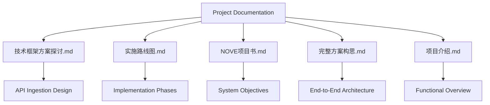
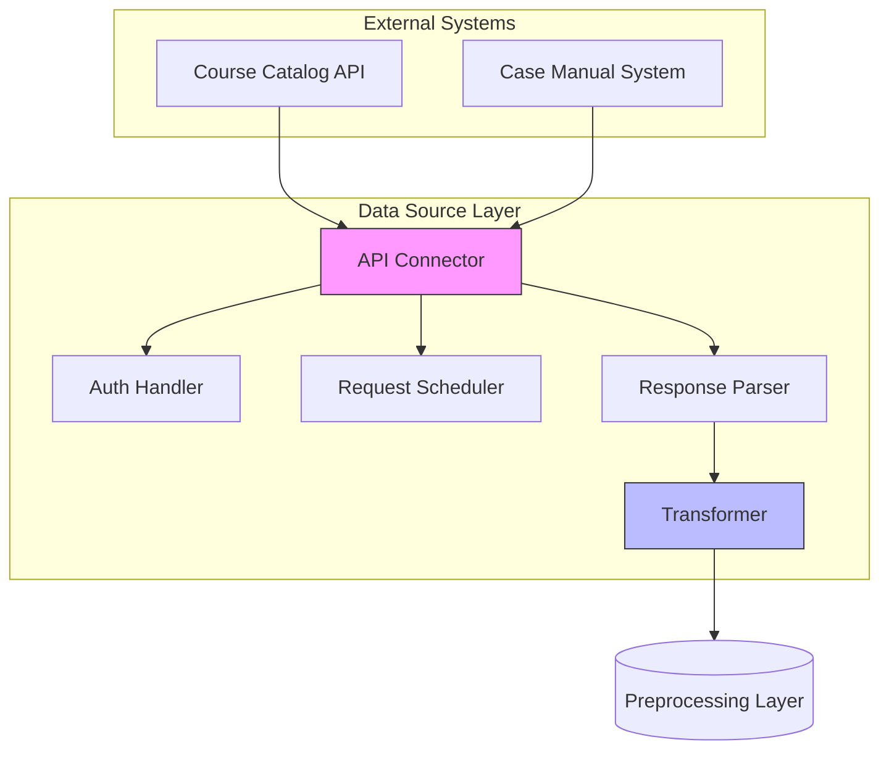
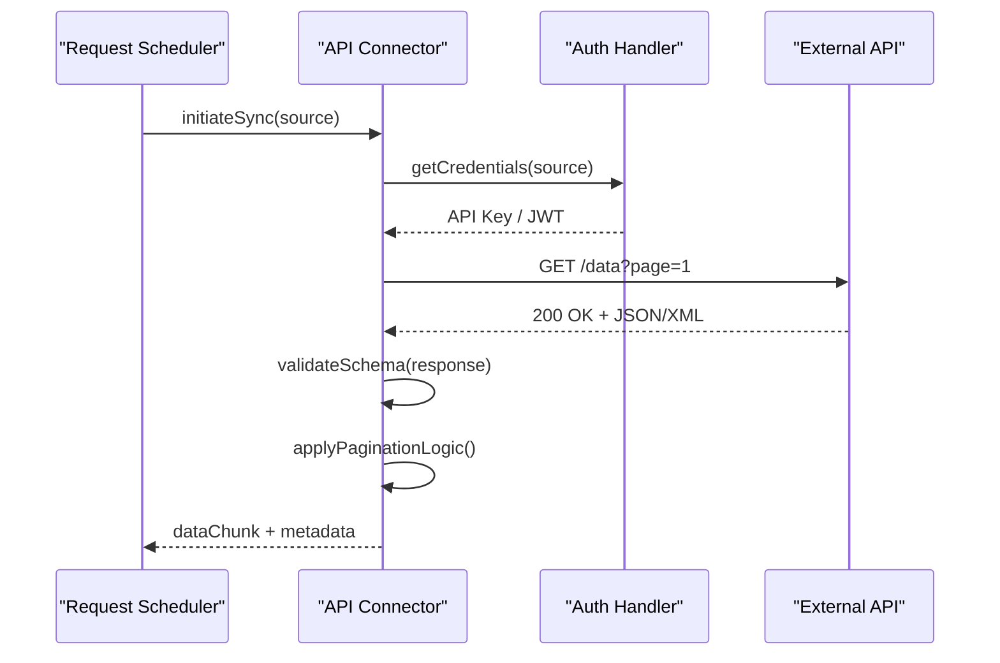
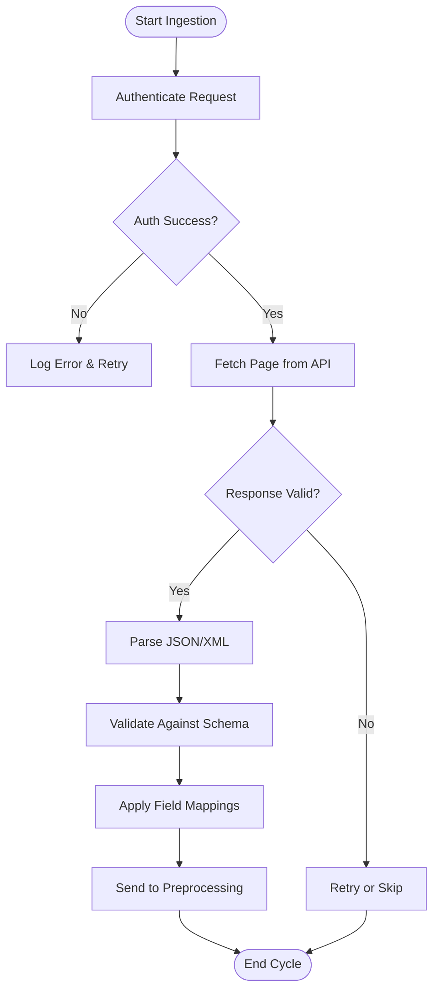
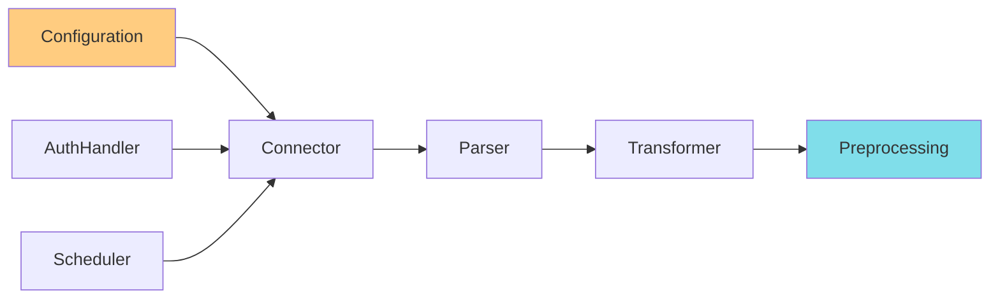

# API Data Ingestion

<cite>
**Referenced Files in This Document**   
- [技术框架方案探讨.md](file://技术框架方案探讨.md)
- [实施路线图.md](file://实施路线图.md)
- [NOVE项目书.md](file://NOVE项目书.md)
- [完整方案构思.md](file://完整方案构思.md)
- [项目介绍.md](file://项目介绍.md)
</cite>

## Table of Contents
1. [Introduction](#introduction)
2. [Project Structure](#project-structure)
3. [Core Components](#core-components)
4. [Architecture Overview](#architecture-overview)
5. [Detailed Component Analysis](#detailed-component-analysis)
6. [Dependency Analysis](#dependency-analysis)
7. [Performance Considerations](#performance-considerations)
8. [Troubleshooting Guide](#troubleshooting-guide)
9. [Conclusion](#conclusion)

## Introduction
This document provides comprehensive documentation for the API-based data ingestion mechanism within the Data Source Layer of the NOVE system. It details how structured data from external sources such as course catalogs and case manuals is ingested via RESTful or GraphQL APIs. The documentation covers authentication protocols, data transfer strategies, payload handling, error resilience, configuration flexibility, and integration examples. Emphasis is placed on reliability, idempotency, and monitoring to ensure robust data pipelines.

## Project Structure
The project is organized around high-level conceptual documents that define the vision, technical direction, and implementation roadmap. These markdown files serve as the primary source of architectural and functional specifications.

**Diagram sources**
- [技术框架方案探讨.md](file://技术框架方案探讨.md#L1-L50)
- [实施路线图.md](file://实施路线图.md#L1-L30)

**Section sources**
- [技术框架方案探讨.md](file://技术框架方案探讨.md#L1-L100)
- [项目介绍.md](file://项目介绍.md#L1-L40)

## Core Components
The core components of the API data ingestion system are defined in the conceptual design documents. These include the data source connectors, authentication managers, request orchestrators, response parsers, and transformation engines. Configuration parameters for endpoint URLs, credentials, and synchronization intervals are specified in the architecture blueprint.

**Section sources**
- [NOVE项目书.md](file://NOVE项目书.md#L20-L80)
- [完整方案构思.md](file://完整方案构思.md#L15-L60)

## Architecture Overview
The data ingestion layer follows a modular, extensible design that supports both polling and push-based integration patterns. External data sources are accessed through standardized API connectors that handle authentication, rate limiting, and pagination transparently.

**Diagram sources**
- [技术框架方案探讨.md](file://技术框架方案探讨.md#L30-L70)
- [完整方案构思.md](file://完整方案构思.md#L40-L90)

## Detailed Component Analysis

### API Connector Analysis
The API connector component abstracts communication with external systems using RESTful or GraphQL endpoints. It supports multiple payload formats including JSON and XML, and enforces schema expectations through validation rules defined in the configuration.

#### For API/Service Components:

**Diagram sources**
- [技术框架方案探讨.md](file://技术框架方案探讨.md#L50-L90)
- [实施路线图.md](file://实施路线图.md#L20-L50)

### Authentication and Security
Authentication is handled through secure credential storage and dynamic token generation. Supported methods include API keys and JWT-based authentication, with refresh mechanisms for long-running sync operations.

**Section sources**
- [NOVE项目书.md](file://NOVE项目书.md#L60-L100)
- [技术框架方案探讨.md](file://技术框架方案探讨.md#L80-L120)

### Data Flow and Transformation
Incoming payloads undergo schema validation and transformation before being passed to the preprocessing layer. This ensures consistency and compatibility across heterogeneous data sources.

#### For Complex Logic Components:

**Diagram sources**
- [完整方案构思.md](file://完整方案构思.md#L70-L130)
- [技术框架方案探讨.md](file://技术框架方案探讨.md#L100-L140)

**Section sources**
- [完整方案构思.md](file://完整方案构思.md#L50-L150)
- [NOVE项目书.md](file://NOVE项目书.md#L90-L130)

## Dependency Analysis
The ingestion system relies on internal coordination between configuration, authentication, scheduling, and parsing modules. There are no direct external code dependencies documented, but integration with third-party APIs implies runtime dependencies on their availability and interface stability.

**Diagram sources**
- [技术框架方案探讨.md](file://技术框架方案探讨.md#L120-L160)
- [实施路线图.md](file://实施路线图.md#L40-L70)

**Section sources**
- [技术框架方案探讨.md](file://技术框架方案探讨.md#L100-L180)
- [实施路线图.md](file://实施路线图.md#L30-L80)

## Performance Considerations
The system incorporates rate limiting, exponential backoff on failures, and configurable sync intervals to prevent overloading external APIs. Idempotent processing ensures safe retries without duplication. Monitoring hooks are included for tracking ingestion success rates, latency, and error conditions.

[No sources needed since this section provides general guidance]

## Troubleshooting Guide
Error handling strategies address network failures, invalid responses, schema mismatches, and version incompatibilities. Logs capture request/response details (with sensitive data redacted), and alerts are triggered for sustained failures or authentication issues.

**Section sources**
- [NOVE项目书.md](file://NOVE项目书.md#L130-L170)
- [完整方案构思.md](file://完整方案构思.md#L140-L180)

## Conclusion
The API-based data ingestion mechanism in the Data Source Layer provides a reliable, secure, and scalable solution for integrating structured data from external systems. Through standardized connectors, robust error handling, and flexible configuration, it enables seamless synchronization of course catalogs and case manuals while maintaining data integrity and operational visibility.

[No sources needed since this section summarizes without analyzing specific files]