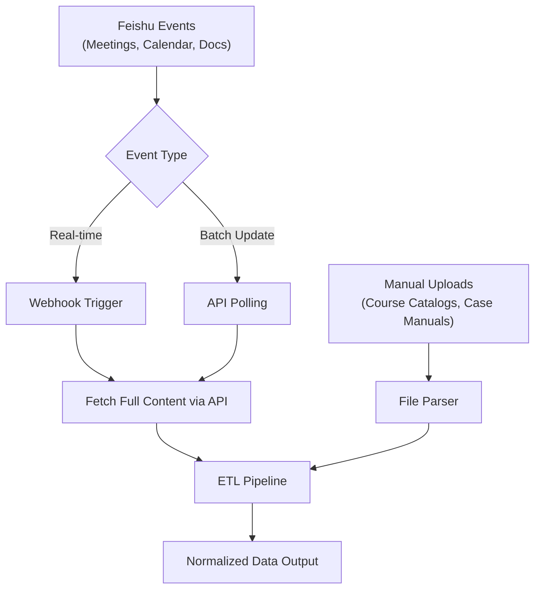
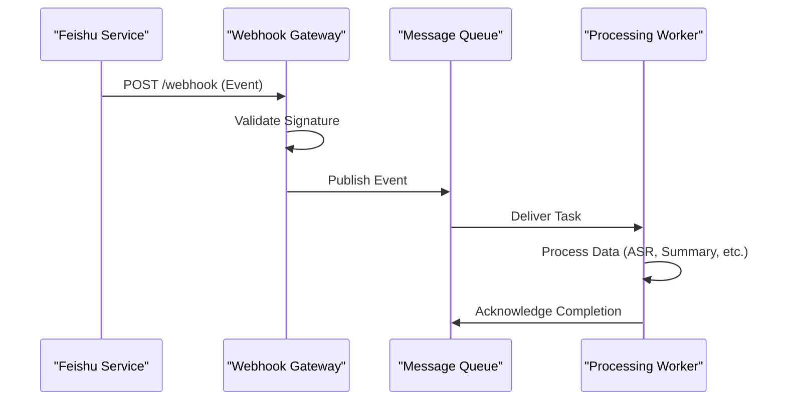

# Data Source Layer

<cite>
**Referenced Files in This Document**   
- [技术框架方案探讨.md](file://技术框架方案探讨.md)
- [NOVE项目书.md](file://NOVE项目书.md)
- [完整方案构思.md](file://完整方案构思.md)
</cite>

## Table of Contents
1. [Introduction](#introduction)
2. [Data Ingestion Patterns](#data-ingestion-patterns)
3. [Authentication Mechanisms](#authentication-mechanisms)
4. [Event-Driven Triggers](#event-driven-triggers)
5. [Integration Touchpoints with External Systems](#integration-touchpoints-with-external-systems)
6. [Data Preprocessing Responsibilities](#data-preprocessing-responsibilities)
7. [Scalability and Fault Tolerance](#scalability-and-fault-tolerance)
8. [Conclusion](#conclusion)

## Introduction
The Data Source Layer of the NOVE platform serves as the foundational component responsible for ingesting data from diverse internal and external systems. This layer enables seamless integration with Feishu (for meetings, calendars, and documents) through OAuth 2.0 and Webhook subscriptions, while also supporting structured data sources such as course catalogs and case manuals via APIs or manual uploads. The primary objective of this layer is to ensure reliable, secure, and scalable data acquisition that feeds into downstream processing stages. It plays a critical role in enabling the platform's AI-driven capabilities by providing timely and accurate data inputs.

**Section sources**
- [NOVE项目书.md](file://NOVE项目书.md#L1-L50)
- [技术框架方案探讨.md](file://技术框架方案探讨.md#L1-L50)

## Data Ingestion Patterns
The Data Source Layer employs multiple ingestion patterns tailored to different types of data sources. For real-time event-driven data from Feishu—such as meeting recordings, calendar updates, and document changes—the system utilizes Webhook subscriptions to capture events as they occur. These events trigger asynchronous processing pipelines that retrieve detailed content via Feishu’s API. For batch-oriented structured data like course catalogs and case manuals, the platform supports both API-based synchronization and manual file uploads (e.g., PDF, PPT, Markdown). Uploaded files are processed through an ETL pipeline that includes parsing, cleaning, and metadata extraction before being forwarded to the next layer.

**Diagram sources**
- [NOVE项目书.md](file://NOVE项目书.md#L100-L150)
- [完整方案构思.md](file://完整方案构思.md#L50-L100)

**Section sources**
- [NOVE项目书.md](file://NOVE项目书.md#L100-L200)
- [完整方案构思.md](file://完整方案构思.md#L50-L120)

## Authentication Mechanisms
Secure access to external systems, particularly Feishu, is achieved through OAuth 2.0 authentication. This protocol allows the NOVE platform to obtain limited access to user accounts on Feishu without exposing credentials. Upon user authorization, the system receives access tokens that are securely stored and used for subsequent API calls. Token refresh mechanisms ensure long-lived integrations without requiring repeated user consent. Additionally, all communication channels enforce TLS 1.3 encryption to protect data in transit. For internal service-to-service communication, JWT-based authentication is used to validate identity and permissions.

**Section sources**
- [技术框架方案探讨.md](file://技术框架方案探讨.md#L200-L250)
- [NOVE项目书.md](file://NOVE项目书.md#L300-L350)

## Event-Driven Triggers
Event-driven architecture is central to the responsiveness of the Data Source Layer. Webhooks from Feishu serve as primary triggers for key workflows, including meeting start/end detection, document modification notifications, and calendar updates. Each webhook payload is validated using signature verification to prevent spoofing attacks. Once verified, events are published to a message queue (e.g., Redis + BullMQ), decoupling event reception from processing. This design enables asynchronous handling of resource-intensive tasks such as audio transcription, meeting summarization, and action item extraction, ensuring system responsiveness even under high load.

**Diagram sources**
- [技术框架方案探讨.md](file://技术框架方案探讨.md#L300-L350)
- [NOVE项目书.md](file://NOVE项目书.md#L400-L450)

**Section sources**
- [技术框架方案探讨.md](file://技术框架方案探讨.md#L300-L400)
- [NOVE项目书.md](file://NOVE项目书.md#L400-L500)

## Integration Touchpoints with External Systems
The Data Source Layer integrates with several external systems, with Feishu being the primary integration partner. The integration includes:
- **OAuth 2.0 Authentication**: Secure user authorization and token management.
- **Webhook Subscriptions**: Real-time event listening for meetings, documents, and calendars.
- **RESTful API Consumption**: Retrieval of detailed data (e.g., meeting transcripts, attendee lists).
- **Manual Upload Interface**: Web-based upload portal for structured documents.

Security practices are rigorously enforced at all integration points. All incoming webhooks are validated using HMAC signatures to ensure authenticity. Outbound communications use TLS 1.3 encryption, and API rate limiting is implemented to prevent abuse. Sensitive data is immediately subjected to de-identification and encryption upon ingestion.

**Section sources**
- [技术框架方案探讨.md](file://技术框架方案探讨.md#L500-L550)
- [NOVE项目书.md](file://NOVE项目书.md#L550-L600)

## Data Preprocessing Responsibilities
Before data is passed to the next layer, the Data Source Layer performs essential preprocessing to ensure quality and consistency. Key responsibilities include:
- **Noise Reduction**: Filtering out irrelevant content (e.g., filler words in transcripts, redundant comments).
- **De-duplication**: Identifying and removing duplicate entries across meetings, documents, or uploads.
- **Schema Normalization**: Converting heterogeneous data formats into a unified schema suitable for downstream processing.
- **Metadata Enrichment**: Adding timestamps, source identifiers, and ownership context.
- **Text Segmentation**: Splitting long documents into semantically meaningful chunks for vectorization.

These preprocessing steps are critical for maintaining high retrieval accuracy in the RAG system and ensuring coherent knowledge representation.

**Section sources**
- [NOVE项目书.md](file://NOVE项目书.md#L600-L650)
- [完整方案构思.md](file://完整方案构思.md#L150-L200)

## Scalability and Fault Tolerance
The Data Source Layer is designed for high scalability and fault tolerance. Horizontal scaling is supported through stateless services behind a load balancer, allowing the system to handle increasing volumes of webhook traffic and API requests. Message queues (e.g., Redis + BullMQ) provide buffering during traffic spikes and enable retry mechanisms for failed processing tasks. Dead-letter queues capture unprocessable messages for diagnostic review. The system also implements exponential backoff and circuit breaker patterns when interacting with external APIs to gracefully handle transient failures. Monitoring and alerting systems track ingestion latency, error rates, and queue depths to ensure operational health.

**Section sources**
- [技术框架方案探讨.md](file://技术框架方案探讨.md#L700-L750)
- [实施路线图.md](file://实施路线图.md#L10-L20)

## Conclusion
The Data Source Layer forms the critical entry point for all data flowing into the NOVE platform. By leveraging OAuth 2.0 for secure authentication, Webhooks for real-time event capture, and robust preprocessing pipelines, it ensures that high-quality, normalized data is reliably delivered to downstream components. Its event-driven, scalable architecture supports both real-time and batch ingestion patterns, making it adaptable to diverse data sources such as Feishu and structured educational content. With strong emphasis on security, fault tolerance, and extensibility, this layer lays the foundation for the platform’s intelligent capabilities, including RAG-based Q&A, meeting summarization, and personalized learning support.