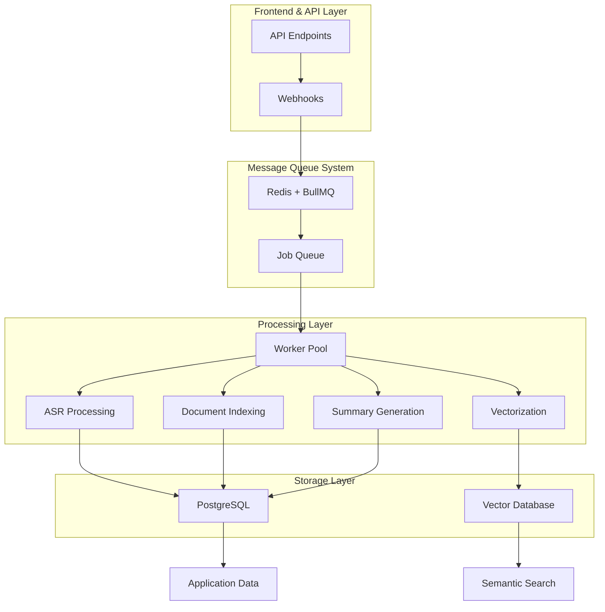
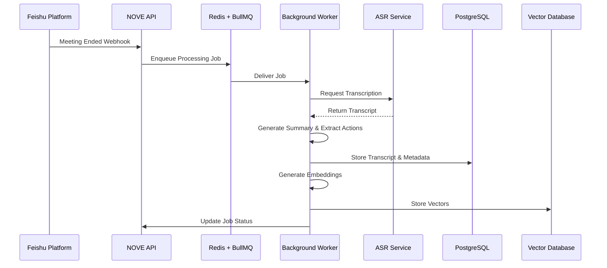

# Asynchronous Processing with Message Queues

<cite>
**Referenced Files in This Document**   
- [技术框架方案探讨.md](file://技术框架方案探讨.md)
- [NOVE项目书.md](file://NOVE项目书.md)
- [完整方案构思.md](file://完整方案构思.md)
- [实施路线图.md](file://实施路线图.md)
</cite>

## Table of Contents
1. [Introduction](#introduction)
2. [Architecture Overview](#architecture-overview)
3. [Job Creation and Enqueueing](#job-creation-and-enqueueing)
4. [Queue Management and Prioritization](#queue-management-and-prioritization)
5. [Worker Processing and Scaling](#worker-processing-and-scaling)
6. [Data Flow from Feishu to Storage](#data-flow-from-feishu-to-storage)
7. [Error Handling and Retry Mechanisms](#error-handling-and-retry-mechanisms)
8. [Monitoring and Observability](#monitoring-and-observability)
9. [Performance Considerations](#performance-considerations)
10. [Conclusion](#conclusion)

## Introduction
This document provides comprehensive architectural documentation for the asynchronous task processing system in the NOVE platform. The system leverages Redis and BullMQ to handle long-running operations such as audio transcription (ASR), document indexing, and vectorization pipelines. It enables non-blocking execution of resource-intensive tasks while maintaining system responsiveness and reliability. Tasks are enqueued from API endpoints or webhooks triggered by external events, particularly from Feishu meeting recordings, and processed by scalable background workers. The architecture ensures robust error handling, retry mechanisms, and monitoring capabilities to maintain data integrity and operational visibility.

**Section sources**
- [技术框架方案探讨.md](file://技术框架方案探讨.md#L1-L700)
- [NOVE项目书.md](file://NOVE项目书.md#L1-L420)

## Architecture Overview
The asynchronous processing architecture in NOVE is built on a message queue pattern using Redis as the message broker and BullMQ as the Node.js-based queue management library. This design decouples task producers (API endpoints, webhooks) from consumers (background workers), enabling resilient and scalable processing of long-running operations. The system handles tasks such as ASR processing, meeting summarization, action item extraction, knowledge base indexing, and vector database updates. Producers enqueue jobs with specific payloads and metadata, while independent worker processes poll queues, execute tasks, and update status in persistent storage (PostgreSQL). This separation allows the main application to respond quickly to user requests while deferring heavy computation to background processes.

**Diagram sources**
- [技术框架方案探讨.md](file://技术框架方案探讨.md#L1-L700)
- [NOVE项目书.md](file://NOVE项目书.md#L1-L420)

**Section sources**
- [技术框架方案探讨.md](file://技术框架方案探讨.md#L1-L700)
- [NOVE项目书.md](file://NOVE项目书.md#L1-L420)

## Job Creation and Enqueueing
Jobs are created and enqueued through two primary mechanisms: API endpoints and webhook triggers. When a Feishu meeting ends, a webhook notification is received by the NOVE backend, which then creates a job in the appropriate BullMQ queue with metadata including meeting ID, recording URL, participants, and scheduled start/end times. Similarly, API calls from the frontend or internal services can trigger job creation for tasks like document indexing or knowledge base updates. Each job includes a type identifier, payload data, and optional priority settings. The enqueueing process is atomic and transactional, ensuring that jobs are durably stored in Redis before acknowledgment, preventing data loss during system failures.

**Section sources**
- [技术框架方案探讨.md](file://技术框架方案探讨.md#L1-L700)
- [NOVE项目书.md](file://NOVE项目书.md#L1-L420)

## Queue Management and Prioritization
The system employs multiple BullMQ queues to manage different types of tasks, enabling effective prioritization and isolation. High-priority queues handle time-sensitive operations such as real-time meeting processing, while standard queues manage batch indexing and maintenance tasks. Jobs can be assigned priority levels that influence their order of processing within a queue. Additionally, queues are configured with rate limiting and concurrency controls to prevent resource exhaustion. Queue separation also facilitates independent scaling of worker pools based on workload characteristics—ASR workers can be scaled separately from vectorization workers, optimizing resource utilization across different task types.

**Section sources**
- [技术框架方案探讨.md](file://技术框架方案探讨.md#L1-L700)
- [NOVE项目书.md](file://NOVE项目书.md#L1-L420)

## Worker Processing and Scaling
Background workers are Node.js processes that subscribe to specific BullMQ queues and execute jobs using domain-specific handlers. Each worker dequeues a job, updates its status to "processing," executes the task (e.g., calling an ASR service, processing text, generating embeddings), and then updates the job status to "completed" or "failed" upon finishing. Workers are stateless and horizontally scalable, allowing the system to handle increased load by adding more worker instances. Kubernetes or similar orchestration tools can be used to automatically scale the number of worker pods based on queue length and system metrics. This elasticity ensures consistent processing throughput even during peak usage periods.

**Section sources**
- [技术框架方案探讨.md](file://技术框架方案探讨.md#L1-L700)
- [NOVE项目书.md](file://NOVE项目书.md#L1-L420)

## Data Flow from Feishu to Storage
The data flow begins when a Feishu meeting concludes and a webhook event is sent to the NOVE platform. The system creates a job to process the meeting recording, which includes downloading the audio, transcribing it via ASR, generating a summary, extracting action items, and identifying key topics. Once processed, the transcription text and metadata are stored in PostgreSQL for structured querying and access control. Simultaneously, the content is vectorized using an embedding model and stored in a vector database (initially Pinecone, evolving to Weaviate) to enable semantic search capabilities. This dual-storage approach supports both precise retrieval and similarity-based discovery of meeting content.

**Diagram sources**
- [技术框架方案探讨.md](file://技术框架方案探讨.md#L1-L700)
- [NOVE项目书.md](file://NOVE项目书.md#L1-L420)

**Section sources**
- [技术框架方案探讨.md](file://技术框架方案探讨.md#L1-L700)
- [NOVE项目书.md](file://NOVE项目书.md#L1-L420)

## Error Handling and Retry Mechanisms
The system implements comprehensive error handling and retry strategies to ensure reliability. Jobs that fail due to transient issues (e.g., network timeouts, temporary service unavailability) are automatically retried with exponential backoff, configurable per job type. Each job has a maximum retry limit to prevent infinite loops. After exhausting retries, failed jobs are moved to a dead-letter queue (DLQ) for inspection and manual intervention. Workers capture detailed error logs, including stack traces and input data snapshots, to facilitate debugging. Additionally, the system monitors DLQ size and failure rates, triggering alerts when anomalies are detected, enabling proactive issue resolution.

**Section sources**
- [技术框架方案探讨.md](file://技术框架方案探讨.md#L1-L700)
- [NOVE项目书.md](file://NOVE项目书.md#L1-L420)

## Monitoring and Observability
Monitoring is critical for maintaining system health and performance. The platform tracks key metrics such as queue length, job processing latency, worker utilization, failure rates, and DLQ size using tools like Prometheus and Grafana. Application performance monitoring (APM) tools provide insights into worker execution times and resource consumption. Custom dashboards display real-time backlog status and processing throughput, enabling operations teams to detect bottlenecks early. Alerts are configured for abnormal conditions, such as sustained high queue depth or elevated error rates. Logs from workers are aggregated using ELK Stack or similar solutions, providing centralized visibility into processing activities and errors.

**Section sources**
- [技术框架方案探讨.md](file://技术框架方案探讨.md#L1-L700)
- [NOVE项目书.md](file://NOVE项目书.md#L1-L420)

## Performance Considerations
To optimize throughput and resource allocation under load, several performance strategies are employed. Workers are designed to be lightweight and efficient, minimizing memory footprint and startup time. Connection pooling is used for database and external service access to reduce overhead. Batch processing is implemented where appropriate—multiple small jobs can be grouped to amortize setup costs. Resource allocation considers the computational intensity of different tasks; ASR and vectorization jobs may require GPU-enabled instances, while metadata processing can run on CPU-only nodes. Auto-scaling policies are tuned based on historical load patterns and real-time queue metrics to balance cost and performance effectively.

**Section sources**
- [技术框架方案探讨.md](file://技术框架方案探讨.md#L1-L700)
- [NOVE项目书.md](file://NOVE项目书.md#L1-L420)

## Conclusion
The asynchronous task processing architecture in the NOVE platform, built on Redis and BullMQ, provides a robust foundation for handling computationally intensive operations like audio transcription, document indexing, and vectorization. By decoupling task producers from consumers, the system achieves high responsiveness, scalability, and fault tolerance. The integration with Feishu enables automated processing of meeting recordings into searchable knowledge assets stored in both relational and vector databases. Comprehensive error handling, retry mechanisms, and monitoring ensure reliable operation, while performance optimizations support efficient resource utilization under varying loads. This architecture enables NOVE to deliver timely, accurate, and context-aware intelligence to users while maintaining system stability and responsiveness.