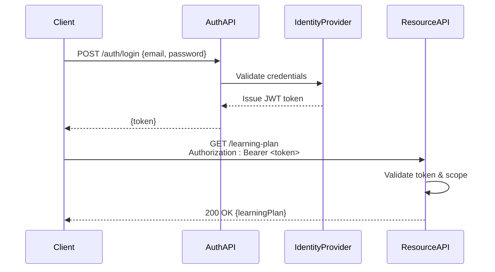

# Backend API Contracts

<cite>
**Referenced Files in This Document**   
- [NOVE项目书.md](file://NOVE项目书.md)
- [完整方案构思.md](file://完整方案构思.md)
- [实施路线图.md](file://实施路线图.md)
- [技术框架方案探讨.md](file://技术框架方案探讨.md)
- [项目介绍.md](file://项目介绍.md)
</cite>

## Table of Contents
1. [Introduction](#introduction)
2. [API Overview](#api-overview)
3. [Authentication and Security](#authentication-and-security)
4. [User Management](#user-management)
5. [Learning Plan Retrieval](#learning-plan-retrieval)
6. [Knowledge Search and RAG Queries](#knowledge-search-and-rag-queries)
7. [Report Generation](#report-generation)
8. [Request and Response Formats](#request-and-response-formats)
9. [Error Handling](#error-handling)
10. [Versioning and Backward Compatibility](#versioning-and-backward-compatibility)
11. [SDK Generation and Integration](#sdk-generation-and-integration)
12. [Security Best Practices](#security-best-practices)
13. [Appendices](#appendices)

## Introduction
The NOVE platform is designed to deliver personalized learning experiences through intelligent knowledge retrieval, adaptive learning paths, and data-driven reporting. This document defines the backend API contracts that enable core functionality across user management, learning orchestration, knowledge search, and analytics. The APIs are built on RESTful principles using OpenAPI 3.0 specifications to ensure clarity, consistency, and ease of integration for both internal microservices and third-party developers.

**Section sources**
- [项目介绍.md](file://项目介绍.md#L1-L20)
- [NOVE项目书.md](file://NOVE项目书.md#L1-L30)

## API Overview
The NOVE backend exposes a set of stateless, resource-oriented REST APIs over HTTPS. Endpoints are organized around key domains: users, learning plans, knowledge base, search, and reports. All requests must include proper authentication via Bearer tokens. The base URL for the production environment is `https://api.nove.lulab.io/v1`, with versioning included in the path.

Core capabilities include:
- User registration, profile management, and role-based access control
- Dynamic retrieval of personalized learning paths based on user progress and goals
- Semantic knowledge search using Retrieval-Augmented Generation (RAG)
- On-demand generation of learning progress and competency reports

**Section sources**
- [完整方案构思.md](file://完整方案构思.md#L15-L40)
- [技术框架方案探讨.md](file://技术框架方案探讨.md#L10-L35)

## Authentication and Security
All API endpoints require authentication using Bearer tokens issued by the NOVE identity provider. Clients must include the `Authorization: Bearer <token>` header in every request. Tokens are JWT-based and contain user identity, roles, and expiration timestamps.

Access control is enforced at the service layer using role-based policies. Supported roles include `learner`, `instructor`, and `admin`, each with defined permissions per endpoint.



**Diagram sources**
- [完整方案构思.md](file://完整方案构思.md#L45-L60)
- [技术框架方案探讨.md](file://技术框架方案探讨.md#L40-L55)

**Section sources**
- [完整方案构思.md](file://完整方案构思.md#L40-L70)
- [技术框架方案探讨.md](file://技术框架方案探讨.md#L35-L60)

## User Management
User management APIs allow creation, retrieval, update, and deletion of user accounts. These endpoints support profile customization, preference settings, and role assignment.

### Endpoints
| Method | Endpoint | Description |
|--------|--------|-------------|
| POST | `/users` | Create a new user |
| GET | `/users/{userId}` | Retrieve user profile |
| PUT | `/users/{userId}` | Update user profile |
| DELETE | `/users/{userId}` | Delete user account |

Request and response payloads follow a standardized JSON schema including fields such as `userId`, `email`, `name`, `preferences`, and `role`.

**Section sources**
- [NOVE项目书.md](file://NOVE项目书.md#L35-L50)
- [完整方案构思.md](file://完整方案构思.md#L75-L90)

## Learning Plan Retrieval
The learning plan API delivers personalized educational pathways based on user goals, prior knowledge, and learning pace. Plans are dynamically generated using adaptive algorithms and can be retrieved or updated as users progress.

### Endpoints
| Method | Endpoint | Description |
|--------|--------|-------------|
| GET | `/learning-plan` | Get current learning plan for authenticated user |
| GET | `/learning-plan/{planId}` | Retrieve specific saved plan |
| POST | `/learning-plan/generate` | Trigger regeneration of learning path |

A sample response includes modules, recommended resources, estimated durations, and milestone checkpoints.

**Section sources**
- [完整方案构思.md](file://完整方案构思.md#L95-L115)
- [实施路线图.md](file://实施路线图.md#L20-L35)

## Knowledge Search and RAG Queries
The knowledge search API enables semantic querying of the NOVE knowledge base using Retrieval-Augmented Generation (RAG). Users can submit natural language questions and receive contextually relevant, synthesized responses.

### Endpoints
| Method | Endpoint | Description |
|--------|--------|-------------|
| POST | `/search/knowledge` | Execute RAG-based knowledge query |

#### Request Payload Example
```json
{
  "query": "Explain the concept of attention mechanisms in transformers",
  "context": {
    "userId": "usr_123",
    "learningDomain": "deep_learning"
  },
  "options": {
    "includeSources": true,
    "responseLength": "medium"
  }
}
```

#### Response Example
```json
{
  "answer": "Attention mechanisms allow models to focus on relevant parts of input sequences...",
  "sources": [
    { "title": "Attention Is All You Need", "url": "https://arxiv.org/abs/1706.03762" }
  ],
  "queryId": "q_789"
}
```

**Section sources**
- [完整方案构思.md](file://完整方案构思.md#L120-L150)
- [技术框架方案探讨.md](file://技术框架方案探讨.md#L60-L80)

## Report Generation
The report generation API produces structured summaries of user learning activity, competency assessments, and progress analytics.

### Endpoints
| Method | Endpoint | Description |
|--------|--------|-------------|
| GET | `/reports/progress` | Generate user progress report |
| GET | `/reports/competency` | Retrieve competency assessment |
| POST | `/reports/custom` | Generate report with custom filters |

Reports are returned in JSON format and can be converted to PDF or CSV by client applications.

**Section sources**
- [NOVE项目书.md](file://NOVE项目书.md#L55-L70)
- [实施路线图.md](file://实施路线图.md#L40-L55)

## Request and Response Formats
All API requests and responses use JSON format with consistent structure:

### Standard Request Format
```json
{
  "data": { /* resource-specific payload */ },
  "meta": { /* optional context, pagination, etc. */ }
}
```

### Standard Response Format
```json
{
  "data": { /* result object or array */ },
  "meta": {
    "requestId": "req_123",
    "timestamp": "2023-08-01T12:00:00Z"
  }
}
```

HTTP status codes indicate operation outcomes (2xx for success, 4xx for client errors, 5xx for server errors).

**Section sources**
- [技术框架方案探讨.md](file://技术框架方案探讨.md#L85-L100)

## Error Handling
The API returns standardized error responses in the following format:

```json
{
  "error": {
    "code": "VALIDATION_ERROR",
    "message": "Email address is invalid",
    "details": [
      { "field": "email", "issue": "invalid_format" }
    ]
  }
}
```

Common error codes include:
- `UNAUTHORIZED (401)`: Missing or invalid authentication token
- `FORBIDDEN (403)`: Insufficient permissions
- `NOT_FOUND (404)`: Resource does not exist
- `VALIDATION_ERROR (422)`: Request data failed validation
- `RATE_LIMITED (429)`: Too many requests
- `INTERNAL_ERROR (500)`: Server-side failure

**Section sources**
- [技术框架方案探讨.md](file://技术框架方案探讨.md#L105-L125)

## Versioning and Backward Compatibility
The API follows semantic versioning with version identifiers in the URL path (e.g., `/v1/users`). 

### Versioning Strategy
- Major versions (`v1`, `v2`) for breaking changes
- Minor versions for backward-compatible additions
- Patch versions for bug fixes

Deprecated endpoints are maintained for at least six months with `Sunset` headers indicating retirement dates. Clients are encouraged to migrate using version-specific SDKs.

**Section sources**
- [实施路线图.md](file://实施路线图.md#L60-L80)

## SDK Generation and Integration
Software Development Kits (SDKs) are automatically generated from the OpenAPI 3.0 specification using OpenAPI Generator. Supported languages include JavaScript, Python, Java, and Swift.

### SDK Features
- Type-safe client classes for all endpoints
- Built-in authentication helpers
- Error handling wrappers
- Async/await support
- TypeScript definitions for frontend integration

Internal microservices consume the API through language-specific clients, while third-party integrators can download pre-built SDKs or generate custom ones from the published OpenAPI spec.

**Section sources**
- [技术框架方案探讨.md](file://技术框架方案探讨.md#L130-L150)

## Security Best Practices
The API enforces robust security measures:

### Input Validation
All inputs are validated against JSON Schema definitions. Sanitization is applied to prevent injection attacks.

### CORS Policies
Cross-Origin Resource Sharing is restricted to authorized domains. Wildcard origins are prohibited.

### Rate Limiting
Requests are rate-limited per user and IP address using a sliding window algorithm. Default limits: 100 requests/minute per user.

### Data Protection
Sensitive data is encrypted in transit (TLS 1.3) and at rest. Logs exclude personally identifiable information.

**Section sources**
- [技术框架方案探讨.md](file://技术框架方案探讨.md#L155-L180)

## Appendices
### Appendix A: OpenAPI Specification
The complete OpenAPI 3.0 YAML specification is available at:  
`https://api.nove.lulab.io/spec/v1/openapi.yaml`

### Appendix B: Authentication Flow
Detailed OAuth 2.0 authorization code flow with PKCE for web and mobile clients.

### Appendix C: Example Integrations
Code samples for integrating with React, Flutter, and Python Django applications.