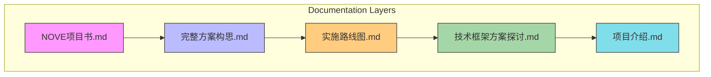
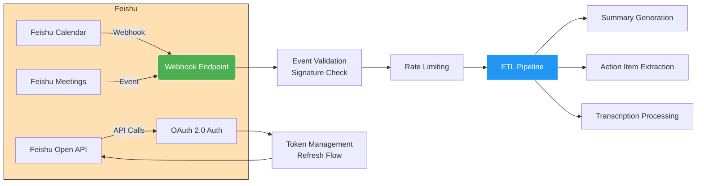
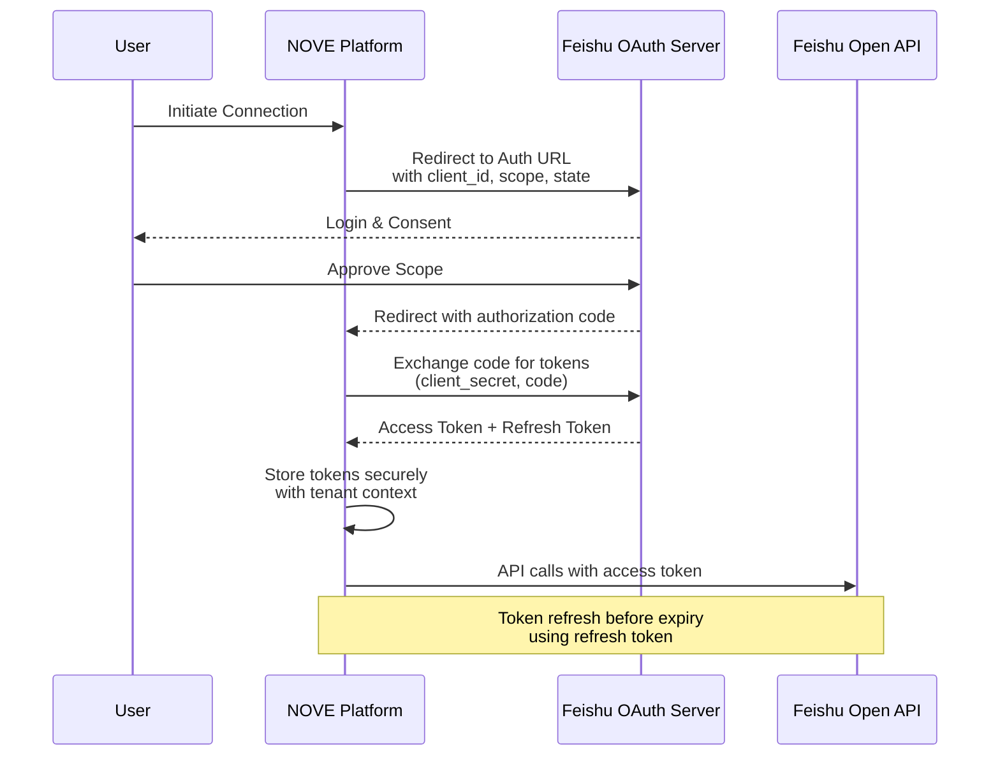
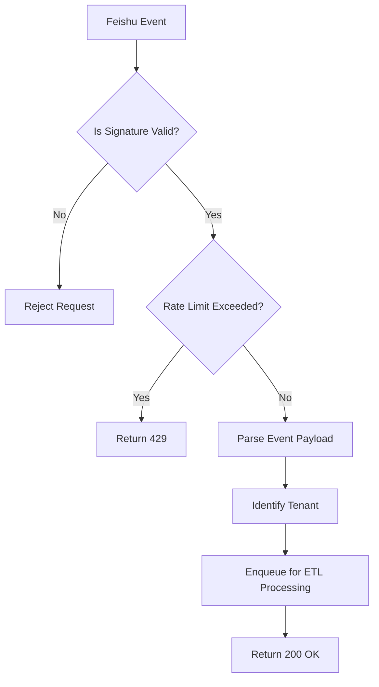
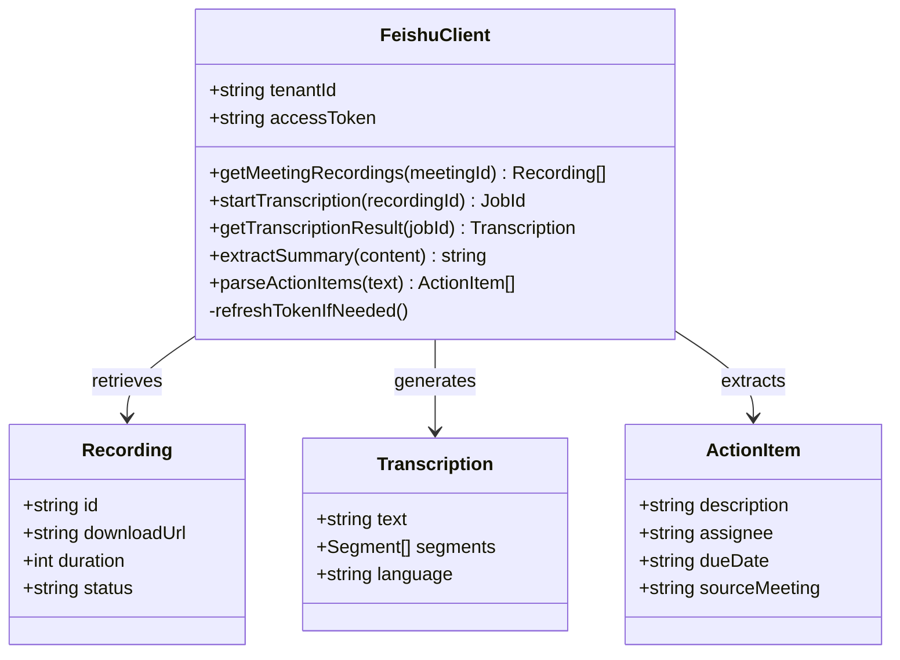
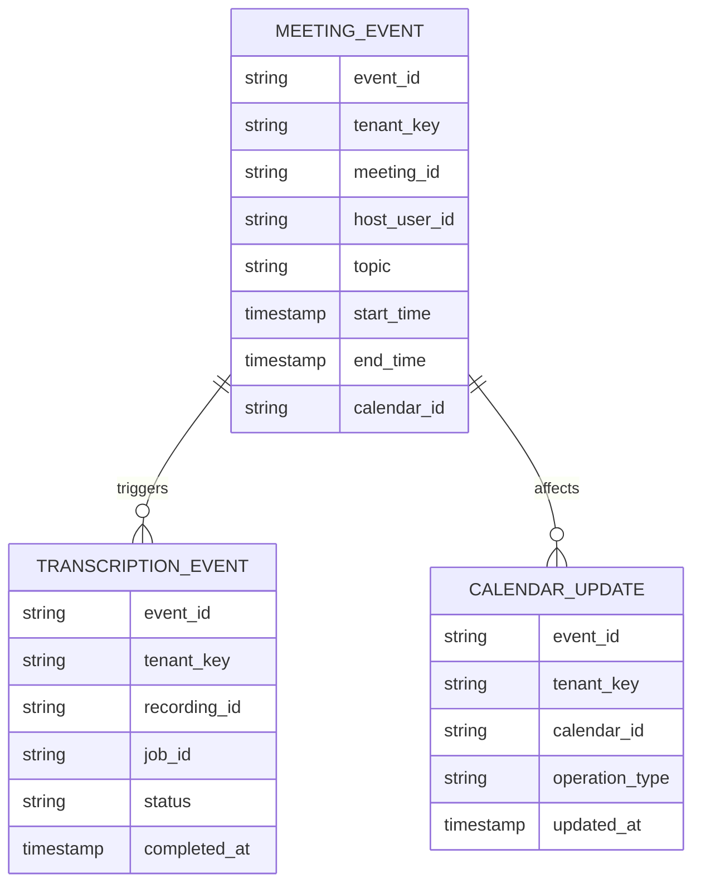
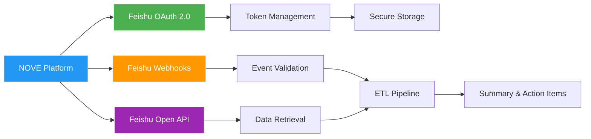

# Feishu Integration

<cite>
**Referenced Files in This Document**  
- [NOVE项目书.md](file://NOVE项目书.md)  
- [完整方案构思.md](file://完整方案构思.md)  
- [实施路线图.md](file://实施路线图.md)  
- [技术框架方案探讨.md](file://技术框架方案探讨.md)  
- [项目介绍.md](file://项目介绍.md)  
</cite>

## Table of Contents
1. [Introduction](#introduction)
2. [Project Structure](#project-structure)
3. [Core Components](#core-components)
4. [Architecture Overview](#architecture-overview)
5. [Detailed Component Analysis](#detailed-component-analysis)
6. [Dependency Analysis](#dependency-analysis)
7. [Performance Considerations](#performance-considerations)
8. [Troubleshooting Guide](#troubleshooting-guide)
9. [Conclusion](#conclusion)

## Introduction
This document provides architectural documentation for the Feishu integration within the NOVE platform. It details the implementation of OAuth 2.0 authentication, Webhook event subscription, and utilization of the Feishu Open API to support meeting recording retrieval, summary generation, and action item extraction. The document also covers security mechanisms such as signature verification, rate limiting, error handling, tenant isolation, and permission-aware data access. The integration enables real-time processing of meeting events and transcription triggers through an ETL pipeline, ensuring scalable and secure data handling across multiple tenants.

## Project Structure
The NOVE platform's Feishu integration is organized around high-level design documents that define the system's architecture, implementation roadmap, and technical specifications. The project structure is documentation-driven, with key files outlining the project vision, technical approach, and execution plan.

**Diagram sources**  
- [NOVE项目书.md](file://NOVE项目书.md)  
- [完整方案构思.md](file://完整方案构思.md)  
- [实施路线图.md](file://实施路线图.md)  
- [技术框架方案探讨.md](file://技术框架方案探讨.md)  
- [项目介绍.md](file://项目介绍.md)

**Section sources**  
- [NOVE项目书.md](file://NOVE项目书.md)  
- [完整方案构思.md](file://完整方案构思.md)  
- [实施路线图.md](file://实施路线图.md)

## Core Components
The Feishu integration relies on several core components defined in the project documentation: authentication flow design, event subscription model, API interaction patterns, and data processing pipeline. These components are specified in high-level design documents that describe the intended behavior and integration points with Feishu services.

**Section sources**  
- [NOVE项目书.md](file://NOVE项目书.md)  
- [技术框架方案探讨.md](file://技术框架方案探讨.md)  
- [完整方案构思.md](file://完整方案构思.md)

## Architecture Overview
The integration architecture follows a modular, event-driven design where Feishu acts as an external event source and API provider. The NOVE platform consumes events via Webhooks, authenticates using OAuth 2.0, and retrieves enriched data (recordings, transcripts) via the Feishu Open API. Processed data flows into an ETL pipeline for summarization and action item extraction.

**Diagram sources**  
- [技术框架方案探讨.md](file://技术框架方案探讨.md)  
- [完整方案构思.md](file://完整方案构思.md)  
- [实施路线图.md](file://实施路线图.md)

## Detailed Component Analysis

### OAuth 2.0 Authentication Flow
The Feishu integration implements OAuth 2.0 for secure user authorization. The flow includes token acquisition through authorization code grant, secure storage of access and refresh tokens, and automatic token refresh before expiration. Scope management ensures minimal permissions are requested, aligned with tenant-specific access policies.

**Diagram sources**  
- [技术框架方案探讨.md](file://技术框架方案探讨.md)  
- [完整方案构思.md](file://完整方案构思.md)

**Section sources**  
- [技术框架方案探讨.md](file://技术框架方案探讨.md#L1-L50)  
- [完整方案构思.md](file://完整方案构思.md#L20-L70)

### Webhook Event Subscription
The platform subscribes to Feishu Webhooks to receive real-time notifications for meeting creation, calendar updates, and transcription completion events. Each subscription is validated using signature verification to ensure authenticity. Events are queued for asynchronous processing to maintain responsiveness.

**Diagram sources**  
- [完整方案构思.md](file://完整方案构思.md)  
- [实施路线图.md](file://实施路线图.md)

**Section sources**  
- [完整方案构思.md](file://完整方案构思.md#L70-L120)  
- [实施路线图.md](file://实施路线图.md#L10-L40)

### Feishu Open API Usage
The integration uses the Feishu Open API to retrieve meeting recordings, initiate transcription jobs, and extract structured data such as summaries and action items. API calls are scoped per tenant, and responses are processed in the ETL pipeline for downstream use.

**Diagram sources**  
- [技术框架方案探讨.md](file://技术框架方案探讨.md)  
- [完整方案构思.md](file://完整方案构思.md)

**Section sources**  
- [技术框架方案探讨.md](file://技术框架方案探讨.md#L30-L80)  
- [完整方案构思.md](file://完整方案构思.md#L100-L150)

### Event Payload Processing
Common event payloads from Feishu include meeting creation, calendar updates, and transcription completion. These payloads are processed in the ETL pipeline to extract relevant metadata, validate tenant context, and trigger downstream workflows.

**Diagram sources**  
- [完整方案构思.md](file://完整方案构思.md)  
- [技术框架方案探讨.md](file://技术框架方案探讨.md)

**Section sources**  
- [完整方案构思.md](file://完整方案构思.md#L150-L200)  
- [技术框架方案探讨.md](file://技术框架方案探讨.md#L50-L100)

## Dependency Analysis
The Feishu integration depends on external Feishu services for authentication, event delivery, and API access. Internal dependencies are defined through documentation rather than code, with design decisions captured in markdown files. There are no direct code-level dependencies visible in the current file structure.

**Diagram sources**  
- [技术框架方案探讨.md](file://技术框架方案探讨.md)  
- [完整方案构思.md](file://完整方案构思.md)  
- [实施路线图.md](file://实施路线图.md)

**Section sources**  
- [技术框架方案探讨.md](file://技术框架方案探讨.md#L1-L30)  
- [实施路线图.md](file://实施路线图.md#L1-L20)

## Performance Considerations
While the current documentation does not specify performance metrics, the architecture supports asynchronous event processing, rate limiting, and token caching to optimize API usage and reduce latency. The ETL pipeline is designed to scale with tenant load, and signature verification is implemented efficiently to avoid bottlenecks.

## Troubleshooting Guide
Error handling strategies include retry mechanisms for transient API failures, structured logging of webhook validation failures, and monitoring of token refresh cycles. Tenant isolation ensures that errors in one tenant do not affect others. Signature mismatches and rate limit responses are logged for audit and debugging.

**Section sources**  
- [完整方案构思.md](file://完整方案构思.md#L200-L250)  
- [技术框架方案探讨.md](file://技术框架方案探讨.md#L100-L150)

## Conclusion
The Feishu integration in the NOVE platform is designed with security, scalability, and real-time event processing in mind. By leveraging OAuth 2.0, Webhooks, and the Feishu Open API, the system enables automated meeting analysis, transcription, and action item extraction. The documentation-driven approach ensures clarity in design and implementation, with strong emphasis on tenant isolation, permission-aware access, and robust error handling.