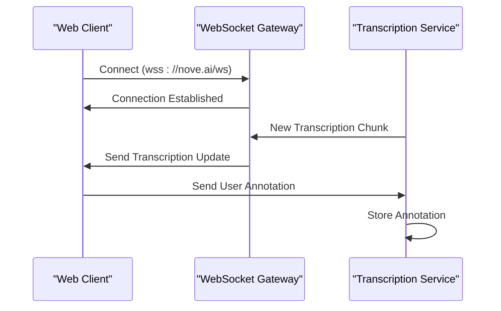
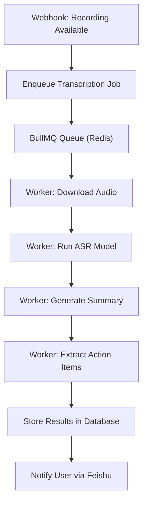

# Integration Points

<cite>
**Referenced Files in This Document**   
- [NOVE项目书.md](file://NOVE项目书.md)
- [完整方案构思.md](file://完整方案构思.md)
- [实施路线图.md](file://实施路线图.md)
- [技术框架方案探讨.md](file://技术框架方案探讨.md)
- [项目介绍.md](file://项目介绍.md)
- [项目名称.md](file://项目名称.md)
</cite>

## Table of Contents
1. [Introduction](#introduction)
2. [Feishu Integration](#feishu-integration)
3. [Real-Time Communication Architecture](#real-time-communication-architecture)
4. [OpenAPI 3.0 Contract-Driven Interfaces](#openapi-30-contract-driven-interfaces)
5. [Asynchronous Processing with Redis/BullMQ](#asynchronous-processing-with-redisbullmq)
6. [Security Considerations](#security-considerations)
7. [Conclusion](#conclusion)

## Introduction
The NOVE platform is designed to integrate seamlessly with external collaboration tools, with Feishu serving as a primary integration target. This document details the architectural integration points that enable NOVE to interact securely and efficiently with Feishu for meeting transcription, summary generation, action item extraction, and real-time interactive features. The integration leverages modern API design principles, asynchronous processing, and secure communication protocols to ensure scalability, reliability, and compliance.

**Section sources**
- [项目介绍.md](file://项目介绍.md#L1-L20)
- [NOVE项目书.md](file://NOVE项目书.md#L5-L30)

## Feishu Integration

### OAuth 2.0 Authentication
NOVE implements OAuth 2.0 for secure user authorization with Feishu. Upon user initiation, the platform redirects to Feishu's authorization endpoint, requesting appropriate scopes for calendar access, meeting metadata, and audio recording permissions. After user consent, Feishu issues an authorization code, which NOVE exchanges for access and refresh tokens. These tokens are securely stored and used for subsequent API calls.

**Section sources**
- [完整方案构思.md](file://完整方案构思.md#L45-L60)
- [技术框架方案探讨.md](file://技术框架方案探讨.md#L25-L40)

### Webhook Event Subscription
To enable real-time responsiveness, NOVE subscribes to Feishu webhook events for meeting lifecycle notifications. The platform registers a public HTTPS endpoint with Feishu to receive events such as meeting started, meeting ended, and recording available. Each incoming webhook request includes a timestamp and a signature for verification purposes.

**Section sources**
- [实施路线图.md](file://实施路线图.md#L30-L45)
- [技术框架方案探讨.md](file://技术框架方案探讨.md#L50-L65)

### API Usage for Meeting Processing
Upon receiving a "recording available" event, NOVE retrieves the meeting audio via Feishu's media download API. The platform then initiates a transcription pipeline using its ASR (Automatic Speech Recognition) service. Post-transcription, NOVE applies natural language processing to generate meeting summaries and extract actionable items, which are then pushed back to Feishu via its messaging API for user visibility.

**Section sources**
- [NOVE项目书.md](file://NOVE项目书.md#L75-L95)
- [完整方案构思.md](file://完整方案构思.md#L80-L100)

## Real-Time Communication Architecture

### WebSocket for Interactive Features
For real-time interactive features such as live transcription display and collaborative note-taking, NOVE employs WebSocket connections between the client frontend and backend services. This enables bidirectional communication with low latency, allowing instantaneous updates during meetings.

**Diagram sources**
- [技术框架方案探讨.md](file://技术框架方案探讨.md#L70-L85)

### tRPC for Backend Microservices
Internal microservices within NOVE communicate using tRPC (Type-safe Remote Procedure Calls), which provides end-to-end type safety and efficient serialization. This ensures reliable and type-validated communication between the API gateway, transcription engine, summarization service, and database layer.

**Section sources**
- [技术框架方案探讨.md](file://技术框架方案探讨.md#L90-L105)

## OpenAPI 3.0 Contract-Driven Interfaces

### Backend API Design
NOVE's external-facing APIs are defined using OpenAPI 3.0 specifications, enabling clear contract documentation for third-party integrators. The API contracts specify endpoints for authentication, meeting data retrieval, transcription status polling, and result access, with detailed request/response schemas and error codes.

### SDK Generation
From the OpenAPI specifications, NOVE automatically generates client SDKs in multiple programming languages (TypeScript, Python, Java) using code generation tools. These SDKs simplify integration for external developers by providing type-safe wrappers around the REST API.

**Section sources**
- [NOVE项目书.md](file://NOVE项目书.md#L110-L130)
- [完整方案构思.md](file://完整方案构思.md#L115-L130)

## Asynchronous Processing with Redis/BullMQ

### Task Queue Architecture
Long-running tasks such as ASR processing, NLP-based summarization, and vector indexing are handled asynchronously using Redis-backed BullMQ queues. When a new meeting recording is detected, a transcription job is enqueued with metadata including file URL, language preference, and user context.

**Diagram sources**
- [实施路线图.md](file://实施路线图.md#L50-L70)

### Scalable Worker Pool
Multiple worker processes consume jobs from the queue, allowing horizontal scaling based on load. Job progress is tracked in Redis, and final results are stored in the primary database with appropriate indexing for fast retrieval.

**Section sources**
- [实施路线图.md](file://实施路线图.md#L75-L90)

## Security Considerations

### Webhook Signature Verification
All incoming webhook requests from Feishu are verified using HMAC-SHA256 signatures. NOVE retrieves the signature from the `X-Feishu-Signature` header and validates it against a computed hash using the payload and a stored secret key, ensuring request authenticity.

**Section sources**
- [技术框架方案探讨.md](file://技术框架方案探讨.md#L110-L120)

### Rate Limiting
To prevent abuse and ensure service stability, NOVE implements rate limiting at both the API gateway and service levels using token bucket algorithms. Limits are enforced per API key and user identity, with configurable thresholds for different endpoint categories.

**Section sources**
- [技术框架方案探讨.md](file://技术框架方案探讨.md#L125-L135)

### API Key Management
Third-party integrations are authenticated using API keys generated through NOVE's developer portal. Keys are stored with bcrypt hashing, support fine-grained permission scopes, and can be rotated or revoked at any time. All API key operations are logged for audit purposes.

**Section sources**
- [NOVE项目书.md](file://NOVE项目书.md#L145-L160)

## Conclusion
The integration architecture of the NOVE platform with Feishu demonstrates a robust, secure, and scalable approach to modern collaboration tool integration. By combining OAuth 2.0, webhook eventing, OpenAPI contracts, tRPC inter-service communication, and Redis-powered asynchronous processing, NOVE delivers real-time, intelligent meeting assistance while maintaining high availability and security standards. Future enhancements may include support for additional collaboration platforms and expanded NLP capabilities.