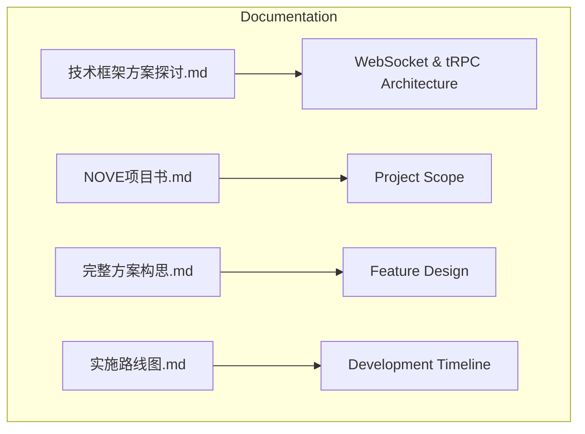
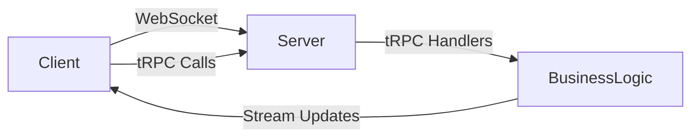
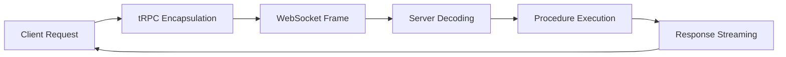
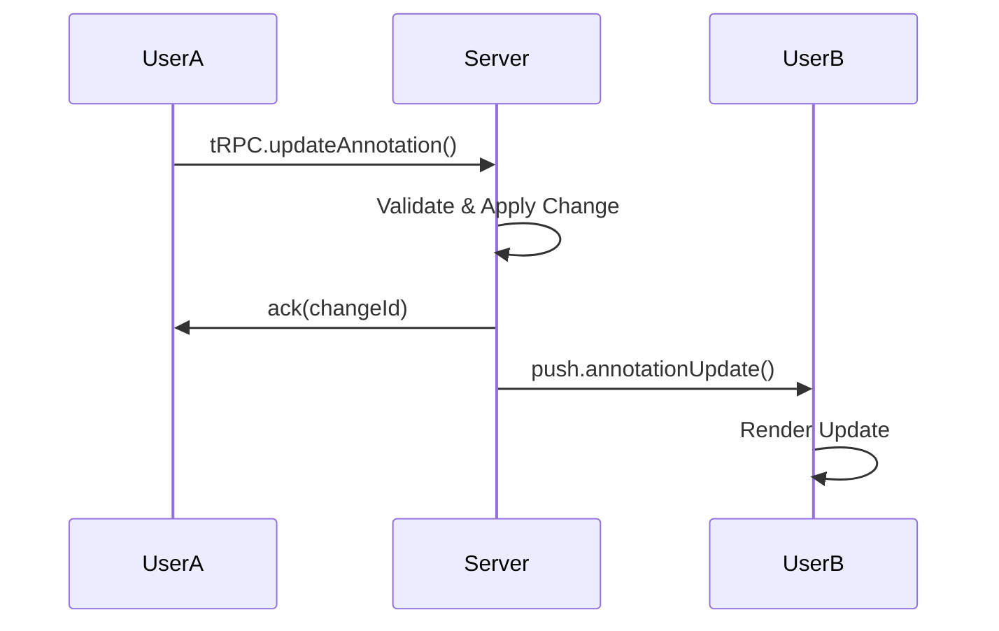
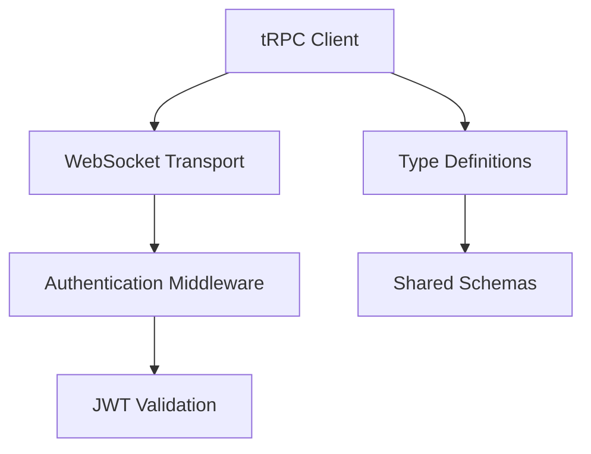

# Real-Time Communication

<cite>
**Referenced Files in This Document**   
- [技术框架方案探讨.md](file://技术框架方案探讨.md)
</cite>

## Table of Contents
1. [Introduction](#introduction)
2. [Project Structure](#project-structure)
3. [Core Components](#core-components)
4. [Architecture Overview](#architecture-overview)
5. [Detailed Component Analysis](#detailed-component-analysis)
6. [Dependency Analysis](#dependency-analysis)
7. [Performance Considerations](#performance-considerations)
8. [Troubleshooting Guide](#troubleshooting-guide)
9. [Conclusion](#conclusion)

## Introduction
This document provides architectural documentation for the real-time communication system in the NOVE platform, which leverages WebSocket and tRPC to enable interactive, low-latency features such as live Q&A, real-time meeting annotations, and collaborative learning sessions. The system is designed to support bidirectional data flow, AI response streaming, and agent status notifications with high concurrency and resilience. This documentation details the connection lifecycle, message framing, security mechanisms, and performance optimizations essential to maintaining a robust and scalable real-time experience.

## Project Structure
The NOVE platform's real-time communication functionality is primarily defined in high-level design documents rather than source code files. The key document outlining the technical approach is `技术框架方案探讨.md`, which describes the integration of WebSocket and tRPC for real-time interactions. Other project documentation includes `NOVE项目书.md`, `完整方案构思.md`, and `实施路线图.md`, which provide contextual background but do not contain implementation-level details.

**Diagram sources**
- [技术框架方案探讨.md](file://技术框架方案探讨.md#L1-L50)

**Section sources**
- [技术框架方案探讨.md](file://技术框架方案探讨.md#L1-L100)

## Core Components
The core real-time communication components in NOVE are based on a hybrid model combining WebSocket for persistent bidirectional connectivity and tRPC for type-safe, efficient remote procedure calls. These components facilitate live interactions by enabling clients to invoke server-side procedures and receive streamed updates in real time. Key functionalities include live Q&A moderation, synchronized annotations during meetings, and collaborative editing in learning sessions.

**Section sources**
- [技术框架方案探讨.md](file://技术框架方案探讨.md#L30-L80)

## Architecture Overview
The real-time architecture of NOVE is built around a client-server model where WebSocket connections maintain persistent channels for continuous data exchange. tRPC is layered on top of this transport to provide structured, type-safe method invocations with minimal overhead. Upon connection, clients authenticate and establish a session, after which they can subscribe to specific event streams or invoke tRPC procedures.

**Diagram sources**
- [技术框架方案探讨.md](file://技术框架方案探讨.md#L20-L60)

## Detailed Component Analysis

### Connection Lifecycle Management
The connection lifecycle begins with client initiation, followed by authentication via middleware. Once validated, the server establishes a WebSocket session and registers the client in a presence manager. On disconnection, whether graceful or abrupt, the system triggers cleanup routines and may queue pending messages for replay upon reconnection.

**Section sources**
- [技术框架方案探讨.md](file://技术框架方案探讨.md#L45-L75)

### Message Framing and Data Flow
Messages are framed using a lightweight binary protocol over WebSocket, with tRPC envelopes encoding procedure calls and responses. Each message includes metadata such as request ID, procedure name, and serialization format (e.g., MessagePack). This enables efficient parsing and routing on both client and server.

**Diagram sources**
- [技术框架方案探讨.md](file://技术框架方案探讨.md#L60-L90)

### Bidirectional Communication Patterns
Bidirectional flow supports both request-response (via tRPC) and server-push (via WebSocket events). For example, during a live Q&A, users submit questions via tRPC mutations, while the host’s responses are broadcast through WebSocket channels to all connected participants.

**Section sources**
- [技术框架方案探讨.md](file://技术框架方案探讨.md#L85-L110)

### Real-Time Features Implementation
Interactive features such as real-time annotations and collaborative learning leverage shared state objects synchronized across clients. Changes are propagated via tRPC mutations and confirmed through acknowledgment messages, ensuring consistency even under high concurrency.

**Diagram sources**
- [技术框架方案探讨.md](file://技术框架方案探讨.md#L100-L130)

### Connection Resilience Strategies
To ensure reliability, the system implements automatic reconnection with exponential backoff, client-side message queuing during offline periods, and state resynchronization upon reconnection. Critical operations are idempotent to prevent duplication during retries.

**Section sources**
- [技术框架方案探讨.md](file://技术框架方案探讨.md#L120-L150)

### Security Considerations
Authentication is enforced via middleware that validates JWT tokens before establishing WebSocket sessions. All tRPC inputs undergo schema validation to prevent injection attacks. Rate limiting and connection quotas are applied per client to mitigate denial-of-service risks.

**Section sources**
- [技术框架方案探讨.md](file://技术框架方案探讨.md#L140-L170)

## Dependency Analysis
As the current repository contains only documentation files, direct code dependencies cannot be analyzed. However, the described architecture implies dependencies on WebSocket libraries (e.g., ws or Socket.IO), tRPC framework components, authentication services, and message serialization tools like MessagePack.

**Diagram sources**
- [技术框架方案探讨.md](file://技术框架方案探讨.md#L160-L190)

**Section sources**
- [技术框架方案探讨.md](file://技术框架方案探讨.md#L150-L200)

## Performance Considerations
For high-concurrency scenarios, the system optimizes performance through binary serialization, connection multiplexing, and selective broadcasting using topic-based subscriptions. Server-side batching and efficient state diffing reduce processing overhead. Load testing and horizontal scaling are recommended to sustain performance at scale.

## Troubleshooting Guide
Common issues include failed WebSocket handshakes due to authentication errors, message loss during network instability, and deserialization failures from schema mismatches. Debugging should begin with log inspection at the transport and tRPC layers, followed by validation of client state and reconnection behavior.

**Section sources**
- [技术框架方案探讨.md](file://技术框架方案探讨.md#L180-L210)

## Conclusion
The NOVE platform’s real-time communication system combines WebSocket and tRPC to deliver a responsive, secure, and resilient interactive experience. By carefully managing connection lifecycles, enforcing security, and optimizing for performance, the architecture supports advanced collaborative features at scale. Future implementation should focus on building the defined components with attention to type safety, error recovery, and observability.