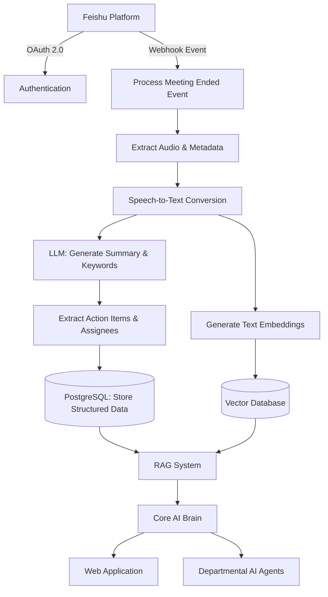
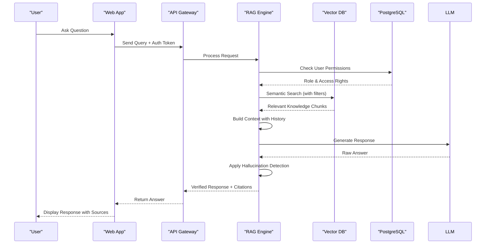
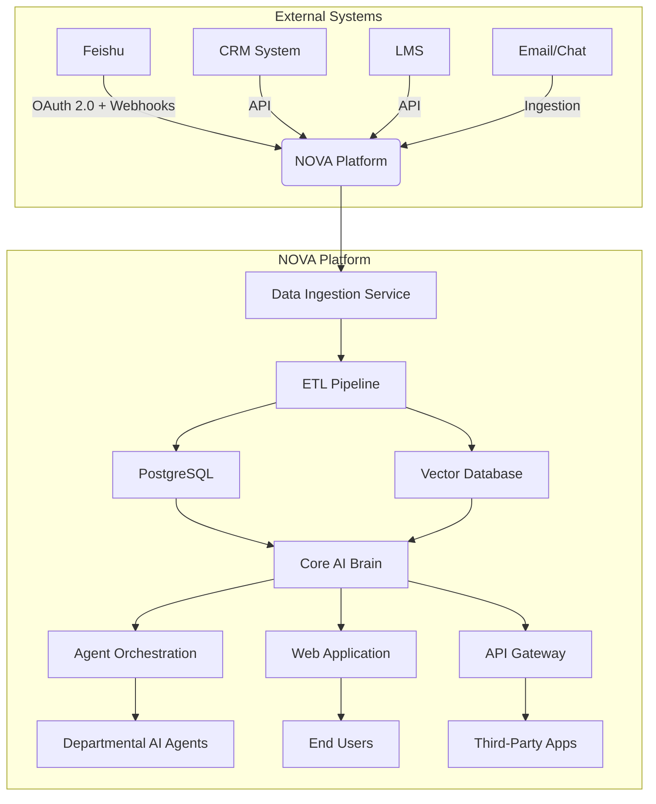

# Technical Architecture

<cite>
**Referenced Files in This Document**  
- [NOVE项目书.md](file://NOVE项目书.md)
- [技术框架方案探讨.md](file://技术框架方案探讨.md)
- [完整方案构思.md](file://完整方案构思.md)
- [实施路线图.md](file://实施路线图.md)
</cite>

## Table of Contents
1. [Introduction](#introduction)
2. [Four-Layer System Architecture](#four-layer-system-architecture)
3. [Data Flow and Integration](#data-flow-and-integration)
4. [Core Architectural Patterns](#core-architectural-patterns)
5. [Technology Stack and Infrastructure](#technology-stack-and-infrastructure)
6. [Cross-Cutting Concerns](#cross-cutting-concerns)
7. [System Context and Integration Touchpoints](#system-context-and-integration-touchpoints)
8. [Scalability and Performance Expectations](#scalability-and-performance-expectations)
9. [Conclusion](#conclusion)

## Introduction
The NOVE platform is an AI-powered educational intelligence system designed to transform unstructured knowledge and meeting data into actionable insights and intelligent services. Built around the concept of a "Core AI Brain," the platform enables organizations to automate knowledge capture, deliver personalized learning experiences, and empower departments with customizable AI agents. This document details the four-layer system architecture, component interactions, key design patterns, technology choices, and integration strategies that define the NOVE platform's technical foundation.

**Section sources**
- [NOVE项目书.md](file://NOVE项目书.md#L1-L50)
- [完整方案构思.md](file://完整方案构思.md#L1-L30)

## Four-Layer System Architecture
The NOVE platform follows a clean, modular four-layer architecture that ensures separation of concerns, scalability, and maintainability. Each layer has well-defined responsibilities and interfaces, enabling independent evolution and technology substitution.

### Data Source Layer
This layer represents the origin of all data consumed by the system. It includes both structured and unstructured data sources across internal and external systems.

**Key Responsibilities**:
- **Data Ingestion**: Real-time and batch collection from diverse sources
- **Authentication & Authorization**: Secure access via OAuth 2.0
- **Event Subscription**: Webhook-based event listening for real-time triggers
- **Data Normalization**: Initial formatting and metadata tagging

**Supported Data Sources**:
- **Meeting Platforms**: Feishu Meetings (audio, transcripts, participants)
- **Document Systems**: Feishu Docs, Confluence, shared PPT/PDFs
- **Business Applications**: CRM, LMS, ERP via API integration
- **Manual Uploads**: Support for Excel, PDF, and other file types

**Section sources**
- [NOVE项目书.md](file://NOVE项目书.md#L150-L170)
- [完整方案构思.md](file://完整方案构思.md#L40-L60)

### Data & Index Layer
This layer processes raw data into structured, searchable, and analyzable formats. It serves as the foundation for AI-driven capabilities.

**Key Components**:
- **ETL Pipelines**: Extract, Transform, Load workflows for data cleaning, de-duplication, anonymization, and segmentation
- **Relational Database**: PostgreSQL with Prisma ORM for storing structured metadata, user roles, permissions, action items, and audit logs
- **Vector Database**: Pinecone (initial) → Weaviate/Milvus (long-term) for semantic search and retrieval-augmented generation (RAG)
- **Version & Provenance Management**: Track document versions and data lineage for traceability

**Processing Workflow**:
1. Raw data ingestion from source systems
2. ASR (Automatic Speech Recognition) for audio content
3. LLM-driven summarization, keyword extraction, and task identification
4. Embedding generation using text2vec models
5. Storage in both relational and vector databases with metadata tagging

**Section sources**
- [NOVE项目书.md](file://NOVE项目书.md#L170-L200)
- [技术框架方案探讨.md](file://技术框架方案探讨.md#L100-L120)

### Capability & Middleware Layer
This is the core intelligence layer where AI models, business logic, and orchestration services reside. It acts as the "Central AI Brain" of the platform.

**Core Services**:
- **Core AI Brain**: Unified engine for query understanding, context-aware reasoning, and response generation using RAG
- **Agent Orchestration Engine**: Low-code platform for creating department-specific AI agents (e.g., Teaching Assistant, Admin Agent)
- **Intelligent Recommendation System**: Personalized content and path suggestions using collaborative filtering and knowledge graphs
- **Real-Time Processing**: WebSocket and tRPC services for live interactions
- **Task Scheduling**: Asynchronous job queues (BullMQ/Celery) for long-running operations like transcription and indexing

**Architectural Principles**:
- **Modular Design**: Services are loosely coupled and independently deployable
- **Event-Driven Architecture**: Components communicate via events (e.g., "meeting-ended" triggers processing pipeline)
- **Hybrid Decision Making**: Combines AI inference with human-defined rules and approvals

**Section sources**
- [NOVE项目书.md](file://NOVE项目书.md#L200-L250)
- [完整方案构思.md](file://完整方案构思.md#L100-L150)

### Application & Experience Layer
This layer delivers user-facing applications and interfaces across multiple channels.

**Primary Applications**:
- **Web MVP**: Next.js-based web application with SSR, featuring:
  - Intelligent Q&A interface with citation tracing
  - Meeting summary dashboard
  - Action item tracking board
  - User profile and learning progress view
- **API Gateway**: OpenAPI 3.0-compliant RESTful APIs and tRPC endpoints for third-party integrations
- **Future Extensions**: Mobile apps, desktop clients, and hardware integrations

**User Experience Features**:
- Real-time streaming responses
- Multi-turn conversational memory
- Role-based UI customization
- Accessibility and responsive design

**Section sources**
- [NOVE项目书.md](file://NOVE项目书.md#L250-L270)
- [实施路线图.md](file://实施路线图.md#L1-L15)

## Data Flow and Integration
The NOVE platform implements a robust, end-to-end data flow that begins with external integrations and culminates in intelligent user experiences.

### Feishu Integration Workflow

**Diagram sources**
- [NOVE项目书.md](file://NOVE项目书.md#L270-L300)
- [完整方案构思.md](file://完整方案构思.md#L60-L80)

### RAG Processing Pipeline

**Diagram sources**
- [NOVE项目书.md](file://NOVE项目书.md#L300-L330)
- [技术框架方案探讨.md](file://技术框架方案探讨.md#L130-L150)

## Core Architectural Patterns
The NOVE platform leverages several proven architectural patterns to ensure flexibility, reliability, and performance.

### Event-Driven Processing
The system uses an event-driven model to decouple components and handle asynchronous workflows:
- Events: `meeting.ended`, `document.uploaded`, `index.updated`
- Message Brokers: Redis or RabbitMQ for task queuing
- Workers: BullMQ (Node.js) or Celery (Python) for background job processing
- Benefits: Improved scalability, fault tolerance, and responsiveness

### Modular and Extensible Design
- **Plugin Architecture**: AI agents can be extended with new data sources and capabilities
- **API-First Development**: All services expose well-documented OpenAPI contracts
- **Replaceable Components**: Vector database or LLM provider can be swapped without system-wide changes

### Hybrid AI-Human Decision Making
- **AI Suggestions**: LLM generates draft responses, reports, or tasks
- **Rule-Based Validation**: Business rules filter or modify AI output
- **Human-in-the-Loop**: Critical decisions require human approval before execution
- **Feedback Loop**: User corrections are used to improve future AI performance

**Section sources**
- [NOVE项目书.md](file://NOVE项目书.md#L330-L370)
- [完整方案构思.md](file://完整方案构思.md#L150-L180)

## Technology Stack and Infrastructure
The NOVE platform combines modern frameworks and cloud-native technologies to deliver a high-performance, maintainable system.

### Frontend
- **Framework**: Next.js (React) with Server-Side Rendering
- **Styling**: Tailwind CSS + shadcn/ui component library
- **State Management**: Zustand or Recoil
- **Real-Time**: WebSocket and tRPC for live updates

### Backend
- **Primary Framework**: NestJS (TypeScript) – recommended for full-stack consistency
- **Alternative**: FastAPI (Python) – if AI-heavy workloads require richer ecosystem
- **Database**: PostgreSQL + Prisma ORM for relational data
- **Vector DB**: Pinecone (initial), transitioning to Weaviate or Milvus
- **Caching**: Redis for session and query result caching

### AI & Data Processing
- **LLM Providers**: GPT-4, Claude, DeepSeek (multi-model strategy)
- **Embedding Models**: text-embedding-ada-002 or open-source alternatives
- **RAG Framework**: Custom implementation with LangChain.js or equivalent
- **Data Warehouse**: ClickHouse for analytics; Metabase/Superset for visualization

### Infrastructure
- **Containerization**: Docker
- **Orchestration**: Kubernetes (for microservices evolution)
- **CI/CD**: GitHub Actions or GitLab CI
- **Monitoring**: ELK Stack or Grafana for logs, metrics, and tracing

**Section sources**
- [技术框架方案探讨.md](file://技术框架方案探讨.md#L1-L159)
- [NOVE项目书.md](file://NOVE项目书.md#L400-L420)

## Cross-Cutting Concerns
The platform addresses critical non-functional requirements across all layers.

### Security
- **Authentication**: OAuth 2.0 with JWT tokens
- **Authorization**: RBAC + ABAC with fine-grained access control
- **Data Protection**: End-to-end TLS encryption, field-level encryption for sensitive data
- **Compliance**: Audit trails, data retention policies, GDPR/CCPA readiness

### Real-Time Communication
- **WebSocket**: For live Q&A, collaborative editing, and notifications
- **tRPC**: Type-safe remote procedure calls between frontend and backend
- **Event Streaming**: Server-Sent Events (SSE) for progress updates

### Observability
- **Logging**: Structured logging with correlation IDs
- **Monitoring**: Prometheus + Grafana for system health
- **Tracing**: Distributed tracing for request flow analysis
- **Alerting**: Slack/email alerts for errors and performance degradation

**Section sources**
- [NOVE项目书.md](file://NOVE项目书.md#L500-L550)
- [完整方案构思.md](file://完整方案构思.md#L180-L200)

## System Context and Integration Touchpoints

**Diagram sources**
- [NOVE项目书.md](file://NOVE项目书.md#L150-L270)
- [完整方案构思.md](file://完整方案构思.md#L40-L100)

## Scalability and Performance Expectations
The NOVE platform is designed to scale horizontally and meet demanding performance targets.

### Scalability Strategy
- **Stateless Services**: Backend services can be load-balanced and auto-scaled
- **Database Sharding**: Future support for sharded PostgreSQL clusters
- **Vector DB Clustering**: Weaviate/Milvus clusters for high-throughput queries
- **CDN Integration**: For static assets and cached responses

### Performance Targets (v1.0)
- **Response Time**: Average first byte < 2s, p99 < 5s
- **Availability**: ≥ 99.5% uptime
- **Concurrency**: Support 1,000+ concurrent users
- **Throughput**: > 500 QPS at peak
- **Data Freshness**: New content searchable within 24 hours

**Section sources**
- [NOVE项目书.md](file://NOVE项目书.md#L600-L630)

## Conclusion
The NOVE platform's four-layer architecture provides a robust, scalable foundation for building AI-powered educational intelligence systems. By clearly separating data sources, processing, capabilities, and user experiences, the system enables rapid iteration, secure data handling, and flexible deployment. The integration of Feishu and other enterprise systems through event-driven ETL pipelines, combined with a powerful RAG-based Core AI Brain, delivers intelligent, context-aware services to users. With its modular design, hybrid AI-human workflows, and comprehensive technology stack, the NOVE platform is well-positioned to evolve into a central knowledge and intelligence hub for educational organizations.

**Section sources**
- [NOVE项目书.md](file://NOVE项目书.md#L1-L420)
- [技术框架方案探讨.md](file://技术框架方案探讨.md#L1-L159)