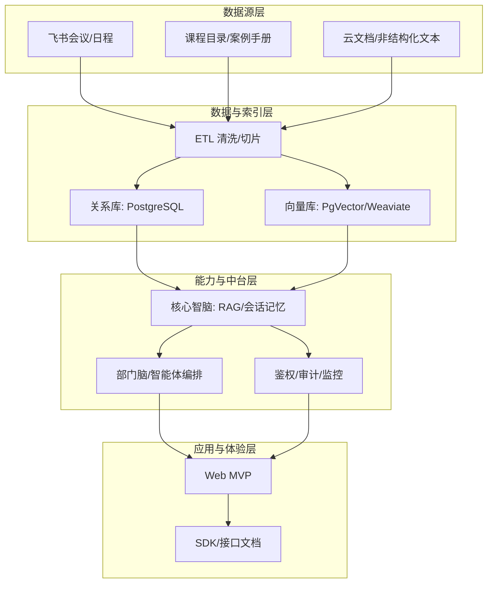

# 参考材料与讨论记录

<cite>
**本文档引用文件**  
- [NOVE项目书.md](file://NOVE项目书.md)
- [完整方案构思.md](file://完整方案构思.md)
- [实施路线图.md](file://实施路线图.md)
- [技术框架方案探讨.md](file://技术框架方案探讨.md)
- [视频会议-关于太子老师项目的讨论.md](file://视频会议-关于太子老师项目的讨论.md)
- [项目介绍.md](file://项目介绍.md)
- [项目名称.md](file://项目名称.md)
</cite>

## 目录
1. [项目背景与核心理念](#项目背景与核心理念)  
2. [总体架构与技术方案](#总体架构与技术方案)  
3. [关键功能与实施路径](#关键功能与实施路径)  
4. [核心讨论要点与决策过程](#核心讨论要点与决策过程)  
5. [争议问题与最终结论](#争议问题与最终结论)  
6. [项目演进与知识传承](#项目演进与知识传承)

## 项目背景与核心理念

本项目旨在为陆向谦实验室构建一个名为“nove”的个性化智能教育平台，其核心理念源于“太子洗马式教育”——即每位学员都应如古代太子般，享有由顶级导师团队与AI系统共同提供的因材施教服务。项目以“以人为本，AI增强”为根本原则，强调AI作为工具提升效率，而非替代人的主观能动性。

项目初期聚焦于实验室内部知识沉淀与协作效率提升，通过打通飞书会议等真实使用场景，自动沉淀会议数据（转写、摘要、行动项），并构建统一的知识中台。长远目标是将此模式推广至其他教育机构、高校及企业培训部门，实现教育服务的智能化与个性化。

**Section sources**  
- [项目介绍.md](file://项目介绍.md#L1-L40)  
- [项目名称.md](file://项目名称.md#L1-L46)  
- [NOVE项目书.md](file://NOVE项目书.md#L1-L20)

## 总体架构与技术方案

项目的总体架构分为四层：数据源层、数据与索引层、能力与中台层、应用与体验层。数据源层整合飞书会议、课程目录、案例手册等结构化与非结构化数据。数据与索引层负责ETL清洗、向量化处理，并存储于关系型数据库（如PostgreSQL）和向量数据库（如PgVector或Weaviate）中。

能力与中台层是系统的核心，包含“核心智脑”与“部门脑/智能体”。核心智脑提供统一的检索、推理、会话记忆与可控迭代能力；部门脑则将核心能力封装为可编排的业务智能体，服务于不同场景。应用层优先交付Web MVP，提供问答、会议纪要与行动项看板等功能。

技术选型上，后端推荐使用NestJS（TypeScript）或FastAPI（Python），前端采用Next.js + React，结合Tailwind CSS和shadcn/ui构建UI。AI能力基于RAG（检索增强生成）实现，并通过OpenAPI契约驱动开发，确保接口清晰稳定。

**Diagram sources**  
- [NOVE项目书.md](file://NOVE项目书.md#L25-L55)  
- [技术框架方案探讨.md](file://技术框架方案探讨.md#L1-L80)

**Section sources**  
- [NOVE项目书.md](file://NOVE项目书.md#L25-L55)  
- [技术框架方案探讨.md](file://技术框架方案探讨.md#L1-L80)  
- [完整方案构思.md](file://完整方案构思.md#L1-L50)

## 关键功能与实施路径

项目的关键功能包括：飞书会议自动打通、知识库接入与RAG问答、智能体编排、权限与审计体系、运营看板等。实施路径采用“先易后难、快速迭代”的策略，分为三个阶段：

**阶段一：MVP原型（3-4个月）**  
搭建基础架构（Next.js + PostgreSQL + Prisma），实现用户认证、基础UI组件库，并开发学生管理、课程管理及简单的AI答疑功能。

**阶段二：核心功能完善（4-6个月）**  
集成RAG系统，部署向量数据库，实现个性化推荐算法，并通过WebSocket支持实时通信与在线协作。

**阶段三：高级特性（4-5个月）**  
构建数据分析系统，实现学习轨迹分析与智能报告生成，并进行系统性能优化，视情况向微服务架构迁移。

整个项目计划在12周内完成v1.0版本的发布，里程碑包括飞书会议打通、知识库向量化、核心智脑v0.1、Web MVP上线等。

**Section sources**  
- [实施路线图.md](file://实施路线图.md#L1-L34)  
- [NOVE项目书.md](file://NOVE项目书.md#L100-L150)

## 核心讨论要点与决策过程

在“视频会议-关于太子老师项目的讨论”中，杨仕明与叶俊深入探讨了项目的核心理念与实施策略。核心要点如下：

1.  **以人为本，AI为辅**：强调AI的核心作用是增强人的效率，而非替代。例如，AI可在一分钟内完成学员月度信息总结，而人工则需半天，效率提升显著。
2.  **架构分层清晰**：明确将系统分为感知层（数据输入）、处理层（核心智脑）、展示层（用户交互）。感知层优先接入最容易获取的飞书会议数据。
3.  **扁平化协作**：在小团队（如6人以内）中，信息直达、减少流程摩擦的扁平化协作最为高效。组织架构的复杂化是团队规模扩大后的“不得不”选择，而非理想状态。
4.  **快速迭代，价值优先**：反对一开始就追求完美架构，主张先做出最核心、最有需求的功能（如会议纪要自动化），快速交付MVP，再逐步迭代优化。
5.  **技术选型务实**：后端技术栈（NestJS或Python）的选择以“可用”为先，不必过度纠结。未来若因用户量增长导致性能瓶颈，再进行重构也不迟，关键在于项目能否启动并获得用户。

**Section sources**  
- [视频会议-关于太子老师项目的讨论.md](file://视频会议-关于太子老师项目的讨论.md#L1-L234)  
- [NOVE项目书.md](file://NOVE项目书.md#L1-L20)

## 争议问题与最终结论

### 争议问题1：技术栈选择（NestJS vs. Python FastAPI）
- **争议点**：后端应采用TypeScript的NestJS还是Python的FastAPI？NestJS具有全栈TypeScript、开发效率高的优势；而Python在AI生态（如LangChain）方面更为丰富。
- **讨论过程**：杨仕明倾向于NestJS，叶俊认为Python可能更适合AI重度应用。双方讨论了两种方案的优劣。
- **最终结论**：采用务实态度，以“可用”为第一原则。初期可选用任一技术栈快速推进，后续根据实际性能和团队能力再决定是否重构。项目文档中明确“技术选型以可用为先”。

### 争议问题2：系统架构设计（单体 vs. 微服务）
- **争议点**：项目初期应采用单体架构还是直接设计为微服务架构？
- **讨论过程**：杨仕明指出，过早引入微服务会增加不必要的复杂性。他以“纪念碑”比喻：若没有用户，再完美的架构也只是摆设。叶俊认同，认为应先验证市场需求。
- **最终结论**：采用“先单体，后演进”的策略。初期使用单体架构快速迭代，待用户量和业务复杂度增长到一定程度后，再考虑向微服务迁移。这符合“渐进迭代”的建设原则。

### 争议问题3：数据处理的挑战
- **争议点**：如何处理非结构化数据（如会议录音、聊天记录）中的噪声和敏感信息？
- **讨论过程**：认识到直接使用原始数据可能导致AI输出质量下降（如“垃圾进，垃圾出”）。讨论了数据清洗、切片、去噪、脱敏的必要性。
- **最终结论**：在数据与索引层建立严格的ETL流程，对数据进行预处理。同时，建立数据安全与合规体系，包括RBAC权限控制、操作审计、数据加密和水印溯源。

**Section sources**  
- [技术框架方案探讨.md](file://技术框架方案探讨.md#L81-L160)  
- [视频会议-关于太子老师项目的讨论.md](file://视频会议-关于太子老师项目的讨论.md#L10-L200)  
- [NOVE项目书.md](file://NOVE项目书.md#L200-L250)

## 项目演进与知识传承

本项目从“太子老师”这一概念出发，最终定名为“nove”，寓意“新的、创新的”。其演进路径清晰：首先服务于陆向谦实验室，验证“太子洗马式教育”理念；成功后拓展至其他教育机构、高校，最终进入企业培训领域。

项目的设计决策始终围绕“真实使用场景”展开，优先解决最痛点的问题（如会议纪要整理），通过快速迭代积累数据和能力。这种“小步快跑”的模式，降低了项目失败的风险，确保了资源的有效利用。

对于新成员而言，理解本项目的关键在于把握其“以人为本、价值优先、渐进迭代”的核心思想。所有技术选型和架构设计，都是服务于这一思想的手段。通过阅读本记录，新成员可以快速理解为何选择当前的技术栈、为何采用MVP策略、以及未来可能的演进方向，从而更好地融入团队，推动项目发展。

**Section sources**  
- [项目名称.md](file://项目名称.md#L1-L46)  
- [NOVE项目书.md](file://NOVE项目书.md#L1-L20)  
- [完整方案构思.md](file://完整方案构思.md#L1-L214)