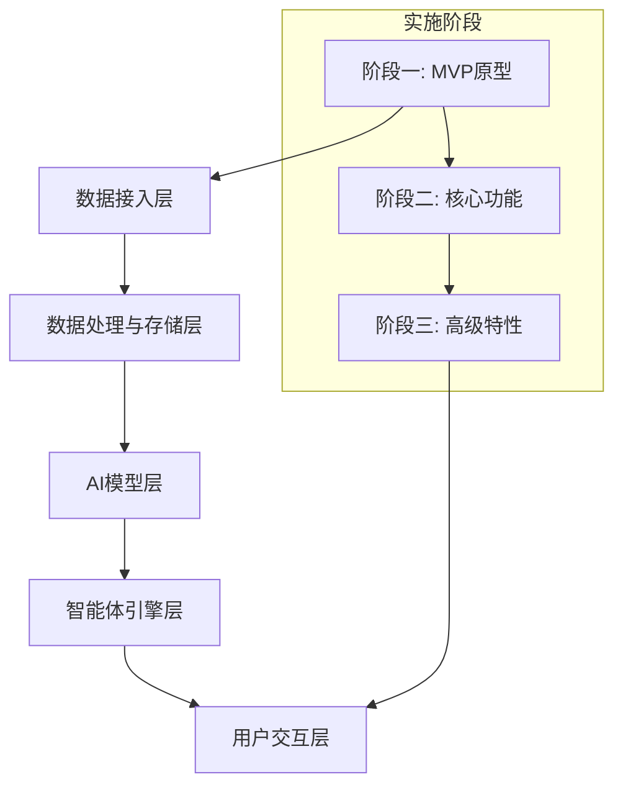
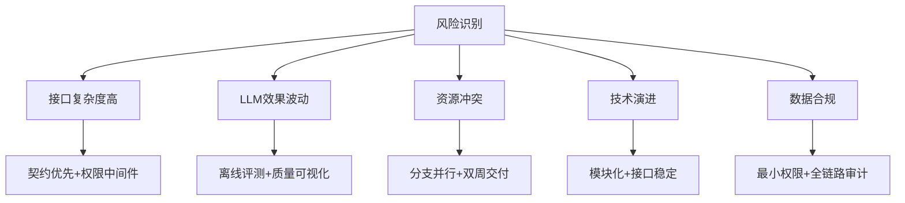

# 实施路线图

<cite>
**本文档引用文件**  
- [实施路线图.md](file://实施路线图.md)
- [NOVE项目书.md](file://NOVE项目书.md)
- [完整方案构思.md](file://完整方案构思.md)
- [技术框架方案探讨.md](file://技术框架方案探讨.md)
- [项目介绍.md](file://项目介绍.md)
- [视频会议-关于太子老师项目的讨论.md](file://视频会议-关于太子老师项目的讨论.md)
</cite>

## 目录
1. [项目概述](#项目概述)
2. [总体实施框架](#总体实施框架)
3. [阶段一：MVP原型开发](#阶段一mvp原型开发)
4. [阶段二：核心功能完善](#阶段二核心功能完善)
5. [阶段三：高级特性开发](#阶段三高级特性开发)
6. [关键里程碑与交付节奏](#关键里程碑与交付节奏)
7. [技术重点与资源需求](#技术重点与资源需求)
8. [风险评估与应对策略](#风险评估与应对策略)
9. [总结与执行建议](#总结与执行建议)

## 项目概述

本项目旨在构建一个名为“EduMind AI Platform”的B端企业级智能教育系统，以“太子洗马式教育”为核心理念，为每位学员提供顶级导师团队与AI协同的个性化教育服务。系统将首先服务于陆向谦实验室，随后逐步拓展至其他教育机构及企业组织。

项目以“以人为本、价值优先、渐进迭代”为建设原则，聚焦真实使用场景，通过AI增强而非替代人工，实现教育理念、课程目录、案例手册、会议数据等知识资产的统一沉淀与智能应用。核心目标是打造一个集知识中台、智能体引擎、AI模型层于一体的一站式教育智能平台。

**Section sources**
- [项目介绍.md](file://项目介绍.md#L1-L40)
- [NOVE项目书.md](file://NOVE项目书.md#L1-L20)

## 总体实施框架

项目采用分层架构设计，分为数据接入层、数据处理与存储层、AI模型层、智能体引擎层和用户交互层。实施路径遵循“先易后难、快速迭代”的原则，从最小可用产品（MVP）出发，逐步演进至完整平台。

整体实施分为三个主要阶段，总周期约12-15个月。第一阶段（3-4个月）聚焦MVP原型开发，打通飞书会议集成，实现基础问答功能；第二阶段（4-6个月）完善核心AI能力，包括RAG系统、向量数据库和实时交互；第三阶段（4-5个月）开发高级特性，如数据分析系统和性能优化。

**Diagram sources**
- [完整方案构思.md](file://完整方案构思.md#L20-L50)
- [NOVE项目书.md](file://NOVE项目书.md#L100-L120)

**Section sources**
- [实施路线图.md](file://实施路线图.md#L1-L5)
- [完整方案构思.md](file://完整方案构思.md#L1-L20)

## 阶段一：MVP原型开发

### 目标与范围
本阶段目标是交付最小可用应用（Web优先），实现飞书会议自动打通、知识库基础问答和行动项闭环跟踪。周期为3-4个月，重点验证核心价值场景的可行性。

### 关键里程碑
- **M1（第1-2周）**：完成需求澄清，实现飞书会议数据拉取、自动转写、摘要生成与行动项入库，搭建项目基础架构与权限审计系统。
- **M2（第3-4周）**：完成课程目录、案例手册等核心知识库的清洗与向量化，实现RAG最小可用链路。
- **M3（第5-6周）**：构建核心智脑v0.1版本，支持权限感知检索、会话记忆与可控更新机制，建立离线评测集。
- **M4（第7-8周）**：开发部门脑/智能体模板与编排能力，搭建开发者工作台雏形。
- **M5（第9-10周）**：完成Web MVP开发，包含登录、问答、会议纪要与行动项看板功能。
- **M6（第11-12周）**：内测优化，接入运营看板与监控告警，完成安全加固并发布v1.0版本。

### 交付成果
- Web MVP应用（问答/纪要/行动项看板）
- 后端服务与OpenAPI文档
- 数据模型与数据字典
- 运营看板与监控告警系统
- 权限与合规方案文档

**Section sources**
- [实施路线图.md](file://实施路线图.md#L7-L14)
- [NOVE项目书.md](file://NOVE项目书.md#L150-L200)

## 阶段二：核心功能完善

### 技术重点
本阶段在MVP基础上深化AI能力与实时交互功能，周期为4-6个月。

#### AI能力集成
- **RAG系统实现**：基于向量数据库（PgVector/Weaviate/FAISS）构建检索增强生成系统，支持多轮会话与可追溯引用。
- **向量数据库部署**：选择合适的向量数据库方案，实现文本嵌入存储与高效语义检索。
- **个性化推荐算法**：结合协同过滤、知识图谱分析与GPT微调模型，为用户提供个性化内容推荐。

#### 实时交互功能
- **WebSocket实时通信**：实现师生实时互动、在线协作与实时答疑系统。
- **智能体编排**：提供低门槛的智能体配置平台，支持按部门与业务场景封装数据源与工具。
- **会话记忆与可控更新**：建立会话记忆机制，支持“可控遗忘/更新”功能，确保知识持续进化。

### 资源需求
- 后端开发：2人
- 前端开发：1人
- AI工程师：1人
- 产品/文档：1人
- 运维/安全：0.5人

**Section sources**
- [实施路线图.md](file://实施路线图.md#L15-L22)
- [技术框架方案探讨.md](file://技术框架方案探讨.md#L50-L100)

## 阶段三：高级特性开发

### 目标与范围
本阶段目标是提升系统智能化水平与可扩展性，周期为4-5个月。

### 主要功能
#### 数据分析系统
- **学习轨迹分析**：追踪用户行为数据，分析学生成长轨迹与学习效果。
- **智能报告生成**：自动生成部门日报、学习报告等，整合会议摘要、文档更新与任务进度。
- **家长沟通系统**：AI自动生成学习报告，通过语音+图文形式定期推送给家长。

#### 性能优化与扩展
- **系统性能优化**：优化数据库查询、API响应时间等关键性能指标。
- **缓存策略实施**：引入Redis等缓存机制，提升系统响应速度。
- **微服务架构迁移（可选）**：根据业务规模评估是否进行微服务架构迁移，提升系统可扩展性。

### 技术演进
- **模型持续学习**：每日新增数据自动触发增量训练，保持模型时效性。
- **多端支持**：扩展移动端、桌面端应用，提升用户体验。
- **跨系统集成**：对接CRM、ERP等业务系统API，实现数据全面整合。

**Section sources**
- [实施路线图.md](file://实施路线图.md#L23-L30)
- [完整方案构思.md](file://完整方案构思.md#L150-L200)

## 关键里程碑与交付节奏

| 里程碑 | 时间节点 | 主要交付物 | 成功指标 |
|--------|----------|-----------|----------|
| M1 | 第1-2周 | 飞书会议打通、基础架构 | 会议数据自动入库率≥90% |
| M2 | 第3-4周 | 知识库清洗、RAG链路 | 关键文档覆盖率≥85% |
| M3 | 第5-6周 | 核心智脑v0.1 | 问答有效率≥80% |
| M4 | 第7-8周 | 智能体模板、工作台 | 智能体配置成功率≥95% |
| M5 | 第9-10周 | Web MVP | 自助解决率≥60% |
| M6 | 第11-12周 | v1.0发布 | 内测满意度≥4.2/5 |
| 阶段二完成 | 第6个月末 | RAG系统、实时通信 | 会议行动项闭环率≥70% |
| 阶段三完成 | 第12个月末 | 数据分析、性能优化 | 平均首响时间<2s |

**Section sources**
- [NOVE项目书.md](file://NOVE项目书.md#L150-L200)
- [实施路线图.md](file://实施路线图.md#L1-L33)

## 技术重点与资源需求

### 技术栈选型
- **前端**：Next.js + React + Tailwind CSS + shadcn/ui
- **后端**：NestJS（主）或 FastAPI（AI模块）
- **数据库**：PostgreSQL（主数据）+ 向量数据库（PgVector/Weaviate）
- **AI模型**：GPT-4/DeepSeek/Claude + 自训练模型
- **部署**：Docker + Kubernetes + AWS/GCP/Aliyun

### 核心技术要求
- **向量搜索**：实现个性化推荐与语义检索的核心技术。
- **异步调度**：支持进度跟踪与后台任务处理。
- **实时通信**：通过WebSocket实现师生互动与协作学习。
- **AI能力**：集成智能评估、答疑、推荐等核心功能。

### 人力资源配置
- 项目负责人：1人（目标范围、里程碑、对外沟通）
- 技术负责人：1人（架构设计、关键技术攻关）
- 后端开发：2-3人（数据接入、接口实现）
- 前端开发：1-2人（Web/Mobile应用）
- AI工程师：1-2人（模型训练、RAG优化）
- 产品/文档：1人（需求澄清、验收标准）
- 运维/安全：0.5-1人（权限、审计、发布）

**Section sources**
- [技术框架方案探讨.md](file://技术框架方案探讨.md#L1-L160)
- [NOVE项目书.md](file://NOVE项目书.md#L200-L220)

## 风险评估与应对策略

### 主要风险
- **接口与权限复杂度高**：飞书开放平台等第三方接口权限管理复杂。
- **LLM效果波动**：大模型输出质量不稳定，可能出现幻觉或错误答案。
- **资源节奏与并行冲突**：多团队并行开发可能导致资源冲突。
- **技术选型演进**：初期技术栈可能无法满足后期规模需求。
- **数据敏感与合规**：企业数据涉及隐私，需严格遵守合规要求。

### 应对策略
- **接口复杂度**：采用契约优先原则，通过权限中间件和沙箱环境先行验证。
- **LLM效果波动**：建立离线评测集，实现检索质量可视化与可追溯引用。
- **资源冲突**：实施分支并行开发，明确场景优先级，双周交付可验收成果。
- **技术演进**：保持模块边界清晰，接口稳定，确保实现可替换。
- **数据合规**：实施最小权限原则，数据脱敏处理，全链路操作审计与溯源。

**Diagram sources**
- [NOVE项目书.md](file://NOVE项目书.md#L250-L270)
- [完整方案构思.md](file://完整方案构思.md#L200-L220)

**Section sources**
- [NOVE项目书.md](file://NOVE项目书.md#L250-L280)
- [视频会议-关于太子老师项目的讨论.md](file://视频会议-关于太子老师项目的讨论.md#L1-L234)

## 总结与执行建议

本实施路线图为“EduMind AI Platform”项目提供了清晰的分阶段演进路径。建议项目团队严格遵循“价值优先、渐进迭代”的原则，聚焦真实使用场景，确保每个阶段都能交付可衡量的业务价值。

执行过程中应保持扁平化协作，小团队高频同步，强调交付与真实使用反馈。技术选型以可用为先，不必过度追求完美架构，后续可根据规模与性能需求进行重构。

关键成功要素包括：确保飞书会议集成的稳定性和数据质量，建立有效的LLM效果评估与优化机制，以及持续收集用户反馈进行产品迭代。通过双周评审与验收机制，保障项目按既定节奏稳步推进，最终实现从MVP到完整智能教育平台的成功演进。

**Section sources**
- [NOVE项目书.md](file://NOVE项目书.md#L280-L300)
- [视频会议-关于太子老师项目的讨论.md](file://视频会议-关于太子老师项目的讨论.md#L1-L234)