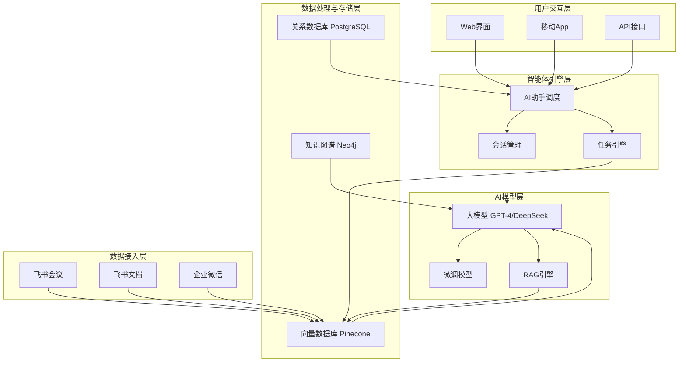

# 学员工作流

<cite>
**本文档引用文件**  
- [项目介绍.md](file://项目介绍.md)
- [视频会议-关于太子老师项目的讨论.md](file://视频会议-关于太子老师项目的讨论.md)
- [实施路线图.md](file://实施路线图.md)
- [技术框架方案探讨.md](file://技术框架方案探讨.md)
- [完整方案构思.md](file://完整方案构思.md)
</cite>

## 目录
1. [引言](#引言)
2. [学员学习与交互流程总览](#学员学习与交互流程总览)
3. [个性化培养方案获取](#个性化培养方案获取)
4. [基于RAG的知识检索](#基于rag的知识检索)
5. [多轮会话答疑机制](#多轮会话答疑机制)
6. [会议纪要与行动项管理](#会议纪要与行动项管理)
7. [典型学习场景应用](#典型学习场景应用)
8. [权限控制与数据安全](#权限控制与数据安全)
9. [使用技巧与最佳实践](#使用技巧与最佳实践)
10. [系统架构与技术支撑](#系统架构与技术支撑)
11. [总结](#总结)

## 引言

本文件旨在系统阐述学员在“nove”平台上的完整学习与交互流程。该平台以“太子洗马式教育”为核心理念，致力于为每位学员提供如同古代太子般的顶级个性化教育服务。通过AI智能助手与导师团队的协同支持，平台实现了从学习规划、知识获取、答疑解惑到任务管理的全流程智能化。

平台不仅关注知识的传递，更注重学习过程的个性化与可追溯性，确保每位学员都能获得量身定制的成长路径。本文将详细描述学员如何与系统互动，如何获取个性化建议，如何检索学习资料，以及系统如何保障信息安全与学习效率。

## 学员学习与交互流程总览

学员在nove平台的学习旅程始于自然语言对话。通过语音或文本输入，学员可与AI助手进行无障碍交流，提出学习需求或疑问。系统基于RAG（检索增强生成）技术，结合学员个人画像与历史数据，生成个性化反馈。

学习过程中，学员可随时发起多轮会话，系统会保持上下文记忆，提供连贯的答疑服务，并在回答中附带可追溯的知识来源。教师发布的会议纪要与行动项会自动推送给相关学员，学员可更新完成状态并反馈进展。

整个流程由权限控制系统保障，确保学员仅能访问其授权范围内的内容。系统通过向量数据库、知识图谱与大模型协同工作，实现高效、精准、安全的个性化辅导体验。

**Section sources**  
- [项目介绍.md](file://项目介绍.md#L1-L40)  
- [完整方案构思.md](file://完整方案构思.md#L1-L214)

## 个性化培养方案获取

学员可通过自然语言对话向AI助手提出“我该如何规划接下来的学习？”或“请为我制定一个项目准备计划”等请求。系统接收请求后，首先调用学员个人画像模块，提取其学习历史、能力维度、兴趣偏好与当前进度。

随后，AI助手结合教师设定的培养目标与课程体系，利用大模型生成初步建议，并通过RAG系统检索历史成功案例与课程资料，进行方案优化。最终输出的培养方案不仅包含学习路径、推荐资源与时间节点，还会说明推荐依据，如“根据您在上一项目中的表现，建议加强XX技能训练”。

该过程实现了“一生一案”的个性化教育理念，确保每位学员获得最适合自身发展的指导。

**Section sources**  
- [项目介绍.md](file://项目介绍.md#L1-L40)  
- [完整方案构思.md](file://完整方案构思.md#L1-L214)

## 基于RAG的知识检索

nove平台采用RAG（检索增强生成）技术构建智能问答系统。学员在学习过程中，可通过自然语言提问，如“上次会议提到的项目手册在哪里？”或“请解释一下XX概念”。

系统工作流程如下：首先将学员的提问进行向量化处理，然后在向量数据库中进行语义搜索，匹配最相关的知识片段。这些知识片段来源于飞书文档、会议纪要、课程PPT、项目案例等结构化与非结构化数据。

检索到的相关内容将作为上下文输入给大模型，生成准确、连贯的回答。回答中会明确标注信息来源，如“根据2025年9月14日会议记录”或“参考《项目介绍.md》第3节”，确保知识引用的可追溯性。

**Section sources**  
- [视频会议-关于太子老师项目的讨论.md](file://视频会议-关于太子老师项目的讨论.md#L1-L234)  
- [技术框架方案探讨.md](file://技术框架方案探讨.md#L1-L160)  
- [完整方案构思.md](file://完整方案构思.md#L1-L214)

## 多轮会话答疑机制

学员在学习过程中可发起多轮会话，系统具备上下文理解与记忆能力。例如，学员先问“什么是RAG？”，系统回答后，学员继续追问“它在我们项目中如何应用？”，系统能准确理解“它”指代RAG，并结合项目背景进行解答。

AI助手在后台维护会话状态，跟踪讨论主题与学员意图。当问题涉及多个知识点时，系统会自动拆解问题，分步检索与生成答案。对于复杂问题，系统可主动追问以澄清需求，确保回答的准确性。

所有答疑过程均记录在学员学习轨迹中，形成可回溯的知识链，便于后续复习与教师评估。

**Section sources**  
- [完整方案构思.md](file://完整方案构思.md#L1-L214)  
- [技术框架方案探讨.md](file://技术框架方案探讨.md#L1-L160)

## 会议纪要与行动项管理

教师在会议结束后，系统自动将会议录音转为文字，并生成结构化纪要，提取关键议题、决策项与任务分配。这些纪要与行动项会根据权限设置自动推送给相关学员。

学员在个人工作台可查看所有分配给自己的任务，包括截止日期、优先级与关联文档。学员可更新任务状态（如“进行中”、“已完成”），并添加反馈或进展说明。系统会自动同步状态至飞书/钉钉待办列表，并在关键节点触发提醒。

教师可实时查看所有学员的任务完成情况，进行进度追踪与干预。该机制确保了教学活动的闭环管理，提升了执行力与协作效率。

**Section sources**  
- [视频会议-关于太子老师项目的讨论.md](file://视频会议-关于太子老师项目的讨论.md#L1-L234)  
- [完整方案构思.md](file://完整方案构思.md#L1-L214)

## 典型学习场景应用

### 项目答辩准备

学员在准备项目答辩时，可向AI助手提问：“请帮我准备答辩材料”。系统会检索该项目相关的所有资料，包括项目文档、会议反馈、教师评语，并生成答辩提纲与常见问题清单。同时，系统会推荐过往优秀答辩案例供参考，帮助学员全面提升准备质量。

### 课程重点复习

学员复习时可提问：“请总结《技术框架方案探讨》的核心要点”。系统会基于文档内容生成结构化摘要，并根据学员的学习历史，突出其薄弱环节。例如，若学员在数据库相关测试中表现不佳，系统会重点强化PostgreSQL与Prisma的相关知识。

这些场景体现了系统如何实现“太子洗马”式的全程陪伴与个性化辅导。

**Section sources**  
- [技术框架方案探讨.md](file://技术框架方案探讨.md#L1-L160)  
- [完整方案构思.md](file://完整方案构思.md#L1-L214)

## 权限控制与数据安全

平台采用基于RBAC（基于角色的访问控制）的权限模型，确保数据安全。学员、教师、管理员拥有不同角色，权限粒度可细化到部门、项目或文档级别。

例如，某学员仅能访问其所在项目组的会议记录与文档，无法查看其他组的敏感信息。系统在数据接入时自动进行脱敏处理，识别并模糊化手机号、身份证号等敏感信息。

所有数据访问均有日志记录，支持审计追踪。该机制在保障信息安全的同时，满足了企业级应用的合规要求。

**Section sources**  
- [完整方案构思.md](file://完整方案构思.md#L1-L214)

## 使用技巧与最佳实践

- **精准提问**：使用具体、明确的语言提问，如“上周三会议中张老师提到的实施步骤是什么？”而非“告诉我一些信息”。
- **善用上下文**：在多轮对话中，可直接追问，系统能理解上下文。
- **及时更新状态**：收到行动项后尽快确认，并定期更新进展，有助于教师及时支持。
- **主动反馈**：对AI回答不满意时，可指出问题，帮助系统持续优化。
- **定期回顾**：利用系统生成的学习报告与知识链，进行周期性复盘。

这些技巧有助于最大化利用平台功能，提升学习效率。

## 系统架构与技术支撑

**Diagram sources**  
- [技术框架方案探讨.md](file://技术框架方案探讨.md#L1-L160)  
- [完整方案构思.md](file://完整方案构思.md#L1-L214)

**Section sources**  
- [技术框架方案探讨.md](file://技术框架方案探讨.md#L1-L160)  
- [完整方案构思.md](file://完整方案构思.md#L1-L214)

## 总结

nove平台通过先进的AI技术与精心设计的交互流程，成功实现了“太子洗马式教育”的愿景。学员在平台上不仅能获得个性化的培养方案，还能通过自然语言高效检索知识、进行多轮答疑、管理学习任务。

系统以RAG为核心，结合向量数据库与大模型，确保了知识服务的准确性与可追溯性。权限控制机制保障了数据安全，而典型场景的应用则展现了系统的实用价值。

未来，随着数据积累与模型迭代，平台将不断优化推荐精度与交互体验，为学员提供更加智能、贴心的个性化教育服务。