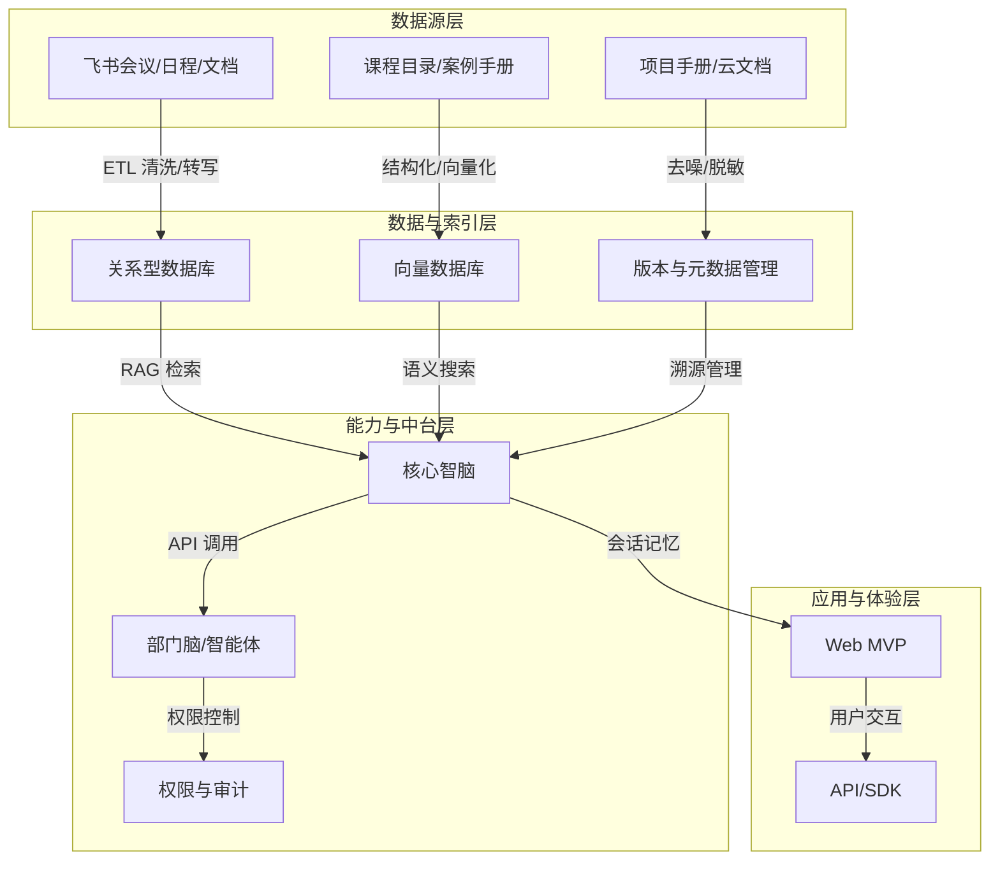

# 教师/助教工作流

<cite>
**本文档引用文件**  
- [NOVE项目书.md](file://NOVE项目书.md)
- [完整方案构思.md](file://完整方案构思.md)
- [实施路线图.md](file://实施路线图.md)
- [技术框架方案探讨.md](file://技术框架方案探讨.md)
- [视频会议-关于太子老师项目的讨论.md](file://视频会议-关于太子老师项目的讨论.md)
- [项目介绍.md](file://项目介绍.md)
- [项目名称.md](file://项目名称.md)
</cite>

## 目录
1. [引言](#引言)
2. [整体架构与技术支撑](#整体架构与技术支撑)
3. [教师与助教核心工作流程](#教师与助教核心工作流程)
4. [典型教学场景应用](#典型教学场景应用)
5. [系统功能与操作路径示例](#系统功能与操作路径示例)
6. [常见问题处理机制](#常见问题处理机制)
7. [总结与展望](#总结与展望)

## 引言

nove平台旨在为教育机构提供“太子洗马式”的个性化智能教育服务，以AI增强教师与助教的教学能力，实现高效的知识沉淀与教学闭环。本工作流详细描述了从飞书会议接入开始，到会议内容自动处理、教师审核发布、学员行动项跟踪的完整流程，结合具体教学场景说明系统如何提升教学效率与知识管理质量。

**Section sources**
- [项目介绍.md](file://项目介绍.md#L1-L40)
- [项目名称.md](file://项目名称.md#L1-L46)

## 整体架构与技术支撑

nove平台采用分层架构设计，确保数据流清晰、功能模块解耦，支持快速迭代与扩展。

**Diagram sources**
- [NOVE项目书.md](file://NOVE项目书.md#L25-L65)
- [技术框架方案探讨.md](file://技术框架方案探讨.md#L1-L60)

**Section sources**
- [NOVE项目书.md](file://NOVE项目书.md#L25-L65)
- [技术框架方案探讨.md](file://技术框架方案探讨.md#L1-L60)

## 教师与助教核心工作流程

### 1. 会议接入与自动处理

教师或助教在飞书创建会议并邀请nove平台机器人参与。会议结束后，系统自动触发以下流程：

- **语音转写**：调用飞书API获取录音文件，通过ASR技术生成文字记录。
- **智能摘要**：利用大模型对转写文本进行摘要生成，提取核心讨论内容。
- **关键词提取**：识别会议中的关键术语、概念与主题标签。
- **行动项抽取**：从对话中识别待办任务、责任人与截止时间，结构化存储至数据库。

该过程基于RAG（检索增强生成）机制，结合实验室已有知识库（如课程目录、案例手册）进行上下文增强，提升摘要与关键词的准确性。

### 2. 内容审核与发布

生成的智能纪要推送至教师与助教的nove平台工作台，支持以下操作：

- **内容审核**：教师可查看自动生成的摘要、关键词与行动项，确认其准确性。
- **人工补充**：支持手动修改摘要、添加遗漏信息或调整行动项优先级。
- **一键发布**：审核通过后，纪要与行动项自动同步至相关学员的个人学习空间。

系统保留原始记录与编辑历史，支持版本追溯与审计。

### 3. 学员行动项跟踪

发布后的行动项进入闭环管理流程：

- **自动提醒**：系统根据截止时间向学员发送飞书/邮件提醒。
- **进度反馈**：学员可在平台提交完成情况，上传相关成果。
- **状态更新**：教师可查看所有学员的执行进度，标记完成或提出反馈。
- **数据统计**：平台生成行动项闭环率、平均响应时间等运营指标。

**Section sources**
- [NOVE项目书.md](file://NOVE项目书.md#L67-L100)
- [完整方案构思.md](file://完整方案构思.md#L30-L60)
- [视频会议-关于太子老师项目的讨论.md](file://视频会议-关于太子老师项目的讨论.md#L100-L150)

## 典型教学场景应用

### 场景一：项目复盘会

在项目复盘会议中，系统自动识别以下内容：

- **关键决策点**：如“确定下一阶段开发方向为AI集成”。
- **经验总结**：如“前端性能瓶颈主要源于图片未压缩”。
- **改进任务**：如“由张三负责优化图片加载，两周内完成”。

教师审核后发布，学员可查阅复盘结论并执行分配任务，形成知识沉淀闭环。

### 场景二：一对一辅导

在个性化辅导中，系统记录学员问题与教师建议：

- **学情分析**：自动归类学员薄弱环节，如“逻辑表达不清晰”。
- **学习建议**：提取教师建议，如“推荐阅读《批判性思维》第3章”。
- **成长路径更新**：将建议同步至学员的个性化学习方案中。

该过程支持“一生一案”的动态调整，提升因材施教的精准度。

**Section sources**
- [项目介绍.md](file://项目介绍.md#L20-L35)
- [完整方案构思.md](file://完整方案构思.md#L150-L180)
- [视频会议-关于太子老师项目的讨论.md](file://视频会议-关于太子老师项目的讨论.md#L150-L200)

## 系统功能与操作路径示例

### 典型操作路径：从会议到行动项闭环

1. **会议创建**：教师在飞书创建会议，添加nove机器人。
2. **自动处理**：会议结束 → 系统转写 → 生成摘要/关键词/行动项。
3. **教师审核**：登录nove平台 → 查看待审纪要 → 修改并发布。
4. **学员执行**：学员收到通知 → 查看行动项 → 提交完成反馈。
5. **进度跟踪**：教师查看看板 → 监控闭环率 → 进行后续指导。

### 技术支撑说明

- **RAG检索**：在生成摘要时，系统检索课程目录与历史案例，确保术语一致性。
- **大模型摘要**：采用GPT-4或DeepSeek等模型进行多轮对话理解与信息压缩。
- **向量数据库**：使用Pinecone或Weaviate存储文本向量，支持语义相似性检索。
- **权限控制**：基于RBAC模型，确保教师仅能访问其负责项目的会议数据。

**Section sources**
- [技术框架方案探讨.md](file://技术框架方案探讨.md#L61-L120)
- [实施路线图.md](file://实施路线图.md#L1-L34)
- [完整方案构思.md](file://完整方案构思.md#L61-L90)

## 常见问题处理机制

### 转写错误修正

- **人工标注接口**：教师可标记转写错误，系统收集反馈用于模型优化。
- **关键词校正**：支持手动替换错误术语，系统学习正确表达。
- **离线评测集**：定期评估ASR准确率，针对性优化模型。

### 敏感信息过滤

- **自动脱敏**：识别手机号、身份证号等敏感信息并模糊化处理。
- **权限隔离**：基于组织架构控制数据可见范围，如“仅项目成员可查看会议记录”。
- **审计日志**：记录所有数据访问行为，支持溯源与合规审查。

### 模型幻觉应对

- **可追溯引用**：所有生成内容标注信息来源，支持人工核验。
- **规则引擎校验**：关键任务（如截止时间）需人工确认后生效。
- **多模型交叉验证**：对重要决策项使用多个大模型生成结果比对。

**Section sources**
- [NOVE项目书.md](file://NOVE项目书.md#L180-L215)
- [完整方案构思.md](file://完整方案构思.md#L91-L120)
- [技术框架方案探讨.md](file://技术框架方案探讨.md#L121-L160)

## 总结与展望

nove平台通过打通飞书会议、自动处理会议内容、结构化知识沉淀与闭环跟踪，显著提升教师与助教的工作效率。系统以“以人为本、AI增强”为核心理念，支持从会议到行动项的全流程自动化，同时保留人工审核与干预机制，确保内容质量与教学权威性。

未来将扩展至更多数据源（如企业微信、邮件），并支持智能体编排，为不同部门生成定制化AI助手，持续推动教育智能化进程。