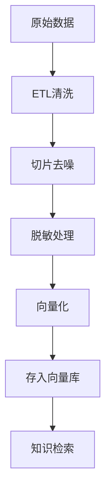
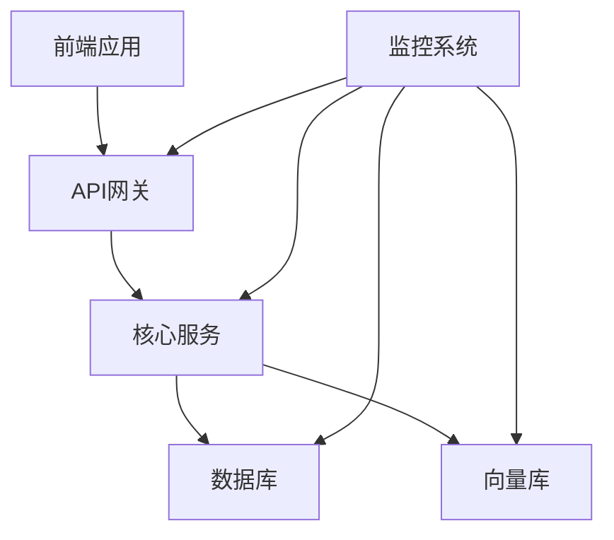

# 管理员工作流

<cite>
**本文档引用文件**  
- [NOVE项目书.md](file://NOVE项目书.md)
- [完整方案构思.md](file://完整方案构思.md)
- [实施路线图.md](file://实施路线图.md)
- [技术框架方案探讨.md](file://技术框架方案探讨.md)
- [视频会议-关于太子老师项目的讨论.md](file://视频会议-关于太子老师项目的讨论.md)
- [项目介绍.md](file://项目介绍.md)
- [项目名称.md](file://项目名称.md)
</cite>

## 目录
1. [引言](#引言)
2. [RBAC权限模型配置](#rbac权限模型配置)
3. [审计日志监控](#审计日志监控)
4. [知识库管理](#知识库管理)
5. [系统状态监控](#系统状态监控)
6. [数据脱敏与合规](#数据脱敏与合规)
7. [实际管理场景](#实际管理场景)
8. [故障排查与维护](#故障排查与维护)

## 引言
nove平台旨在为教育机构提供"太子洗马式"的个性化智能教育服务，通过AI增强教学研发、协作与对外服务能力。作为管理员，您将负责系统的整体运维、权限配置、数据安全与合规性保障。本工作流文档全面介绍管理员在nove平台中的系统管理职责与操作流程，涵盖权限管理、审计监控、知识库维护、系统状态查看等核心功能，帮助您高效管理平台并确保其稳定运行。

**Section sources**
- [项目介绍.md](file://项目介绍.md#L1-L40)
- [NOVE项目书.md](file://NOVE项目书.md#L1-L50)

## RBAC权限模型配置
管理员需基于RBAC（基于角色的访问控制）模型为不同部门和角色分配数据访问与功能使用权限。系统支持最小可见与分级授权原则，确保用户仅能访问其职责范围内的数据和功能。

权限配置流程如下：
1. **角色定义**：创建超级管理员、部门管理员、普通成员等角色
2. **权限粒度设置**：按部门、项目或文档类型控制数据访问权限
3. **用户分配**：将用户分配至相应角色，继承对应权限
4. **动态调整**：根据组织架构变化实时更新权限配置

例如，销售部门仅能访问销售相关会议记录，教学部门只能查看教研会议和课程资料。系统还支持ABAC（基于属性的访问控制）作为补充，实现更精细化的权限管理。

**Section sources**
- [NOVE项目书.md](file://NOVE项目书.md#L150-L180)
- [完整方案构思.md](file://完整方案构思.md#L100-L130)

## 审计日志监控
管理员可通过审计日志全面监控用户行为、API调用记录与敏感操作，确保系统安全与合规。全链路日志记录所有关键操作，包括登录、数据访问、权限变更等。

审计功能包括：
- **操作留痕**：记录用户操作时间、IP地址、操作内容
- **溯源追踪**：支持按用户、时间范围、操作类型进行查询
- **水印追踪**：对敏感数据访问添加数字水印
- **安全告警**：异常行为自动触发告警通知

审计日志存储于关系数据库中，支持长期保留与定期归档，满足合规性要求。

**Section sources**
- [NOVE项目书.md](file://NOVE项目书.md#L170-L180)
- [完整方案构思.md](file://完整方案构思.md#L120-L130)

## 知识库管理
管理员负责知识库的接入与更新，确保平台知识的时效性与准确性。知识库管理主要包括文档系统同步、ETL清洗任务触发等操作。

### 数据接入
支持多种数据源接入：
- 飞书会议/文档/日程
- 课程目录/案例手册/项目手册
- 其他云文档与非结构化文本

### ETL处理流程

**Diagram sources**
- [NOVE项目书.md](file://NOVE项目书.md#L60-L80)
- [完整方案构思.md](file://完整方案构思.md#L40-L60)

**Section sources**
- [NOVE项目书.md](file://NOVE项目书.md#L60-L100)
- [完整方案构思.md](file://完整方案构思.md#L40-L70)

## 系统状态监控
管理员可实时查看系统运行状态、资源消耗与模型调用统计，确保平台稳定高效运行。

### 监控指标
- **系统性能**：响应时间、可用性、并发处理能力
- **资源消耗**：CPU、内存、存储使用率
- **AI模型调用**：QPS、成功率、成本统计
- **业务指标**：自助解决率、行动项闭环率

### 监控架构

**Diagram sources**
- [NOVE项目书.md](file://NOVE项目书.md#L60-L90)
- [技术框架方案探讨.md](file://技术框架方案探讨.md#L10-L30)

**Section sources**
- [NOVE项目书.md](file://NOVE项目书.md#L250-L280)
- [技术框架方案探讨.md](file://技术框架方案探讨.md#L100-L120)

## 数据脱敏与合规
管理员需配置数据脱敏策略，保障敏感信息的安全与合规性。系统自动识别并处理敏感信息，如手机号、身份证号等。

### 脱敏策略配置
- **识别规则**：定义敏感信息识别模式
- **处理方式**：模糊化、加密或屏蔽
- **应用范围**：指定需脱敏的数据源和字段
- **合规审计**：记录脱敏操作日志

### 合规性保障措施
- **传输安全**：TLS全面加密，Webhook验签
- **存储安全**：敏感数据加密，密钥托管
- **访问控制**：最小权限原则，分级授权
- **数据治理**：版本溯源，保留与销毁政策

**Section sources**
- [NOVE项目书.md](file://NOVE项目书.md#L170-L180)
- [完整方案构思.md](file://完整方案构思.md#L110-L130)

## 实际管理场景
### 新学期权限批量设置
每学期初，管理员需为新学员和教师批量配置权限。可通过导入CSV文件或调用API接口实现批量操作，确保开学前权限配置完成。

### 异常行为排查
当系统检测到异常行为（如频繁API调用、越权访问）时，管理员可通过审计日志快速定位问题源头，采取相应措施，如临时禁用账户、加强验证等。

**Section sources**
- [NOVE项目书.md](file://NOVE项目书.md#L200-L230)
- [视频会议-关于太子老师项目的讨论.md](file://视频会议-关于太子老师项目的讨论.md#L100-L150)

## 故障排查与维护
### 常见问题处理
- **服务不可用**：检查服务状态，重启异常服务
- **响应缓慢**：查看资源使用率，扩容或优化查询
- **权限异常**：核对RBAC配置，检查用户角色分配
- **数据不同步**：检查ETL任务状态，重试失败任务

### 系统维护建议
- **定期备份**：每日备份核心数据，异地存储
- **版本更新**：在低峰期进行版本升级，做好回滚准备
- **性能优化**：定期分析慢查询，优化索引和缓存策略
- **安全加固**：定期更新依赖库，修补已知漏洞

**Section sources**
- [NOVE项目书.md](file://NOVE项目书.md#L300-L330)
- [实施路线图.md](file://实施路线图.md#L10-L20)