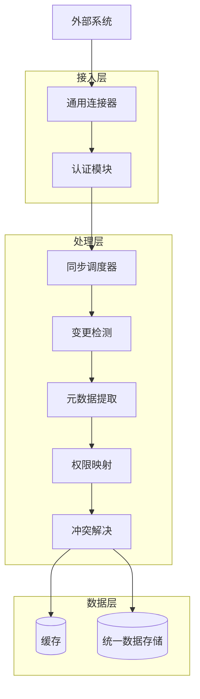
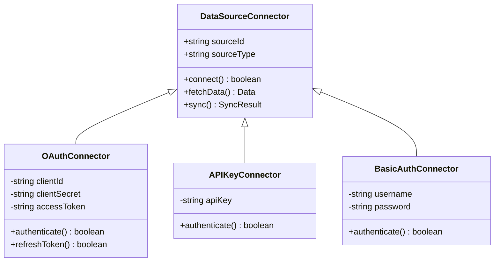
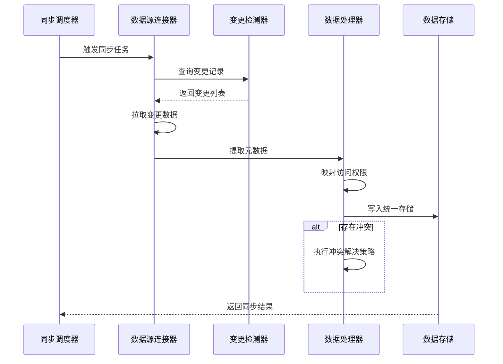
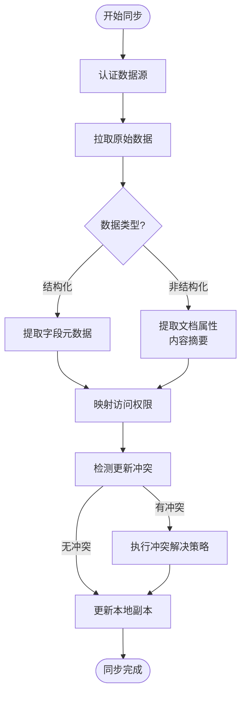

# 外部数据源接入

<cite>
**本文档引用文件**  
- 无可用源代码文件
</cite>

## 目录
1. [引言](#引言)
2. [项目结构概述](#项目结构概述)
3. [核心组件分析](#核心组件分析)
4. [架构概览](#架构概览)
5. [详细组件分析](#详细组件分析)
6. [依赖关系分析](#依赖关系分析)
7. [性能考量](#性能考量)
8. [故障排查指南](#故障排查指南)
9. [结论](#结论)

## 引言
本文档旨在系统化说明nove项目如何接入云文档系统（如飞书文档、Notion）和业务系统API的数据源。文档将描述通用连接器的架构设计，支持OAuth、API Key等多种认证方式，并详细阐述文档同步策略、增量拉取机制与变更检测逻辑。同时，将说明结构化与非结构化数据的统一处理流程，包括元数据提取、访问权限映射和更新冲突解决机制，为开发者提供新数据源接入的开发模板与测试验证流程。

## 项目结构概述
当前项目目录中仅包含若干Markdown格式的项目说明文档，未发现源代码文件或程序模块。项目结构以文档驱动为主，包含项目介绍、技术方案探讨、实施路线图等高层次设计文档。

**Section sources**
- [项目介绍.md](file://项目介绍.md)
- [技术框架方案探讨.md](file://技术框架方案探讨.md)
- [实施路线图.md](file://实施路线图.md)

## 核心组件分析
由于未提供实际代码实现，无法分析具体核心组件。根据文档目标，预期核心组件应包括：
- 数据源连接器（DataSource Connector）
- 认证管理模块（Authentication Manager）
- 同步调度器（Sync Scheduler）
- 变更检测引擎（Change Detection Engine）
- 元数据处理器（Metadata Processor）
- 权限映射服务（Permission Mapper）
- 冲突解决策略（Conflict Resolution Strategy）

这些组件应共同构成外部数据源接入的核心能力。

**Section sources**
- [完整方案构思.md](file://完整方案构思.md)
- [技术框架方案探讨.md](file://技术框架方案探讨.md)

## 架构概览
预期的外部数据源接入架构应采用插件化设计，支持多种云文档系统和业务API的统一接入。架构应包含连接层、认证层、同步层、处理层和存储层，实现解耦与可扩展性。

**Diagram sources**
- [技术框架方案探讨.md](file://技术框架方案探讨.md)

## 详细组件分析

### 通用连接器设计
通用连接器应支持多种数据源类型，通过接口抽象实现统一接入。每个具体数据源（如飞书文档、Notion）实现各自的适配器。

#### 认证方式支持

**Diagram sources**
- [技术框架方案探讨.md](file://技术框架方案探讨.md)

### 同步策略与变更检测
增量同步机制应基于时间戳、版本号或事件通知实现变更检测，避免全量拉取带来的性能开销。

**Diagram sources**
- [实施路线图.md](file://实施路线图.md)
- [完整方案构思.md](file://完整方案构思.md)

### 数据统一处理流程
结构化与非结构化数据应通过统一管道处理，提取标准化元数据并映射原始权限模型。

**Diagram sources**
- [完整方案构思.md](file://完整方案构思.md)

**Section sources**
- [完整方案构思.md](file://完整方案构思.md)
- [技术框架方案探讨.md](file://技术框架方案探讨.md)

## 依赖关系分析
由于缺乏代码实现，无法分析具体依赖关系。预期项目应依赖以下外部库：
- HTTP客户端库用于API调用
- OAuth2.0认证库
- JSON/XML解析库
- 数据库驱动
- 缓存系统客户端

**Section sources**
- [技术框架方案探讨.md](file://技术框架方案探讨.md)

## 性能考量
- 增量同步应控制请求频率，避免触发API限流
- 缓存机制应减少重复数据拉取
- 并行处理多个数据源变更
- 元数据索引优化查询性能
- 批量写入降低存储开销

## 故障排查指南
预期应提供以下调试能力：
- 连接器日志记录
- 认证状态监控
- 同步任务追踪
- 变更检测准确性验证
- 权限映射正确性检查

**Section sources**
- [实施路线图.md](file://实施路线图.md)

## 结论
尽管当前项目目录中缺乏可执行代码，但通过现有文档可推断出nove项目对外部数据源接入的设计目标与架构方向。建议尽快补充具体实现代码，以便进行深入分析与验证。当前文档为后续开发提供了清晰的指导框架，包括连接器设计、认证支持、同步机制和数据处理流程。