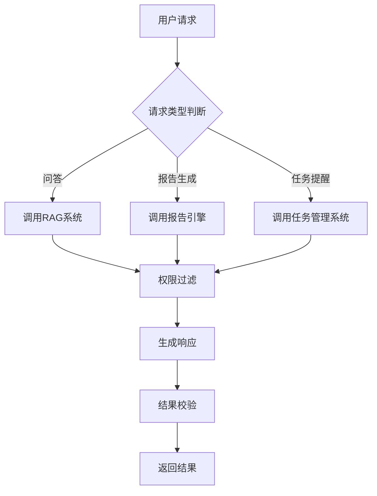
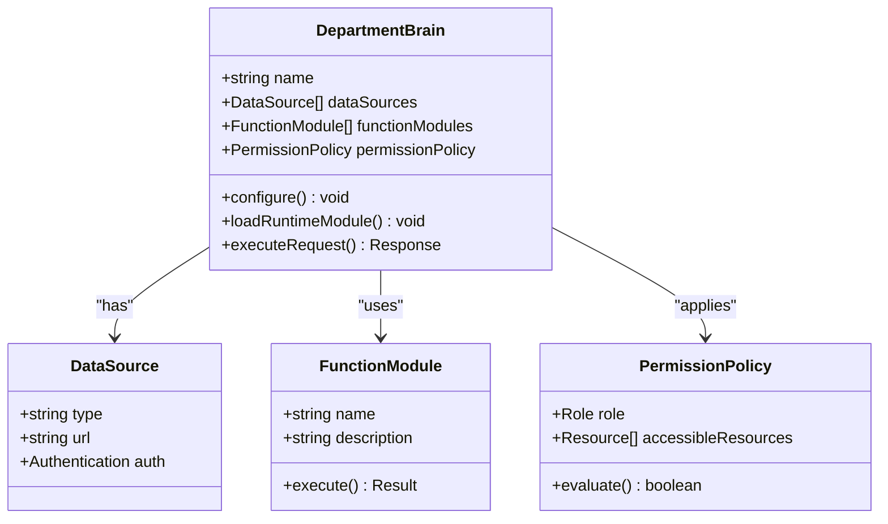
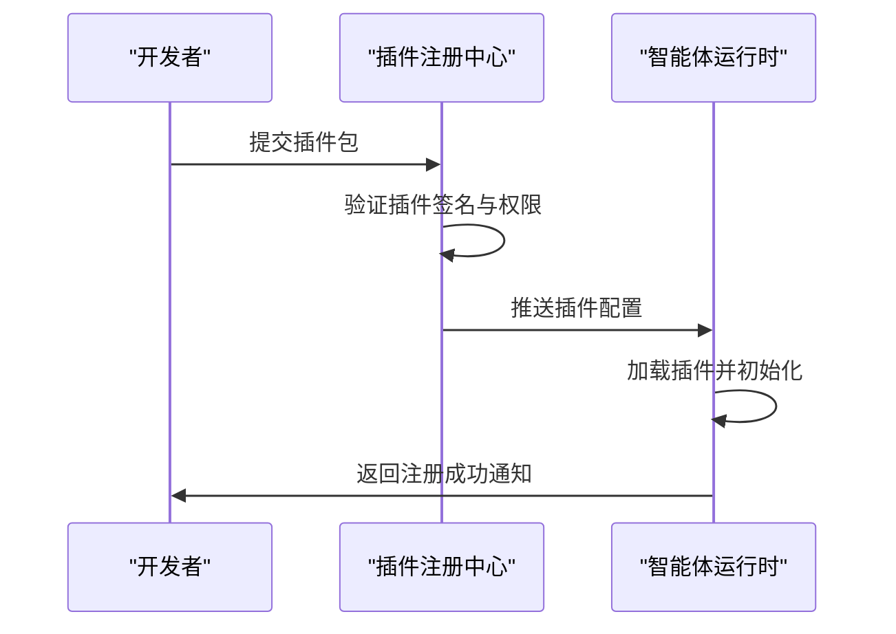

# 智能体模板与扩展机制

<cite>
**本文档引用文件**  
- [NOVE项目书.md](file://NOVE项目书.md)
- [完整方案构思.md](file://完整方案构思.md)
- [技术框架方案探讨.md](file://技术框架方案探讨.md)
- [实施路线图.md](file://实施路线图.md)
- [项目介绍.md](file://项目介绍.md)
- [视频会议-关于太子老师项目的讨论.md](file://视频会议-关于太子老师项目的讨论.md)
- [项目名称.md](file://项目名称.md)
</cite>

## 目录
1. [引言](#引言)
2. [智能体模板系统设计](#智能体模板系统设计)
3. [部门脑的可配置架构](#部门脑的可配置架构)
4. [智能体扩展接口规范](#智能体扩展接口规范)
5. [配置加载流程与JSON Schema示例](#配置加载流程与json-schema示例)
6. [集成到核心调度引擎](#集成到核心调度引擎)
7. [总结](#总结)

## 引言

nove项目旨在构建一个“太子洗马”式的个性化智能教育平台，通过AI技术为每位学员提供顶级的因材施教服务。在这一愿景下，智能体模板系统成为实现教育智能化的核心组件。该系统不仅支持按组织单元定制知识边界与工作流，还具备强大的扩展能力，允许开发者通过配置化方式定义智能体的行为逻辑、数据源绑定和工具调用权限。

本文件深入阐述nove项目中智能体模板系统的设计与扩展能力，涵盖“部门脑”的可配置架构、插件注册机制、自定义工具开发模板、上下文注入方式等内容，并提供JSON Schema示例和配置加载流程，指导开发者如何创建新的智能体类型并集成到核心调度引擎中。

**Section sources**
- [项目介绍.md](file://项目介绍.md#L1-L40)
- [NOVE项目书.md](file://NOVE项目书.md#L1-L321)

## 智能体模板系统设计

### 配置化行为逻辑定义

智能体模板系统采用模块化配置方式，允许非技术人员通过低代码界面定义智能体的功能。用户可以选择输入数据源（如“仅使用教研会议+课程PPT”）、勾选功能模块（问答、报告生成、任务提醒等），并调整模型参数、响应风格和输出格式。

系统支持动态加载新数据源或功能模块，确保智能体能力的灵活性与可扩展性。任务路由机制根据用户请求类型分发至不同处理流水线，状态管理模块记录智能体交互历史，支持上下文连续对话。

### 数据源绑定与权限控制

智能体可绑定特定范围的数据源，例如教学部门智能体可访问教研会议记录、课程PPT和学生反馈数据，而销售部门智能体则可接入客户沟通记录和合同文档。权限模型基于RBAC（角色访问控制）为主，辅以ABAC（属性访问控制）场景补充，确保最小可见与分级授权。

敏感信息（如手机号、身份证号）在存储和传输过程中自动脱敏处理，保障数据安全与合规。

### 工具调用权限管理

智能体可通过API封装为第三方系统提供标准化接口，支持权限感知的工具调用。例如，智能体可调用飞书API获取会议数据，或调用CRM系统更新客户状态。所有操作均留痕审计，支持水印追踪与安全事件监控。



**Diagram sources**
- [NOVE项目书.md](file://NOVE项目书.md#L1-L321)
- [完整方案构思.md](file://完整方案构思.md#L1-L213)

**Section sources**
- [NOVE项目书.md](file://NOVE项目书.md#L1-L321)
- [完整方案构思.md](file://完整方案构思.md#L1-L213)

## 部门脑的可配置架构

### 可配置架构概述

“部门脑”是面向具体业务场景的能力封装与可编排单元，支持按组织单元定制知识边界与工作流。每个部门脑可独立配置其数据源、功能模块和权限策略，形成专属的智能体实例。

例如：
- **教学部门脑**：数据源为教研会议记录、课程PPT、学生反馈；功能包括自动生成教案、回答教师关于课程设计的提问。
- **销售部门脑**：数据源为客户沟通记录、合同文档；功能包括生成销售话术建议、提示未跟进的客户。

### 架构分层设计

```
[数据接入层]
  - 飞书会议/日程/文档
  - 课程目录/案例手册/项目手册
  - CRM/ERP/LMS系统API

        │ ETL清洗/切片/去噪/脱敏
        ▼
[数据与索引层]
  - 关系库（PostgreSQL + Prisma ORM）
  - 向量库（Weaviate/Milvus）
  - 版本/溯源与元数据管理

        │ RAG检索/记忆/更新
        ▼
[能力与中台层]
  - 核心智脑（统一检索/推理/会话记忆）
  - 部门脑模板（按场景封装能力）
  - 智能体编排（数据/工具/权限绑定）

        │ API/网关
        ▼
[应用与体验层]
  - Web MVP（Next.js + Tailwind CSS）
  - SDK/接口文档（OpenAPI契约驱动）
```

### 动态配置与运行时加载

部门脑支持运行时动态加载新数据源或功能模块，无需重启服务即可扩展智能体能力。配置变更通过版本控制系统管理，支持回滚与审计。



**Diagram sources**
- [NOVE项目书.md](file://NOVE项目书.md#L1-L321)
- [完整方案构思.md](file://完整方案构思.md#L1-L213)

**Section sources**
- [NOVE项目书.md](file://NOVE项目书.md#L1-L321)
- [完整方案构思.md](file://完整方案构思.md#L1-L213)

## 智能体扩展接口规范

### 插件注册机制

智能体扩展系统提供标准化的插件注册接口，允许开发者注册自定义功能模块。插件需实现统一的接口契约，包含初始化、执行和销毁方法。

注册流程如下：
1. 开发者编写插件代码并实现标准接口
2. 将插件打包为独立模块（如NPM包或Python Wheel）
3. 通过管理后台上传插件或配置远程仓库地址
4. 系统自动加载插件并注册到智能体运行时环境

### 自定义工具开发模板

系统提供自定义工具开发模板，简化开发者接入流程。模板包含以下内容：
- 工具元数据定义（名称、描述、输入输出参数）
- 权限声明（所需数据访问权限）
- 执行逻辑框架（包含异常处理与日志记录）
- 测试用例模板（单元测试与集成测试）

### 上下文注入方式

智能体支持多种上下文注入方式，确保插件能够访问必要的运行时信息：
- **依赖注入容器**：通过IoC容器注入服务实例（如数据库连接、缓存客户端）
- **上下文对象传递**：在执行时将用户身份、会话状态等信息作为上下文对象传入
- **环境变量配置**：通过环境变量传递敏感信息（如API密钥）



**Diagram sources**
- [完整方案构思.md](file://完整方案构思.md#L1-L213)
- [技术框架方案探讨.md](file://技术框架方案探讨.md#L1-L159)

**Section sources**
- [完整方案构思.md](file://完整方案构思.md#L1-L213)
- [技术框架方案探讨.md](file://技术框架方案探讨.md#L1-L159)

## 配置加载流程与JSON Schema示例

### 配置加载流程

智能体配置加载流程如下：
1. 从配置中心（如Consul或Etcd）拉取最新配置
2. 使用JSON Schema验证配置合法性
3. 解析配置并构建智能体实例
4. 注册到核心调度引擎
5. 启动健康检查与监控

配置支持热更新，变更后自动触发重新加载流程，确保服务不中断。

### JSON Schema示例

```json
{
  "$schema": "https://json-schema.org/draft/2020-12/schema",
  "type": "object",
  "properties": {
    "name": {
      "type": "string",
      "description": "智能体名称"
    },
    "dataSources": {
      "type": "array",
      "items": {
        "type": "object",
        "properties": {
          "type": { "type": "string" },
          "url": { "type": "string" },
          "auth": { "type": "object" }
        },
        "required": ["type", "url"]
      }
    },
    "functionModules": {
      "type": "array",
      "items": {
        "type": "string",
        "enum": ["qa", "report", "task_reminder"]
      }
    },
    "permissionPolicy": {
      "type": "object",
      "properties": {
        "role": { "type": "string" },
        "accessibleResources": {
          "type": "array",
          "items": { "type": "string" }
        }
      }
    }
  },
  "required": ["name", "dataSources", "functionModules"]
}
```

**Section sources**
- [NOVE项目书.md](file://NOVE项目书.md#L1-L321)
- [完整方案构思.md](file://完整方案构思.md#L1-L213)

## 集成到核心调度引擎

### 调度引擎接口规范

核心调度引擎提供RESTful API和gRPC接口，支持智能体注册、任务分发和状态查询。智能体需实现以下接口：
- `register()`：向调度引擎注册自身能力
- `handleRequest(request)`：处理用户请求
- `getHealthStatus()`：返回健康状态

### 集成步骤

1. 实现智能体类并继承基础智能体接口
2. 编写配置文件并部署到配置中心
3. 调用调度引擎注册接口完成注册
4. 启动服务并监听任务队列

系统支持多语言智能体共存，可通过tRPC或WebSocket进行轻量级远程调用，确保跨语言互操作性。

**Section sources**
- [NOVE项目书.md](file://NOVE项目书.md#L1-L321)
- [技术框架方案探讨.md](file://技术框架方案探讨.md#L1-L159)

## 总结

nove项目的智能体模板系统通过配置化方式实现了高度灵活的行为逻辑定义、数据源绑定和工具调用权限管理。其“部门脑”架构支持按组织单元定制知识边界与工作流，满足不同业务场景的需求。扩展接口规范提供了插件注册机制、自定义工具开发模板和上下文注入方式，降低了开发者接入门槛。结合JSON Schema验证与配置热更新机制，系统具备良好的可维护性与稳定性。

未来，随着智能体生态的不断丰富，nove平台将进一步强化跨部门协作能力，推动教育智能化向更深层次发展。