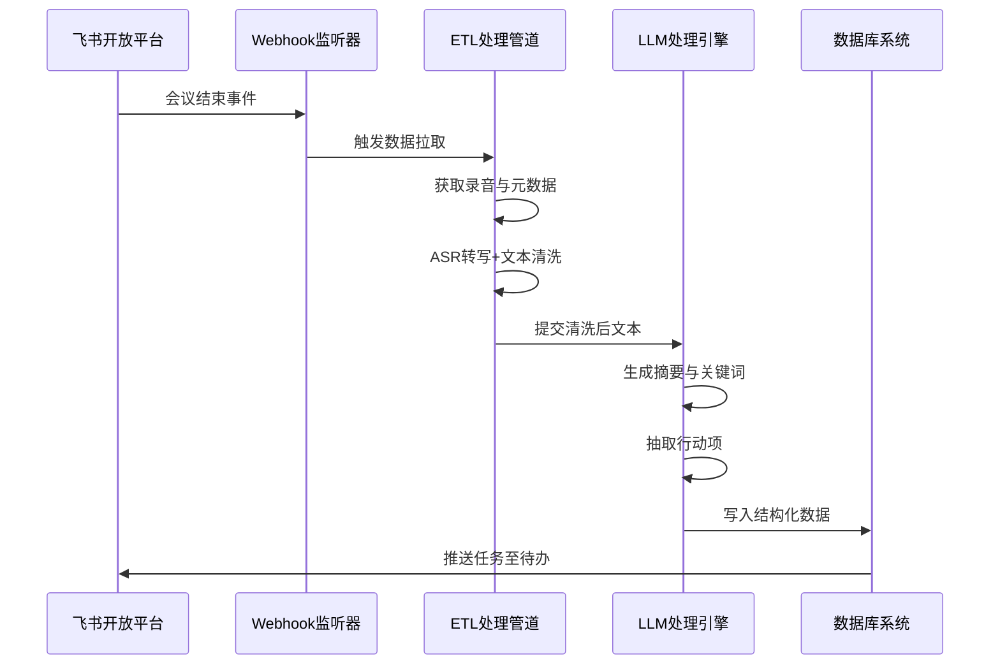
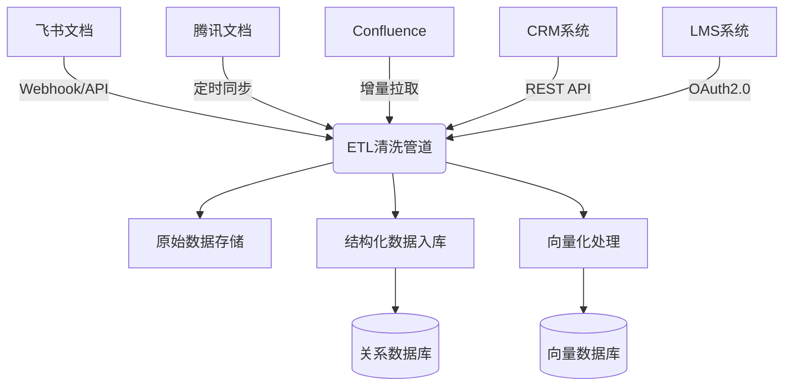
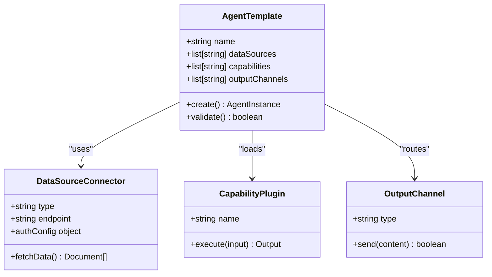
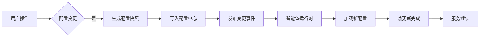
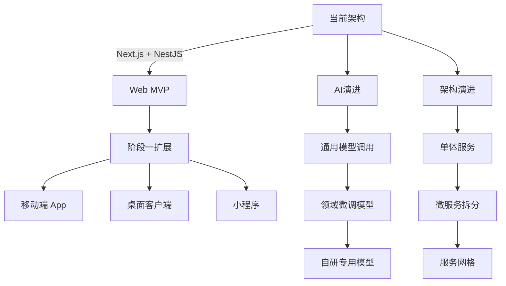

# 系统集成与扩展点

<cite>
**本文档引用文件**  
- [NOVE项目书.md](file://NOVE项目书.md)
- [完整方案构思.md](file://完整方案构思.md)
- [技术框架方案探讨.md](file://技术框架方案探讨.md)
- [实施路线图.md](file://实施路线图.md)
- [视频会议-关于太子老师项目的讨论.md](file://视频会议-关于太子老师项目的讨论.md)
- [项目介绍.md](file://项目介绍.md)
- [项目名称.md](file://项目名称.md)
</cite>

## 目录
1. [引言](#引言)
2. [飞书开放平台API对接机制](#飞书开放平台api对接机制)
3. [云文档与业务系统数据接入](#云文档与业务系统数据接入)
4. [智能体模板系统扩展接口](#智能体模板系统扩展接口)
5. [部门脑配置的灵活性设计](#部门脑配置的灵活性设计)
6. [集成开发指导原则](#集成开发指导原则)
7. [未来扩展技术框架](#未来扩展技术框架)
8. [结论](#结论)

## 引言

nove项目旨在构建一个以“太子洗马式教育”为核心理念的个性化智能教育平台，服务于陆向谦实验室并逐步拓展至其他教育机构与企业。系统通过AI增强人类主观能动性，聚焦真实使用场景，采用渐进迭代方式持续进化。本文件重点阐述外部系统集成方案，涵盖飞书开放平台对接、多源数据接入、智能体扩展机制及未来技术演进路径。

**本节来源**  
- [NOVE项目书.md](file://NOVE项目书.md#L1-L20)
- [项目介绍.md](file://项目介绍.md#L1-L10)

## 飞书开放平台API对接机制

### 会议转录与数据拉取

系统通过飞书开放平台API实现会议数据的自动化采集。利用Webhook监听“会议结束”事件，触发实时数据同步流程。后端服务调用飞书API获取会议录音、参会人员、日程信息等元数据，并启动语音转文字（ASR）处理流程。

转录完成后，原始文本进入ETL清洗管道，进行去噪、分段、发言人识别等预处理操作，确保语义连贯性和结构化质量。

### 纪要生成与关键词提取

基于大语言模型（LLM）的摘要引擎对清洗后的会议文本进行深度分析，生成结构化纪要。该过程包括：
- 会议主题识别
- 核心议题提炼
- 决策点归纳
- 多维度标签打标（如“战略”“执行”“教学”）

摘要结果存储于向量数据库中，支持后续语义检索与知识关联。

### 行动项抽取与闭环跟踪

系统通过提示工程（Prompt Engineering）引导LLM从会议内容中精准抽取行动项，提取字段包括：
- 任务描述
- 负责人（自动匹配飞书组织架构）
- 截止时间（自然语言解析）
- 关联项目/议题

抽取结果写入关系型数据库，并通过飞书机器人推送至相关人员待办列表，实现任务创建、状态更新与闭环追踪。



**图示来源**  
- [NOVE项目书.md](file://NOVE项目书.md#L50-L70)
- [完整方案构思.md](file://完整方案构思.md#L60-L80)
- [视频会议-关于太子老师项目的讨论.md](file://视频会议-关于太子老师项目的讨论.md#L100-L130)

**本节来源**  
- [NOVE项目书.md](file://NOVE项目书.md#L50-L70)
- [完整方案构思.md](file://完整方案构思.md#L60-L90)

## 云文档与业务系统数据接入

### 云文档系统集成

系统支持对接主流云文档平台（飞书文档、腾讯文档、Confluence），通过其开放API实现增量数据同步。接入方式分为两类：

1. **实时同步**：注册Webhook监听文档创建、修改、评论等事件，即时触发内容抓取。
2. **定时批量同步**：每日定时扫描指定知识库目录，拉取新增或更新的文档内容。

文档内容经解析后，提取标题、段落、表格、附件等结构化信息，并进行权限标记，确保后续访问控制的准确性。

### 业务系统API数据接入

系统可对接CRM、ERP、LMS等业务系统API，实现跨系统数据融合。典型接入模式如下：

- **身份与权限同步**：从HR系统或IAM平台拉取组织架构与角色信息，构建RBAC权限模型。
- **学习进度集成**：从LMS获取学员课程完成情况、测验成绩等数据，用于个性化推荐。
- **客户交互记录**：从CRM系统提取客户沟通日志，作为销售智能体的知识来源。

所有外部数据在写入前均经过脱敏处理，敏感字段（如手机号、身份证号）自动模糊化。



**图示来源**  
- [完整方案构思.md](file://完整方案构思.md#L90-L110)
- [技术框架方案探讨.md](file://技术框架方案探讨.md#L40-L60)

**本节来源**  
- [完整方案构思.md](file://完整方案构思.md#L90-L120)

## 智能体模板系统扩展接口

### 模块化配置接口

智能体模板系统提供标准化的扩展接口，支持开发者按需定制部门级AI助手。核心接口包括：

- **数据源绑定接口**：允许指定智能体可访问的知识库分区（如“仅销售部文档”）。
- **能力插件接口**：支持注册问答、报告生成、任务提醒等功能模块。
- **输出通道接口**：定义交互形式（Web页面、企业微信机器人、API端点）。

### API设计规范

所有扩展接口遵循OpenAPI 3.0规范，采用RESTful风格设计，示例如下：

```
POST /api/agents
{
  "name": "教学助手",
  "dataSources": ["meeting_records", "curriculum_ppts"],
  "capabilities": ["qa", "lesson_plan_generation"],
  "outputChannels": ["web", "wechat_bot"]
}
```

接口支持权限校验与调用审计，确保安全可控。

### 微服务架构支持

系统采用混合微服务架构，智能体引擎作为独立服务运行，通过gRPC或REST API与其他模块通信。未来可按需拆分为：
- 智能体调度服务
- 知识检索服务
- 任务执行服务



**图示来源**  
- [完整方案构思.md](file://完整方案构思.md#L120-L150)
- [技术框架方案探讨.md](file://技术框架方案探讨.md#L100-L120)

**本节来源**  
- [完整方案构思.md](file://完整方案构思.md#L120-L160)

## 部门脑配置的灵活性设计

### 低代码配置界面

系统提供可视化低代码界面，允许非技术人员快速配置“部门脑”。用户可通过拖拽方式完成以下设置：
- 选择目标数据源（会议记录、文档库、业务系统）
- 勾选所需功能（问答、日报生成、任务提醒）
- 定义输出形式（Web页面、机器人、API）

配置结果自动生成JSON Schema并持久化存储。

### 权限与隔离机制

基于RBAC模型实现细粒度权限控制：
- **角色定义**：超级管理员、部门管理员、普通成员
- **数据隔离**：每个智能体仅能访问授权范围内的数据
- **操作审计**：记录所有配置变更与访问行为

支持ABAC（属性基访问控制）扩展，满足复杂场景需求。

### 动态加载与热更新

智能体配置支持运行时动态加载，无需重启服务即可生效。系统监听配置变更事件，自动重新初始化相关模块，保障高可用性。



**图示来源**  
- [完整方案构思.md](file://完整方案构思.md#L150-L180)
- [NOVE项目书.md](file://NOVE项目书.md#L100-L110)

**本节来源**  
- [完整方案构思.md](file://完整方案构思.md#L150-L190)

## 集成开发指导原则

### 契约优先开发

所有外部集成遵循“契约优先”原则，明确API接口规范（请求/响应格式、状态码、错误码），使用OpenAPI文档驱动开发流程。

### 沙箱环境先行

新系统接入前，先在沙箱环境中完成数据通路验证，确保不影响生产环境稳定性。

### 异常处理与降级

集成模块需实现完善的异常处理机制，包括：
- 接口超时重试
- 断路器模式防雪崩
- 本地缓存降级策略

### 可观测性保障

所有集成点需暴露监控指标（调用量、延迟、错误率），并通过Sentry等工具实现前端与后端日志追踪。

**本节来源**  
- [NOVE项目书.md](file://NOVE项目书.md#L180-L200)
- [技术框架方案探讨.md](file://技术框架方案探讨.md#L140-L160)

## 未来扩展技术框架

### 多端支持演进

当前以Web MVP为优先交付形态，后续将逐步扩展至：
- 移动端App（React Native）
- 桌面客户端（Electron）
- 微信小程序
- 硬件终端（语音交互设备）

### 模型演进路径

AI能力将按阶段演进：
1. **初期**：调用GPT-4/Claude等通用大模型
2. **中期**：基于企业数据微调专用模型
3. **长期**：训练自研垂直领域模型

### 架构演进方向

系统架构将根据业务规模动态演进：
- **单体架构** → **微服务架构** → **服务网格（Service Mesh）**
- 支持Kubernetes弹性扩缩容，保障高并发场景下的稳定性



**图示来源**  
- [实施路线图.md](file://实施路线图.md#L1-L30)
- [技术框架方案探讨.md](file://技术框架方案探讨.md#L130-L150)

**本节来源**  
- [实施路线图.md](file://实施路线图.md#L1-L30)
- [技术框架方案探讨.md](file://技术框架方案探讨.md#L130-L160)

## 结论

nove项目通过深度集成飞书开放平台，实现了会议数据的自动转录、纪要生成与行动项闭环管理，构建了以“核心智脑”为中枢的知识中台体系。系统支持多源数据接入，涵盖云文档与各类业务系统API，确保信息全面同步。智能体模板系统提供灵活的扩展接口，结合低代码配置与细粒度权限控制，实现“部门脑”的快速定制与部署。整体架构遵循渐进迭代、契约优先、可观测性等开发原则，具备良好的可扩展性与技术演进路径，为未来多端支持、模型优化与架构升级奠定坚实基础。