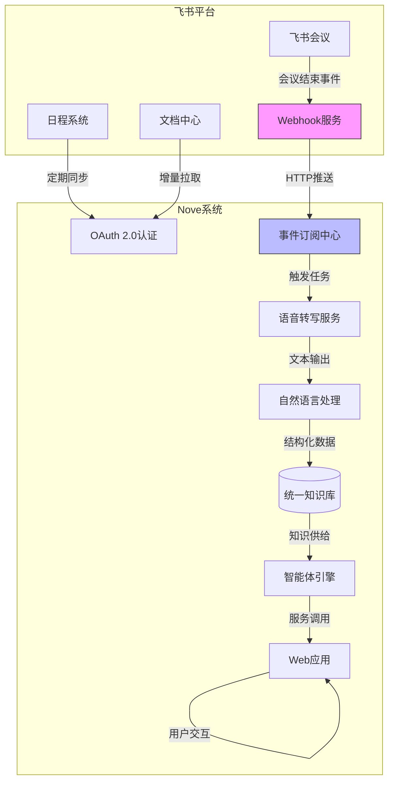
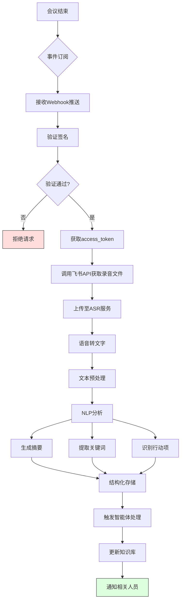

# 飞书开放平台集成

<cite>
**本文档引用文件**  
- [NOVE项目书.md](file://NOVE项目书.md)
- [完整方案构思.md](file://完整方案构思.md)
- [实施路线图.md](file://实施路线图.md)
- [技术框架方案探讨.md](file://技术框架方案探讨.md)
- [视频会议-关于太子老师项目的讨论.md](file://视频会议-关于太子老师项目的讨论.md)
- [项目介绍.md](file://项目介绍.md)
- [项目名称.md](file://项目名称.md)
</cite>

## 目录
1. [项目概述](#项目概述)
2. [飞书集成总体架构](#飞书集成总体架构)
3. [OAuth 2.0认证流程](#oauth-20认证流程)
4. [事件订阅与实时消息推送](#事件订阅与实时消息推送)
5. [会议数据获取与处理流程](#会议数据获取与处理流程)
6. [异步任务处理与结果回传](#异步任务处理与结果回传)
7. [接口调用示例与错误处理](#接口调用示例与错误处理)
8. [权限范围申请最佳实践](#权限范围申请最佳实践)
9. [Webhook配置与本地调试指南](#webhook配置与本地调试指南)
10. [性能与速率限制应对策略](#性能与速率限制应对策略)

## 项目概述

本集成方案旨在实现nove项目与飞书开放平台的深度对接，通过自动化手段提升会议知识管理效率。系统将利用飞书API实现会议录音自动转写、会议纪要生成、关键词提取及行动项识别等核心功能，构建从会议到知识沉淀的完整闭环。

集成目标包括：
- 实现飞书会议结束后自动触发录音转写与内容分析
- 提取结构化会议信息（摘要、关键词、行动项）并入库
- 建立基于角色的权限控制体系，确保数据安全
- 提供可扩展的智能体能力，支持部门级知识应用

该集成是“实验室智脑”项目的核心组成部分，服务于教师、助教、学员及管理人员等多类用户，重点解决会议信息流失、行动项跟踪困难、知识复用率低等问题。

**Section sources**
- [NOVE项目书.md](file://NOVE项目书.md#L1-L50)
- [完整方案构思.md](file://完整方案构思.md#L1-L30)

## 飞书集成总体架构

**Diagram sources**
- [NOVE项目书.md](file://NOVE项目书.md#L51-L70)
- [完整方案构思.md](file://完整方案构思.md#L31-L50)

## OAuth 2.0认证流程

飞书开放平台采用标准OAuth 2.0协议进行身份验证与授权，确保第三方应用安全访问用户数据。nove系统的认证流程如下：

1. **应用注册**：在飞书开放平台创建企业自建应用，获取App ID与App Secret。
2. **授权请求**：引导用户跳转至飞书授权页面，请求必要权限（如`user_info`, `meeting:record:readonly`）。
3. **用户同意**：用户确认授权后，飞书平台重定向至回调URL并携带临时授权码（code）。
4. **令牌获取**：使用App ID、App Secret和授权码向飞书API请求访问令牌（access_token）和刷新令牌（refresh_token）。
5. **令牌存储**：安全存储令牌对，用于后续API调用。
6. **令牌刷新**：当access_token过期时，使用refresh_token获取新令牌对。

该流程遵循最小权限原则，仅申请实现功能所必需的权限范围，并通过RBAC机制在系统内部进行细粒度权限控制。

**Section sources**
- [NOVE项目书.md](file://NOVE项目书.md#L71-L90)
- [技术框架方案探讨.md](file://技术框架方案探讨.md#L10-L25)

## 事件订阅与实时消息推送

为实现会议结束后的自动化处理，系统通过飞书事件订阅机制接收实时通知：

1. **订阅配置**：在飞书开放平台配置事件订阅，监听`meeting.ended`事件。
2. **Webhook注册**：提供公网可访问的Webhook地址，用于接收事件推送。
3. **签名验证**：飞书推送消息时附带签名（X-Lark-Signature），系统需验证签名有效性以防止伪造请求。
4. **事件解析**：解析JSON格式的事件消息，提取会议ID、结束时间、参会人员等关键信息。
5. **任务触发**：根据事件内容生成异步处理任务，进入消息队列等待执行。

此机制确保系统能及时响应会议结束事件，启动后续的数据处理流程，避免轮询带来的资源浪费。

**Section sources**
- [NOVE项目书.md](file://NOVE项目书.md#L91-L110)
- [实施路线图.md](file://实施路线图.md#L15-L30)

## 会议数据获取与处理流程

**Diagram sources**
- [NOVE项目书.md](file://NOVE项目书.md#L111-L130)
- [完整方案构思.md](file://完整方案构思.md#L51-L70)

## 异步任务处理与结果回传

为应对语音转写和NLP处理的高延迟特性，系统采用异步任务队列模式：

1. **任务入队**：Webhook接收事件后，立即生成任务并提交至消息队列（如RabbitMQ/Kafka）。
2. **后台处理**：工作进程从队列中消费任务，依次执行录音下载、转写、摘要生成等操作。
3. **状态跟踪**：每个任务分配唯一ID，状态在数据库中实时更新（待处理、处理中、已完成、失败）。
4. **结果回传**：处理完成后，将结构化结果写入统一知识库，并通过飞书机器人或邮件通知相关责任人。
5. **闭环管理**：行动项自动创建为待办任务，支持状态更新与完成确认，形成管理闭环。

该设计保证了系统的响应性能与可伸缩性，即使面对大量并发会议也能稳定运行。

**Section sources**
- [NOVE项目书.md](file://NOVE项目书.md#L131-L150)
- [实施路线图.md](file://实施路线图.md#L31-L45)

## 接口调用示例与错误处理

### 关键接口调用
- **获取access_token**: `POST /open-apis/auth/v3/tenant_access_token/internal`
- **订阅事件验证**: `POST /webhook/event`
- **查询会议记录**: `GET /open-apis/meeting/v1/record/list`
- **下载录音文件**: `GET /open-apis/drive/v1/files/{file_token}/download`

### 错误重试策略
- **瞬时错误**（5xx、网络超时）：指数退避重试，最多3次，间隔为2^N秒。
- **限流错误**（429）：根据`Retry-After`头指定时间等待后重试。
- **认证失效**（401）：自动刷新access_token后重试一次。
- **永久错误**（4xx参数错误）：记录日志并标记任务失败，不重试。

所有失败任务均进入死信队列，供人工排查与手动重试。

**Section sources**
- [技术框架方案探讨.md](file://技术框架方案探讨.md#L26-L40)
- [完整方案构思.md](file://完整方案构思.md#L71-L90)

## 权限范围申请最佳实践

为保障数据安全与用户隐私，权限申请遵循以下原则：

1. **最小权限原则**：仅申请必要权限，如`user_info`、`meeting:record:readonly`、`calendar:readonly`。
2. **分级授权**：根据用户角色分配不同数据访问权限，如普通成员仅能查看自己参与的会议。
3. **动态授权**：敏感操作（如导出完整录音）需二次确认或管理员审批。
4. **权限审计**：记录所有权限变更与数据访问日志，支持追溯与审查。

在飞书应用配置中明确说明各项权限的用途，增强用户信任感。

**Section sources**
- [NOVE项目书.md](file://NOVE项目书.md#L151-L170)
- [完整方案构思.md](file://完整方案构思.md#L91-L110)

## Webhook配置与本地调试指南

### Webhook配置步骤
1. 在飞书开放平台进入应用管理页面。
2. 选择“事件订阅”功能，点击“启用事件订阅”。
3. 填写公网可访问的回调URL（如`https://yourdomain.com/api/lark/webhook`）。
4. 设置加密密钥（Encrypt Key）用于签名计算。
5. 订阅所需事件类型（如`meeting.ended`）。
6. 保存配置并完成URL验证。

### 本地调试方法
- **内网穿透**：使用ngrok或localtunnel将本地服务暴露为公网URL。
- **模拟请求**：使用Postman或curl发送符合飞书格式的JSON请求进行测试。
- **日志监控**：开启详细日志记录，捕获请求头、签名、消息体等信息。
- **签名验证工具**：使用飞书提供的签名验证代码片段确保本地验证逻辑正确。

建议在沙箱环境中完成全部调试后再上线生产环境。

**Section sources**
- [技术框架方案探讨.md](file://技术框架方案探讨.md#L41-L60)
- [视频会议-关于太子老师项目的讨论.md](file://视频会议-关于太子老师项目的讨论.md#L5-L20)

## 性能与速率限制应对策略

飞书API对调用频率实施严格限制，系统需采取以下措施应对：

1. **速率限制识别**：监控HTTP响应头中的`X-RateLimit-Limit`、`X-RateLimit-Remaining`和`X-RateLimit-Reset`字段。
2. **请求节流**：在客户端实现令牌桶算法，平滑请求流量。
3. **批量处理**：合并多个小请求为批量请求（如批量获取用户信息）。
4. **缓存机制**：对高频读取的静态数据（如用户信息、部门结构）进行本地缓存，设置合理TTL。
5. **优先级队列**：为不同类型的任务设置优先级，确保关键任务优先执行。
6. **弹性伸缩**：在高负载时段自动增加工作进程数量，提升处理能力。

通过以上策略，系统可在遵守平台规则的前提下最大化数据处理效率。

**Section sources**
- [NOVE项目书.md](file://NOVE项目书.md#L171-L190)
- [实施路线图.md](file://实施路线图.md#L46-L60)