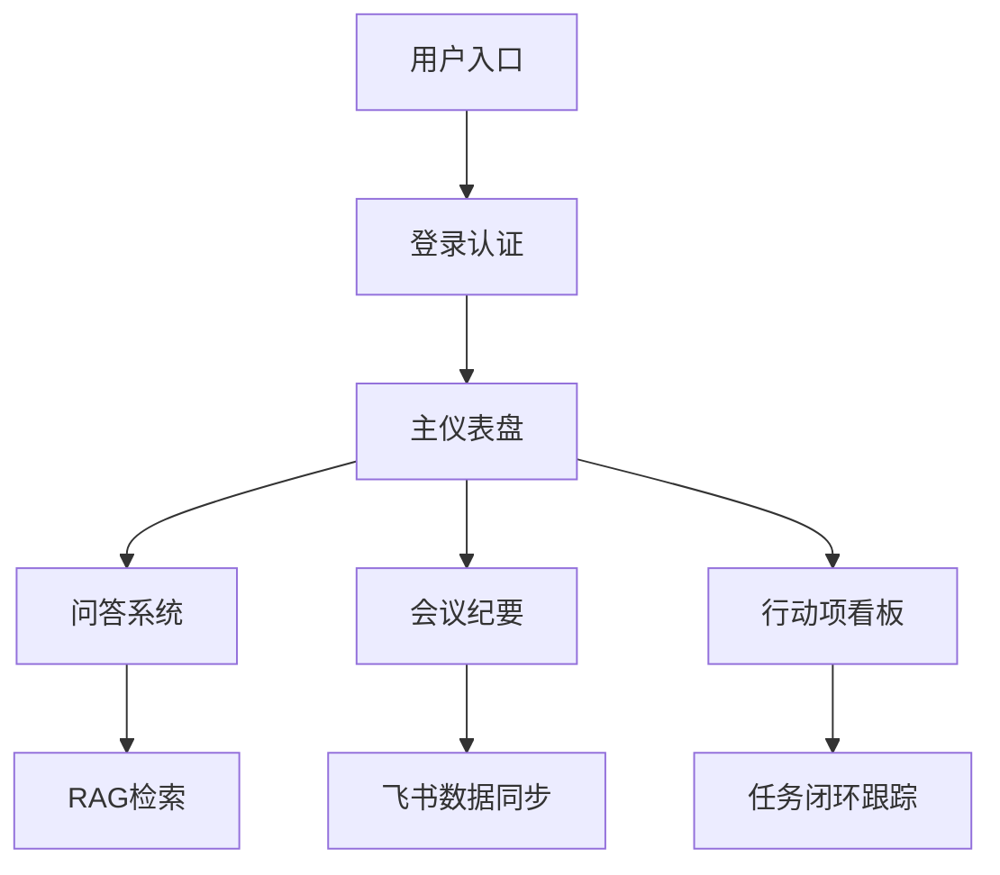
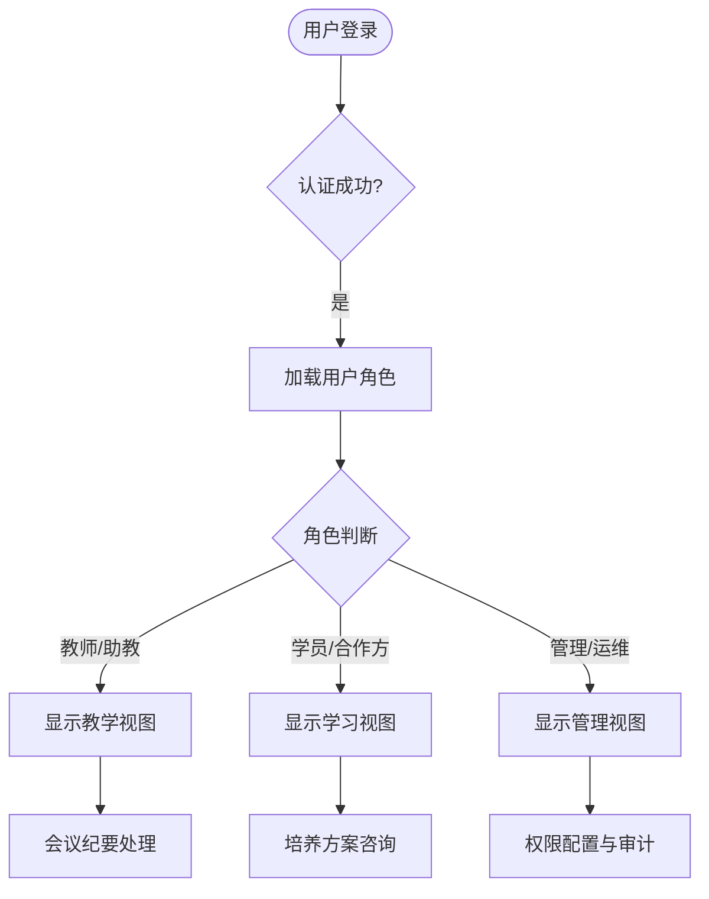
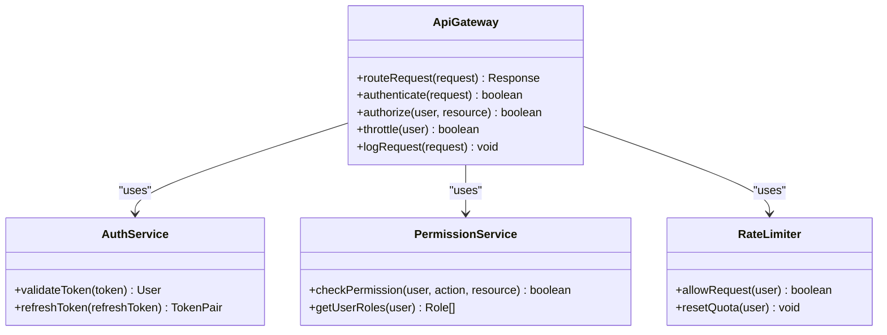

# 应用与体验层

<cite>
**本文档引用文件**  
- [项目介绍.md](file://项目介绍.md)
- [NOVE项目书.md](file://NOVE项目书.md)
- [实施路线图.md](file://实施路线图.md)
- [技术框架方案探讨.md](file://技术框架方案探讨.md)
- [视频会议-关于太子老师项目的讨论.md](file://视频会议-关于太子老师项目的讨论.md)
- [项目名称.md](file://项目名称.md)
</cite>

## 目录
1. [引言](#引言)
2. [Web MVP前端界面设计](#web-mvp前端界面设计)
3. [API接口暴露方式与多端访问支持](#api接口暴露方式与多端访问支持)
4. [用户界面信息架构与交互流程](#用户界面信息架构与交互流程)
5. [响应式设计原则](#响应式设计原则)
6. [API网关设计](#api网关设计)
7. [个性化教育体验的渐进式迭代路径](#个性化教育体验的渐进式迭代路径)
8. [功能演进规划](#功能演进规划)
9. [结论](#结论)

## 引言

nove平台旨在打造“太子洗马”式的个性化智能教育体验，为每位学员提供专属的、精英级的教育服务。本文件聚焦于应用与体验层的整体设计，涵盖Web MVP前端界面、API接口暴露方式、多端访问支持（如移动端、飞书插件）等关键方面。通过系统化的信息架构、流畅的交互流程与响应式设计原则，确保用户在不同设备和场景下均能获得一致且优质的使用体验。同时，结合项目目标，阐述如何通过渐进式迭代实现个性化教育愿景，并规划从MVP到完整产品的功能演进路径。

**Section sources**
- [项目介绍.md](file://项目介绍.md#L1-L40)
- [项目名称.md](file://项目名称.md#L1-L46)

## Web MVP前端界面设计

Web MVP作为平台的首个可用版本，采用Next.js框架构建，结合Tailwind CSS实现现代化UI设计。前端架构遵循SSR（服务器端渲染）原则，提升SEO性能与首屏加载速度。核心功能模块包括问答界面、会议纪要展示、行动项看板等，均围绕真实使用场景设计，确保用户能够快速上手并获得价值。

前端技术栈选择Next.js + Tailwind CSS + shadcn/ui组件库，确保开发效率与视觉一致性。状态管理采用Zustand或Recoil等轻量级方案，保证高性能响应。通过内置API路由机制，简化前后端通信，提升开发协同效率。

**Diagram sources**
- [NOVE项目书.md](file://NOVE项目书.md#L1-L368)
- [技术框架方案探讨.md](file://技术框架方案探讨.md#L1-L160)

**Section sources**
- [NOVE项目书.md](file://NOVE项目书.md#L1-L368)
- [技术框架方案探讨.md](file://技术框架方案探讨.md#L1-L160)

## API接口暴露方式与多端访问支持

平台通过标准化API接口实现多端访问支持，确保Web、移动端、飞书插件等终端能够无缝集成。API设计遵循OpenAPI契约驱动原则，提供清晰的接口文档与SDK示例，降低第三方接入成本。

### 多端支持策略
- **Web端**：基于Next.js构建响应式Web应用，支持主流浏览器
- **移动端**：预留React Native或Flutter扩展接口，未来可快速开发原生应用
- **飞书插件**：通过OAuth 2.0认证与Webhook订阅，实现会议数据自动同步与交互
- **桌面端**：支持Electron框架扩展，满足特定场景下的离线使用需求

API网关统一管理所有外部请求，支持版本控制、限流、鉴权等功能，保障系统的稳定性与安全性。

**Section sources**
- [NOVE项目书.md](file://NOVE项目书.md#L1-L368)
- [技术框架方案探讨.md](file://技术框架方案探讨.md#L1-L160)

## 用户界面信息架构与交互流程

平台的信息架构以用户角色为核心，分为教师/助教、学员/合作方、管理与运维三类角色，每类角色拥有独立的功能视图与权限边界。

### 核心交互流程
1. **用户登录**：支持OAuth 2.0、JWT等多种认证方式
2. **权限校验**：基于RBAC模型进行角色权限匹配
3. **功能导航**：通过侧边栏菜单快速跳转至核心模块
4. **数据操作**：支持搜索、筛选、排序、导出等常用操作
5. **反馈闭环**：操作结果实时提示，关键任务设置完成确认机制

交互设计强调扁平化协作与信息直达，减少流程摩擦。例如，在会议纪要模块中，用户可直接查看AI生成的摘要、关键词与行动项，并一键分配责任人，形成管理闭环。

**Diagram sources**
- [NOVE项目书.md](file://NOVE项目书.md#L1-L368)
- [视频会议-关于太子老师项目的讨论.md](file://视频会议-关于太子老师项目的讨论.md#L1-L234)

**Section sources**
- [NOVE项目书.md](file://NOVE项目书.md#L1-L368)
- [视频会议-关于太子老师项目的讨论.md](file://视频会议-关于太子老师项目的讨论.md#L1-L234)

## 响应式设计原则

前端界面遵循响应式设计原则，适配不同屏幕尺寸与设备类型。设计规范包括：
- **断点设置**：针对移动端、平板、桌面端设置不同布局断点
- **弹性布局**：使用CSS Grid与Flexbox实现自适应布局
- **触控优化**：按钮与交互元素满足最小触控区域要求
- **字体可读性**：根据不同设备调整字体大小与行高
- **加载状态**：提供骨架屏、进度条等加载反馈机制

通过Tailwind CSS的实用类系统，快速实现一致的视觉风格与交互体验，确保在不同终端上均能提供高质量的用户界面。

**Section sources**
- [技术框架方案探讨.md](file://技术框架方案探讨.md#L1-L160)
- [NOVE项目书.md](file://NOVE项目书.md#L1-L368)

## API网关设计

API网关作为应用与体验层的核心枢纽，承担路由分发、认证鉴权、流量控制、日志审计等关键职责。

### 路由配置
- **路径映射**：将外部请求映射至后端微服务或函数
- **版本管理**：支持/v1、/v2等版本前缀，确保向后兼容
- **动态路由**：支持基于用户角色与权限的动态路由规则

### 认证机制
- **多协议支持**：OAuth 2.0、JWT、SAML等
- **权限感知**：结合RBAC与ABAC模型，实现细粒度访问控制
- **会话管理**：支持分布式会话存储与自动续期

### 版本管理策略
- **灰度发布**：新版本API可先对部分用户开放
- **废弃策略**：旧版本API标记为deprecated并提供迁移指引
- **文档同步**：API文档随代码变更自动更新，确保一致性

**Diagram sources**
- [NOVE项目书.md](file://NOVE项目书.md#L1-L368)
- [技术框架方案探讨.md](file://技术框架方案探讨.md#L1-L160)

**Section sources**
- [NOVE项目书.md](file://NOVE项目书.md#L1-L368)
- [技术框架方案探讨.md](file://技术框架方案探讨.md#L1-L160)

## 个性化教育体验的渐进式迭代路径

平台采用“先易后难、快速迭代”的建设原则，围绕真实使用场景逐步扩展功能。个性化教育体验的实现分为三个阶段：

### 第一阶段：MVP原型（3-4个月）
- 搭建基础架构（Next.js + PostgreSQL + Prisma）
- 实现用户认证与权限系统
- 开发学生管理、课程管理基础功能
- 集成简单AI答疑功能

### 第二阶段：核心功能完善（4-6个月）
- 构建RAG系统与向量数据库
- 实现个性化推荐算法
- 开发WebSocket实时通信功能
- 完善在线协作与实时答疑系统

### 第三阶段：高级特性（4-5个月）
- 构建学习轨迹分析系统
- 实现智能报告生成
- 开发家长沟通自动化系统
- 进行系统性能优化与微服务架构迁移

该路径确保每个阶段都能交付可验证的价值，逐步逼近“太子洗马”式个性化教育的终极目标。

**Section sources**
- [实施路线图.md](file://实施路线图.md#L1-L34)
- [NOVE项目书.md](file://NOVE项目书.md#L1-L368)

## 功能演进规划

从MVP到完整产品的功能演进遵循“飞书会议打通 → RAG问答 → 智能体编排 → 多端应用”的路线。具体规划如下：

| 阶段 | 时间 | 核心目标 | 交付物 |
|------|------|----------|--------|
| M1 | 第1-2周 | 基础架构与飞书集成 | 项目骨架、飞书API、会议处理链路 |
| M2 | 第3-4周 | 知识库与RAG系统 | 知识库架构、RAG API、权限检索 |
| M3 | 第5-6周 | 核心智脑与会话系统 | 智脑引擎、会话管理、质量监控 |
| M4 | 第7-8周 | 智能体编排 | 编排引擎、部门智能体模板 |
| M5 | 第9-10周 | Web应用开发 | Web MVP、用户界面、交互系统 |
| M6 | 第11周 | 测试优化 | 测试报告、监控看板、安全方案 |
| Release | 第12周 | 正式发布 | v1.0产品、完整文档体系 |

该规划确保每两周都有可评审的成果，支持持续集成与快速反馈。

**Section sources**
- [NOVE项目书.md](file://NOVE项目书.md#L1-L368)
- [实施路线图.md](file://实施路线图.md#L1-L34)

## 结论

nove平台通过精心设计的应用与体验层，为“太子洗马”式个性化教育提供了坚实的技术支撑。Web MVP前端界面以用户为中心，结合响应式设计原则，确保跨设备一致性体验。API网关通过标准化接口暴露方式，支持Web、移动端、飞书插件等多端访问。渐进式迭代路径与清晰的功能演进规划，确保项目能够从小处着手，逐步扩展，最终实现为每位学员提供专属精英教育的愿景。未来将持续优化用户体验，拓展更多智能功能，推动个性化教育的创新发展。