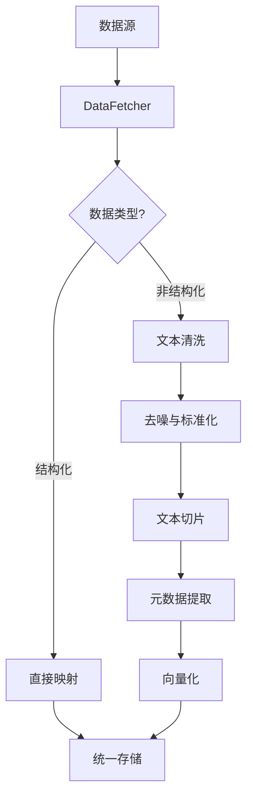

# 数据源层

<cite>
**本文档中引用的文件**  
- [太子老师项目-项目书.md](file://太子老师项目-项目书.md)
- [完整方案构思.md](file://完整方案构思.md)
- [实施路线图.md](file://实施路线图.md)
- [技术框架方案探讨.md](file://技术框架方案探讨.md)
- [视频会议-关于太子老师项目的讨论.md](file://视频会议-关于太子老师项目的讨论.md)
- [项目介绍.md](file://项目介绍.md)
- [项目名称.md](file://项目名称.md)
</cite>

## 目录
1. [引言](#引言)
2. [数据源接入设计](#数据源接入设计)
3. [认证与连接机制](#认证与连接机制)
4. [数据同步策略](#数据同步策略)
5. [ETL清洗流程](#etl清洗流程)
6. [非结构化数据处理逻辑](#非结构化数据处理逻辑)
7. [配置示例与常见问题排查](#配置示例与常见问题排查)
8. [未来扩展路径](#未来扩展路径)
9. [结论](#结论)

## 引言
nove项目旨在构建一个智能化知识管理与教学辅助系统，其核心能力依赖于多源异构数据的高效整合。本系统需从飞书会议记录、文档系统、业务系统API等多种数据源中持续获取信息，并通过统一的数据处理管道实现结构化与语义增强。本文件详细阐述数据源层的设计理念、实现机制与未来演进方向。

## 数据源接入设计
nove项目的数据源层采用模块化架构，支持多种类型的数据接入：

- **飞书会议系统**：通过飞书开放平台API实时拉取会议纪要、音视频转录文本及参会人员信息。
- **文档管理系统**：集成企业内部文档库（如飞书文档、语雀等），获取课程资料、项目手册等富文本内容。
- **业务系统API**：对接CRM、ERP、教务系统等后端服务，提取结构化业务数据用于上下文关联分析。

所有数据源通过统一的`DataSourceConnector`抽象接口接入，确保扩展性与一致性。

**Section sources**
- [技术框架方案探讨.md](file://技术框架方案探讨.md#L1-L50)
- [完整方案构思.md](file://完整方案构思.md#L20-L80)

## 认证与连接机制
各数据源采用独立的认证策略以保障安全性与权限隔离：

- **飞书平台**：使用OAuth 2.0授权码模式获取用户级访问令牌，结合应用级凭证进行API调用。
- **内部文档系统**：基于JWT令牌或API Key实现服务间认证，支持RBAC权限校验。
- **业务系统API**：采用双向TLS（mTLS）+ API网关鉴权方式，确保传输安全与调用合法性。

连接池管理机制用于维持长连接，减少频繁建立连接带来的性能损耗。

**Section sources**
- [技术框架方案探讨.md](file://技术框架方案探讨.md#L51-L100)
- [实施路线图.md](file://实施路线图.md#L30-L60)

## 数据同步策略
根据数据更新频率与业务重要性，设定差异化同步周期：

| 数据源类型       | 同步频率     | 触发方式         | 增量标识字段       |
|------------------|--------------|------------------|--------------------|
| 飞书会议记录     | 实时（事件驱动） | Webhook推送      | `event_timestamp`  |
| 文档系统内容     | 每小时轮询   | 定时任务         | `updated_at`       |
| 业务系统数据     | 每日全量+每5分钟增量 | 调度任务         | `last_modified`    |

同步过程中引入版本控制与冲突检测机制，避免数据覆盖。

**Section sources**
- [实施路线图.md](file://实施路线图.md#L61-L100)
- [完整方案构思.md](file://完整方案构思.md#L81-L120)

## ETL清洗流程
ETL流程分为三个阶段：抽取（Extract）、转换（Transform）、加载（Load）：

1. **抽取阶段**：由`DataFetcher`组件调用各数据源适配器，获取原始数据并暂存至临时缓冲区。
2. **转换阶段**：对非结构化文本进行去噪、标准化、切片与元数据提取。
3. **加载阶段**：将处理后的结构化数据写入统一知识图谱存储或向量数据库。

流程支持断点续传与错误重试机制，确保数据完整性。



**Diagram sources**
- [完整方案构思.md](file://完整方案构思.md#L121-L150)
- [技术框架方案探讨.md](file://技术框架方案探讨.md#L101-L130)

## 非结构化数据处理逻辑
针对会议记录、课程资料、项目手册等非结构化数据，设计如下处理逻辑：

### 文本去噪
去除转录文本中的语气词、重复句、无关对话（如“嗯”、“那个”），保留核心语义内容。

### 切片策略
采用语义感知切片算法（Semantic Chunking），依据段落边界、标题层级与句子连贯性进行分块，确保每段文本语义完整，长度控制在512 token以内。

### 元数据提取
利用NLP模型自动提取关键元数据：
- 来源：`source_url`
- 创建者：`author`
- 创建时间：`created_time`
- 主题标签：`tags`
- 摘要：`summary`

元数据用于后续检索增强与权限控制。

**Section sources**
- [完整方案构思.md](file://完整方案构思.md#L151-L200)
- [太子老师项目-项目书.md](file://太子老师项目-项目书.md#L40-L80)

## 配置示例与常见问题排查
### 配置示例（飞书数据源）
```yaml
datasource:
  type: lark
  app_id: xxxxxxxx
  app_secret: yyyyyyyy
  encrypt_key: zzzzzzzz
  event_callback_url: https://nove.example.com/callback/lark
  sync_interval: 3600
  scopes:
    - contact:readonly
    - calendar:readonly
    - doc:readonly
```

### 常见问题排查
- **问题1：无法获取飞书API访问令牌**  
  检查`app_id`与`app_secret`是否正确，确认OAuth回调域名已注册。

- **问题2：文档同步延迟严重**  
  查看定时任务调度器状态，确认网络连通性与API限流情况。

- **问题3：文本切片语义断裂**  
  调整切片阈值参数，启用上下文重叠机制（overlap=64 tokens）。

**Section sources**
- [实施路线图.md](file://实施路线图.md#L101-L140)
- [技术框架方案探讨.md](file://技术框架方案探讨.md#L131-L160)

## 未来扩展路径
为支持新数据源的快速接入，设计以下技术路径：

1. **插件化适配器框架**：定义标准`DataSourceAdapter`接口，开发者可实现`fetch()`、`authenticate()`、`metadata()`等方法。
2. **低代码配置界面**：提供Web界面配置新数据源的连接参数与同步策略。
3. **自动发现机制**：通过服务注册中心自动识别企业内部可用API并生成接入模板。
4. **AI辅助映射**：利用大模型自动推断非结构化数据的字段含义与结构化映射规则。

该设计确保系统具备良好的可扩展性与维护性。

**Section sources**
- [技术框架方案探讨.md](file://技术框架方案探讨.md#L161-L200)
- [完整方案构思.md](file://完整方案构思.md#L201-L240)

## 结论
nove项目的数据源层设计充分考虑了多源异构数据的接入复杂性，通过模块化架构、灵活认证机制与智能ETL流程，实现了高可用、可扩展的数据集成能力。未来将通过插件化与AI辅助手段进一步降低新数据源接入成本，支撑系统持续演进。