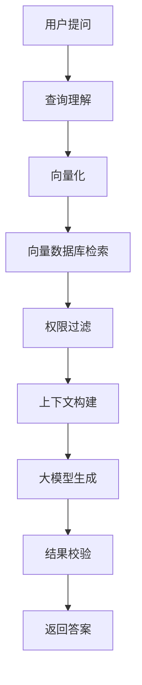
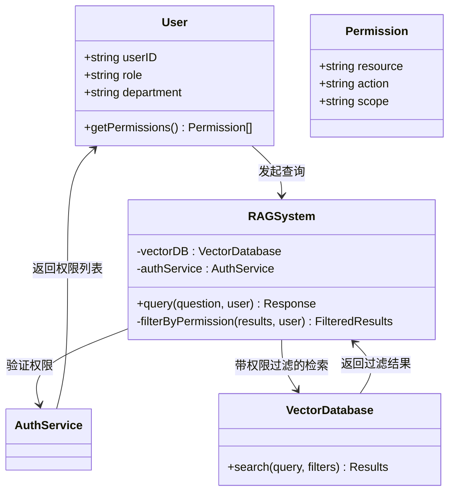

# RAG问答系统

<cite>
**本文档引用文件**  
- [NOVE项目书.md](file://NOVE项目书.md)
- [技术框架方案探讨.md](file://技术框架方案探讨.md)
- [视频会议-关于太子老师项目的讨论.md](file://视频会议-关于太子老师项目的讨论.md)
- [实施路线图.md](file://实施路线图.md)
- [项目介绍.md](file://项目介绍.md)
</cite>

## 目录
1. [引言](#引言)
2. [RAG系统工作机制](#rag系统工作机制)
3. [多轮会话与状态管理](#多轮会话与状态管理)
4. [检索结果可追溯性设计](#检索结果可追溯性设计)
5. [权限感知检索实现](#权限感知检索实现)
6. [数据源集成逻辑](#数据源集成逻辑)
7. [多模型响应解析与一致性保障](#多模型响应解析与一致性保障)
8. [典型使用场景示例](#典型使用场景示例)
9. [性能优化建议](#性能优化建议)
10. [结论](#结论)

## 引言

本系统旨在构建一个“太子洗马式教育”平台，为每位学员提供顶级导师团队与AI协同的个性化教育服务。通过RAG（检索增强生成）技术，系统能够实现智能问答、知识检索与个性化推荐，服务于陆向谦实验室并逐步拓展至其他教育机构和企业。

核心理念是“一生一案、因材施教”，结合AI助手实现学情分析、个性化推荐和家长沟通自动化。系统以人为核心，AI作为增强工具，采用渐进迭代方式，围绕真实使用场景交付最小可用版本（MVP），确保数据安全与合规。

**Section sources**
- [项目介绍.md](file://项目介绍.md#L1-L40)

## RAG系统工作机制

### 查询理解
系统接收用户问题后，利用大语言模型进行意图识别与关键词提取，将自然语言转换为可处理的查询向量。此过程支持模糊匹配与语义扩展，提升检索准确性。

### 向量数据库检索
采用Pinecone（初期）→ Weaviate/Milvus（后期）的向量数据库架构，将课程目录、案例手册、会议记录等非结构化文本进行嵌入（Embedding）处理，构建高维语义索引。查询向量在向量空间中进行相似度匹配，返回最相关的知识片段。

### 上下文融合
检索结果与用户历史数据（如学习进度、偏好设置）相结合，形成完整的上下文输入。系统通过提示工程（Prompt Engineering）引导大模型生成更贴合用户需求的回答。

### 大语言模型生成
综合上下文信息，调用GPT-4、Claude或DeepSeek等大模型生成最终回答。系统支持多模型协同策略：GPT-4用于复杂分析与报告生成，Claude擅长长文本处理与会议摘要，DeepSeek用于成本敏感场景的本地化推理。

**Diagram sources**
- [NOVE项目书.md](file://NOVE项目书.md#L150-L180)
- [技术框架方案探讨.md](file://技术框架方案探讨.md#L50-L70)

**Section sources**
- [NOVE项目书.md](file://NOVE项目书.md#L150-L180)
- [技术框架方案探讨.md](file://技术框架方案探讨.md#L50-L70)

## 多轮会话与状态管理

系统支持上下文连续对话，维持会话记忆。通过会话ID绑定用户交互历史，记录每轮问答的上下文信息。核心智脑模块负责管理会话状态，支持以下功能：

- **上下文继承**：后续问题自动继承前序对话背景
- **意图延续**：识别用户追问行为，保持主题连贯性
- **记忆更新**：根据新信息动态调整用户画像
- **超时清理**：设置会话有效期，防止状态膨胀

会话数据存储于PostgreSQL数据库，结合Redis缓存提升访问性能。系统支持跨设备同步会话状态，确保用户体验一致性。

**Section sources**
- [NOVE项目书.md](file://NOVE项目书.md#L185-L190)

## 检索结果可追溯性设计

为确保答案可靠性，系统提供完整的引用溯源机制：

1. **来源标注**：在回答末尾标注引用的知识块来源（如课程PPT、会议纪要）
2. **链接跳转**：提供可点击的原文链接，支持快速核验
3. **置信度提示**：对低置信度回答添加不确定性说明
4. **版本追踪**：记录知识块的创建与修改时间，支持历史回溯

该机制结合规则引擎进行幻觉检测，当生成内容与检索结果偏差较大时，自动触发警告或拒绝响应，保障输出质量。

**Section sources**
- [NOVE项目书.md](file://NOVE项目书.md#L190-L195)

## 权限感知检索实现

系统基于RBAC（角色访问控制）+ ABAC（属性访问控制）模型实现精细化权限管理：

### 权限模型
- **角色维度**：教师、助教、学员、管理员等
- **部门维度**：教研组、运营组、合作方等
- **数据敏感度**：公开、内部、机密三级分类

### 检索过滤机制
1. 用户认证后获取权限令牌（JWT）
2. 检索请求携带权限标签
3. 向量数据库查询时自动过滤超出权限范围的知识块
4. 返回结果仅包含用户有权访问的内容

例如，某学员只能检索其所在课程的相关资料，无法查看其他班级的培养方案；助教可访问教学资料但不能查看人事信息。

**Diagram sources**
- [NOVE项目书.md](file://NOVE项目书.md#L200-L210)
- [技术框架方案探讨.md](file://技术框架方案探讨.md#L100-L110)

**Section sources**
- [NOVE项目书.md](file://NOVE项目书.md#L200-L210)

## 数据源集成逻辑

系统支持多种数据源的统一接入与处理：

### 飞书知识库集成
- **OAuth 2.0认证**：安全获取用户授权
- **Webhook订阅**：实时接收会议创建、结束事件
- **API调用**：
  - 获取会议录音与转写文本
  - 提取会议摘要、关键词与行动项
  - 关联项目与责任人，形成闭环跟踪

### 课程文档处理
- **文件上传接口**：支持PPT、PDF、Word等格式
- **智能分块**：使用LLM进行语义切分，避免机械分割
- **元数据提取**：自动识别标题、作者、日期等信息
- **版本控制**：保留历史版本，支持回滚与对比

### 其他云文档
通过API接入Google Docs、Notion等第三方平台，统一清洗与向量化处理，构建全域知识中台。

**Section sources**
- [NOVE项目书.md](file://NOVE项目书.md#L80-L100)

## 多模型响应解析与一致性保障

### 模型协同策略
| 模型 | 适用场景 | 优势 |
|------|----------|------|
| GPT-4 | 综合分析、报告生成 | 强大的推理与表达能力 |
| Claude | 长文本处理、会议摘要 | 支持超长上下文（100K tokens） |
| DeepSeek | 成本敏感场景 | 本地化部署，降低调用成本 |

### 一致性保障机制
1. **标准化输出模板**：定义统一的回答格式，包含标题、正文、引用三部分
2. **后处理校验**：使用轻量级模型对生成内容进行合规性检查
3. **缓存比对**：相同问题优先返回已验证的高质量答案
4. **人工反馈闭环**：用户可标记错误回答，用于后续模型微调

系统通过A/B测试持续评估各模型表现，动态调整路由策略，确保整体服务质量稳定。

**Section sources**
- [NOVE项目书.md](file://NOVE项目书.md#L350-L370)
- [技术框架方案探讨.md](file://技术框架方案探讨.md#L80-L90)

## 典型使用场景示例

### 场景一：学员咨询培养方案
**用户**：“我的下一阶段学习重点是什么？”  
**系统流程**：
1. 识别用户身份与当前学习阶段
2. 检索其个人培养方案与近期表现数据
3. 结合导师评语生成个性化建议
4. 返回答案并附上课程链接

### 场景二：助教查询SOP
**用户**：“新学员入组流程有哪些步骤？”  
**系统流程**：
1. 理解查询意图为操作指南
2. 检索最新版SOP文档相关章节
3. 提取关键步骤并结构化呈现
4. 标注文档版本与更新时间

### 场景三：会议行动项跟踪
**用户**：“上周会议中我有哪些待办事项？”  
**系统流程**：
1. 关联用户与会议记录
2. 抽取分配给该用户的行动项
3. 显示截止日期与完成状态
4. 支持一键标记完成

这些场景体现了系统在教育服务中的实际价值，显著提升信息获取效率。

**Section sources**
- [NOVE项目书.md](file://NOVE项目书.md#L60-L70)

## 性能优化建议

### 检索性能优化
- **索引分片**：按数据类型或部门拆分向量索引，减少单次搜索范围
- **缓存策略**：高频问题答案缓存至Redis，降低数据库压力
- **异步预加载**：预测用户可能的后续问题，提前检索相关知识

### 系统架构优化
- **微服务拆分**：将RAG核心、权限服务、数据接入等模块独立部署
- **负载均衡**：多实例部署大模型网关，支持横向扩展
- **监控告警**：集成Prometheus+Grafana，实时监控响应延迟与错误率

### 成本控制
- **模型降级**：简单问题优先调用低成本模型
- **批量处理**：非实时任务（如索引重建）采用批处理模式
- **资源调度**：夜间低峰期执行耗时任务，充分利用计算资源

**Section sources**
- [NOVE项目书.md](file://NOVE项目书.md#L500-L520)

## 结论

本RAG问答系统通过查询理解、向量检索、上下文融合与大模型生成的完整链条，实现了高效准确的知识服务。系统具备多轮会话管理、可追溯引用、权限感知检索等关键特性，支持飞书知识库、课程文档等多种数据源集成。

采用GPT-4、Claude、DeepSeek等多模型协同策略，在保证回答质量的同时实现成本优化。未来可通过微服务架构演进与AI效果持续评估，不断提升系统性能与用户体验，最终构建一个真正智能化的教育中台。