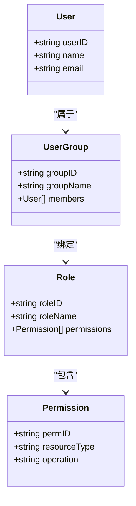
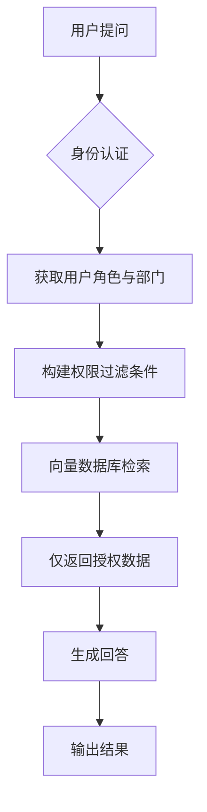
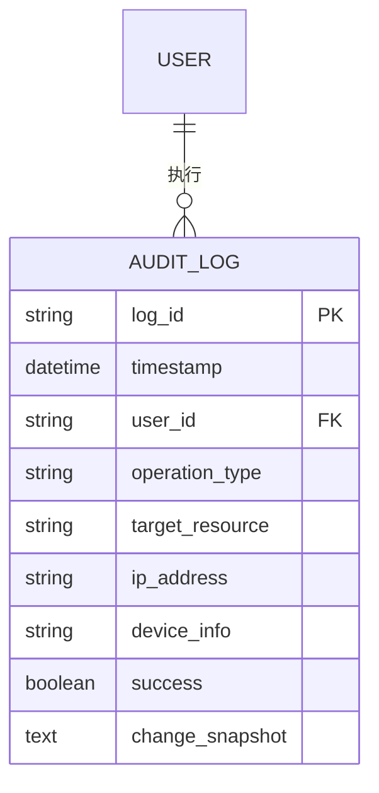

# 权限与审计控制

<cite>
**本文档引用文件**  
- [NOVE项目书.md](file://NOVE项目书.md)
- [完整方案构思.md](file://完整方案构思.md)
- [实施路线图.md](file://实施路线图.md)
</cite>

## 目录
1. [引言](#引言)
2. [RBAC权限模型在中台层的应用](#rbac权限模型在中台层的应用)
3. [权限控制对RAG检索范围的影响](#权限控制对rag检索范围的影响)
4. [内容脱敏策略的触发与执行机制](#内容脱敏策略的触发与执行机制)
5. [操作审计日志的设计与实现](#操作审计日志的设计与实现)
6. [权限系统与飞书组织架构的同步机制](#权限系统与飞书组织架构的同步机制)
7. [扩展性考虑与未来演进](#扩展性考虑与未来演进)

## 引言
本项目旨在构建一个以“实验室智脑”为核心的AI教育中台系统，实现知识沉淀、智能问答、会议数据闭环管理及部门级智能体编排。为保障系统的安全性与合规性，权限与审计体系被确立为核心建设目标之一。该体系基于RBAC（基于角色的访问控制）模型，结合ABAC（属性基访问控制）进行补充，确保数据在不同用户层级间的最小可见与分级授权原则。同时，系统需支持敏感信息脱敏、全链路操作审计，并与飞书组织架构实时同步，支撑多部门、多场景下的安全协作。

**Section sources**
- [NOVE项目书.md](file://NOVE项目书.md#L1-L50)
- [完整方案构思.md](file://完整方案构思.md#L1-L30)

## RBAC权限模型在中台层的应用

### 角色、权限与用户组的定义
在本系统中，权限体系采用RBAC为主、ABAC为辅的设计模式，确保灵活性与安全性的平衡。

- **角色（Role）**：系统预设三类核心角色：
  - **超级管理员**：拥有全系统数据访问与配置权限。
  - **部门管理员**：可管理本部门成员权限，访问本部门及公共知识库。
  - **普通成员**：仅能访问其所属部门授权范围内的数据资源。

- **权限（Permission）**：权限按数据类型与操作维度进行细粒度划分，包括：
  - 数据读取（Read）
  - 数据写入（Write）
  - 智能体配置（Configure Agent）
  - 审计日志查看（View Audit Logs）

- **用户组（User Group）**：用户组与飞书组织架构中的部门一一对应，支持动态同步。每个用户组绑定特定的角色集合与数据访问策略。

### 映射关系与权限继承
权限通过“用户 → 用户组 → 角色 → 权限”的链路进行映射。例如，某教师属于“教研部”用户组，该组默认赋予“部门管理员”角色，从而继承对教研会议记录、课程PPT等资源的读写权限。同时，系统支持临时权限提升（如项目协作期间跨部门访问），通过ABAC策略动态判断是否放行。

**Diagram sources**
- [NOVE项目书.md](file://NOVE项目书.md#L150-L180)
- [完整方案构思.md](file://完整方案构思.md#L60-L90)

**Section sources**
- [NOVE项目书.md](file://NOVE项目书.md#L140-L200)
- [完整方案构思.md](file://完整方案构思.md#L50-L100)

## 权限控制对RAG检索范围的影响

### 权限感知的检索机制
RAG（检索增强生成）系统在执行语义检索前，会先进行权限过滤。具体流程如下：

1. 用户发起查询请求；
2. 系统解析用户身份，获取其所属用户组及角色权限；
3. 在向量数据库检索时，自动附加“数据可见范围”过滤条件（如 `department = '教研部' OR visibility = 'public'`）；
4. 仅返回用户有权访问的知识块作为上下文；
5. LLM基于过滤后的上下文生成响应。

该机制确保了即使多个部门共享同一向量库实例，用户也无法通过语义相似性检索到非授权内容，实现了数据访问的细粒度管控。

**Diagram sources**
- [NOVE项目书.md](file://NOVE项目书.md#L220-L240)
- [完整方案构思.md](file://完整方案构思.md#L110-L130)

**Section sources**
- [NOVE项目书.md](file://NOVE项目书.md#L210-L250)
- [完整方案构思.md](file://完整方案构思.md#L100-L140)

## 内容脱敏策略的触发条件与执行机制

### 脱敏触发条件
内容脱敏在以下两个阶段自动触发：
- **数据入库阶段**：原始会议录音、文档上传后，在ETL清洗过程中进行敏感信息识别与脱敏；
- **结果展示阶段**：即使数据已入库，若当前用户无权限查看明文敏感信息，则在返回前端前再次进行动态脱敏。

### 脱敏执行机制
系统采用规则引擎+LLM联合识别的方式检测敏感信息：
- **规则匹配**：正则表达式识别手机号、身份证号、银行卡号等结构化敏感字段；
- **语义识别**：利用LLM判断非结构化文本中是否包含个人隐私、商业机密等内容。

脱敏方式包括：
- 替换：如手机号显示为 `138****1234`
- 删除：高敏感字段直接移除
- 加密：存储时使用AES加密，仅授权用户可解密

所有脱敏操作均记录于审计日志，确保可追溯。

**Section sources**
- [NOVE项目书.md](file://NOVE项目书.md#L260-L280)
- [完整方案构思.md](file://完整方案构思.md#L75-L85)

## 操作审计日志的设计与实现

### 记录内容
系统对所有关键操作进行全链路留痕，审计日志包含以下字段：
- 操作时间
- 用户ID与姓名
- 操作类型（如“登录”“查询知识”“修改权限”）
- 操作对象（如“会议ID: M20250915”）
- 请求IP与设备信息
- 操作结果（成功/失败）
- 变更前后数据快照（适用于写操作）

### 存储方式
审计日志采用独立存储策略：
- **短期存储**：使用Elasticsearch集群，支持高效全文检索与分析；
- **长期归档**：定期转存至对象存储（如MinIO），保留至少180天；
- **防篡改机制**：日志写入后不可修改，仅可追加，关键日志附加数字水印。

### 查询接口设计
提供标准化RESTful API供管理员查询：
- `/api/audit/logs?user=xxx&start=2025-09-01&end=2025-09-30`
- 支持按用户、时间、操作类型、资源类型多维度过滤；
- 返回JSON格式日志列表，前端可集成可视化看板。

**Diagram sources**
- [NOVE项目书.md](file://NOVE项目书.md#L270-L290)
- [完整方案构思.md](file://完整方案构思.md#L80-L85)

**Section sources**
- [NOVE项目书.md](file://NOVE项目书.md#L260-L300)
- [完整方案构思.md](file://完整方案构思.md#L75-L90)

## 权限系统与飞书组织架构的同步机制

### 同步机制
系统通过飞书开放平台的OAuth 2.0认证与Webhook订阅机制，实现组织架构的实时同步：
- **初始同步**：管理员授权后，调用飞书API批量拉取部门树与成员列表；
- **增量同步**：订阅“用户变更”“部门调整”等事件，通过Webhook实时接收变更通知；
- **定时校验**：每日凌晨执行一次全量比对，防止事件丢失导致数据不一致。

### 数据映射
飞书中的“部门”映射为系统中的“用户组”，“成员”映射为“用户”，并自动继承其上级部门的默认角色。管理员可在系统内进行微调（如为特定成员赋予额外权限）。

**Section sources**
- [NOVE项目书.md](file://NOVE项目书.md#L100-L120)
- [完整方案构思.md](file://完整方案构思.md#L65-L70)

## 扩展性考虑与未来演进

### 多源身份集成
当前以飞书为主，未来可扩展支持：
- 企业微信、钉钉组织架构同步；
- LDAP/Active Directory对接；
- SAML/OIDC单点登录集成。

### 动态权限策略
引入ABAC（属性基访问控制）模型，支持基于时间、地点、设备安全等级等上下文属性动态调整权限。例如：“仅允许在办公网络内访问财务数据”。

### 智能权限推荐
利用AI分析用户行为模式，自动推荐权限变更建议。如某用户频繁请求跨部门数据，系统可提示管理员评估是否授予临时访问权限。

**Section sources**
- [NOVE项目书.md](file://NOVE项目书.md#L310-L330)
- [完整方案构思.md](file://完整方案构思.md#L200-L210)