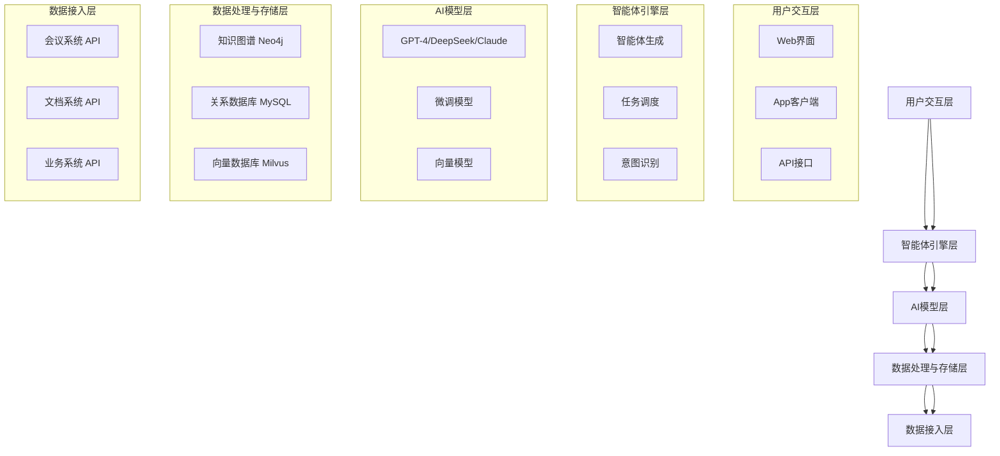

# 能力与中台层

<cite>
**本文档引用文件**  
- [完整方案构思.md](file://完整方案构思.md)
- [技术框架方案探讨.md](file://技术框架方案探讨.md)
- [实施路线图.md](file://实施路线图.md)
- [项目介绍.md](file://项目介绍.md)
</cite>

## 目录
1. [引言](#引言)
2. [系统架构概览](#系统架构概览)
3. [RAG问答系统工作机制](#rag问答系统工作机制)
4. [智能体编排引擎设计原理](#智能体编排引擎设计原理)
5. [权限感知检索实现逻辑](#权限感知检索实现逻辑)
6. [大语言模型调用策略与结果融合](#大语言模型调用策略与结果融合)
7. [智能体模板与执行上下文管理](#智能体模板与执行上下文管理)
8. [RBAC权限模型与内容脱敏](#rbac权限模型与内容脱敏)
9. [能力封装接口设计与服务通信](#能力封装接口设计与服务通信)
10. [结论](#结论)

## 引言
本文档全面阐述“EduMind AI Platform”中台层的核心组件与能力体系，聚焦于智能教育系统中的关键技术实现。系统旨在为在线教育机构、企业内训部门等B端客户提供数据驱动、权限隔离、可定制的AI智能体服务。通过整合多源异构数据，结合大语言模型与领域知识，实现个性化、智能化的教育支持与业务赋能。

**本节内容未直接分析具体源码文件，故不提供节来源**

## 系统架构概览
系统采用分层架构设计，确保功能解耦与可扩展性：

**图示来源**  
- [完整方案构思.md](file://完整方案构思.md#L20-L35)
- [技术框架方案探讨.md](file://技术框架方案探讨.md#L10-L25)

**节来源**  
- [完整方案构思.md](file://完整方案构思.md#L1-L50)
- [技术框架方案探讨.md](file://技术框架方案探讨.md#L1-L30)

## RAG问答系统工作机制
RAG（检索增强生成）系统是智能体实现精准问答的核心机制。其工作流程如下：

1. **用户提问**：用户通过Web或App提交自然语言问题。
2. **意图识别**：AI模型判断问题类型（如“查找会议结论”“生成报告”）。
3. **权限过滤**：基于用户角色与部门信息，确定可访问的知识库范围。
4. **向量检索**：将问题编码为向量，在向量数据库（如Milvus）中进行语义相似度搜索。
5. **上下文增强**：从知识图谱与结构化数据库中补充实体关系与元数据。
6. **答案生成**：将检索到的上下文与问题一并输入大语言模型（GPT-4/DeepSeek/Claude），生成自然语言回答。
7. **结果返回**：经内容脱敏后，将答案返回给用户。

该机制有效缓解了大模型的“幻觉”问题，确保回答基于企业真实数据。

**节来源**  
- [完整方案构思.md](file://完整方案构思.md#L100-L120)
- [技术框架方案探讨.md](file://技术框架方案探讨.md#L80-L95)

## 智能体编排引擎设计原理
智能体编排引擎负责根据企业需求动态生成和调度部门级AI助手。其设计原理包括：

- **模块化配置**：通过低代码界面选择数据源、功能模块（问答、报告、任务提醒）和输出形式。
- **模板化生成**：预设“教学助手”“销售助手”等模板，支持快速实例化。
- **任务调度**：基于事件（如会议结束）或时间（每日定时）触发自动化任务。
- **状态管理**：维护智能体的运行状态与上下文，支持多轮对话与长期记忆。
- **服务路由**：根据意图将请求路由至不同处理模块（如RAG模块、报告生成模块）。

引擎通过API与前端、模型层、数据层交互，实现灵活的业务编排。

**节来源**  
- [完整方案构思.md](file://完整方案构思.md#L121-L145)
- [实施路线图.md](file://实施路线图.md#L15-L20)

## 权限感知检索实现逻辑
权限感知检索确保用户只能访问其权限范围内的数据，实现逻辑如下：

1. **用户身份认证**：通过统一身份认证系统获取用户信息（部门、角色）。
2. **权限解析**：查询RBAC权限表，确定该用户可访问的数据分区（如“销售部文档”“教研会议记录”）。
3. **查询重写**：在执行向量检索前，自动添加权限过滤条件（如`department = 'sales'`）。
4. **结果校验**：对检索结果进行二次校验，防止越权访问。
5. **日志审计**：记录所有检索行为，用于安全审计与合规检查。

该机制与向量检索、知识图谱查询深度集成，保障数据安全。

**节来源**  
- [完整方案构思.md](file://完整方案构思.md#L60-L75)
- [技术框架方案探讨.md](file://技术框架方案探讨.md#L130-L140)

## 大语言模型调用策略与结果融合
系统采用多模型协同策略，提升回答质量与稳定性：

- **模型选择策略**：
  - **GPT-4**：用于高精度问答与复杂推理。
  - **DeepSeek**：用于中文语境下的文本生成。
  - **Claude**：用于长文本摘要与逻辑分析。
  - **自训练模型**：用于特定领域（如教育术语）的微调任务。

- **调用模式**：
  - **主备模式**：主模型失败时自动切换至备用模型。
  - **并行调用**：对关键问题并行调用多个模型，进行结果融合。
  - **缓存机制**：对高频问题缓存结果，提升响应速度。

- **结果融合方法**：
  - **投票机制**：多个模型输出一致时采纳。
  - **加权评分**：根据模型历史准确率加权。
  - **规则校验**：通过规则引擎过滤明显错误或敏感内容。

**节来源**  
- [完整方案构思.md](file://完整方案构思.md#L150-L170)
- [技术框架方案探讨.md](file://技术框架方案探讨.md#L40-L60)

## 智能体模板与执行上下文管理
智能体模板定义了AI助手的配置蓝图，执行上下文管理确保其运行一致性：

- **模板定义方式**：
  - **数据源配置**：指定可接入的知识库分区。
  - **功能模块**：勾选问答、报告、任务提醒等功能。
  - **输出通道**：配置企业微信、Web、API等输出方式。
  - **行为规则**：设置响应风格、敏感词过滤等。

- **执行上下文管理**：
  - **会话状态**：维护用户会话的上下文，支持多轮对话。
  - **任务上下文**：记录任务执行进度与依赖关系。
  - **环境变量**：注入用户角色、部门等运行时信息。
  - **上下文存储**：使用Redis缓存短期上下文，数据库持久化长期记忆。

**节来源**  
- [完整方案构思.md](file://完整方案构思.md#L121-L145)
- [实施路线图.md](file://实施路线图.md#L15-L20)

## RBAC权限模型与内容脱敏
RBAC（基于角色的访问控制）模型是权限体系的核心：

- **角色定义**：
  - **超级管理员**：全系统权限。
  - **部门管理员**：本部门数据管理权限。
  - **普通成员**：仅访问授权数据。

- **权限粒度**：支持按部门、项目、文档类型进行细粒度控制。

- **内容脱敏策略**：
  - **自动识别**：使用正则与LLM识别手机号、身份证号等敏感信息。
  - **模糊化处理**：对敏感字段进行掩码（如`138****1234`）。
  - **权限联动**：高敏感数据仅对特定角色可见。

该模型与数据接入、检索、生成全流程集成，确保端到端安全。

**节来源**  
- [完整方案构思.md](file://完整方案构思.md#L60-L75)
- [技术框架方案探讨.md](file://技术框架方案探讨.md#L130-L140)

## 能力封装接口设计与服务通信
中台能力通过标准化接口对外暴露，支持灵活集成：

- **接口设计思路**：
  - **RESTful API**：用于同步请求（如问答、报告生成）。
  - **WebSocket**：用于实时通信（如在线答疑）。
  - **gRPC**：用于高性能内部服务调用。
  - **事件驱动**：通过消息队列（如Kafka）实现异步任务通知。

- **服务间通信模式**：
  - **API网关**：统一入口，负责认证、限流、路由。
  - **服务发现**：Kubernetes + Consul 实现动态服务定位。
  - **熔断降级**：使用Hystrix或Resilience4j保障系统稳定性。
  - **数据一致性**：通过分布式事务或最终一致性保障。

接口设计遵循高内聚、低耦合原则，支持未来微服务化演进。

**节来源**  
- [技术框架方案探讨.md](file://技术框架方案探讨.md#L100-L120)
- [实施路线图.md](file://实施路线图.md#L25-L30)

## 结论
“EduMind AI Platform”的能力与中台层通过RAG、智能体编排、权限感知检索等核心技术，实现了企业级智能教育系统的数据驱动与个性化服务。系统采用模块化设计，支持灵活配置与扩展，结合RBAC权限模型与内容脱敏策略，保障了数据安全与合规性。未来可通过持续微调模型、优化检索算法、增强多模态能力，进一步提升系统智能化水平。

**本节内容为总结性陈述，未直接分析具体源码文件，故不提供节来源**