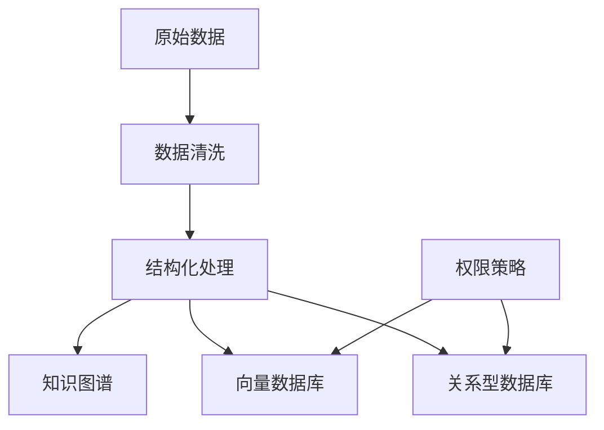

# 项目架构与技术方案

<cite>
**本文档引用文件**  
- [项目介绍.md](file://项目介绍.md)
- [完整方案构思.md](file://完整方案构思.md)
- [技术框架方案探讨.md](file://技术框架方案探讨.md)
- [实施路线图.md](file://实施路线图.md)
- [视频会议-关于太子老师项目的讨论.md](file://视频会议-关于太子老师项目的讨论.md)
</cite>

## 目录
1. [引言](#引言)
2. [系统四层架构设计](#系统四层架构设计)
3. [RAG系统工作机制](#rag系统工作机制)
4. [向量数据库选型考量](#向量数据库选型考量)
5. [大语言模型集成策略](#大语言模型集成策略)
6. [智能体编排引擎设计](#智能体编排引擎设计)
7. [权限感知检索实现路径](#权限感知检索实现路径)
8. [NestJS与FastAPI技术选型对比](#nestjs与fastapi技术选型对比)
9. [微服务架构扩展性分析](#微服务架构扩展性分析)
10. [总结与建议](#总结与建议)

## 引言

本项目旨在构建一个名为“太子老师”的个性化智能教育平台，为每位学员提供如古代太子般的顶级教育服务。系统以陆向谦实验室为首个客户，未来将拓展至其他教育机构及企业组织。平台融合人工导师团队与AI智能系统，实现“一生一案、因材施教”的教育理念，通过AI助手完成学情分析、个性化推荐与家长沟通等核心功能。

**Section sources**
- [项目介绍.md](file://项目介绍.md#L1-L39)

## 系统四层架构设计

### 数据源层（感知层）

数据源层作为系统的“感官系统”，负责采集多模态原始数据，为上层提供信息输入。当前优先接入会议系统数据，未来将扩展至文本、音频、视频及即时通讯记录。

**支持的数据源类型**：
- **会议系统**：腾讯会议、飞书会议、钉钉会议（通过API获取录音、文字纪要、参会人信息）
- **文档系统**：飞书文档、腾讯文档、Confluence（爬取文本、表格、评论）
- **业务系统**：CRM、ERP、LMS（学习管理系统）API对接
- **其他**：邮件、企业微信/钉钉群聊记录（需合规脱敏）

**数据接入方式**：
- **实时流**：通过Webhook监听会议结束事件，自动触发数据拉取
- **批量同步**：每日定时从文档系统拉取增量数据
- **手动上传**：支持Excel/PDF等文件上传至指定知识库分区

**Section sources**
- [完整方案构思.md](file://完整方案构思.md#L30-L50)
- [视频会议-关于太子老师项目的讨论.md](file://视频会议-关于太子老师项目的讨论.md#L11:51-L14:06)

### 数据与索引层

该层负责对原始数据进行清洗、结构化处理与存储，构建企业专属知识库，并建立高效索引机制。

**数据处理流程**：
- **会议数据**：语音转文字（ASR）、提取关键议题、决策项、任务分配
- **文档数据**：解析标题、段落、表格，构建知识图谱（实体+关系）
- **非结构化数据**：使用LLM提取摘要、分类标签（如“销售话术”“技术文档”）

**存储方案**：
- **原始数据**：分布式文件存储（HDFS/MinIO），保留原始格式供审计
- **结构化数据**：
  - 知识图谱：Neo4j/GraphDB
  - 业务数据：MySQL/PostgreSQL（部门、用户权限）
  - 向量数据库：Milvus/Pinecone（存储文本向量，支持语义检索）

**权限管理**：
- 基于RBAC模型（角色：超级管理员、部门管理员、普通成员）
- 权限粒度：按部门/项目/文档类型控制数据访问
- 数据脱敏：自动识别敏感信息（如手机号、身份证号）并模糊化处理

**Diagram sources**
- [完整方案构思.md](file://完整方案构思.md#L51-L80)

**Section sources**
- [完整方案构思.md](file://完整方案构思.md#L51-L80)

### 能力与中台层（智能体引擎层）

该层是系统的核心“大脑”，包含AI模型层与智能体引擎，负责语义理解、推理生成与任务调度。

**智能体生成逻辑**：
- **模块化配置**：企业可通过低代码界面定义智能体功能
  - 输入：选择数据源（如“仅使用销售部会议记录+产品文档”）
  - 能力：勾选功能模块（问答、报告生成、任务提醒）
  - 输出：定义交互形式（企业微信机器人、Web页面、API）

**典型智能体场景**：
- **教学部门智能体**：数据源为教研会议记录+课程PPT+学生反馈，功能包括自动生成教案、回答教师关于课程设计的提问
- **销售部门智能体**：数据源为客户沟通记录+合同文档，功能包括生成销售话术建议、提示未跟进客户

**Section sources**
- [完整方案构思.md](file://完整方案构思.md#L81-L100)

### 应用与体验层（展示层）

该层面向最终用户，提供多样化的交互入口与用户体验。

**支持的终端形式**：
- 移动App（语音交互、学习咨询）
- Web平台（课程管理、进度追踪）
- 企业微信/钉钉机器人（任务提醒、日报推送）
- API接口（与其他系统集成）

**核心功能**：
- 个性化学习路径推荐
- 实时答疑与作业批改
- 自动生成学习报告并推送给家长
- 模拟学生提问场景进行AI试讲演练

**Section sources**
- [视频会议-关于太子老师项目的讨论.md](file://视频会议-关于太子老师项目的讨论.md#L18:12-L20:04)

## RAG系统工作机制

检索增强生成（RAG）系统是实现精准问答与内容生成的核心技术，其工作机制如下：

1. **查询理解**：接收用户问题，通过LLM进行意图识别与关键词提取
2. **语义检索**：将查询向量化，在向量数据库中进行相似度匹配，检索相关文档片段
3. **上下文构建**：结合检索结果与用户历史数据，构建完整上下文
4. **生成响应**：将上下文输入大语言模型，生成准确、有依据的回答
5. **结果校验**：通过规则引擎或轻量模型检测幻觉，确保输出可靠性

RAG系统有效解决了大模型知识固化、易产生幻觉的问题，确保回答基于企业真实数据。

**Section sources**
- [技术框架方案探讨.md](file://技术框架方案探讨.md#L70-L75)
- [实施路线图.md](file://实施路线图.md#L15-L18)

## 向量数据库选型考量

向量数据库的选择直接影响语义检索的效率与准确性，主要考量因素如下：

| 选项 | 优势 | 劣势 | 适用场景 |
|------|------|------|----------|
| **Pinecone** | 托管服务、易用性高、性能优异 | 成本较高、对网络依赖强 | 快速原型、中小规模部署 |
| **Weaviate** | 开源、支持混合搜索（关键词+向量）、模块化 | 部署维护复杂 | 需要灵活定制的场景 |
| **Milvus** | 高性能、支持大规模向量检索、社区活跃 | 学习曲线陡峭 | 大型企业级应用 |
| **ChromaDB** | 轻量级、Python生态友好、易于集成 | 功能相对简单 | Python技术栈项目 |

推荐初期采用Pinecone以快速验证，后期根据数据规模与性能需求迁移至Milvus或Weaviate。

**Section sources**
- [技术框架方案探讨.md](file://技术框架方案探讨.md#L55-L60)

## 大语言模型集成策略

系统采用多模型协同策略，根据不同任务选择最优模型，兼顾性能与成本。

**模型选型与分工**：
- **GPT-4**：通用性强，适合综合分析、报告生成等复杂任务
- **Claude**：长文本处理能力强，适合会议摘要、文档分析
- **DeepSeek**：中文理解优秀，适合本地化内容生成与答疑
- **LLaMA-3（微调）**：基于企业数据微调，注入行业术语与组织知识

**集成方式**：
- 统一API网关路由不同请求至相应模型
- 建立模型监控体系，跟踪响应延迟、准确率、幻觉比例
- 设置降级机制，关键任务可触发人工审核

**Section sources**
- [完整方案构思.md](file://完整方案构思.md#L131-L140)
- [技术框架方案探讨.md](file://技术框架方案探讨.md#L40-L45)

## 智能体编排引擎设计

智能体编排引擎负责创建、调度与管理各类部门级AI助手，其设计思路如下：

**核心功能**：
- **低代码配置界面**：允许非技术人员通过勾选方式定义智能体能力
- **动态加载机制**：支持运行时添加新数据源或功能模块
- **任务路由系统**：根据用户请求类型（问答/报告/任务）分发至不同处理流水线
- **状态管理**：记录智能体交互历史，支持上下文连续对话

**架构特点**：
- 模块化设计，各功能组件可插拔
- 支持异步任务处理（如报告生成）
- 提供API供第三方系统调用

**Section sources**
- [完整方案构思.md](file://完整方案构思.md#L81-L100)

## 权限感知检索实现路径

权限感知检索确保用户只能访问其权限范围内的数据，实现路径如下：

1. **用户身份认证**：通过OAuth2.0或JWT验证用户身份
2. **权限解析**：查询数据库获取用户所属部门、角色及权限列表
3. **查询重写**：在向量检索前，将权限条件嵌入查询语句（如添加“department:sales”过滤）
4. **结果过滤**：对检索结果再次校验权限，防止越权访问
5. **审计日志**：记录所有检索行为，便于安全审计

该机制与RBAC模型深度集成，确保数据安全与合规性。

**Section sources**
- [完整方案构思.md](file://完整方案构思.md#L75-L80)

## NestJS与FastAPI技术选型对比

| 维度 | NestJS | FastAPI |
|------|--------|---------|
| **语言生态** | TypeScript/JavaScript | Python |
| **AI生态** | LangChain.js，相对有限 | LangChain，生态丰富，库支持全面 |
| **开发效率** | 全栈TypeScript，一致性高 | Python简洁，AI开发友好 |
| **性能** | Node.js异步非阻塞，性能良好 | Starlette异步框架，性能优异 |
| **学习曲线** | 需掌握TypeScript与装饰器模式 | Python开发者易上手 |
| **适用场景** | 中小型团队、全栈TypeScript项目 | AI重度应用、算法研究项目 |

**推荐策略**：
- 若团队具备较强JavaScript/TypeScript背景，推荐NestJS以实现全栈一致性
- 若项目AI功能占比高，推荐FastAPI以充分利用Python AI生态

**Section sources**
- [技术框架方案探讨.md](file://技术框架方案探讨.md#L30-L65)

## 微服务架构扩展性分析

### 当前架构（单体优先）
初期采用单体架构（Next.js + NestJS/FastAPI + PostgreSQL），优势在于：
- 开发部署简单，适合MVP阶段快速迭代
- 团队协作成本低，调试维护方便
- 性能损耗小，适合中小规模用户

### 未来扩展路径（微服务）
当用户规模扩大后，可逐步迁移至微服务架构：

**服务拆分建议**：
- **AI服务**：独立部署，支持GPU加速与弹性扩缩容
- **用户管理服务**：负责认证、权限、组织架构
- **数据同步服务**：专门处理外部系统数据接入
- **通知服务**：统一管理邮件、短信、IM推送

**通信机制**：
- 服务间采用gRPC（高性能）或REST API（易调试）
- 事件驱动架构（Kafka/RabbitMQ）解耦服务

**部署方案**：
- Docker容器化 + Kubernetes集群管理
- 服务网格（Istio）实现流量控制与监控

该路径兼顾启动效率与长期可扩展性。

**Section sources**
- [实施路线图.md](file://实施路线图.md#L28-L30)
- [技术框架方案探讨.md](file://技术框架方案探讨.md#L120-L130)

## 总结与建议

本项目采用四层架构设计，从数据采集到智能应用形成完整闭环。RAG系统结合向量数据库与多模型集成，确保AI输出的准确性与实用性。智能体编排引擎支持低代码配置，满足不同部门的个性化需求。权限感知检索机制保障数据安全。

技术选型上，建议根据团队技术栈选择NestJS或FastAPI，初期采用单体架构快速验证，后期按需迁移至微服务。向量数据库可先用Pinecone快速启动，后续视规模迁移。

核心建议：**先做对，再做好**。优先实现核心功能（如会议摘要、智能答疑），快速获取用户反馈，再逐步完善系统架构与高级功能。