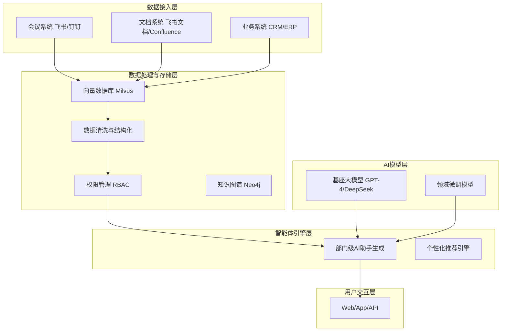
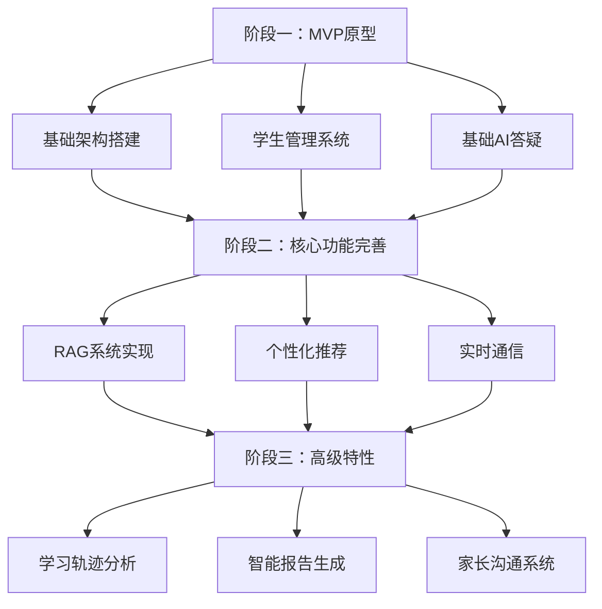

# 项目概述

<cite>
**本文档引用文件**  
- [项目介绍.md](file://项目介绍.md)
- [项目名称.md](file://项目名称.md)
- [完整方案构思.md](file://完整方案构思.md)
- [实施路线图.md](file://实施路线图.md)
- [技术框架方案探讨.md](file://技术框架方案探讨.md)
- [视频会议-关于太子老师项目的讨论.md](file://视频会议-关于太子老师项目的讨论.md)
</cite>

## 目录
1. [项目愿景与核心理念](#项目愿景与核心理念)  
2. [“太子洗马”式教育的内涵](#太子洗马式教育的内涵)  
3. [项目命名哲学与文化融合](#项目命名哲学与文化融合)  
4. [智能教育平台的定位与差异化](#智能教育平台的定位与差异化)  
5. [技术实现路径与系统架构](#技术实现路径与系统架构)  
6. [目标用户群体与核心需求场景](#目标用户群体与核心需求场景)  
7. [教育目标与价值主张](#教育目标与价值主张)  
8. [实施路线与未来拓展](#实施路线与未来拓展)

## 项目愿景与核心理念

nove项目致力于构建一个“太子洗马”式的个性化智能教育平台，旨在为每位学员提供如同古代太子般专属、顶级、全方位的教育服务。项目以陆向谦实验室为首个服务对象，通过AI技术与专业导师团队的深度融合，打造“一生一案、因材施教”的教育新模式。

核心理念在于将每位学员视为“太子”，配备专属的导师团队与智能AI助手，形成“人工+智能”的双轮驱动教育体系。系统不仅关注知识传授，更注重个性化成长路径的规划与实时追踪，实现教育服务的精准化、智能化与尊贵化。

**本节来源**  
- [项目介绍.md](file://项目介绍.md#L1-L39)  
- [项目名称.md](file://项目名称.md#L1-L45)

## “太子洗马”式教育的内涵

“太子洗马”原为古代官职，负责辅佐太子学习与成长，象征着最高规格的教育陪伴与指导。在nove项目中，“太子洗马”被赋予现代教育意义，代表一种极致个性化、全程陪伴式的智能教育服务模式。

该模式的核心特征包括：
- **专属性**：每位学员拥有独立的学习档案与成长路径，系统为其量身定制学习方案。
- **全程化**：从入学评估、课程推荐、学习过程监控到成果反馈，AI系统全程参与。
- **协同性**：AI助手与人工导师协同工作，AI负责数据处理与推荐，导师负责情感支持与深度指导。
- **智能化**：基于RAG（检索增强生成）、向量数据库与大模型技术，实现精准学情分析与个性化推荐。

此模式突破传统“一对多”教学局限，实现“一对一”甚至“多对一”的精英教育体验，真正落实“因材施教”的教育理想。

**本节来源**  
- [项目介绍.md](file://项目介绍.md#L1-L39)  
- [视频会议-关于太子老师项目的讨论.md](file://视频会议-关于太子老师项目的讨论.md#L1-L233)

## 项目命名哲学与文化融合

项目命名为“nove”，源自拉丁语“novus”，意为“新的、创新的”，象征项目对教育行业的革新使命。同时，名称采用首字母拆解方式，赋予其深层教育理念：

- **N - New（全新）**：打破传统教育边界，开创AI驱动的个性化学习新范式。  
- **O - Optimized（优化）**：通过数据驱动，为每位学员提供最优学习路径。  
- **V - Versatile（多元）**：支持多种教学场景与学习风格，适应不同学员需求。  
- **E - Elite（精英）**：提供如“太子”般的顶级教育资源与服务体验。

“nove”不仅是一个技术平台，更是一种教育哲学的体现——将古代“尊师重教、因材施教”的文化精髓，与现代AI技术深度融合，实现传统文化与前沿科技的共生共荣。

**本节来源**  
- [项目名称.md](file://项目名称.md#L1-L45)

## 智能教育平台的定位与差异化

nove定位为B端企业级智能教育系统，服务于教育机构、高校及企业培训部门。其核心差异化体现在：

| 维度 | 传统教育平台 | nove智能教育平台 |
|------|----------------|------------------|
| 教学模式 | 标准化课程推送 | 一生一案，个性化推荐 |
| 教学支持 | 人工教师主导 | AI助手 + 导师团队协同 |
| 数据应用 | 静态记录 | 实时学情分析与动态调整 |
| 知识管理 | 分散文档 | 统一知识库 + 智能检索 |
| 用户体验 | 单向授课 | 多模态交互（语音、文本、图表） |

nove通过构建企业专属知识库，支持多数据源接入（会议、文档、业务系统），并基于组织架构实现权限隔离，确保数据安全的同时提升教学效率。

**本节来源**  
- [完整方案构思.md](file://完整方案构思.md#L1-L213)  
- [项目介绍.md](file://项目介绍.md#L1-L39)

## 技术实现路径与系统架构

nove采用分层架构设计，确保系统的可扩展性与智能化水平：

**图示来源**  
- [完整方案构思.md](file://完整方案构思.md#L1-L213)  
- [技术框架方案探讨.md](file://技术框架方案探讨.md#L1-L159)

系统采用Next.js + NestJS全栈TypeScript架构，结合PostgreSQL与Prisma ORM，确保开发效率与数据一致性。AI能力通过RAG系统与向量数据库实现，支持实时语义检索与智能生成。

## 目标用户群体与核心需求场景

nove服务于三类核心用户，满足其差异化需求：

### 教师
- **需求场景**：快速生成教案、获取学生学情报告、自动化批改作业  
- **系统支持**：AI自动生成教学建议、整合教研会议记录、提供学生历史表现分析  

### 学员
- **需求场景**：个性化学习路径、实时答疑、成长轨迹可视化  
- **系统支持**：一生一案推荐、语音交互式学习助手、学习进度动态追踪  

### 管理员
- **需求场景**：组织知识管理、权限控制、教学效果评估  
- **系统支持**：多部门数据隔离、自动化报告生成、跨系统数据同步  

**本节来源**  
- [项目介绍.md](file://项目介绍.md#L1-L39)  
- [完整方案构思.md](file://完整方案构思.md#L1-L213)

## 教育目标与价值主张

nove的价值主张在于“让每个学员都享受太子般的教育待遇”，具体体现为：

- **个性化**：基于学生能力、兴趣与学习风格，动态调整教学内容与节奏。  
- **智能化**：AI助手7×24小时响应，提供精准答疑与学习建议。  
- **高效化**：自动化处理会议纪要、学习报告生成等重复性工作，释放教师精力。  
- **可扩展**：从实验室起步，逐步拓展至教育机构、高校与企业培训场景。  

教育目标不仅是知识传授，更是培养学员的自主学习能力、批判性思维与终身成长意识。

**本节来源**  
- [项目介绍.md](file://项目介绍.md#L1-L39)  
- [项目名称.md](file://项目名称.md#L1-L45)

## 实施路线与未来拓展

项目实施分为三个阶段：

**图示来源**  
- [实施路线图.md](file://实施路线图.md#L1-L33)  
- [技术框架方案探讨.md](file://技术框架方案探讨.md#L1-L159)

未来拓展路径为：陆向谦实验室 → 专业教育机构 → 高等院校 → 企业内训，逐步实现从点到面的教育智能化变革。