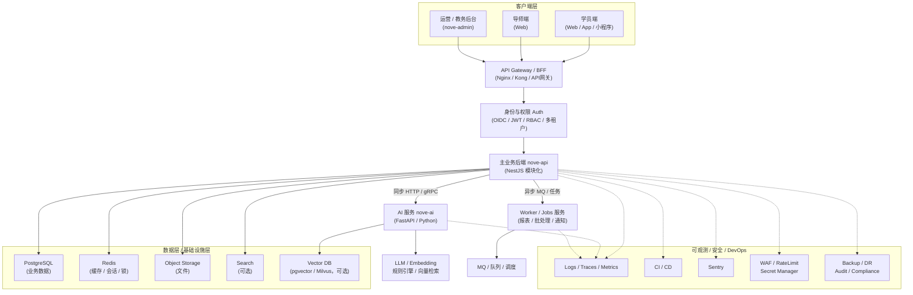

┌──────────────────────────── 客户端层 ────────────────────────────┐
│  学员端(Web/App/小程序)   导师端(Web)   运营/教务后台(nove-admin)    │
└───────────────┬───────────────────┬───────────────────┬──────────┘
                │                   │                   │
                └────────────── API Gateway / BFF ──────┘
                                (Nginx / Kong / API网关)
                                        │
                           ┌────────────┴─────────────┐
                           │  身份与权限 Auth (OIDC)   │
                           │  JWT / RBAC / 多租户      │
                           └────────────┬─────────────┘
                                        │
                          ┌─────────────┴─────────────┐
                          │     主业务后端 nove-api     │
                          │ (NestJS/SpringBoot 模块化)  │
                          └───────┬─────────┬──────────┘
                                  │         │
                     同步HTTP/gRPC│         │异步MQ/任务
                                  │         │
                    ┌─────────────▼───┐   ┌▼──────────────────┐
                    │   AI 服务 nove-ai │   │ Worker/Jobs 服务   │
                    │   (FastAPI/Python)│   │(报表/批处理/通知)  │
                    └───────┬──────────┘   └─────────┬─────────┘
                            │                        │
             ┌──────────────▼──────────────┐   ┌────▼─────────┐
             │ LLM/Embedding/规则/向量检索  │   │ MQ/队列/调度   │
             └──────────────┬──────────────┘   └────┬─────────┘
                            │                        │
┌───────────────────────────▼───────────────┬────────▼─────────────────────────┐
│                  数据层 / 基础设施层      │       可观测 / 安全 / DevOps       │
│ PostgreSQL(业务)  Redis(缓存/会话/锁)     │ Logs/Traces/Metrics  CI/CD  Sentry │
│ Object Storage(文件)  Search(可选)        │ WAF/RateLimit  Secret Manager      │
│ Vector DB(pgvector/Milvus)(可选)          │ Backup/DR     Audit/Compliance      │
└───────────────────────────────────────────┴───────────────────────────────────┘


┌──────────────────────────── 客户端层 ────────────────────────────┐
│  学员端(Web/App/小程序)   导师端(Web)   运营/教务后台(nove-admin)    │
└───────────────┬───────────────────┬───────────────────┬──────────┘
                │                   │                   │
                └────────────── API Gateway / BFF ──────┘
                                (Nginx / Kong / API网关)
                                        │
                           ┌────────────┴─────────────┐
                           │  身份与权限 Auth (OIDC)   │
                           │  JWT / RBAC / 多租户      │
                           └────────────┬─────────────┘
                                        │
                          ┌─────────────┴──────────────┐
                          │     主业务后端 nove-api      │
                          │ (NestJS 模块化)             │
                          └───────┬─────────┬──────────┘
                                  │         │
                     同步HTTP/gRPC│         │异步MQ/任务
                                  │         │
                    ┌─────────────▼───┐   ┌▼──────────────────┐
                    │   AI 服务 nove-ai │   │ Worker/Jobs 服务   │
                    │   (FastAPI/Python)│   │(报表/批处理/通知)  │
                    └───────┬──────────┘   └─────────┬─────────┘
                            │                        │
             ┌──────────────▼──────────────┐   ┌────▼─────────┐
             │ LLM/Embedding/规则/向量检索  │   │ MQ/队列/调度   │
             └──────────────┬──────────────┘   └────┬─────────┘
                            │                        │
┌───────────────────────────▼───────────────┬────────▼─────────────────────────┐
│                  数据层 / 基础设施层      │       可观测 / 安全 / DevOps       │
│ PostgreSQL(业务)  Redis(缓存/会话/锁)     │ Logs/Traces/Metrics  CI/CD  Sentry │
│ Object Storage(文件)  Search(可选)        │ WAF/RateLimit  Secret Manager      │
│ Vector DB(pgvector/Milvus)(可选)          │ Backup/DR     Audit/Compliance      │
└───────────────────────────────────────────┴───────────────────────────────────┘


```mermaid
flowchart TB
  %% ========= 样式 =========
  classDef client fill:#eef6ff,stroke:#3b82f6,stroke-width:1px,color:#0f172a;
  classDef core fill:#ecfeff,stroke:#06b6d4,stroke-width:1px,color:#0f172a;
  classDef svc fill:#f0fdf4,stroke:#22c55e,stroke-width:1px,color:#0f172a;
  classDef data fill:#fff7ed,stroke:#fb923c,stroke-width:1px,color:#0f172a;
  classDef ops fill:#fdf2f8,stroke:#ec4899,stroke-width:1px,color:#0f172a;

  %% ========= 客户端 =========
  subgraph L1["客户端层"]
    U1["学员端<br/>Web / App / 小程序"]:::client
    U2["导师端<br/>Web"]:::client
    U3["运营/教务后台<br/>nove-admin"]:::client
  end

  %% ========= 接入与权限 =========
  subgraph L2["接入层 & 权限层"]
    GW["API Gateway / BFF<br/>Nginx / Kong / API网关"]:::core
    AUTH["Auth<br/>OIDC · JWT · RBAC · 多租户"]:::core
  end

  %% ========= 业务与域服务 =========
  subgraph L3["业务层（核心域）"]
    API["nove-api 主业务后端<br/>NestJS（模块化）"]:::core
  end

  %% ========= 智能与异步 =========
  subgraph L4["智能层 & 异步计算层"]
    AI["nove-ai AI 服务<br/>FastAPI / Python"]:::svc
    WORKER["Worker / Jobs<br/>报表 · 批处理 · 通知"]:::svc
    MQ["MQ / 队列 / 调度<br/>Kafka/Rabbit/SQS（任选）"]:::svc
    LLM["LLM 编排<br/>Embedding · 规则 · RAG/向量检索"]:::svc
  end

  %% ========= 数据与基础设施 =========
  subgraph L5["数据层 / 基础设施层"]
    PG["PostgreSQL<br/>业务数据"]:::data
    REDIS["Redis<br/>缓存/会话/锁"]:::data
    OBJ["Object Storage<br/>文件/附件/素材"]:::data
    SEARCH["Search（可选）<br/>ES/OpenSearch"]:::data
    VECTOR["Vector DB（可选）<br/>pgvector/Milvus"]:::data
  end

  %% ========= 可观测与安全 =========
  subgraph L6["可观测 / 安全 / DevOps"]
    OBS["Logs · Traces · Metrics<br/>告警与审计"]:::ops
    DEVOPS["CI/CD · Sentry<br/>WAF/RateLimit · Secret Manager<br/>Backup/DR · Compliance"]:::ops
  end

  %% ========= 流向 =========
  U1 --> GW
  U2 --> GW
  U3 --> GW

  GW --> AUTH
  AUTH --> API
  GW --> API

  API -->|同步 HTTP / gRPC| AI
  API -->|异步 事件/任务| MQ
  WORKER <-->|消费/重试/定时| MQ

  AI --> LLM

  API --> PG
  API --> REDIS
  API --> OBJ
  API -.-> SEARCH
  AI -.-> VECTOR

  API -.-> OBS
  AI -.-> OBS
  WORKER -.-> OBS
  GW -.-> OBS

  DEVOPS -.-> GW
  DEVOPS -.-> AUTH
  DEVOPS -.-> API
  DEVOPS -.-> AI
  DEVOPS -.-> WORKER
  ```