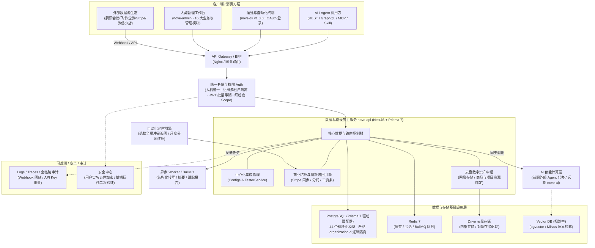
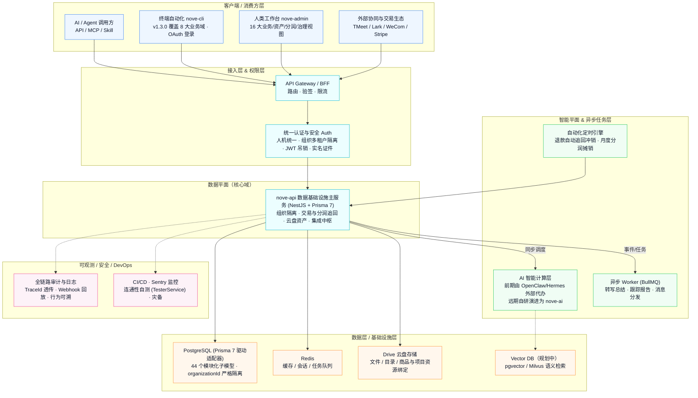

# nove 系统架构图集

本文档以架构图形式展示 nove（组织级 Agent 数据基础设施 / 数据网关）的整体架构。

## 一、ASCII 架构总览

```
┌──────────────────────────── 客户端 / 消费方层 ────────────────────────────┐
│  AI / Agent 调用方          外部系统 / Agent Harness       人类 (nove-admin)│
│  (API / MCP / Skill / CLI)  (读取数据、执行任务)          (16大业务与管理模块)│
└───────────────┬───────────────────┬───────────────────┬──────────────────┘
                │                   │                   │
                └────────────── API Gateway / BFF ──────┘
                                (Nginx / Kong / 网关)
                                        │
                           ┌────────────┴─────────────┐
                           │  身份与权限 Auth          │
                           │  人机统一 · 组织上下文透传 │
                           │  JWT 吊销 / API Key / RBAC│
                           └────────────┬─────────────┘
                                        │
     ┌──────────────────────────────────┴──────────────────────────────────┐
     │                      数据基础设施主服务 nove-api                      │
     │   (NestJS + Prisma 7：多源接入 / 组织隔离 / 商业分润 / 资产驱动 / 接口) │
     │  ┌──────────────────────┬──────────────────────┬─────────────────┐  │
     │  │   集成中枢与健康自测  │   商业结算与冲销追回 │   云盘数字资产  │  │
     │  │ (TMeet/Lark/WeCom/   │ (Stripe/订单权益/    │ (文件/目录/     │  │
     │  │  Stripe/TesterService│  分润摊销/Cron冲销)  │  商品封面绑定)  │  │
     │  └──────────────────────┴──────────────────────┴─────────────────┘  │
     └───────┬──────────────────────────┬──────────────────────────┬───────┘
             │                          │                          │
        同步HTTP/gRPC              异步MQ/BullMQ               定时Cron调度
             │                          │                          │
┌────────────▼────────────┐   ┌─────────▼─────────┐      ┌─────────▼─────────┐
│ 智能计算层(前期用外部Agent│   │ 异步任务 Worker   │      │ 自动化对账追回引擎 │
│ 代办，远期为 nove-ai)   │   │ (转写总结/追踪报告)│      │ (退款冲销/月度分润)│
└────────────┬────────────┘   └─────────┬─────────┘      └─────────┬─────────┘
             │                          │                          │
┌────────────▼──────────────────────────▼──────────────────────────▼───────────────┐
│                              数据层 / 基础设施层                                 │
│  PostgreSQL (Prisma 7 驱动适配器，44 个模块化子模型，严格 organizationId 逻辑隔离)│
│  Redis (缓存 / 会话 / BullMQ 队列)        Drive 云盘存储 (文件 / 目录 / 业务资产) │
│  Vector DB (pgvector / Milvus，规划中)    Search (可选)                          │
└───────────────────────────────────────┬──────────────────────────────────────────┘
                                        │
┌───────────────────────────────────────▼──────────────────────────────────────────┐
│                             可观测 / 安全 / DevOps                                │
│  Logs / Traces / Metrics (全链路 TraceId)  WAF / RateLimit  Secret Manager       │
│  全量人机访问审计 / Webhook 回放          CI/CD 自动化部署   Sentry 监控告警      │
└──────────────────────────────────────────────────────────────────────────────────┘
```

## 二、Mermaid 架构图（分层版）



## 三、Mermaid 架构图（彩色分层版）



---

> 架构要点：**数据平面（nove-api）承载获取 / 存储 / 组织隔离 / 商业分润 / 资产管理 / 接口；智能平面（外部 Agent / 远期 nove-ai）承载高级预处理与关联；人类通过 nove-admin 管理；AI 与运维通过 API / MCP / Skill / CLI 访问；全链路受组织多租户与人机权限体系统一约束。**
