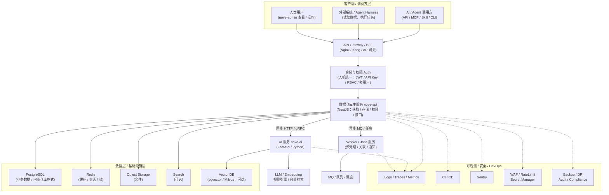
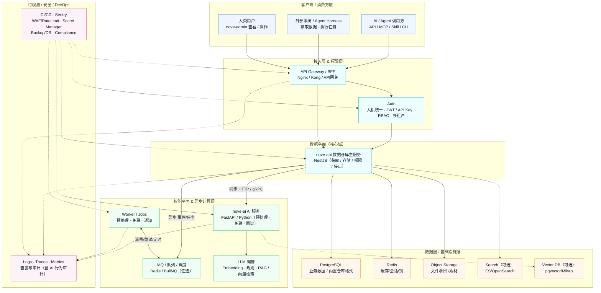

# nove 系统架构图集

本文档以架构图形式展示 nove（个人 / 组织 / 企业智能数据仓库）的整体架构。

## 一、ASCII 架构总览

```
┌──────────────────────────── 客户端 / 消费方层 ────────────────────────────┐
│  AI / Agent 调用方          外部系统 / Agent Harness       人类(nove-admin) │
│  (API / MCP / Skill / CLI)  (读取数据、执行任务)          (查看 / 操作)     │
└───────────────┬───────────────────┬───────────────────┬──────────────────┘
                │                   │                   │
                └────────────── API Gateway / BFF ──────┘
                                (Nginx / Kong / API网关)
                                        │
                           ┌────────────┴─────────────┐
                           │  身份与权限 Auth          │
                           │  人机统一 (人类+AI Agent)  │
                           │  JWT / API Key / RBAC     │
                           └────────────┬─────────────┘
                                        │
                          ┌─────────────┴─────────────┐
                          │  数据仓库主服务 nove-api    │
                          │ (NestJS：获取/存储/权限/接口) │
                          └───────┬─────────┬──────────┘
                                  │         │
                     同步HTTP/gRPC│         │异步MQ/任务
                                  │         │
                    ┌─────────────▼───┐   ┌▼──────────────────┐
                    │  AI 服务 nove-ai  │   │ Worker/Jobs 服务   │
                    │ (FastAPI/Python) │   │(预处理/关联/通知)   │
                    └───────┬──────────┘   └─────────┬─────────┘
                            │                        │
             ┌──────────────▼──────────────┐   ┌────▼─────────┐
             │ LLM/Embedding/规则/向量检索  │   │ MQ/队列/调度   │
             └──────────────┬──────────────┘   └────┬─────────┘
                            │                        │
┌───────────────────────────▼───────────────┬────────▼─────────────────────────┐
│                  数据层 / 基础设施层      │       可观测 / 安全 / DevOps       │
│ PostgreSQL(业务)  Redis(缓存/会话/锁)     │ Logs/Traces/Metrics  CI/CD  Sentry │
│ Vector DB(向量)  Object Storage(文件)    │ WAF/RateLimit  Secret Manager      │
│ 内置数据仓库格式  Search(可选)           │ Backup/DR  Audit/Compliance        │
└───────────────────────────────────────────┴───────────────────────────────────┘
```

## 二、Mermaid 架构图（分层版）



## 三、Mermaid 架构图（彩色分层版）



---

> 架构要点：**数据平面（nove-api）承载获取 / 存储 / 权限 / 接口；智能平面（nove-ai）承载预处理 / 关联 / 图谱；人类通过 nove-admin 访问；AI / Agent 通过 API / MCP / Skill / CLI 访问；所有访问受统一的人机权限体系管控。**
